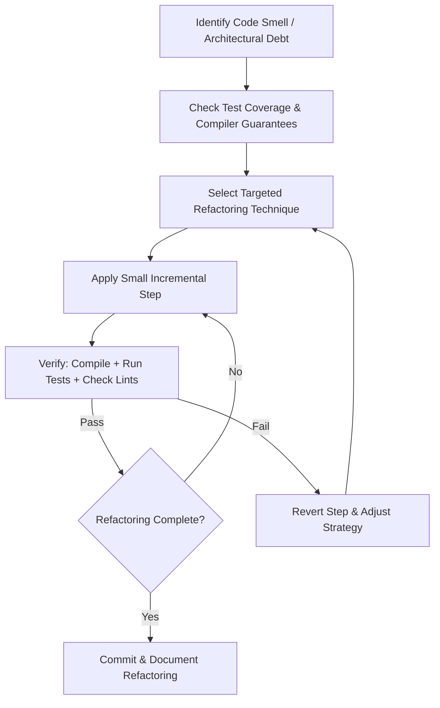

# Refactoring Skill

This skill provides a structured refactoring methodology based on [Refactoring.Guru](https://refactoring.guru/), tailored for safe, incremental codebase improvements in Rust and Bevy.

## Core Philosophy & Principles

1. **Definition of Refactoring**: Systematic, controllable process of improving existing code structure without changing its external behavior.
2. **Goal**: Pay off technical debt, improve readability, reduce complexity, and make future feature development faster and safer.
3. **The Two Hats Rule**: Never add new features and refactor at the same time. Switch explicitly between the "Feature Hat" and the "Refactoring Hat".
4. **Test-Backed Safety Net**: Before refactoring, ensure unit tests, integration tests, or compiler checks exist for the code being modified.

---

## Refactoring Workflow

Follow this step-by-step workflow when executing any refactoring task:

1. **Identify**: Locate specific Code Smells (see section below) rather than vague "cleaning up".
2. **Isolate**: Limit changes to one refactoring move at a time.
3. **Verify continuously**: Run `cargo check`, `cargo test`, and `cargo clippy` after every small change.
4. **Preserve Contracts**: Keep external signatures and behavioral invariants intact.

---

## Code Smell Quick Taxonomy

Code smells are indicators of deeper structural problems. Refactoring.Guru categorizes them into 5 major groups:

| Category | Description | Common Smells | Primary Remedies |
| :--- | :--- | :--- | :--- |
| **Bloaters** | Code, methods, or structs that have grown excessively large. | Long Method, Large Class/Struct, Primitive Obsession, Long Parameter List, Data Clumps | *Extract Method*, *Extract Class/Struct*, *Introduce Parameter Object* |
| **Object-Orientation Abusers** | Incomplete or misuse of domain modeling / pattern abstractions. | Switch/Match Statements, Temporary Field, Refused Bequest, Alternative Interfaces | *Replace Conditional with Polymorphism*, *Extract Strategy/State* |
| **Change Preventers** | Violations of Single Responsibility Principle where one change forces multiple cascade edits. | Divergent Change, Shotgun Surgery, Parallel Hierarchies | *Move Method/Field*, *Extract Class*, *Inline Class* |
| **Dispensables** | Unnecessary, redundant, or dead code cluttering the codebase. | Duplicate Code, Dead Code, Speculative Generality, Lazy Class | *Inline Method*, *Remove Dead Code*, *Collapse Hierarchy* |
| **Couplers** | Excessive coupling or inappropriate intimacy between modules. | Feature Envy, Inappropriate Intimacy, Message Chains, Middle Man | *Move Method*, *Hide Delegate*, *Remove Middle Man* |

> [!NOTE]
> For a comprehensive breakdown of all 24 code smells with detection signs and treatments, see [references/code_smells.md](file:///o:/Observed%202/.agents/skills/refactor/references/code_smells.md).

---

## Refactoring Techniques Catalog Summary

Refactoring techniques are categorized by their primary objective:

1. **Composing Methods**:
   - `Extract Method`: Move code fragments into standalone functions with clear intent.
   - `Inline Method`: Replace indirect, single-use trivial functions with their body.
   - `Replace Temp with Query`: Turn temporary variables into query functions to eliminate intermediate states.
   - `Extract Variable`: Replace complex expressions with self-descriptive named variables.

2. **Moving Features Between Modules / Objects**:
   - `Move Method / Field`: Relocate functions or fields to the module/struct where they are most used.
   - `Extract Struct / Class`: Split oversized data structures into cohesive domain models.
   - `Hide Delegate`: Encapsulate internal object relationships to prevent `Message Chains`.

3. **Organizing Data**:
   - `Replace Primitive with Value Object`: Wrap raw primitives (`u32`, `String`) in strongly-typed domain IDs (`RoomId`, `PlayerId`).
   - `Replace Array/Tuple with Struct`: Convert positional data into explicit named fields.

4. **Simplifying Conditional Logic**:
   - `Decompose Conditional`: Extract complex boolean logic into named helper methods.
   - `Replace Nested Conditional with Guard Clauses`: Use early returns to flatten execution paths.
   - `Replace Conditional with Enum Match / Polymorphism`: Use Rust `enum` pattern matching or trait dispatch instead of chained `if-else`.

5. **Simplifying Method Calls**:
   - `Introduce Parameter Object`: Group repetitive function arguments into a single options or context struct.
   - `Separate Query from Modifier`: Ensure functions either return data (pure query) or mutate state (command), not both.

> [!TIP]
> For full step-by-step mechanics and before/after code examples of every technique, consult [references/refactoring_techniques.md](file:///o:/Observed%202/.agents/skills/refactor/references/refactoring_techniques.md).

---

## Project-Specific Refactoring Rules (Observed 2 / Rust & Bevy)

When refactoring inside this project, strictly enforce the following architectural rules:

1. **Simulation vs Presentation Separation**:
   - `sim/` must NEVER import from `view/` or `screens/`.
   - If a simulation method reads rendering components or entities, apply *Extract Method* and *Move Method* to decouple simulation logic.
2. **Input Separation (`PlayerIntent`)**:
   - Gameplay systems must not query raw keyboard/mouse input directly.
   - Refactor hardcoded key bindings into `PlayerIntent` consumption systems.
3. **Domain Identifier Safety**:
   - Do not use raw Bevy `Entity` as persistent domain keys. Refactor raw entities to domain IDs like `PlayerId(pub u16)`, `RoomId(pub u32)`, `PortId(pub u32)`.
4. **Style Centralization**:
   - Avoid ad-hoc color or visual constants in game presentation code. Use *Move Field / Method* to route visual styling through the centralized `style` module.
5. **No Glob Re-exports**:
   - Avoid `pub use x::*` between modules. Use explicit imports so dependency graphs remain readable and verifiable via architectural ratchets.

---

## Reference Material

- [Code Smells Reference](file:///o:/Observed%202/.agents/skills/refactor/references/code_smells.md)
- [Refactoring Techniques Reference](file:///o:/Observed%202/.agents/skills/refactor/references/refactoring_techniques.md)
- External Catalog: [Refactoring.Guru](https://refactoring.guru/refactoring)
