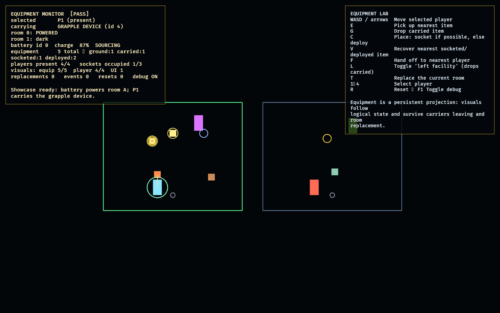
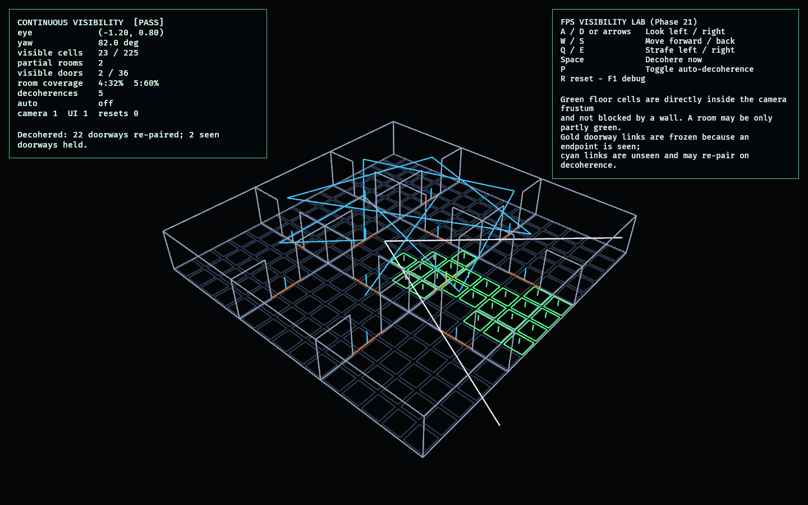

# Observed 2 technical labs

This workspace contains small, independently runnable prototypes for the game.

## The assembled game

The proven labs strung into one cohesive, UX-first player loop. Run:

```powershell
cargo run -p observed_game
```

Splash → Main Menu → Loadout → Lobby → Match → Results, with a persistent career,
a single visual theme, keyboard navigation, and an in-match pause. Nothing here
re-implements game logic: the career is
[`progression_lab`](labs/progression_lab/README.md), the lobby is
[`session_lab`](labs/session_lab/README.md), and the **Match is the live,
first-person 3D, networked hybrid match**
([`net_match_lab`](labs/net_match_lab/README.md)) — you walk the maze in first
person and each round is replicated to a remote peer over lockstep. The only new
code is the state machine and presentation.


See [game/README.md](game/README.md) for the screen-by-screen controls and the
manual verification procedure.

The live match now runs in a generated three-level facility: flat room bands at
0.0 m, 0.9 m, and 1.8 m are joined by deterministic stairs, and elevation is part
of collision, replay, networking, and rendered geometry.

Protected routes now offer a short pulsing pressure-gate shortcut versus a longer
safe bypass. Trap setbacks cost time and position, never health or earned progress;
route shifts produce explicit first-person flash, camera, and audio feedback.

## Networked Hybrid Match

Run:

```powershell
cargo run -p net_match_lab
```

The networked first-person match: deterministic lockstep
([`network_lab`](labs/network_lab/README.md)) carrying the concrete hybrid match
([`fps_hybrid_match_lab`](labs/fps_hybrid_match_lab/README.md)) over a hostile
transport. Two peers exchange the local team's per-round actions and reconstruct the
**identical match, maze, and first-person pose** despite packet loss, duplication,
and reordering — the 2D map is the spectator:


See [labs/net_match_lab/README.md](labs/net_match_lab/README.md) for the controls and
the verification procedure. This is the match the assembled game runs.

## Menu Lab

Run:

```powershell
cargo run -p menu_lab
```

The lab exercises:

- Boot to main-menu transition
- Functional settings and controls screens
- Timed gameplay loading
- Gameplay pause and resume
- In-place gameplay reset
- Return to the main menu
- Gameplay entity and resource cleanup
- Live lifecycle diagnostics

Keyboard shortcuts:

- `Escape`: back, pause, or resume depending on the current screen
- `Enter`: skip boot/loading
- `R`: reset the active gameplay session
- `F1`: toggle lifecycle diagnostics

See [labs/menu_lab/README.md](labs/menu_lab/README.md) for the complete manual test.

## Control Lab

Run:

```powershell
cargo run -p control_lab
```

The Control Lab proves that four player entities can consume the same abstract
intent regardless of whether it came from a keyboard, controller, deterministic
script, or recorded playback.

See [labs/control_lab/README.md](labs/control_lab/README.md) for controls and the
manual verification procedure.

## Movement Lab

Run:

```powershell
cargo run -p movement_lab
```

The Movement Lab is a deterministic kinematic-controller prototype covering
walking, running, jump timing assists, slopes, stairs, moving platforms, and
out-of-bounds respawn.

See [labs/movement_lab/README.md](labs/movement_lab/README.md) for its course
layout and verification procedure.

## Climbing Lab

Run:

```powershell
cargo run -p climbing_lab
```

The Climbing Lab proves authored vertical traversal as discrete, explicit modes
— ladders, ledge grab/hang/pull-up/drop/shimmy, and socket-based grapple
traversal — layered on the shared `PlayerIntent`. The authored showcase renders
every mode at once:


See [labs/climbing_lab/README.md](labs/climbing_lab/README.md) for controls, the
manual verification procedure, and how to regenerate the screenshot.

## Equipment Lab

Run:

```powershell
cargo run -p equipment_lab
```

The Equipment Lab proves a generic persistent-item framework: logical equipment
(battery, structural jack, cable spool, deployable light, grapple device) owned
by stable `EquipmentId`, with rendering as a pure projection. Items survive their
carrier leaving and survive room replacement, and a socketed battery powers a
room until it drains:



See [labs/equipment_lab/README.md](labs/equipment_lab/README.md) for controls,
the manual verification procedure, and how to regenerate the screenshot.

## Team Lab

Run:

```powershell
cargo run -p team_lab
```

The Team Lab runs four players in two teams (`observed_core::TeamId`) through
shared resources — narrow passages, a multi-climber climb point, a two-operator
machine, and contested items — proving deterministic contention, simultaneous
machinery/climbing, and team separation/reunion:


See [labs/team_lab/README.md](labs/team_lab/README.md) for controls, the manual
verification procedure, and how to regenerate the screenshot.

## Interaction Lab

Run:

```powershell
cargo run -p interaction_lab
```

The Interaction Lab demonstrates instant, exclusive, shared, timed, carry,
socket, and climb interactions through a logical state machine that supports
four stable player IDs.

See [labs/interaction_lab/README.md](labs/interaction_lab/README.md) for fixture
controls and the manual verification procedure.

## Room Lab

Run:

```powershell
cargo run -p room_lab
```

The Room Lab demonstrates the authored modular-room vocabulary, typed port
alignment, validated connections, collision generation, replacement, and
room-owned entity cleanup.

See [labs/room_lab/README.md](labs/room_lab/README.md) for controls and the
manual verification procedure.

## Facility Sandbox

Run:

```powershell
cargo run -p facility_sandbox
```

The Facility Sandbox is the first integration target: a main menu, four players,
run/jump/climb (reusing the `climbing_lab` controller), five connected rooms with
a room replacement, a carryable power cell that opens a powered door, a deployable
jack that bridges a pit, a schematic map, and a spectator camera — combined into
one completable objective with no competition or quantum behaviour:


See [labs/facility_sandbox/README.md](labs/facility_sandbox/README.md) for the
end-to-end objective, controls, and how to regenerate the screenshot.

## Observation Lab

Run:

```powershell
cargo run -p observation_lab
```

The Observation Lab is the first feasibility probe of the game's defining concept:
a room-connection graph that rewires **when unobserved** and freezes **when
observed**. Observed rooms pin their doors; a deterministic decoherence event
re-matches the rest; stepping through a door follows its current link, so where a
door leads depends on what has been watched:


See [labs/observation_lab/README.md](labs/observation_lab/README.md) for controls,
the manual verification procedure, and how to regenerate the screenshot.

## Constraint Lab

Run:

```powershell
cargo run -p constraint_lab
```

The Constraint Lab makes the observe/decohere structure playable: it reuses the
`observation_lab` graph and adds **mutable graph constraints** — a persistent
"spine" of protected routes that keeps the structure fully traversable however
the rest of it rewires. Drop the protection and a decoherence can isolate a room:


See [labs/constraint_lab/README.md](labs/constraint_lab/README.md) for controls,
the manual verification procedure, and how to regenerate the screenshot.

## Competition Lab

Run:

```powershell
cargo run -p competition_lab
```

The Competition Lab probes the competitive layer: multiple teams race to
**capacity-limited exits**, and teams interfere only *indirectly* by winning a
shared control (no direct harm). The match resolves to a deterministic placement,
with the overflow team locked out:


See [labs/competition_lab/README.md](labs/competition_lab/README.md) for controls,
the manual verification procedure, and how to regenerate the screenshot.

## Facility Director Lab

Run:

```powershell
cargo run -p director_lab
```

The Facility Director Lab probes the antagonist that controls the megastructure:
teams flee capacity-limited exits while a collapse line chases the leader, and any
team that falls behind is **absorbed into the director**, accelerating the
collapse. The director only closes in — it never harms players directly:


See [labs/director_lab/README.md](labs/director_lab/README.md) for controls, the
manual verification procedure, and how to regenerate the screenshot.

## Replay / Spectator Lab

Run:

```powershell
cargo run -p replay_lab
```

The Replay / Spectator Lab is the payoff of the workspace's determinism: a match
is recorded as a tape of per-tick inputs and **replayed exactly**, so a spectator
can scrub to any tick and the state is reproduced bit-for-bit — read straight from
the simulation, never reconstructed from entities:


See [labs/replay_lab/README.md](labs/replay_lab/README.md) for the transport
controls, the manual verification procedure, and how to regenerate the screenshot.

## Persistent Route Lab

Run:

```powershell
cargo run -p route_lab
```

The Persistent Route Lab lets players lay **cables** that pin a connection so it
survives decoherence — a reliable highway through the churning structure — with a
limited, contestable budget (an opponent can cut your cable):


See [labs/route_lab/README.md](labs/route_lab/README.md) for controls, the manual
verification procedure, and how to regenerate the screenshot.

## Incentive Lab

Run:

```powershell
cargo run -p incentive_lab
```

The Incentive Lab probes a scoring scheme that rewards **splitting** a team across
rooms and **revisiting** regrown rooms — rooms pay while occupied and regenerate
while empty, and harvest is multiplied by how many rooms a team covers, so no
single path dominates:


See [labs/incentive_lab/README.md](labs/incentive_lab/README.md) for controls, the
manual verification procedure, and how to regenerate the screenshot.

## Cooperative Hazard Lab

Run:

```powershell
cargo run -p hazard_lab
```

The Cooperative Hazard Lab proves a director-steered environmental pressure
front that requires two simultaneous relief roles. Operators may come from
different teams; successful coordination opens the shared route, while an
uncontained pulse only stalls advancement and never removes earned progress:


See [labs/hazard_lab/README.md](labs/hazard_lab/README.md) for controls, success
conditions, the manual verification procedure, and screenshot regeneration.

## Deterministic Lockstep Lab

Run:

```powershell
cargo run -p network_lab
```

The Deterministic Lockstep Lab connects two peers through a hostile datagram
transport and drives Phase 20's fixed-step first-person controller from quantized
network intents. Complete-frame gating, cumulative acknowledgements, resend, and
per-frame state hashes keep both peers synchronized through packet loss, delay,
duplication, and reordering. The committed network frames are also an exact replay
tape:


See [labs/network_lab/README.md](labs/network_lab/README.md) for the protocol,
controls, success conditions, scope, and screenshot regeneration.

## Matchmaking / Session Formation Lab

Run:

```powershell
cargo run -p session_lab
```

The Session Formation Lab deterministically selects a compatible four-account
roster, assigns stable player seats and balanced teams, gates launch on connection
and readiness, emits the networking/gameplay launch manifest, and handles host
migration, reconnect continuity, post-match rematch, and clean closure:


See [labs/session_lab/README.md](labs/session_lab/README.md) for controls, lifecycle
rules, success conditions, scope, and screenshot regeneration.

## Mutable Facility

Run:

```powershell
cargo run -p mutable_facility
```

The Mutable Facility is the first integration of the higher-level arc: it folds
the proven observation graph (`observation_lab`) and the constraint spine
(`constraint_lab`) into one playable loop with an objective — a team carries a
power cell to the exit while the unobserved structure rewires behind them. The
rooms the team observes freeze, the protected spine they follow never rewires, so
the exit stays reachable through the churn:


See [labs/mutable_facility/README.md](labs/mutable_facility/README.md) for
controls, the manual verification procedure, and how to regenerate the screenshot.

## Competitive Facility

Run:

```powershell
cargo run -p competitive_facility
```

The Competitive Facility folds all three higher-level systems into one match: the
mutable structure (`mutable_facility`), competition (`competition_lab` —
capacity-limited exits + deterministic placement + the contested control), and the
facility director (`director_lab` — a collapse line that absorbs fall-behind teams
and escalates). Progress is graph position along the protected spine, so the match
resolves while the structure rewires — the fastest teams escape, the rest are
taken by the facility:


See [labs/competitive_facility/README.md](labs/competitive_facility/README.md) for
controls, the manual verification procedure, and how to regenerate the screenshot.

## Match Replay / Spectator

Run:

```powershell
cargo run -p match_replay
```

The Match Replay lab records the full competitive match (`competitive_facility` —
observation + spine + competition + director) as a tape of per-round intents and
**replays it exactly**. A spectator/director camera over the schematic map reads
the replayed simulation state — seek to any round and the map, collapse, and
standings are reproduced bit-for-bit, with a focus ring tracking the leader and a
scrubber timeline of escape/absorption events:


See [labs/match_replay/README.md](labs/match_replay/README.md) for the transport
controls, the manual verification procedure, and how to regenerate the screenshot.

## FPS Observation Lab

Run:

```powershell
cargo run -p fps_observation_lab
```

The first **3D** lab and the feasibility probe that opens the first-person path. It
drives the observe/decohere mechanic from the first-person camera's **line of
sight**: the rooms you can see freeze their connections, while everything off-camera
rewires — and looking through a doorway follows its current graph link, so you
freeze whatever it leads to, not the room physically next door. The only new logic
is a line-of-sight function; it feeds `observation_lab`'s proven, deterministic
graph wholesale:


See [labs/fps_observation_lab/README.md](labs/fps_observation_lab/README.md) for
controls, the manual verification procedure, and how to regenerate the screenshot.

## FPS Controller Lab

Run:

```powershell
cargo run -p fps_controller_lab
```

A **deterministic** 3D first-person controller on the shared `PlayerIntent`
boundary — the 3D analogue of `movement_lab`, stepped at a fixed timestep with
substep AABB collision (floor, walls, pillars). Movement is relative to facing;
look, sprint, and jump come from `PlayerIntent`. Your live path is recorded and can
be replayed on a fresh body, retracing it exactly — the determinism that powers
replay and lockstep networking:


See [labs/fps_controller_lab/README.md](labs/fps_controller_lab/README.md) for
controls, the manual verification procedure, and how to regenerate the screenshot.

## FPS Visibility Lab

Run:

```powershell
cargo run -p fps_visibility_lab
```

Phase 21 replaces room-sized observation booleans with a continuous first-person
visibility field. Stable sub-room cells pass through frustum, range, and wall
occlusion tests; rooms can be partly visible, and only directly seen doorway
connections freeze while deterministic decoherence re-pairs the unseen:



See [labs/fps_visibility_lab/README.md](labs/fps_visibility_lab/README.md) for
controls, success conditions, and how to regenerate the screenshot.

## FPS Rewire Lab

Run:

```powershell
cargo run -p fps_rewire_lab
```

Phase 22 proves out-of-view-only 3D geometry replacement. Hidden portals are
rewired as one atomic batch, actual module entities are replaced only after every
affected aperture is still off-camera and clear, and traversal pins its old
rendered destination until arrival:


See [labs/fps_rewire_lab/README.md](labs/fps_rewire_lab/README.md) for the rendering
contract, controls, success conditions, and evidence procedure.

## FPS Facility Lab

Run:

```powershell
cargo run -p fps_facility_lab
```

Phase 23 promotes the `room_lab` vocabulary into authored 3D modules and projects
the exact `observation_lab` graph onto them. All 36 graph doors map to typed
Passage ports; sealed ports create real collision panels; and the deterministic
first-person controller walks through openings to their current graph partner:


See [labs/fps_facility_lab/README.md](labs/fps_facility_lab/README.md) for the
module/port contract, navigation controls, success conditions, and evidence
procedure.

## First-Person Competitive Match

Run:

```powershell
cargo run -p fps_match_lab
```

Phase 24, the FPS-arc capstone: the **full competitive match played in first
person** and replayed exactly. It composes the `competitive_facility` brain
(observation + spine + competition + director) with `fps_facility_lab`'s 3D facility
and controller; crossing the gold spine Passage advances your team while bots, the
collapse, and rewiring resolve deterministically. A tape records the local round
actions and reconstructs both the match and the first-person pose bit-for-bit, with
the `match_replay` schematic promoted to an in-3D tac-map:


See [labs/fps_match_lab/README.md](labs/fps_match_lab/README.md) for controls, the
manual verification procedure, and how to regenerate the screenshot.

## Spatial Maze Lab

Run:

```powershell
cargo run -p fps_maze_lab
```

Phase 25, the first lab of the **Hybrid maze arc** — making the coherence mechanic
concrete. It embeds the proven room graph in space: nine rooms placed
deterministically and every graph connection routed as a **real walkable corridor**
(gold = protected spine), no portals. The layout is a function of the graph + seed
(press `N` to vary it), and a decohered graph still embeds navigably — the basis for
rerouting (Phase 26):


See [labs/fps_maze_lab/README.md](labs/fps_maze_lab/README.md) for controls, the
manual verification procedure, and how to regenerate the screenshot.

## Rerouting Passages

Run:

```powershell
cargo run -p fps_reroute_lab
```

Phase 26, the second Hybrid-maze-arc lab — the maze made **live**. It composes the
Phase 25 maze with Phase 22's off-camera swap: when an unobserved region decoheres,
its corridors **re-route to different rooms**, but only via an atomic swap that
happens off-camera and never under the player's feet (magenta = a reroute waiting to
swap). The room you stand in is frozen; walk off, look back, and a corridor leads
somewhere new — no pop, no stranding, always navigable:


See [labs/fps_reroute_lab/README.md](labs/fps_reroute_lab/README.md) for controls,
the manual verification procedure, and how to regenerate the screenshot.

## First-Person Hybrid Match

Run:

```powershell
cargo run -p fps_hybrid_match_lab
```

Phase 27 completes the Hybrid maze arc: the full competitive match is played in
the concrete, navigable, rerouting labyrinth. The local team advances only after
the first-person controller physically enters the next protected-spine room;
unseen graph changes become atomic off-camera corridor swaps; and the deterministic
tape reproduces the match, maze, and first-person pose exactly:


See [labs/fps_hybrid_match_lab/README.md](labs/fps_hybrid_match_lab/README.md) for
controls, success conditions, automated coverage, and evidence regeneration.

## Progression & Cosmetics

Run:

```powershell
cargo run -p progression_lab
```

Phase 18, the final feasibility lab: a persistence layer for unlocks and cosmetics
that **never touches simulation determinism**. A profile earns XP from match
placements, levels up, unlocks cosmetics by level/win thresholds, equips them per
slot, and serializes to a save string that round-trips. The match is the proven
competitive brain, which takes no profile — so a test confirms the deterministic
result is identical no matter what is unlocked or equipped:


See [labs/progression_lab/README.md](labs/progression_lab/README.md) for controls,
the manual verification procedure, and how to regenerate the screenshot.

## Asset Drop-In Showcase

Run:

```powershell
cargo run -p asset_lab
```

A tooling lab: the simple way to use free/CC0 assets. A data-driven manifest of
slots (texture / model / sound) renders each as the **loaded file if present, or a
magenta placeholder if absent** — and an overlay shows every slot's exact drop path
and status. Drop a CC0 file at the listed path, re-run, and it replaces the
placeholder with no code changes:


See [labs/asset_lab/README.md](labs/asset_lab/README.md) for the convention and
[assets/README.md](assets/README.md) for the slot → path → CC0-source table
(ambientCG / Poly Haven for textures, Kenney / Quaternius for glTF models,
Kenney / Freesound for sounds).
