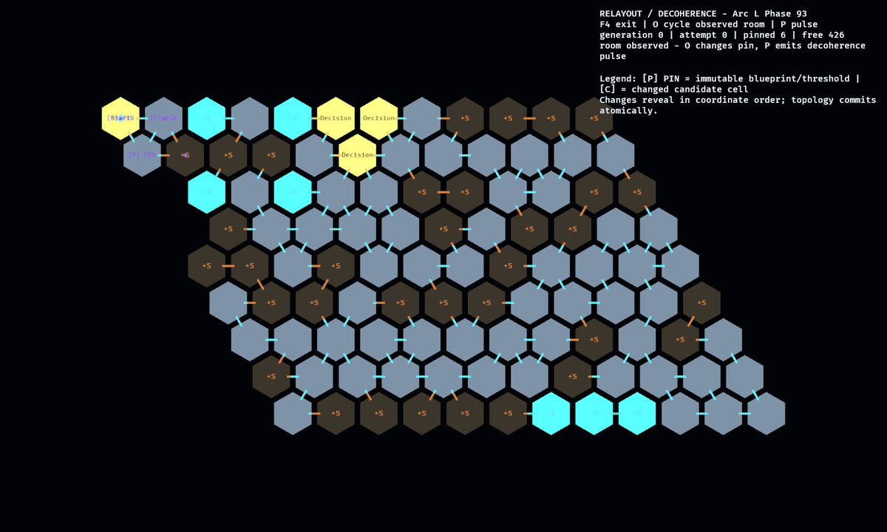

# Phase 93 — Relayout / Decoherence Parity

**Wave 4, parallel with Phase 92.** You own
`crates/observed_facility/src/hex_wfc/{relayout,topology}.rs` and the 2D relayout
mode of `labs/hex_wfc_lab/`. Phase 92 owns `crates/observed_match/src/hex_wfc/`
and the lab's 3D modules; the shared facility `hex_wfc/tests.rs` is
**append-only** for both. Do not touch anything under `full_wfc`. Arc context:
[../hex_tile_arc_plan.md](../hex_tile_arc_plan.md).

## Goal

Full relayout/decoherence parity on hex — a locked user ruling: the
changes-when-unobserved identity must work before game integration. Port the
square lattice's continuous-mutation machinery at **blueprint granularity**.

## Source material

- `crates/observed_facility/src/full_wfc/relayout.rs` — `begin_relayout` /
  `advance_relayout` / `propose_relayout`, `RelayoutWork` / `RelayoutProgress`,
  the one-attempt-per-tick discipline, `fallback_geometry_relayout`.
- `crates/observed_facility/src/full_wfc/topology.rs` — `pinned_cells`,
  `change_is_safe`, route re-validation at commit.
- `crates/observed_facility/src/full_wfc/mod.rs` — `commit_relayout` (route
  checks for players/landmarks before accepting).

## Deliverables

- Multi-tick relayout on the hex solver: begin/advance/propose over the
  `(seed, generation, attempt)` streams; incremental, cancellable, one
  deterministic attempt per tick.
- **Pin semantics at blueprint granularity**: observed/occupied/landmark cells
  pin their whole blueprint footprint plus attached threshold cells; hall pins
  stay per-cell. Ramp pairs pin as a unit (never split a `RampUp` from its
  `RampHead`). Shaft columns pin per-cell.
- Identity across relayout: `RoomId` (via blueprint `generation_key`) and
  `CorridorId` survive relayouts that keep them in place; threshold attachments
  re-derive stably.
- Commit-time validation: every occupied-player and remaining-objective route
  re-verified; pinned geometry byte-identical across the commit.
- Fallback path: when the topological retry budget exhausts, mutate one unseen
  cell's architecture register with identical ports (mirror
  `fallback_geometry_relayout`).
- **Decoherence-yield measurement** (arc-listed risk): with N rooms observed
  (blueprint pins), measure how many cells remain free to re-collapse on the
  default config; record the curve in as-landed notes so the parent can judge
  whether blueprint pins starve relayout.
- Lab: 2D animated relayout demo — pin a room (click/key), trigger a pulse,
  watch unpinned regions decohere and re-collapse in the step view.

## Success criteria

1. Replay determinism test: same pin set + seed + tick schedule ⇒ identical
   proposal, twice in a row.
2. Pin invariants over a corpus (≥100 seeds × ≥20 relayouts): pinned blueprints
   and ramp pairs never change; all routes survive every commit.
3. Stable-ID test: an observed room keeps its `RoomId` across ≥20 relayouts.
4. Decoherence yield recorded.
5. Workspace green.

## Evidence

Agent-viewed GIF of the lab relayout demo (pinned room stays, surroundings
re-form) + corpus/replay test output. Describe what visibly changed and what
visibly held still.

## As landed (2026-07-17)

**Status: complete.** Hex relayout is a pure facility-domain transaction with a
cancellable `HexRelayoutWork`: `advance_relayout` consumes exactly one
deterministic `(seed, generation, attempt)` stream per call. Collapse accepts
the previous layout, exact per-cell pins, and locked blueprints rather than
repeatedly generating unconstrained fresh worlds. Commit revalidates the latest
blueprint/threshold/ramp pins plus every occupied-player and remaining-objective
route before atomically replacing placements, blueprints, architecture
registers, and generation.

Pin and identity details as landed:

- Observing any blueprint cell or valid stable
  `(room_generation_key, named_port)` threshold pins the complete footprint and
  its attached threshold cells. Stale room keys and invalid port names are
  no-ops, and stale out-of-grid observation coordinates are ignored. Ordinary
  hall and shaft pins stay per-cell; either ramp half pins its pair.
- `RoomId` derives from the blueprint `generation_key`; `CorridorId` derives
  from the exact connected hall-cell set. Named threshold attachments are
  rebuilt deterministically. The facility also owns the architecture register
  and generation-independent authored-tile variation key, so pinned geometry
  identity includes the projector's semantic selection inputs.
- Work and candidates carry their base seed, complete solver configuration, and
  generation. A same-generation token from either a different seed or changed
  grid dimensions is stale before old locks can be indexed. The lab explicitly
  cancels in-flight work on reset, same-seed preset reselection, or mode exit;
  the plan reset writer is ordered before the cancellation reader in the same
  update.
- Retry exhaustion changes one unseen active cell's architecture register while
  leaving every port and placement byte-identical.

### Decoherence-yield risk measurement

The ignored audit test was run, not merely compiled, against the real Arc L
`28 x 20 x 10` configuration (5,600 cells), seed
`0xA11C_9300_0000_0001`. The solve and curve completed in 659.38 seconds.
Start and Exit are baseline pins, which is why explicitly observing them does
not increase the first two rows.

| observed rooms | pinned cells | free cells | free yield |
| ---: | ---: | ---: | ---: |
| 0 | 6 | 5,594 | 99.89% |
| 1 | 6 | 5,594 | 99.89% |
| 2 | 6 | 5,594 | 99.89% |
| 3 | 20 | 5,580 | 99.64% |
| 4 | 32 | 5,568 | 99.43% |

Blueprint pinning therefore does not starve relayout on this accepted default
seed. At Phase 93 the remaining scale risk was solve latency, so its interactive
evidence deliberately used the 12 x 9 x 4 showcase and a 12-attempt bound.

> **Phase 95 correction (2026-07-18):** subsequent solver work reduced the
> production-shaped solve from offline-scale (~10 minutes in the Phase 92/93
> measurements) to roughly 0.8 seconds. Phase 95 therefore uses the real
> 28 x 20 x 10 configuration in normal Play while keeping the compact fixture for
> deterministic capture and test timelines.

### Verification and evidence

- Focused relayout suite: 13 passed, 1 production-scale audit ignored in normal
  runs; the ignored audit was run separately and passed.
- Required invariant corpus: 100 seeds x 20 committed relayouts; pinned
  blueprint/ramp geometry, architecture register, authored variation key,
  player/objective routes, and observed `RoomId` all held. The run produced 264
  non-fallback candidates with 264 nonempty placement/topology deltas across 74
  seeds and all 20 pulse indices. The test enforces floors of 200 topology
  deltas, 50 distinct seeds, and 10 distinct pulse indices, so fallback-only
  behavior cannot satisfy the corpus.
- Hex WFC lab: 14 passed, including generic and same-seed preset cancellation,
  optional-room stable-key selection, 2D-to-3D generation synchronization, and
  reset/reprojection.
- Focused Clippy with warnings denied passed for `observed_facility` and
  `hex_wfc_lab`.

The viewed loop starts with the solved plan and six purple `[P] PIN` labels on
the observed Start blueprint/attached thresholds. After five one-attempt ticks,
register-colored `[C]` markers reveal the 424 changed candidate cells in
deterministic coordinate order; this is an evidence animation, not the WFC's
internal collapse order. The same six purple pin labels remain fixed, then the
new topology appears atomically at commit. The final overlay reports generation
1, 424 changed, 6 pinned, and 426 free on the compact evidence world. The ASCII
labels are a redundant shape/text channel, so the state is not communicated by
color alone. WFC attempt semantics are proven by the replay/corpus tests rather
than inferred from reveal order. Capture manifest:
[`manifest.json`](../evidence/hex_wfc_lab_p93/manifest.json).
