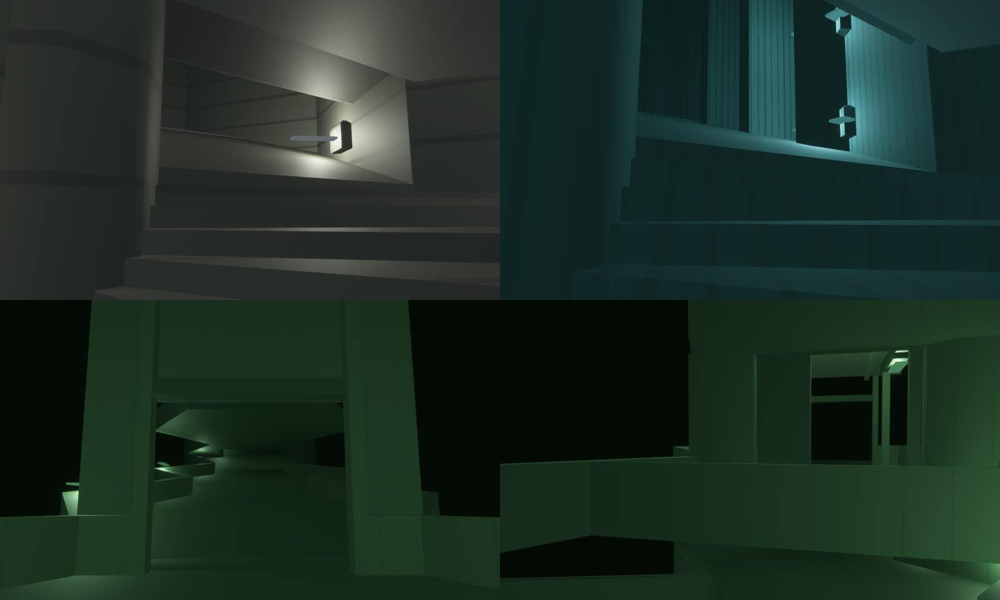

# Climb compositions: every storey reached across several tiles

2026-10-02. Decided with the user after the first-person captures: a climb inside one
hex column rises a full 8 m storey within 14 m of plan, and it shows. Today's switchback
ramp and spiral stair tower are too steep and too narrow. From now on a climb is a
composition of several tiles. One card plays it, and places them all.

Decisions:

- **Stair towers retire.** Every storey is reached by its own composition, and climbs
  chain floor to floor. The narrow spiral goes, and so does the multi-storey shortcut.
- **Straight first.** One straight composition proves the mechanism, dressed for each
  district. Turned shapes follow on the same mechanism (phase 6).

## The composition

A straight run along a lateral heading `d`: three cells on storey L and one above the
last.

| Cell | Storey | Ports | Holds |
|---|---|---|---|
| **Foot** | L | `opposite(d)`: door; `d`: span | entry pad, then the flight up to 2.6 m |
| **Mid** | L | `opposite(d)`: span; `d`: span | the flight, up to 5.0 m |
| **High** | L | `opposite(d)`: span; up: climb-open | the flight, up the last 3.0 m to the next floor |
| **Landing** | L+1 | down: climb-open; `d`: door | open over the flight, a pad where it arrives |

- **One archetype:** `HexArchetype::Climb { part, heading }`, with `ClimbPart` naming
  the cell. `hex_wfc::composition_cells` gives all four cells from any one of them.
  Topology pins and relayout treat that set as one indivisible unit.
- **Plan:** 42 m from the entry face to the far face, with about 36 m of flight for 8 m
  of rise. No flight is steeper than 0.3 (about 17°): `FloorPolicy::Flight` in the forge
  enforces this. The flight runs wall to wall.
- **Headroom:** the cells above Foot and Mid are ordinary cells, with their floor slab
  from 8.0 m. Foot and Mid keep a ceiling at 7.5 m. The High has none, and the Landing
  is open over it.
- **Self-assembly:** a new lateral port class, **span** (`PortClass::Span`), meets only
  another span. `spans_join` and `climb_bond` require the right partner in the right
  order along one heading. Span shares a packed lane with `RampOpen`, so no older
  signature moved.
- **Straight on, both ends.** The first plan allowed 7 entry and 7 exit masks per
  heading. That multiplied the variants past the solver's mask budget and gave it
  climbs it could not close. Each end now has exactly one door, straight along the
  heading: 24 variants (4 parts, 6 headings), weight 4.

## How the solver routes through a climb

A climb is three cells long and one storey up, so a breadth-first search over single
cells could not route a skeleton through one. `hex_wfc/routing.rs` is a Dijkstra search
with two kinds of move:

- a lateral step, cost 1;
- a whole climb (`climb_move`), cost 5, rising or falling, which claims all four cells.

The corridor skeleton reuses climbs already laid, keeps doorsteps clear, and never
crosses its own recent path. Routed hall cells may carry one branch door beyond the
route's own (`collapse::routed_mask_admits`). Exact masks stranded hall pockets and took
11 attempts and 9.4 s on the production solve. With the one-branch relaxation it takes
3 attempts and 3.0 s. A pocket relayout must use the same rule. Holding its routed
cells to the bare route made a standing branch unmatchable from inside the pocket, and
5 in 60 tactics-lab shifts fell back to a district repaint until it did.

The validator measures decision-beat spacing with a 0-1 search: moving within one
composition is free, so a 42 m climb does not count as a long corridor without choices.

## Phases

Each phase leaves the tree green and the game playable.

1. **Solver.** Done. Span ports, the climb archetype, variants, compatibility,
   validation (a composition is always whole and in order), the router, and
   `directed::authored_climb` for the card.
2. **Tiles.** Done. `forge/climb.rs` builds the four cells (base dressing) into
   `assets/tiles/authored/climb_*.map`. A traversal test walks every production
   composition up and down: 39 climbs, no stalls.
3. **Bots.** Done. A span face binds to the spine node nearest in plan, a storey's rise
   apart. Projection pins each climb cell's turn (`geometry::required_turn`), because the
   Mid's signature is symmetric under a half turn. The bot soak climbs 404 storeys by
   composition, and the headless gate is re-pinned.
4. **Retire.** Done. The ramp and shaft families are out of the solver (352
   variants). The Stair card plays `authored_climb` and places four cells. Its
   legality covers all of them, and no climb cell is ever retracted. The `RampUp`,
   `RampHead` and `Shaft` archetypes are gone. So are the ramp, tower and perimeter
   forge families, the kits' wedge ascents and the generated library's ramps, along
   with their 185 sources. The catalogue went from 359 modules to 181, and the
   profile's archetype bias names `climb` (profile version 6). Two pieces stay on
   purpose:
   - The `shaft_open` port class: the Backrooms sanctuary modules still declare it,
     and removing it would reshuffle every packed signature.
   - The `vertical_column` assembly scope: it is part of the authoring format, in the
     TrenchBroom entity definitions and in certification, though nothing uses it now.

   The district benchmark scenes in `docs/compositions/` lost their one-cell ramps.
   Each tier is still checked for internal connectivity, but the tiers are no longer
   joined; a benchmark that climbs again will climb by a composition.
5. **Districts.** Done. Every register has its own climb: seven dressings
   (`forge::climb`), 28 cells in all. The flight, its spans and its spine are the
   same in every district. The hexagon's flat east and west faces leave a straight
   aisle 7 m wide through every cell, with a triangular alcove either side, and a
   district dresses only the alcoves, the aisle's edges and what hangs overhead:

   | District | Registers | Dressing |
   |---|---|---|
   | Backrooms | liminal grid, monolith, institutional, wellshaft | plain walls and ceiling |
   | Library | infinite gallery | stacks across the alcoves, floor to ceiling |
   | Lumen | overlit grid | a lit, tiled plinth in each alcove |
   | Zen | shadow screen | paper screens along the aisle, lanterns behind them |
   | Monument | facet monument | masonry filling the alcoves, a pier at every seam |
   | Reactor | megastructure | columns in the alcoves, balustrades, a girder overhead |
   | Sky | thinning | parapets for walls, no ceiling |

   Where the landing is open over the high cell, the Library's stacks, the
   Monument's masonry and the Reactor's columns carry on up through it, so the high
   cell reads as one tall stairwell. Climbs are drawn by facing, as ramps were, so
   a flight wears its district's floor. They had been drawn as halls, which judged
   the sloped mass a wall. On every map (the survivor map, tactics_lab,
   iso_observer_lab, composition_studio), a climb's flight cells step up the way it
   climbs (`HexSketchRole::ClimbFoot` to `ClimbHigh`), with its landing low on the
   floor above, so a composition reads as a stair with a direction.

   `OBSERVED2_CAPTURE_HEX_WFC_VERTICALS` shoots each district's first climb in game:
   up from the foot, and down from the landing. The landing is on the floor above, so
   each "down" view stands in the next district.

   
   

6. **Shapes.** Done. A composition's shape is carried by the two cells it changes.
   The mid cell may turn the flight (`ClimbPart::Mid { turn }`) and the landing may
   be left by four faces (`ClimbPart::Landing { exit }`). The foot is always entered
   straight on, and the high cell is the same in every shape.

   The shapes were chosen by the benchmark scenes in `docs/compositions/`, not in
   the abstract. A probe tried every flight that bends 0, 60 or 120 degrees at its
   mid cell, with every landing exit, in each scene. No straight climb fitted any
   scene, and the shapes below are what the scenes asked for. Each scene was then
   rebuilt by the generator's own check: every placement of every shape, with any
   door it shuts re-chosen from that hall's own family, anything it strands pruned,
   and the result ranked by what the scene loses. Two scenes take a climb that joins
   two existing doors and touches nothing else, both with the switchback landing. The
   two three-storey scenes take two climbs, one per storey:

   | Scene | District | Climbs | What gave way |
   |---|---|---|---|
   | last courtyard | Sky | straight, landing back over the flight | nothing |
   | same door twice | Lumen | straight, landing back over the flight | nothing |
   | empty audience | Monument | winds 120 degrees left | a hall, and one it stranded |
   | missing rooms | Library | winds 120 degrees left | three halls, and two stranded |
   | witness exchange | Backrooms | bends 60 degrees left, landing to the right; then winds 120 degrees right | a junction; another re-chosen |
   | unfinished crossing | Reactor | straight, landing to the left; then bends 60 degrees left | a turn; two junctions re-chosen |

   Their tests now hold each scene to one place: every cell reachable through its
   ports, across storeys by its climbs.

   - **Turns** (`ClimbTurn`, counted from the heading toward its right, as the faces
     run): ahead, 60 degrees either way, and 120 degrees either way. A turning mid
     cell's steps fan about the point where its entry and exit faces' lines meet: the
     corner they share for a 120-degree winder, which winds round a newel there, and
     a point outside the cell for a 60-degree bend. Every step's edges lie on rays
     from that point, so the first step meets the foot's flight along the whole entry
     face and the last meets the high cell's along the whole exit face; no warped
     slope of flat brushes can. Eight treads, nine equal risers of 0.27 m, and a climb
     line on the pitch of the steps through both faces' midpoints: 0.29 for the
     winder, 0.19 for the bend.
   - **Exits:** ahead, 60 degrees either way, and back over the flight. The flight
     arrives on the landing's east pad as on every landing. A gallery round the alcove
     on the exit's side carries the floor to the door, railed where it overlooks the
     stairwell. Back over the flight it runs left to a pad of its own before the
     west door: a switchback. The two exits beside the face behind are left out,
     because from the pad they are as far round as the face behind.
   - **Weights:** the straight mid and landing keep weight 4, and each turned one has
     weight 1. The corpus builds all 20 shapes. The router still lays straight
     climbs on its routes, so routed climbs do not move: turned shapes come from free
     collapse, from an Architect's card, and from authored scenes.
   - **Cells:** `composition_cells` reads the mid cell's turn through a lookup, since
     a foot alone no longer says where its high cell is (`composition_in` reads a
     facility's placements). The catalogue is 394 variants (66 climb), so the
     solver's variant set grows to seven words. The forge builds 49 more cells (seven
     shapes in seven dressings); a turning flight has no alcoves, so each district
     dresses the two walls round the outside of the turn.
   - **Frame budget.** Phase 101 arc gate, 2026-10-03, uncapped, live seed: frame
     p95 12.3 ms (13.8 before the shapes, budget 16.7), worst mutation frame 12.3 ms,
     all ten mutations committed.
   - **Walking them.** Every production composition, every shape, climbs and
     descends end to end on the production controller (155 across three seeds). Two
     fixes made that true. A spine's target now looks past a node already underfoot
     (`StairSpine::target`): a body that met a node from the side, as on a landing it
     arrives at off the axis, or one stood on a tread a little above a winder's pitch
     line, circled the node. And a walkway hangs its truss only over an unbuilt cell:
     over a climb's mid cell it came down through the ceiling into the steps'
     headroom.

   Clockwise from top left: a Backrooms winder from its foot, round the newel; a
   Library winder between its stacks; the Sky courtyard's switchback landing, its
   gallery railed over the stairwell; and its flight from the hall below.

   

## What moved

- **Hashes:** the catalogue, the composition profile (version 5) and the simulation.
  This means a LAN lockout against older builds.
- **Pins:** gate, selection and soak pins, each with a note.
- **Ascent scenario seeds:** Pocket 20, Quick Climb 39, Full Ascent 26, Deep Stack 10
  (were 19, 21 and 27 until the climbs gained turned shapes; Quick Climb must also
  complete its darkness hold).
  These were chosen by measurement, with two tests.
  - A scenario gap must now be a cell that some card rebuilds exactly. Routed halls can
    carry a branch, and many routes have too few such cells; Pocket's old seed had none.
  - The bot match must not be decided in its opening beats. The first seeds with full
    gaps ended in 6 to 9 beats, because they started the second Observer a short walk
    from the exit.
- **Phase 101 arc gate: green again.** Measured 2026-10-02, uncapped, on the live
  seed 263960012067191:

  | | Before climbs | Climbs | Climbs and dressings | Now |
  |---|---|---|---|---|
  | Frame p95 | 14.9 ms | 17.9 ms | 18.3 ms | **14.2 ms** (budget 16.7) |
  | Worst mutation frame | 15.5 ms | 18.1 ms | 18.9 ms | 14.5 ms (budget 33.3) |
  | Peak resident cells | 60 | 90 | 90 | 90 |

  The GPU passes come to about 4 ms. The cost was the practical lights' shadows:
  each shadowed fixture redraws every caster within its 14 m range into six cube
  faces, about 2.5 ms a frame whatever the shadow map's size. With all practical
  shadows off the median frame falls from 14.3 to 4.1 ms; key and moon shadows off
  save about 0.3 and 0.4 ms. Climbs put half as many cells again within reach, so
  the budget of shadowed fixtures went from four to three
  (`PRACTICAL_SHADOW_BUDGET`). Separately, cells below the viewed storey no longer
  cast shadows (`sync_storey_shadow_casters`), which saves about 0.4 ms.
