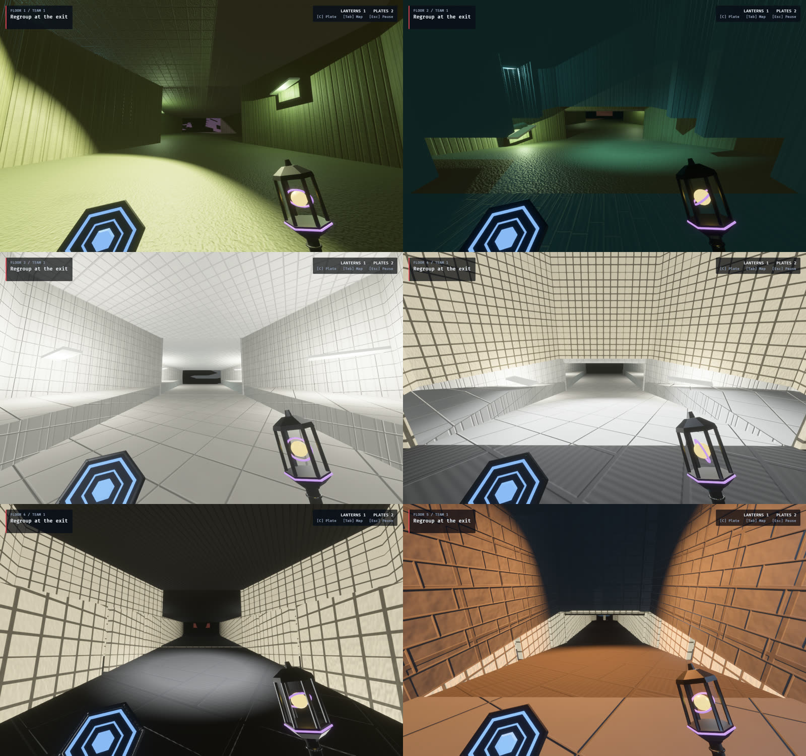
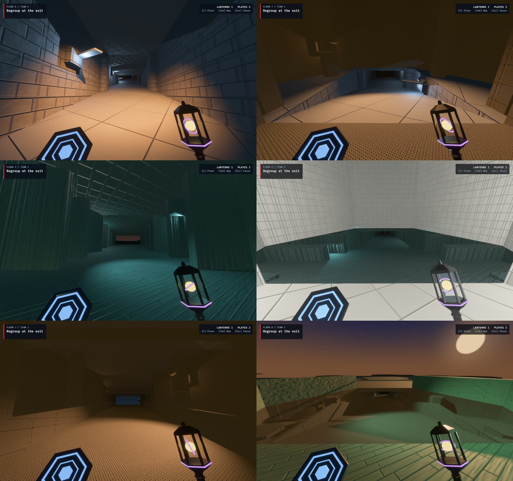

# Climb compositions: every storey reached across several tiles

2026-10-02. Decided with the user after the first-person captures: a climb inside one
hex column rises a full 8 m storey within 14 m of plan, and it shows. Today's switchback
ramp and spiral stair tower are too steep and too narrow. From now on a climb is a
composition of several tiles. One card plays it, and places them all.

Decisions:

- **Stair towers retire.** Every storey is reached by its own composition, and climbs
  chain floor to floor. The narrow spiral goes, and so does the multi-storey shortcut.
- **Straight first.** One straight composition proves the mechanism, dressed for each
  district. District-specific shapes (an L-turn, a switchback across two cells, a grand
  stair) follow as further compositions on the same mechanism.

## The composition

A straight run along a lateral heading `d`: three cells on storey L and one above the
last.

| Cell | Storey | Ports | Holds |
|---|---|---|---|
| **Foot** | L | `opposite(d)`: door; `d`: span | entry pad, then the flight up to 2.6 m |
| **Mid** | L | `opposite(d)`: span; `d`: span | the flight, up to 5.0 m |
| **High** | L | `opposite(d)`: span; up: climb-open | the flight, up the last 3.0 m to the next floor |
| **Landing** | L+1 | down: climb-open; `d`: door | open over the flight, a pad where it arrives |

- **One archetype:** `HexArchetype::Climb { part, heading }`, with `ClimbPart` naming
  the cell. `hex_wfc::composition_cells` gives all four cells from any one of them.
  Topology pins and relayout treat that set as one indivisible unit.
- **Plan:** 42 m from the entry face to the far face, with about 36 m of flight for 8 m
  of rise. No flight is steeper than 0.3 (about 17°): `FloorPolicy::Flight` in the forge
  enforces this. The flight runs wall to wall.
- **Headroom:** the cells above Foot and Mid are ordinary cells, with their floor slab
  from 8.0 m. Foot and Mid keep a ceiling at 7.5 m. The High has none, and the Landing
  is open over it.
- **Self-assembly:** a new lateral port class, **span** (`PortClass::Span`), meets only
  another span. `spans_join` and `climb_bond` require the right partner in the right
  order along one heading. Span shares a packed lane with `RampOpen`, so no older
  signature moved.
- **Straight on, both ends.** The first plan allowed 7 entry and 7 exit masks per
  heading. That multiplied the variants past the solver's mask budget and gave it
  climbs it could not close. Each end now has exactly one door, straight along the
  heading: 24 variants (4 parts, 6 headings), weight 4.

## How the solver routes through a climb

A climb is three cells long and one storey up, so a breadth-first search over single
cells could not route a skeleton through one. `hex_wfc/routing.rs` is a Dijkstra search
with two kinds of move:

- a lateral step, cost 1;
- a whole climb (`climb_move`), cost 5, rising or falling, which claims all four cells.

The corridor skeleton reuses climbs already laid, keeps doorsteps clear, and never
crosses its own recent path. Routed hall cells may carry one branch door beyond the
route's own (`collapse::routed_mask_admits`). Exact masks stranded hall pockets and took
11 attempts and 9.4 s on the production solve. With the one-branch relaxation it takes
3 attempts and 3.0 s. A pocket relayout must use the same rule. Holding its routed
cells to the bare route made a standing branch unmatchable from inside the pocket, and
5 in 60 tactics-lab shifts fell back to a district repaint until it did.

The validator measures decision-beat spacing with a 0-1 search: moving within one
composition is free, so a 42 m climb does not count as a long corridor without choices.

## Phases

Each phase leaves the tree green and the game playable.

1. **Solver.** Done. Span ports, the climb archetype, variants, compatibility,
   validation (a composition is always whole and in order), the router, and
   `directed::authored_climb` for the card.
2. **Tiles.** Done. `forge/climb.rs` builds the four cells (base dressing) into
   `assets/tiles/authored/climb_*.map`. A traversal test walks every production
   composition up and down: 39 climbs, no stalls.
3. **Bots.** Done. A span face binds to the spine node nearest in plan, a storey's rise
   apart. Projection pins each climb cell's turn (`geometry::required_turn`), because the
   Mid's signature is symmetric under a half turn. The bot soak climbs 404 storeys by
   composition, and the headless gate is re-pinned.
4. **Retire.** Mostly done. The ramp and shaft families are out of the catalogue
   (352 variants). The Stair card plays `authored_climb` and places four cells. Its
   legality covers all of them, and no climb cell is ever retracted. Still left as
   dead code: the `RampUp`, `RampHead` and `Shaft` enum variants, the tower and ramp
   forge sources, and the column-assembly machinery.
5. **Districts.** Done. Every register has its own climb: seven dressings
   (`forge::climb`), 28 cells in all. The flight, its spans and its spine are the
   same in every district. The hexagon's flat east and west faces leave a straight
   aisle 7 m wide through every cell, with a triangular alcove either side, and a
   district dresses only the alcoves, the aisle's edges and what hangs overhead:

   | District | Registers | Dressing |
   |---|---|---|
   | Backrooms | liminal grid, monolith, institutional, wellshaft | plain walls and ceiling |
   | Library | infinite gallery | stacks across the alcoves, floor to ceiling |
   | Lumen | overlit grid | a lit, tiled plinth in each alcove |
   | Zen | shadow screen | paper screens along the aisle, lanterns behind them |
   | Monument | facet monument | masonry filling the alcoves, a pier at every seam |
   | Reactor | megastructure | columns in the alcoves, balustrades, a girder overhead |
   | Sky | thinning | parapets for walls, no ceiling |

   Where the landing is open over the high cell, the Library's stacks, the
   Monument's masonry and the Reactor's columns carry on up through it, so the high
   cell reads as one tall stairwell. Climbs are drawn by facing, as ramps were, so
   a flight wears its district's floor. They had been drawn as halls, which judged
   the sloped mass a wall. On every map (the survivor map, tactics_lab,
   iso_observer_lab, composition_studio), a climb's flight cells step up the way it
   climbs (`HexSketchRole::ClimbFoot` to `ClimbHigh`), with its landing low on the
   floor above, so a composition reads as a stair with a direction.

   `OBSERVED2_CAPTURE_HEX_WFC_VERTICALS` shoots each district's first climb in game:
   up from the foot, and down from the landing. The landing is on the floor above, so
   each "down" view stands in the next district.

   
   

## What moved

- **Hashes:** the catalogue, the composition profile (version 5) and the simulation.
  This means a LAN lockout against older builds.
- **Pins:** gate, selection and soak pins, each with a note.
- **Ascent scenario seeds:** Pocket 20, Quick Climb 19, Full Ascent 21, Deep Stack 27.
  These were chosen by measurement, with two tests.
  - A scenario gap must now be a cell that some card rebuilds exactly. Routed halls can
    carry a branch, and many routes have too few such cells; Pocket's old seed had none.
  - The bot match must not be decided in its opening beats. The first seeds with full
    gaps ended in 6 to 9 beats, because they started the second Observer a short walk
    from the exit.
- **Phase 101 arc gate: green again.** Measured 2026-10-02, uncapped, on the live
  seed 263960012067191:

  | | Before climbs | Climbs | Climbs and dressings | Now |
  |---|---|---|---|---|
  | Frame p95 | 14.9 ms | 17.9 ms | 18.3 ms | **14.2 ms** (budget 16.7) |
  | Worst mutation frame | 15.5 ms | 18.1 ms | 18.9 ms | 14.5 ms (budget 33.3) |
  | Peak resident cells | 60 | 90 | 90 | 90 |

  The GPU passes come to about 4 ms. The cost was the practical lights' shadows:
  each shadowed fixture redraws every caster within its 14 m range into six cube
  faces, about 2.5 ms a frame whatever the shadow map's size. With all practical
  shadows off the median frame falls from 14.3 to 4.1 ms; key and moon shadows off
  save about 0.3 and 0.4 ms. Climbs put half as many cells again within reach, so
  the budget of shadowed fixtures went from four to three
  (`PRACTICAL_SHADOW_BUDGET`). Separately, cells below the viewed storey no longer
  cast shadows (`sync_storey_shadow_casters`), which saves about 0.4 ms.
