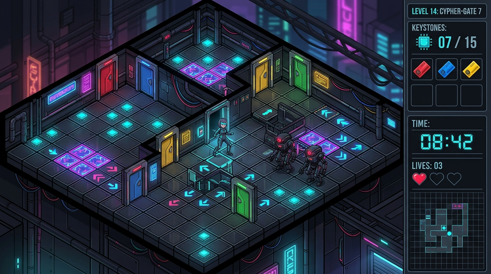
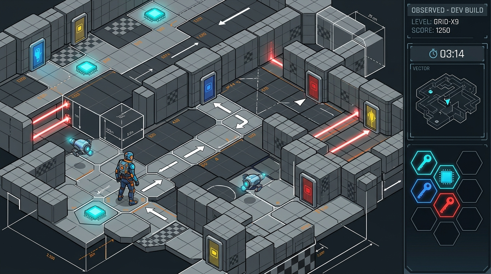
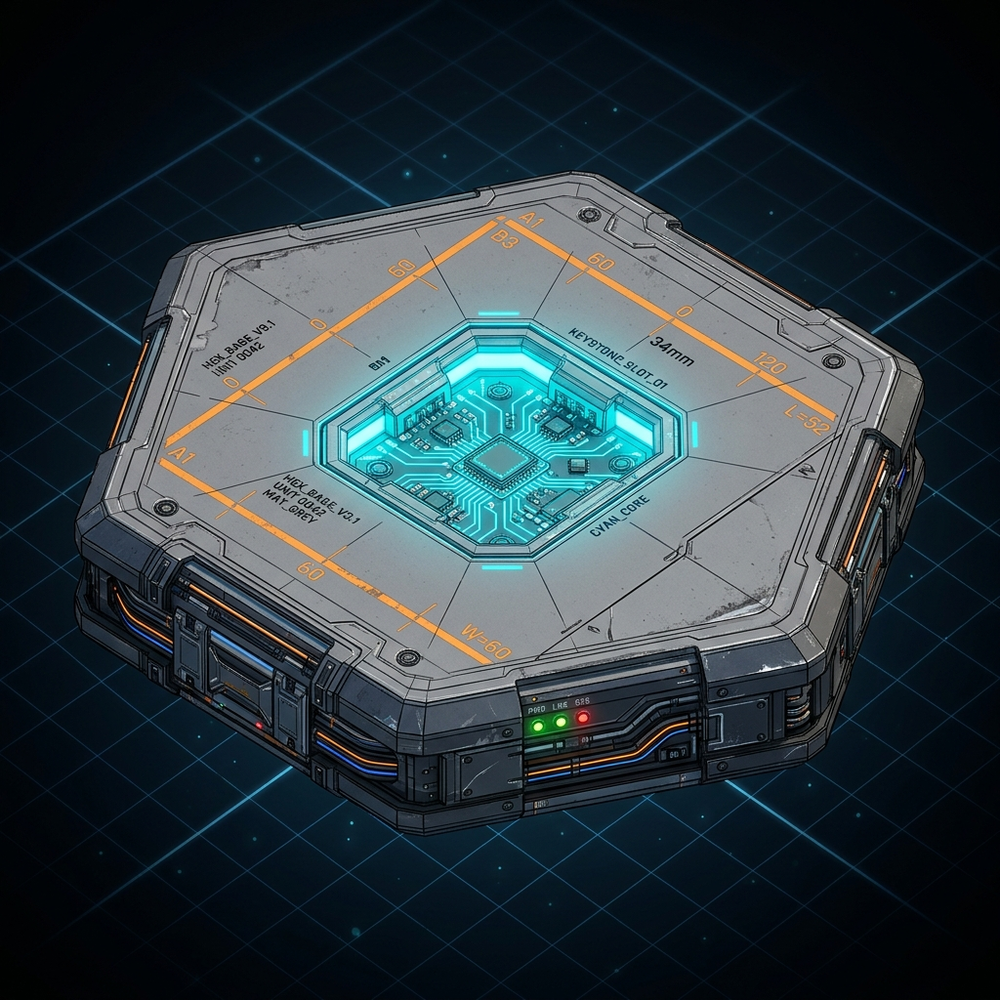
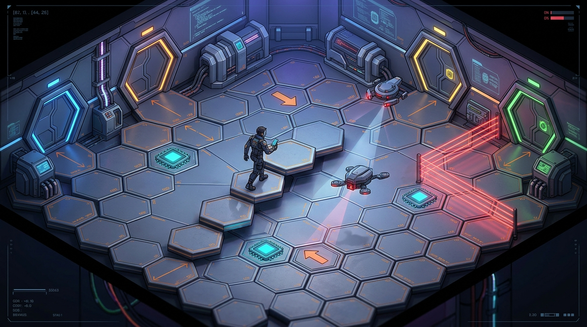

# Observed: Isometric Protocol (Concept Art Gallery)

````carousel

<!-- slide -->

<!-- slide -->

<!-- slide -->

````

---

## Comparison & Design Variations

### 1. Hexagonal Grid Mechanics vs. Square Grid
- **Movement Axes**: 6-directional movement vectors allow diagonal flanking around patrolling Guardians and more organic choke-points.
- **Hex Keystones & Sockets**: Keystone chips and security door sockets fit interlocking hexagonal geometry for natural tile alignment.
- **Force Vector Hexes**: Directional force floors use 6-way hex arrows for complex momentum puzzles.

### 2. "Dev Texture" / Greybox Aesthetic
- **Orange & Slate-Grey Unit Grids**: Standard Source/Unreal-style prototype dev textures with scale markers and unit grid lines.
- **Wireframe & Collision Overlays**: Visible tile boundary lines and hitboxes, emphasizing legibility and prototype clarity.
- **High-Contrast Gameplay Markers**: Neon cyan keystones, bright keycard locks, and clear hazard highlights popping against neutral greybox geometry.

### 3. Single Hex Keystone Tile Specification
- **Recessed Socket**: Central octagonal/hexagonal recess accommodating microchip keystone inserts (`CYAN_CORE`).
- **Dev Print Annotations**: Printed grid measurements (`W=60`, `L=52`, `34mm`), material tags (`MAY_GREY`), and unit bounding boxes.
- **Side Panel Conduits**: Dark metallic base structure with status LEDs (`PWR`, `LNK`, `ERR`) and power busing for tile-to-tile signal propagation.

### 4. Tessellated Hexagonal Chamber Room Architecture
- **Tessellated Flooring**: Complete room floor constructed from interlocking hex tiles with elevated hex step pedestals.
- **Hexagonal Wall Frames & Doors**: Angled room walls matching 60-degree hex geometry with color-coded keycard door locks.
- **Dynamic Laser & Force Tiles**: Red laser barrier hexes and orange directional force tiles integrated directly into the floor matrix.
