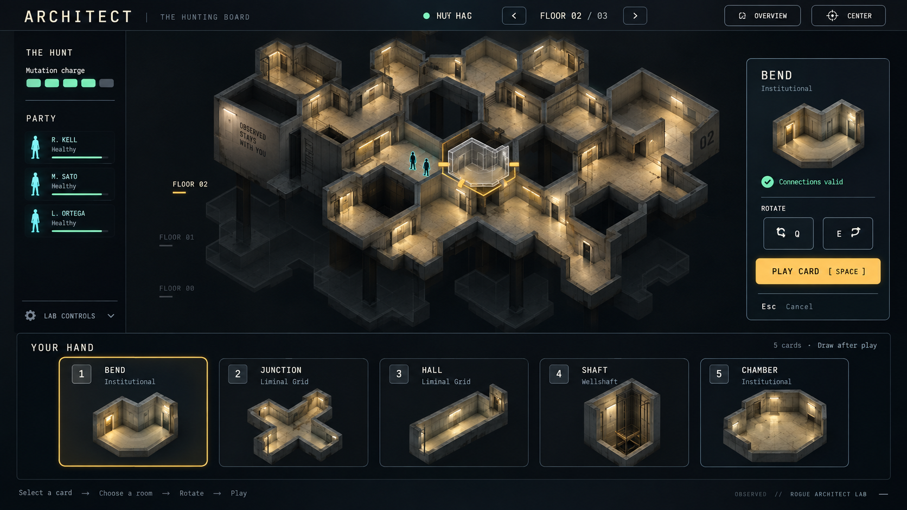

# Rogue Architect UI concept

Generated with the built-in image generation tool on 2026-09-19, using the current lab screenshot as a functional reference. This is a proposed visual target, not an implemented UI or a validated map.



## Direction

- A large isometric cutaway of connected rooms is the primary view.
- Muted lower floors provide context while one floor remains readable.
- The five-card hand previews architectural modules.
- Selection, connection validity, rotation, and play form a clear interaction sequence.
- Quiet charcoal panels, warm architecture, amber selection, and cyan party markers establish hierarchy.

## Implementation constraints

Use real tile geometry, hex connectivity, floor indices, party roles and existing simulation state. Generated room topology, names, status indicators and text are illustrative. Correct the garbled hunt-status label and omit invented wall slogans. Do not introduce health mechanics or new rules based on visual details in this image. Card previews and the board should share the same geometry and materials. This concept does not change the simulation or commit to the architectural theme of every district.

## Generation prompt

```text
Use case: ui-mockup.
Create a polished, implementable widescreen 16:9 game UI redesign concept for OBSERVED's Rogue Architect lab. Image 1 is the CURRENT UI, a functional reference only: radically redesign its presentation while keeping the central hunting board, floor navigation, selected target, room-card hand, rotation and play action. Deliver one full-screen game screenshot, no device frame, no comparison panels, no annotations outside the UI.

Visual goal: an elegant, restrained tactical interface around a beautiful isometric cutaway of the actual 3D environment. The center is the hero, occupying roughly 70% of the screen. One large coherent connected hex-cell-based labyrinth is in focus, with two subtle offset lower-floor silhouettes beneath it to imply a multi-storey structure. Fixed orthographic isometric camera looking down about 35 degrees. Cut away roofs and front-facing walls so room interiors and continuous walkable connections are clearly visible. Use monumental simple early-2000s sci-fi architecture blended with eerie institutional Backrooms: broad pale concrete surfaces, chunky chamfered doorframes, a few deep voids and shafts, warm fluorescent light in corridors, muted ochre interiors. Strong architectural silhouettes and convincing scale, very sparse detailing, no dense machinery or decorative greebles. Hex boundaries are fine seams in the model; connected corridors and rooms form a real place, not a collection of flat board-game tokens. Tiny readable human pawns and a restrained cyan locator identify the hunting party.

Art direction: dark charcoal backdrop and flat quiet HUD panels, warm off-white typography, muted architectural gray/ochre, small amber accents reserved for the selected card, selected module and primary action. Cyan reserved for people/party. Atmospheric but legible; abundant negative space; thoughtful large typography, no neon borders, no ornate fantasy frames. Architectural render with soft directional shadows and fluorescent pools; UI stays clean and crisp.

Layout and interaction state:
- Slim top bar: title "ARCHITECT"; small secondary "THE HUNTING BOARD". A compact status reads "HUNT LIVE". Floor switcher reads "FLOOR 02 / 03", with short left/right chevrons. Small "Overview" and "Center" controls.
- Narrow left rail, substantially smaller and calmer than the reference: "THE HUNT", compact "Mutation charge" with five simple segments; "PARTY" with three compact pawn/status rows. A collapsed "Lab controls" row at bottom. No debug text wall.
- Large center board with a single replacement target raised a few pixels and outlined thin amber; a translucent ghost of a bend module fits into its selected hex. Amber connection marks clearly meet adjacent corridors. No enormous floating overlays.
- Small contextual panel at right, vertically centered: "BEND", secondary "Institutional", a short state "Connections valid", two discrete rotate buttons marked "Q" and "E", one clearly dominant amber button "PLAY CARD" with small "Space" hint. Plain text below "Esc  Cancel". Panel does not cover the board.
- Bottom: a neat horizontal hand of exactly FIVE equally sized room-module cards, with generous spacing, occupying about 22% of screen height. Header "YOUR HAND" and small "5 cards · Draw after play". Cards show miniature isometric architectural cutaways that match the world above, NOT line icons or unrelated illustrations. Labels in order "BEND", "JUNCTION", "HALL", "SHAFT", "CHAMBER"; small keys "1", "2", "3", "4", "5". First card selected with a thin amber stroke and slight elevation. Each card has only a name, a small district label, and a large readable model preview.
- Subtle bottom guidance "Select a card  →  Choose a room  →  Rotate  →  Play".

Make it look like a coherent premium indie tactical game that could actually ship. Keep typography readable and aligned. Sparse strong geometry and a calm interaction hierarchy are more important than spectacle. Do not add invented currencies, combat stats, minimaps, decorative charts, dense technical diagrams, excessive glow, or extra UI panels.
```

