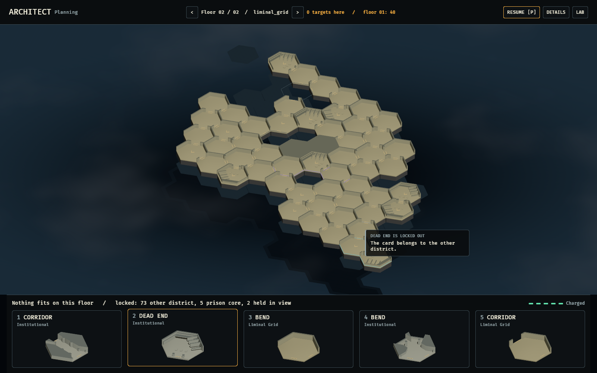
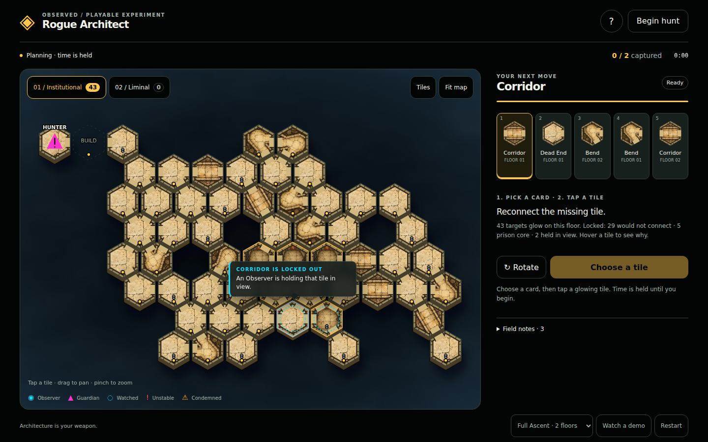
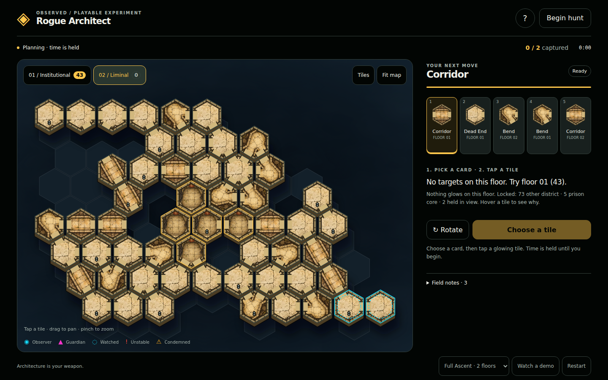
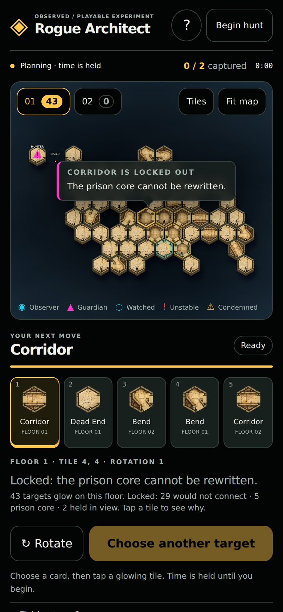
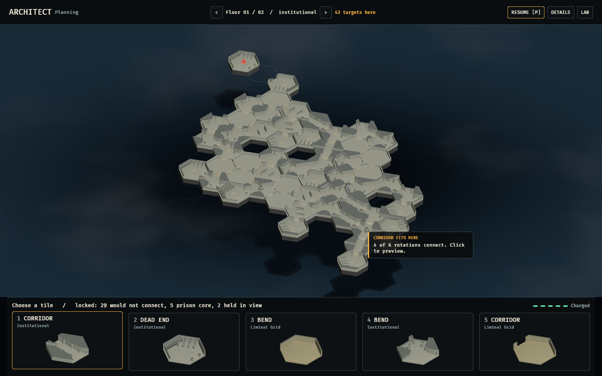
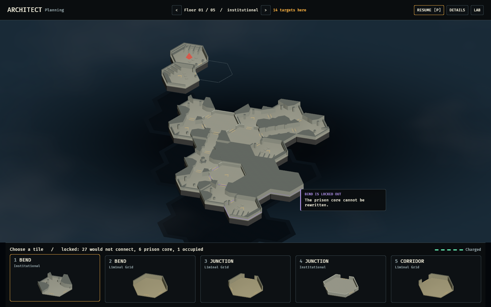
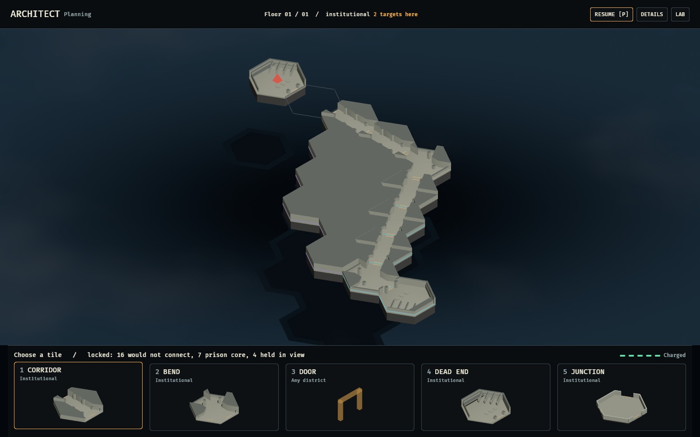
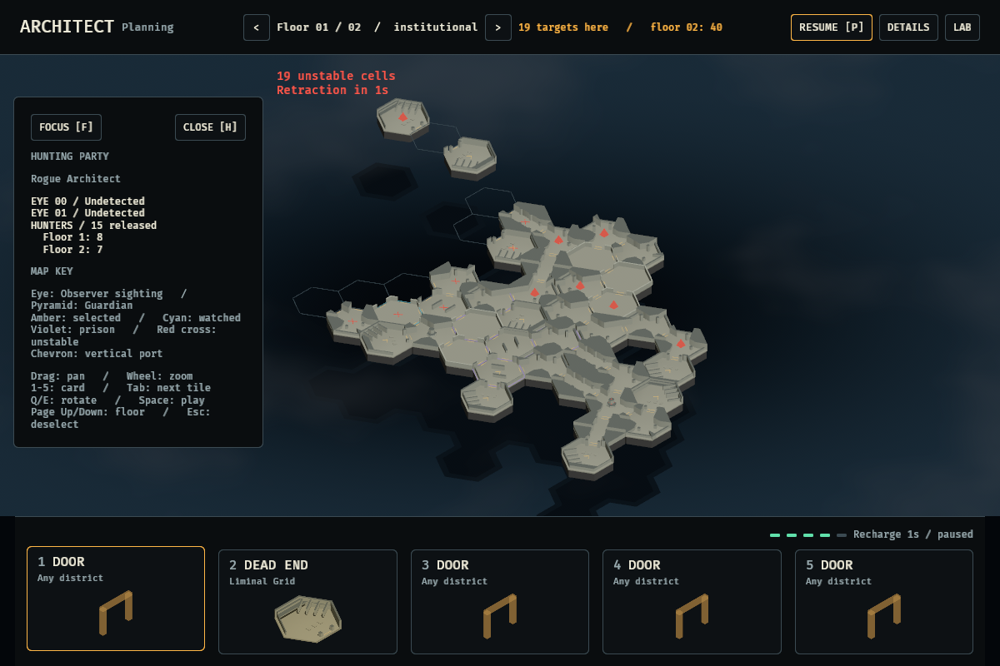

# Rogue Architect presentation pass

Application captures, not mockups. Interface only: no simulation rule changed.
Every locked-tile reason below is `CommandRefusal::label()` verbatim, asked of the
simulation through `placement::survey`, which the two surfaces share.

## Why a tile is locked, and where the card can go



Hovering any tile on the active deck says what the selected card can do there: how
many of six rotations connect, or why none do. The floor switcher counts legal
targets on this floor and names any other floor the card reaches
(`0 targets here / floor 01: 40`). Before a tile is chosen, the hand header tallies
what is holding the rest (`locked: 73 other district, 5 prison core, 2 held in view`).







In the browser the note appears on hover for a mouse, and pins on tap for touch.
Each floor button carries a count badge. The side panel gives the same tally and,
when a floor is empty, names the floor to try instead.

The recharge is deliberately left out of the survey. It is already on the charge
meter, and showing "cooldown" on every tile would hide the reason that outlasts it.
Submission still checks it.

## Sky







Open air is roughly a third of every facility, so it is drawn as a place to fall
into rather than as black. Orthographic projection has no parallax, so the depth
comes from atmosphere instead, in these layers from the back:

1. a camera-fixed well, deepest straight down the middle of the view and hazing toward its edges;
2. the deck's soft cast shadow far below, along the key light (opaque rings, so
   overlapping cells never pile up into a black hole);
3. a thin world-fixed cloud layer over that shadow;
4. a sawn underside on every built cell, so the deck's edges are cliffs.

Lower decks shown for context (`V`) are hazed by storey. Sealed rock (`Void` that
was never built) is an opaque block. A *retracted* cell is also `Void` to the
simulation, but it is drawn as a hole, because a body falls through it.

The browser uses the same language in SVG: a radial well with a faint drifting
haze, each floor plate given an edge and a soft shadow, and the floor below as
hazed silhouettes through the gaps.

## Framing and the hunting party

The resting view fits the active deck's structure, centred. A new selection pans
only when the tile is outside the middle of the view or under the inspector.



After 90 bot beats Full Ascent has released fifteen Guardians. The list used to
cut off at four rows behind `+ 13 other hunters`. It now counts them per floor.
Close sits beside Focus, so no control can sit over a row, and the hazard notice
moves beside the open panel instead of over it.

## Reproduce

Linux builds use the native `CARGO_TARGET_DIR` from the root runbook.
`OBSERVED2_CAPTURE_BEATS=n` (new) lets the bot Architect play `n` beats through the
ordinary command boundary before the capture.

```bash
OBSERVED2_MODE=full_ascent OBSERVED2_CAPTURE_IDLE=1 OBSERVED2_CAPTURE=desktop-full-ascent.png cargo dev-run -p architect_lab
OBSERVED2_MODE=full_ascent OBSERVED2_CONTEXT=1 OBSERVED2_FLOOR=1 OBSERVED2_CAPTURE=desktop-locked-hover.png cargo dev-run -p architect_lab
OBSERVED2_MODE=deep_stack OBSERVED2_CAPTURE_IDLE=1 OBSERVED2_CAPTURE=desktop-deep-stack.png cargo dev-run -p architect_lab
OBSERVED2_MODE=pocket OBSERVED2_CAPTURE_IDLE=1 OBSERVED2_CAPTURE=desktop-pocket.png cargo dev-run -p architect_lab
OBSERVED2_CAPTURE_SIZE=1200x800 OBSERVED2_MODE=full_ascent OBSERVED2_DETAILS=1 OBSERVED2_CAPTURE_BEATS=90 \
  OBSERVED2_CAPTURE_IDLE=1 OBSERVED2_CAPTURE=desktop-details-midmatch.png cargo dev-run -p architect_lab
```

The desktop hover note follows the pointer. Under Xvfb the pointer rests
mid-window, which is why a note appears in the hover capture. Browser captures are
Playwright over `scripts/build-architect-web.sh` output, at 1440×900 and at 390×844
with touch.
