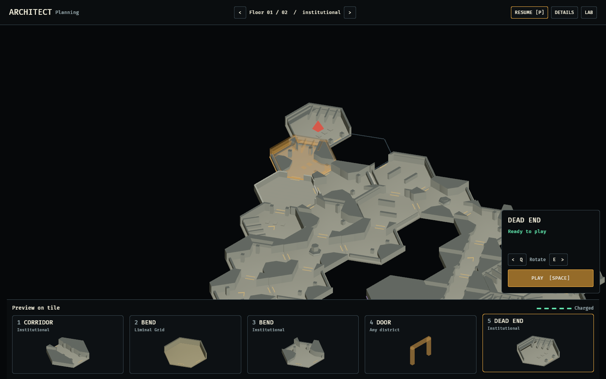
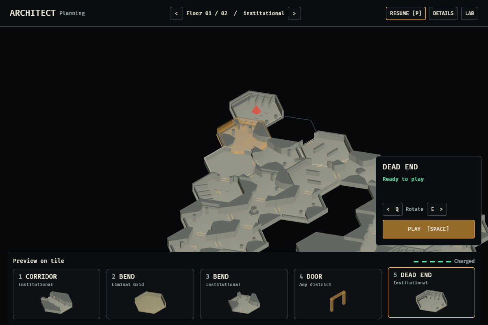
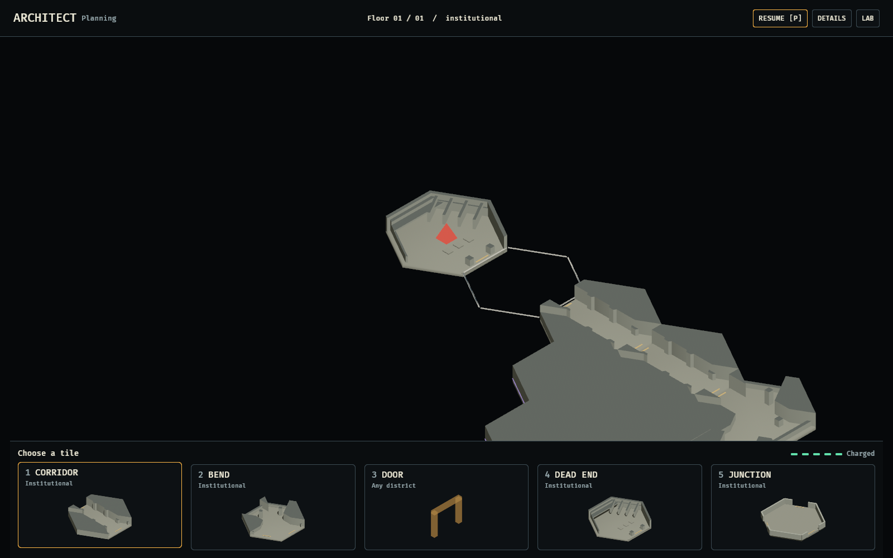
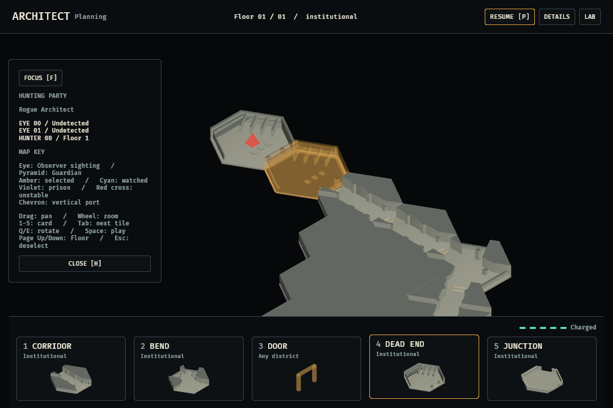
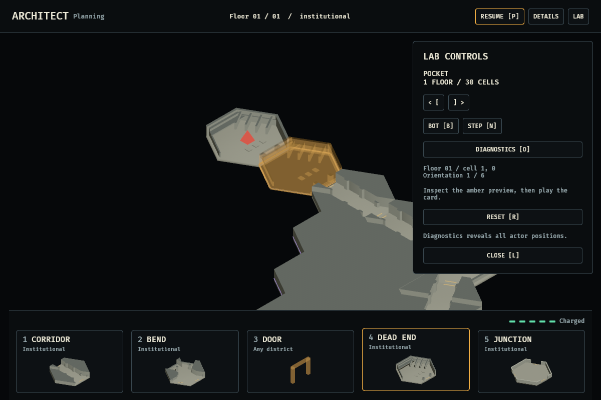

# Rogue Architect desktop redesign

Implemented from the [concept goal](../../../concepts/rogue_architect/README.md).
These are application screenshots, not generated mockups.

## Focused second pass



The board uses the full window width. *Superseded by the
[presentation pass](../presentation/README.md):* the resting view now fits the
active deck's structure, centred, and a new selection only pans when the tile is
outside the middle of the view or under the inspector. Snapping every selection
to the centre, and opening on the first editable tile, is what left the board off
to one side in the captures below.
`F`/Home refocuses the selection. Changing floors never follows a hidden target.

The permanent side rails, duplicate selected-card image, coordinate/orientation
readout, instruction strip, and zero-hazard message are removed from the default
screen. The smaller hand retains all five cards and their districts. Rotation and
play appear only after selecting a tile. Refusal reasons and active collapse
countdowns remain visible when relevant.





## Optional details



**Details** (`H`) contains the roster, map legend, camera controls, and shortcuts.
**Lab** (`L`) contains scenario, bot, stepping, reset, and diagnostics. Only one of
these panels can be open at a time; either temporarily hides placement controls.
The inspector blocks clicks to covered geometry, and the hand/header are outside
the board viewport. Details/lab panels suspend board picking while open.



Start/reset use paused planning. Selecting a card or rotating never submits a
move. The simulation's refusal gates both the button and Space key. Escape cancels
selection. Normal play uses Rogue actor knowledge; diagnostics reveals full state.

## Reproduce

Create this output directory before capturing. Linux builds use the shared native
`CARGO_TARGET_DIR` described in the root runbook; do not overlap builds in that cache.

```bash
OBSERVED2_MODE=quick OBSERVED2_CAPTURE=docs/evidence/architect_lab/redesign/focused.png cargo dev-run -p architect_lab
OBSERVED2_MODE=quick OBSERVED2_CAPTURE_SIZE=1200x800 OBSERVED2_CAPTURE=docs/evidence/architect_lab/redesign/focused-compact.png cargo dev-run -p architect_lab
OBSERVED2_CAPTURE_IDLE=1 OBSERVED2_CAPTURE=docs/evidence/architect_lab/redesign/planning.png cargo dev-run -p architect_lab
OBSERVED2_CAPTURE_SIZE=1200x800 OBSERVED2_DETAILS=1 OBSERVED2_CAPTURE=docs/evidence/architect_lab/redesign/details.png cargo dev-run -p architect_lab
OBSERVED2_CAPTURE_SIZE=1200x800 OBSERVED2_LAB_CONTROLS=1 OBSERVED2_CAPTURE=docs/evidence/architect_lab/redesign/lab-controls-v2.png cargo dev-run -p architect_lab
```

`OBSERVED2_FLOOR` is zero-based; `OBSERVED2_CONTEXT=1` shows lower decks.
Captures select a legal opening before simulation advances unless
`OBSERVED2_CAPTURE_IDLE=1` is set, wait 90 render frames, save, and exit.

The first-pass [board](quick-climb.png), [compact layout](compact.png),
[Deep Stack context](deep-stack.png), and [Pocket opening](desktop.png) are retained
for comparison.

## Geometry and scope

The native lab still simulates cell/port topology. It does not own production
physical tile IDs. The presentation selects a compiled one-level representative
with exactly the current lateral ports. Unsupported signatures use a low-wall
shell with literal doorway gaps; vertical links have explicit chevrons rather
than an invented staircase. Ceiling/wall cuts and darker cut faces are visual
only. This is not a first-person traversal certification.

Five isolated offscreen cameras render card models. Their models are spatially
separated as well as layer-separated so shadow maps cannot mix different cards
or the board. Model meshes/materials are cached and previews update only when
the held cards or orientation change.

The browser DOM/SVG client is unchanged. No simulation rules, card types, health
mechanics, or production game rendering are introduced by this redesign.
