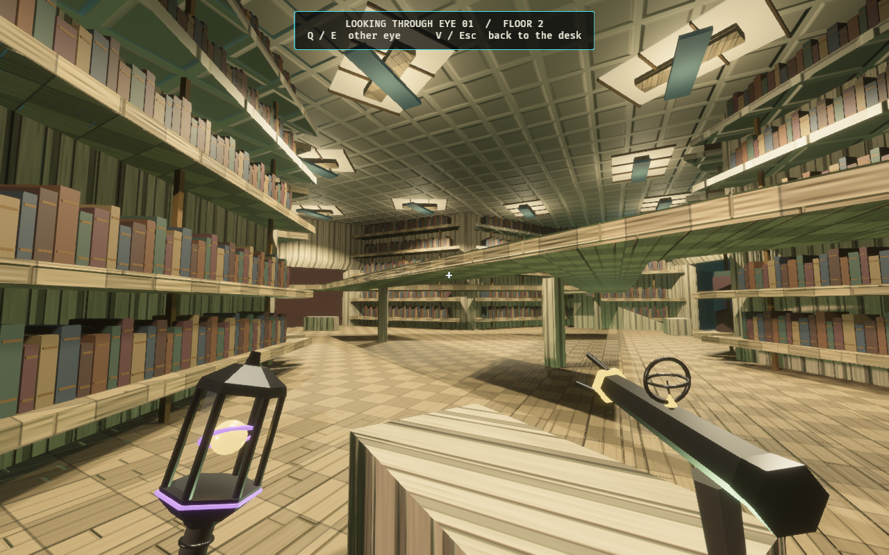
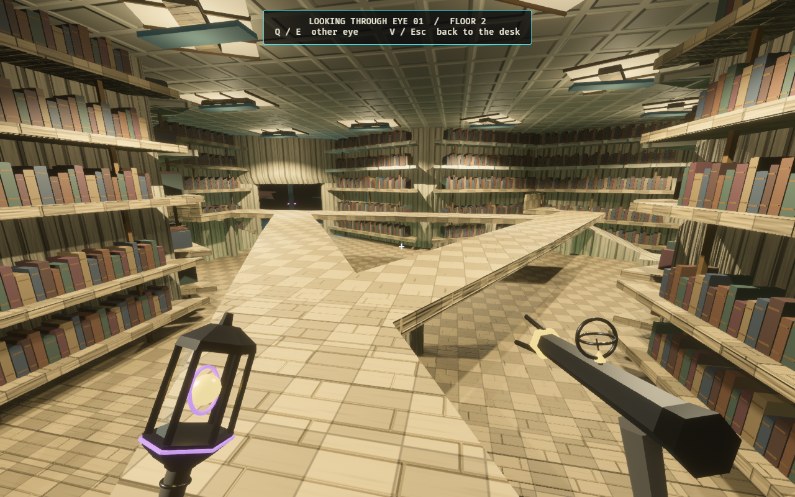
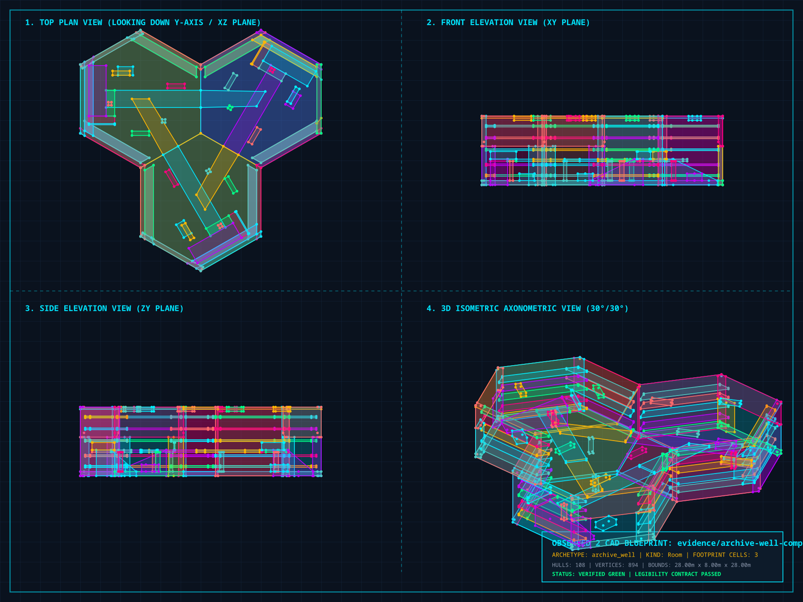

# The Archive Well — one Library wonder card

[Research, references and room design](../../archive_well_proposal.md)

A single card places three adjoining Library / Infinite Gallery hexes. Packed
shelf bays surround a lower reading floor; shallow ramps connect three reading
perches to an exposed upper bridge circuit. Pale mineral surfaces, muted bindings,
bronze details and fixed ceiling panels give the room a different identity from
the Cistern and Chargeworks. The well remains inside the existing eight-metre
storey; it is not a shaft through the floor below.

## Game views

These are game captures after a real Architect card commit. The evidence setup
stages bodies in an existing Library hall to discover it, then leaves through an
existing neighbouring doorway. A clone with complete knowledge is used only to
choose a suitable starting pose. Authoritative knowledge is earned by the bodies;
the selected card is taken from the real finite deck and goes through ordinary
placement, attachment and physical commit rules.

After the commit, the match is held still for settled eye-level photographs and
a separate controller walkthrough. These views establish the location and local
traversal; they are not a full competitive-match playtest.





[Packed shelves](architect-archive-shelves-1280x800.png) ·
[Exposed bridge](architect-archive-bridge-1280x800.png) ·
[Complete card preview and legal placement ghost](architect-play-1280x800.png) ·
[Committed room on the Architect board](architect-built-1280x800.png)

## Physical walkthrough


[Download the H.264 walkthrough](archive-walk.mp4). It contains 633 consecutive
1280×800 frames at 30 fps, lasting 21.1 seconds, encoded as H.264 / yuv420p.
The production controller completes the route in 635 capture frames; 633
screenshots flush before exit. The movie preserves the actual local collision
snapshot and walks the lower circuit, climbs a ramp, crosses all three upper
joins and descends to the entrance. Photographs use staged settled poses.

All entities belong to their resident cell, so rewriting or streaming out the
cell removes its bindings and lights with its geometry. Decorative books sit
within the authored shelf depth and add no collision, map reveal or interaction.
The fixed downlights illuminate each bay before entry and follow generator power;
the moving district key remains disabled inside the wonder.

## Authored plan



[Vector plan](archive-plan.svg) · [Validated geometry snapshot](archive-plan.map)

The forge source is `crates/observed_authoring/src/forge/archive_well.rs`.
Six maps provide exact lattice orientations with `rotation_policy = none` and
`register_scope = infinite_gallery`. Three oriented sectors contain **108 convex
hulls**, below the 128-hull room budget, with nine authored practical sources.
The full-room snapshot assembles the same production brushes at their exact
three-cell offsets; it is an evidence artifact outside the tile catalogue.
The composition profile and ordinary WFC demand alphabet are unchanged.

Books, spine bands, bookcase uprights and ceiling details are batched into eight
material meshes per sector and cached by exact heading. The shared
`observed_style::archive` module owns their treatments and the room's structural
finish. The approved follow-up applies those structural materials throughout
Babel / Infinite Gallery, with the wonder using the district's exact cached
floor, wall and ceiling handles.
[Ordinary Babel tile and shared-material verification](../babel-mineral/README.md).

## Reproduce

Use this checkout with the machine's `CARGO_TARGET_DIR` set and no other worktree
building in that cache. Start with an empty capture directory.

```bash
OBSERVED2_CAPTURE_HEX_WFC_ARCHITECT=/tmp/archive-capture \
OBSERVED2_ARCHIVE_PORTRAITS=1 \
RUST_LOG=warn,observed_game=info cargo dev-run -p observed_game
ffmpeg -y -framerate 30 -i /tmp/archive-capture/archive-walk-%03d.png \
  -c:v libx264 -pix_fmt yuv420p -crf 20 -movflags +faststart \
  docs/evidence/archive-well/archive-walk.mp4
cargo run -p observed_authoring --bin tilec -- validate \
  docs/evidence/archive-well/archive-plan.map
cargo run -p observed_authoring --bin tilec -- render-cad \
  docs/evidence/archive-well/archive-plan.map /tmp/archive-plan.svg
rsvg-convert -w 1800 /tmp/archive-plan.svg -o /tmp/archive-plan.png
```

The CAD command writes the SVG successfully. Its optional JPEG conversion needs
Pillow in the selected Python; `rsvg-convert` provides the PNG used here.

## Verification

- Forge regeneration is byte-exact; all six sources validate.
- Production controller walks the lower and upper circuits in both directions,
  every ramp uphill and downhill, and every entrance at all six orientations.
- The card appears once in each finite loyal/Rogue deck where the Library exists,
  and is absent when the climb has no Library district.
- Physical card commit is Library-only, rejects an anchored sibling without
  changing geometry, consumes the card, advances one generation, and projects
  all three cells together. The same test still covers Chargeworks.
- Fixed-light regression checks illumination before entry, unchanged fixture
  poses across sector changes, suppression of the moving key, and power cycling.
- The card thumbnail finds a complete three-cell anchor and renders its floor and
  wall meshes at all six orientations, including when the district's first cell
  faces outside the grid. The final captured thumbnail was visually inspected.
- Game capture completed with no warnings or errors. All four eye-level views
  and representative walkthrough frames were visually inspected.
- H.264 metadata inspection and complete video decode passed.
- `cargo fmt --all`, `cargo dev-clippy` and `cargo dev-test` passed with no warnings:
  **2,691 passed, 0 failed, 45 ignored**. The extended ignored suite was not run.
- Local documentation links and `git diff --check` passed.
- The affected ignored `how_much_of_the_hand_is_playable` measurement completed
  successfully in 155.78 seconds. It reports availability, not competitive balance.

Each distribution below is `playable card count: sampled beats`:

| Scenario | Beats | Anywhere | On an Observer floor |
| --- | ---: | --- | --- |
| Pocket | 4 | `0:1, 5:3` | `0:1, 5:3` |
| Quick Climb | 400 | `4:160, 5:240` | `0:4, 1:3, 3:1, 4:236, 5:156` |
| Full Ascent | 18 | `0:1, 5:17` | `0:1, 4:10, 5:7` |
| Deep Stack | 377 | `0:1, 5:376` | `0:1, 1:9, 2:42, 3:201, 4:124` |

Quick Climb, Full Ascent and Deep Stack match the recorded previous wonder
measurements. These scenarios do not establish how often the Archive itself is
played during competitive matches.

The six added sources bring the active catalogue to 260 modules. The catalogue
identity is `9aa15ad620b8968acf516e757bfae8e5d94c019fab5969cdcfd3a8c0ecb00aeb`;
the unchanged profile identity is
`7b57da365f6c4de7876cd76adfd985db582d6f1610999c29d89d116739b639d1`;
the folded simulation identity is
`5ac623c9f9103f4f912aa5772a916e8e274da2e5241951de4f30e4d267093f55`.
