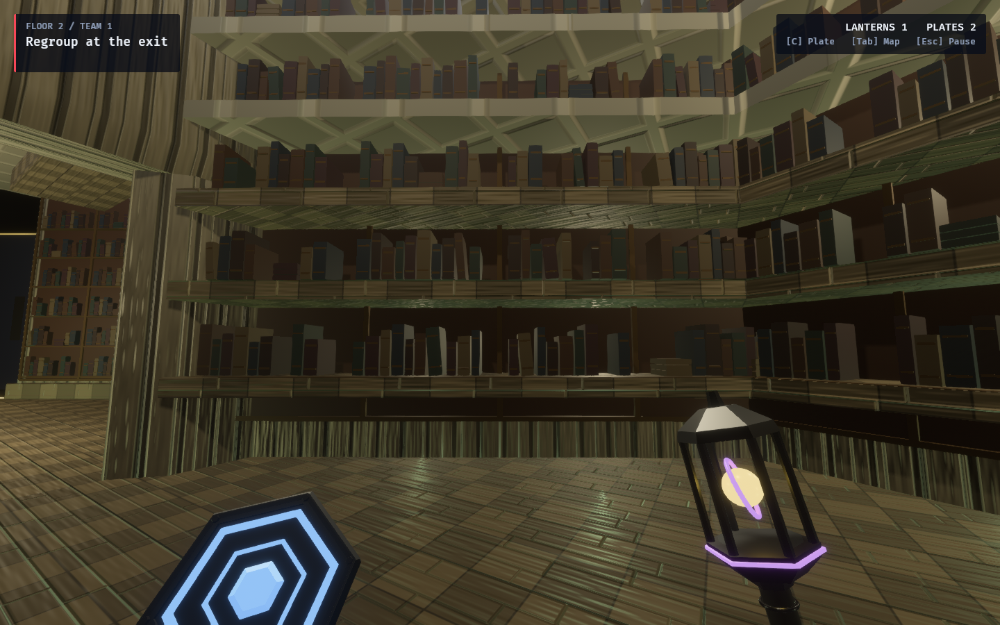
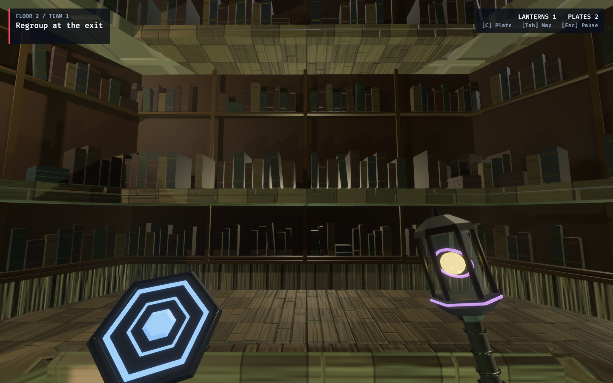
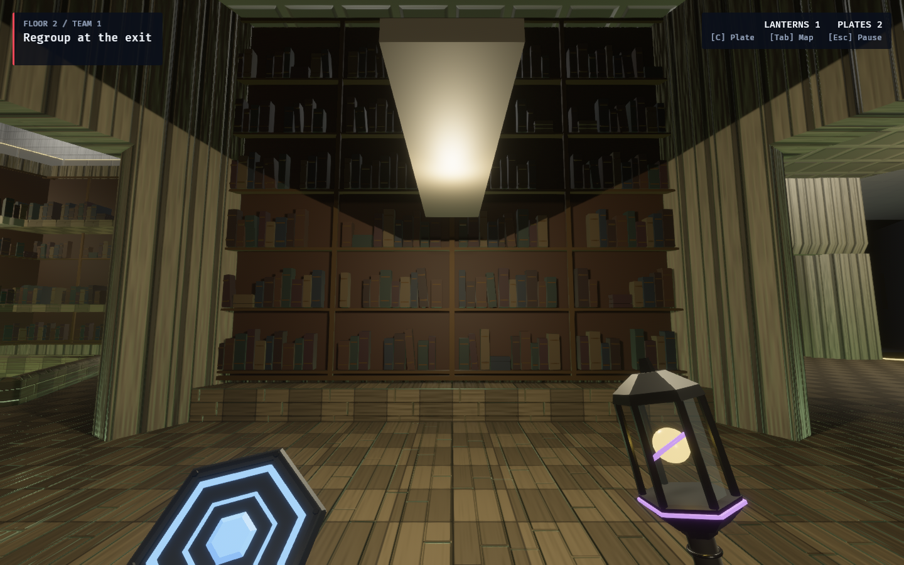

# Ordinary Babel — books and bookcase bays

The first ordinary Library dressing pass adds muted bindings, fine bronze spine
bands, narrow bookcase uprights and shelf courses. Small gaps, tilted volumes and
three-book stacks break up the repetition. Pale mineral frames, columns, floor
stone and ceiling coffers retain the shared Archive finish.

Each facade fits an inward-facing convex support from the tile's actual rendered
wall geometry. Split window frames stay separate; declared door faces are skipped.
Wide, thin authored shelves supply their own row heights and front edges. Where
the source only supplies a wall and plinth, or leaves large gaps between shelf
courses, shallow inlays project roughly 0.22 m from the wall, inside the
character's wall clearance. Books stop below the underside of the next course.
Narrow jambs, low rails and sloping supports that cannot contain a full
rectangular bay receive no dressing.

The fit uses the support's actual plane, including authored variants with walls
slightly rotated from the lattice. This keeps corner tiles populated without
stretching a facade across an unsupported surface.

This is presentation geometry. It introduces no collider, gameplay rule, card or
content-catalog change. Identical fits reuse meshes; their entities, materials and
cutaway metadata belong to the cell parent and are removed with it. The Archive
Well keeps its own shelves, elevated reading perches, bridge circuit and lighting.
Fixed shelf lighting, desks and reading alcoves remain follow-up proposals.

## Production captures

These are ordinary tiles in the production surface-tour fixture, photographed
with settled player-eye poses. No props, wonder cards or topology edits are staged.
All three are on level 1 (displayed floor 2): Straight at q3 r8, Corner at q2 r9
and Junction at q1 r10. These stills establish appearance, not competitive play.







## Reproduce

With this checkout's assets and the machine's `CARGO_TARGET_DIR` set, and no other
worktree building in that cache:

```bash
OBSERVED2_LIBRARY_PORTRAITS=1 \
OBSERVED2_CAPTURE_HEX_WFC_SURFACES=/tmp/babel-books-capture \
RUST_LOG=warn,observed_game=info cargo dev-run -p observed_game
```

The optional portrait selector chooses ordinary Straight, Corner, Room and
Junction archetypes when present in Infinite Gallery, facing closed walls. This
fixture supplies the three corridor types pictured above. The regular surface
tour continues to select one pose per district when this option is absent.

## Verification

- Focused library checks: four passed. They cover door and window clearance,
  authored shelf heights and undersides, shallow depth, actual rotated wall
  supports, mesh reuse, cell cleanup and climb-wall cutaway ownership.
- `cargo fmt --all` and `cargo dev-clippy`: passed, without warnings.
- Three final GPU portraits: completed without warnings or errors and visually
  inspected after fitting the rotated corner walls and filling wide shelf gaps.
- Full `cargo dev-test`: 2,695 passed, zero failed, 45 ignored.
- Changed documentation's local links and `git diff --check`: passed.
- Extended `cargo dev-test-all` was not run for this presentation change.

Related: [Archive design and research](../../archive_well_proposal.md),
[district mineral finish](../babel-mineral/README.md),
[Archive Well captures and walkthrough](../archive-well/README.md).
