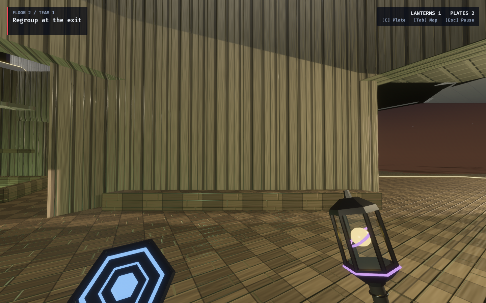

# Babel district — shared Archive mineral finish

The Archive Well's structural finish now belongs to Babel / Infinite Gallery:
pale mineral walls, a warm checker-cut reading floor, coffered ceilings and
honed surfaces with roughness 0.68. Ordinary rooms, corridors, stairs and their
Architect previews use the shared style APIs. The Archive Well uses the same
cached floor, wall and ceiling material handles as the district.

The existing generated wall and ceiling images and floor relief remain the
Archive's source textures. The floor's checker albedo now goes through the
shared district texture generator. Babel's ambient fill, practical and key
light now use warm reading-room colors, with neutral warm fog and a bronze
structural accent. This removes the inherited Spillway palette's teal wash.
Practical fixtures retain their existing treatments, light geometry, intensity
budgets and power behavior. Fog distances and the blue-hour sky remain intact.
The Archive retains its shelf geometry, bridges and fixed wonder lighting.
A later [ordinary Library dressing pass](../babel-books/README.md) shares its
binding and bronze materials across fitted bookcase bays.

This is a presentation change. Authored hulls, collision, card placement,
finite decks, simulation rules and content hashes are unchanged.



The screenshot comes from the production surface-tour capture: a regular WFC
tile at q2 r8 on level 1 (displayed floor 2), with its floor, sealed wall and
ceiling in view.
The capture stages a settled eye-level pose and leaves match topology unchanged.
It establishes the material appearance rather than competitive gameplay.

Related: [Archive design and inspirational photographs](../../archive_well_proposal.md),
[Archive walkthrough and room captures](../archive-well/README.md).

## Reproduce

From this checkout, with the machine's `CARGO_TARGET_DIR` set and no other
worktree building in that cache:

```bash
OBSERVED2_CAPTURE_HEX_WFC_SURFACES=/tmp/babel-district-capture \
RUST_LOG=warn,observed_game=info cargo dev-run -p observed_game
```

The tour photographs seven floors; `vista_02_floor_2.png` shows Babel.

## Verification

- Focused `cargo test -p observed_style`: 90 passed, zero failed, one ignored.
  Existing checks cover image tiling, bounded albedo, normal validity, district
  distinction and nonsignal structural treatments.
- `cargo fmt --all` and `cargo dev-clippy`: passed, with no warnings.
- Refreshed seven-floor GPU surface tour: completed without warnings or errors.
  The same Babel pose was visually inspected after replacing the teal light.
- Full `cargo dev-test` for the final warm-light revision: 2,691 passed,
  zero failed, 45 ignored.
- Local documentation links and `git diff --check`: passed.
- Extended `cargo dev-test-all` was not run for this presentation change.
