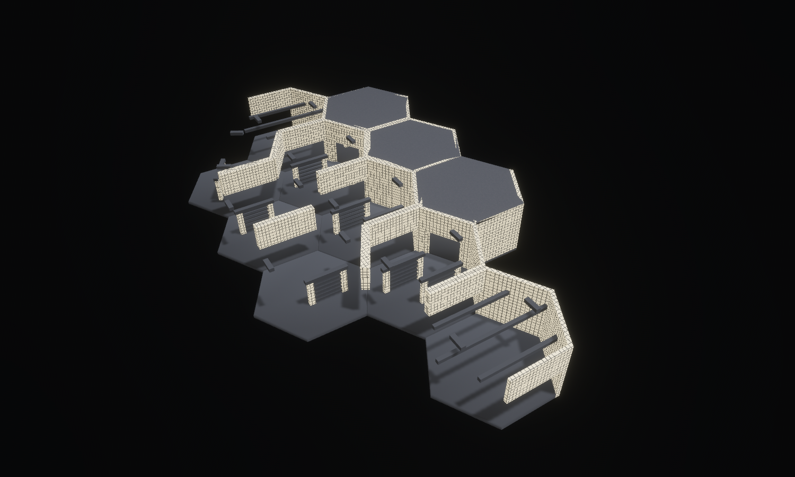

# The Borrowed View — Shadow Screen

Concept-to-tile benchmark, 15 September 2026. Six new district-scoped designs compose into **11 hex tiles on one floor**, with a central gallery and two connected side loops. Twelve staggered screens interrupt views without turning every partition into an opaque wall.



The [concept image](concept.png) was generated first with the built-in image generator; its [exact prompt](prompt.txt) is preserved. The built composition translates the layered screens, paper planes and branching circulation into the existing WFC grid. The concept's pitched roofs, detailed timber joints and wood grain remain an art-quality gap: the model uses the standard flat service roof, simpler members and paper-faced end supports. Its inspection views also use cooler fill than the concept.

## Views

- [Hero](hero.png): Lit architectural cutaway with three rear roofs retained, EV100 7.0, shared district materials and a shadow-casting inspection key.
- [Clay](clay.png): the same framing with neutral materials and diagnostic mesh edges.
- [Plan](plan.png): roof-off floor arrangement showing the central route and both side loops.
- [Layered screens](layered.png): close oblique view of overlapping slats, end supports and neighbouring thresholds.
- [Through the screens](screen.png): stationary first-person view with complete geometry and normal facility lighting.
- [Side loop](loop.png): stationary first-person view along the upper gallery, through a threshold toward the next screen.
- [Screen CAD](screen_cad.svg) ([PNG](screen_cad.png)): the paired-screen source's actual convex hulls in four views.

All six JSON scripts in `docs/compositions/borrowed_view` contain the same placement list. Cutaways only modify presentation. First-person captures retain the complete collision geometry; they are still photographs, not traversal recordings.

## Reusable sources

The forge is `crates/observed_authoring/src/forge/borrowed.rs`. Generated sources live under `assets/tiles/authored/borrowed_*.map`.

| Source | WFC archetype | Runtime variant, turn 0 | Hulls | Purpose |
| --- | --- | ---: | ---: | --- |
| `borrowed_screen` | `hall_straight` | 1080 | 32 | Paired offset screens across the gallery |
| `borrowed_fork` | `hall_junction_4way` | 1080 | 36 | Paired screens and four route choices |
| `borrowed_turn` | `hall_turn_120` | 1080 | 23 | Single screen inside a broad turn |
| `borrowed_elbow` | `hall_turn_60` | 1080 | 23 | Single screen inside a tight turn |
| `borrowed_gallery` | `hall_straight` | 1086 | 23 | A quieter single-screen passage |
| `borrowed_threshold` | `hall_straight` | 1092 | 17 | Open arrival with three overhead crossbeams |

The six sources expand into **36 new runtime candidates**, scoped to `shadow_screen`. Every source matches an existing production geometry demand. The arrangement contains **276 authored hull instances, 72 screen rails, 24 paper-faced screen-end supports and 22 authored practical sources**. The busiest source reaches, but does not exceed, the existing 36-hull ceiling.

Each screen uses six independent 0.25 m-thick rails with **0.375 m clear vertical gaps**. A small probe can occupy a gap; a player capsule cannot. The floor remains continuous, with a navigable route around each end. Doorways preserve the shared 4 m standing clearance. Threshold floors use the existing slab rather than adding duplicate sill hulls.

The landmark is hand-composed. WFC can select its individual candidates, but no new rule guarantees this exact arrangement. The geometry offers partially visible neighbouring routes and alternate paths relevant to exploration and cooperative observation. It adds no observation rules, Guardian behaviours or scripted objectives.

## Presentation changes

- The game and lab share the existing thin-horizontal-hull classifier, so rails receive the timber floor material rather than luminous paper.
- The game's repeating architectural lattice is now generated as renderer-independent pixels in `observed_style` and consumed by both renderers. Shadow Screen's lattice masks wall emission as well as albedo, preserving its pattern in low light.
- Shadow Screen's shared hex material preserves its authored dark-timber/light-paper treatment. Generic palette blending previously raised dark members toward grey. A regression check pins the material contrast and keeps paper emission below the signal minimum.
- `inspection_shadows` optionally enables shadows on the primary lab inspection light. The secondary fill stays shadowless; facility lighting remains a separate mode.
- Front-only roof cuts now remove practicals by their parent module, so an offset fixture cannot remain floating after its roof is removed.

The material changes apply to Shadow Screen in the game as well as the lab. Source geometry and collision remain authoritative; none of these presentation changes alters simulation behaviour.

## Validation

- Byte-exact regeneration and source parsing for all six designs.
- Production character controller traverses every ordered doorway pair around the staggered screens without jumping or falling.
- Capsule probes verify an actual opening between rails, collision against a rail, and rejection of a player-sized capsule inside the screen.
- Lab layout resolves all 11 placements, matches adjacent ports, connects both loops and survives three resets without accumulating collision state.
- Source seam audit: **413 sources, 549,676 valid boundary comparisons, zero height mismatches**. This audits sampled boundary envelopes; controller tests provide separate movement evidence.
- Regression coverage for paper/timber contrast, opaque lattice pixels and offset practicals under module-based roof cuts.

Formatting and Clippy pass without warnings. Combined workspace coverage is
**2,104 passed, 37 existing ignores**: the final run passes 2,103 tests and reuses
the unchanged stacked-tower test's pass from the preceding run. Details are
recorded in [verification.txt](verification.txt).

Catalogue hash: `dea61d2a4834e0dbcbe697ac01f273a926937aaff8577383ce6060fdfe2208bb`.
Folded simulation hash: `6ac9c845670f2d5d675d8f6361631af48b110bbb696e0dfbb6f07123e36bfadd`.
The composition profile is unchanged. Both spectator candidate-selection digests were updated for the added sources; their placement counts and tower selections remain unchanged.

## Reproduce

From the repository root:

```bash
cargo run -p observed_authoring --bin tilec -- gen-tiles
cargo run -p observed_authoring --bin tilec -- build
OBSERVED2_SCRIPT=docs/compositions/borrowed_view/hero.json cargo dev-run -p hex_tile_lab
```

Swap `hero.json` for `clay.json`, `plan.json`, `layered.json`, `screen.json` or `loop.json`. Each saves its PNG and exits. Direct development-binary launches also need `BEVY_ASSET_ROOT` pointing to `labs/hex_tile_lab` and the development dynamic-library search paths.
