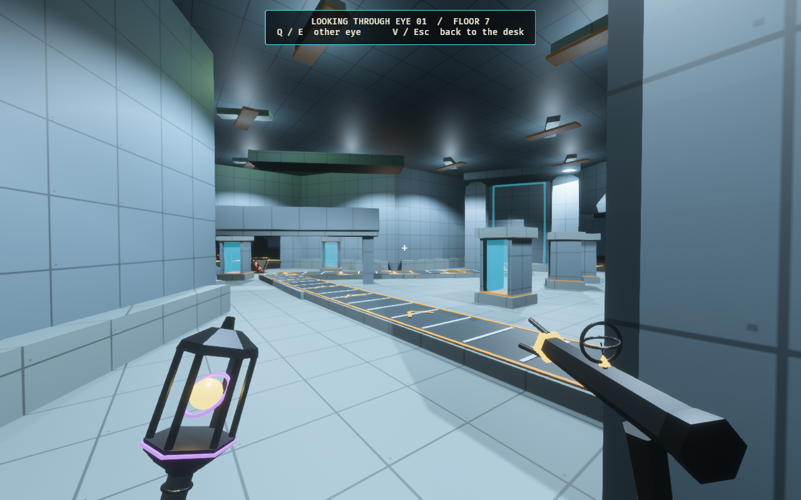
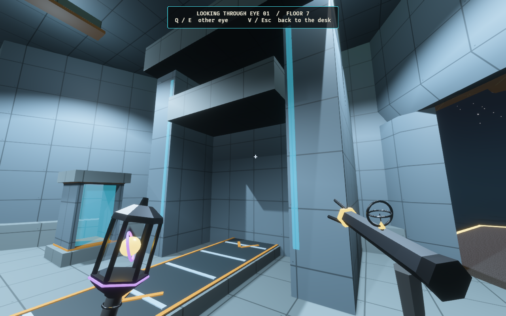
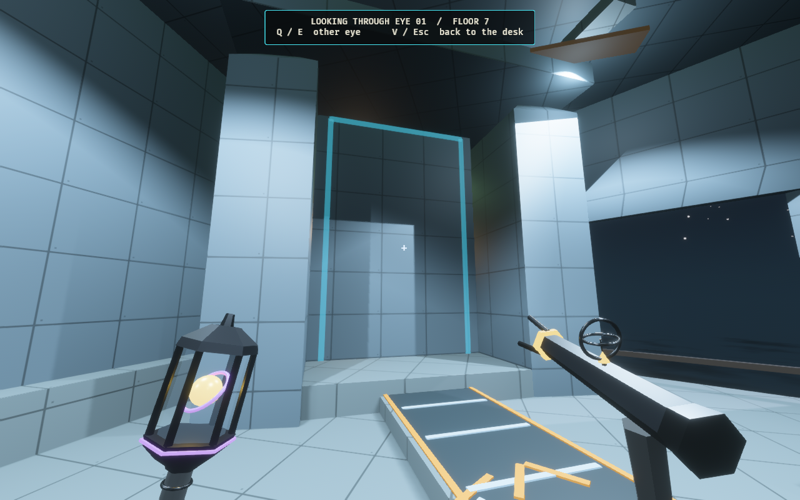
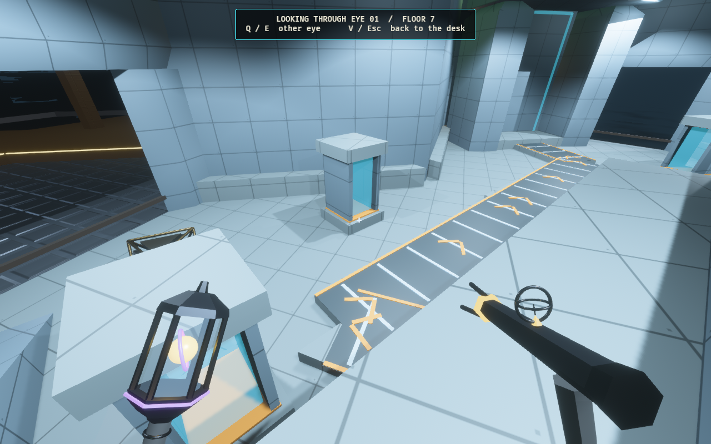
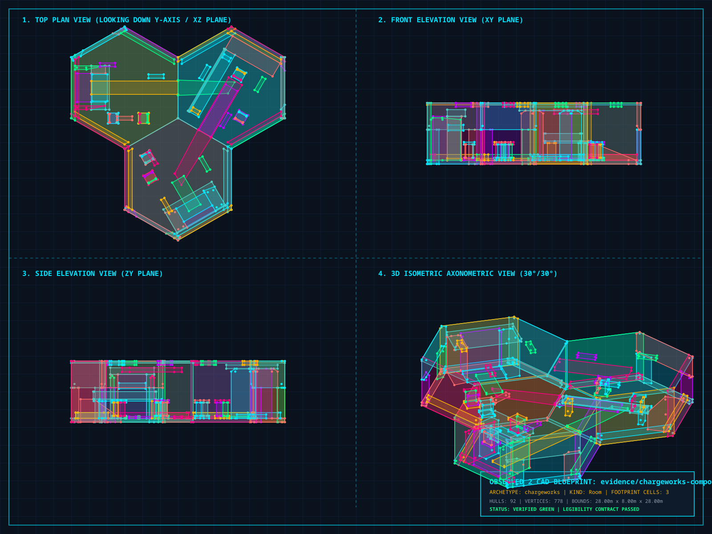

# The Chargeworks — one Reactor wonder card

A real Architect play places three connected hexes: a fabrication press,
conveyor transfer hall and receiving vault. An accessible service gantry crosses
above the ground route. Six stationary sample canisters contain translucent
cyan gas. These are original primitive-based geometry and finishes, inspired
by Halo's gas-mine machinery and conveyor spaces.

[Research, imagined location and future delivery proposal](../../chargeworks_wonder_proposal.md).
Production, moving cargo, explosions and the Rogue delivery victory are not
implemented. The proposed quota begins at six canisters in a later lab, with
factory and objective receiver at separate sites. The showcase's local vault
is storage and cannot complete that remote quota.

## In-game views









Amber edges and chevrons mark the intended conveyor direction. Cyan marks
inert sample gas and machinery light insets; these are decorative. Fixed cool
white work lights illuminate the whole location before entry. The room uses
nine stationary shadowed downlights and fixed bounce fills, outside the moving
nearest-player shadow budget. Inside the room, the moving district key is
suppressed. The existing generator dims work lights to the normal emergency
minimum and restores their original intensity when power returns.

## Card placement and physical walkthrough

[Ready-to-play card and full composition preview](architect-play-1280x800.png) ·
[Board before the play](architect-board-1280x800.png) ·
[Building in](architect-building-in-1280x800.png) ·
[Committed location](architect-built-1280x800.png).


[H.264 walkthrough](chargeworks-walk.mp4): 434 saved frames, 1280 × 800,
30 fps, 14.47 seconds. The production Rapier controller completes the entrance,
three-sector circuit, full ramp approach, gantry climb and descent, and return.
The capture logs completion after 436 controller frames; the saved video ends
just before the final two pending screenshot readbacks.

This capture starts bodies at a suitable real Reactor hall, allows ordinary
sight to discover it, and moves them into its existing neighbour. It stages a
real finite-deck card; the placement goes through the normal Architect desk,
district and mutation checks, and the authoritative physical projection.
Knowledge and room geometry are not injected by the capture. A guard checks
that all three expected placements remain physically committed before inspection.

The harness then holds match events still for portraits and runs the production
controller against the committed collision snapshot, two 60 Hz steps per saved
frame. This proves local placement and traversal, rather than multiplayer timing
or the balance of the proposed cargo objective.

## Authored plan



[Vector plan](chargeworks-plan.svg) · [Combined geometry snapshot](chargeworks-plan.map).
The complete composition uses 92 convex hulls, below the 128-hull room budget,
and remains inside three cells on one 8-metre storey. The combined evidence map
is a legacy room wrapper for CAD; shipping cells use the generated, compiled
catalogue. Eighteen forge sources cover three distinct roles at six exact lattice
orientations. They are directed card content, rather than ordinary WFC lottery
variations.

## Reproduce

From this checkout, with the machine's `CARGO_TARGET_DIR` set and no other
worktree building in that cache:

```bash
cargo run -p observed_authoring --bin tilec -- gen-tiles
cargo run -p observed_authoring --bin tilec -- build
cargo run -p observed_authoring --bin tilec -- validate docs/evidence/chargeworks/chargeworks-plan.map
cargo run -p observed_authoring --bin tilec -- render-cad docs/evidence/chargeworks/chargeworks-plan.map docs/evidence/chargeworks/chargeworks-plan.svg
rsvg-convert -w 1600 -o docs/evidence/chargeworks/chargeworks-plan.png docs/evidence/chargeworks/chargeworks-plan.svg
OBSERVED2_CAPTURE_HEX_WFC_ARCHITECT=docs/evidence/chargeworks \
OBSERVED2_CHARGEWORKS_PORTRAITS=1 RUST_LOG=warn,observed_game=info \
  cargo dev-run -p observed_game
ffmpeg -y -framerate 30 -i docs/evidence/chargeworks/chargeworks-walk-%03d.png \
  -c:v libx264 -pix_fmt yuv420p -crf 20 -movflags +faststart \
  docs/evidence/chargeworks/chargeworks-walk.mp4
```

Clear old `chargeworks-walk-*.png` files before capturing again. Raw frames are
ignored and removed after video encoding and inspection. Check the controller
completion log when reviewing a capture.

## Verification

Focused physical tests cover every sector's entrance in both directions, every
internal join, the ramp approach and gantry ascent/descent at all six rotations.
The real-facility card test proves Reactor-only placement, rejection of a
protected footprint cell, atomic three-cell physical commitment and card
consumption. Finite-deck tests verify one Chargeworks card in Reactor for loyal
and Rogue decks, and no card on a climb without that district. The lighting
regression verifies fixed room illumination, disabled moving key, and repeated
generator dimming and restoration. Forge tests verify reproducible sources,
import validation and catalogue hash identity.

Verified on 2026-10-04:

- `cargo fmt --all` and `cargo dev-clippy`: passed, no warnings.
- `cargo dev-test`: 2,683 passed, zero failed, 45 ignored.
- After the final capture-helper cleanup, `cargo dev-clippy` passed again and
  `cargo test -p observed_game --features bevy/dynamic_linking --lib` passed:
  540 passed, zero failed, six ignored.
- The affected ignored hand-playability measurement was run explicitly: passed.
  Quick Climb sampled 400 beats with four or five playable cards throughout;
  Full Ascent sampled 18 beats with five playable cards on 17 beats;
  Deep Stack sampled 377 beats with five playable cards on 376 beats.
  This measures hand availability, not cargo-objective balance.
- H.264 metadata inspection and complete video decode: passed.
- Local documentation links resolve; `git diff --check` passed.

The extended `cargo dev-test-all` suite was not run. Its known baseline
`hex_full_match_soak` exception remains ignored by the standard gate; this
evidence does not claim that extended suite is green.
