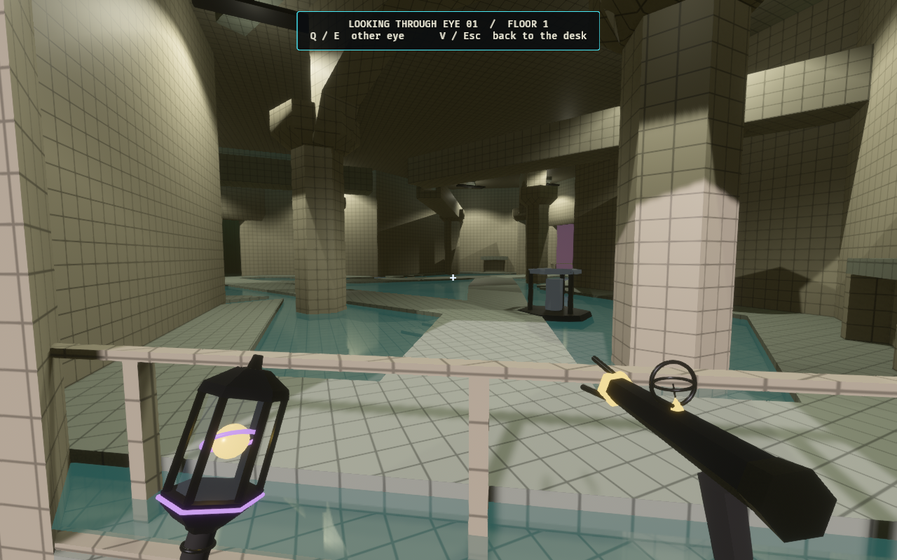
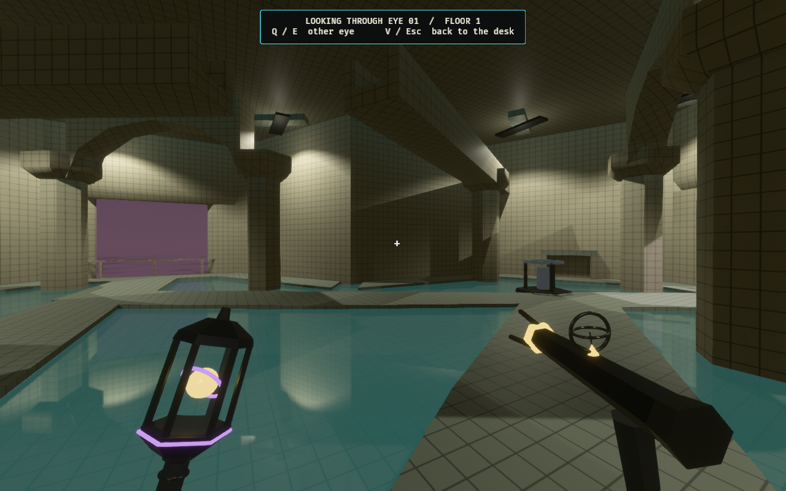

# The Cistern — fixed lighting

The original room inherited the district's large key spotlight, which moves
between the viewed Observer's hexes. In one continuous three-hex bath this
looked like a giant light following the player and waking each bay on arrival.

The Cistern now uses nine fixed, shadowed fluorescent downlights at its authored
fixture positions. Each has a small, fixed, shadowless fill below it to
approximate diffuse light returning onto the ceiling. That fill is excluded
from the nearest-player point-light shadow budget. The moving district key has
zero intensity and no shadow map while the viewed Observer occupies any Cistern
sector. Ordinary districts retain their existing rig.

Both kinds of fixed light follow the floor's generator: an unpowered floor
keeps the existing 12% emergency illumination and restores the original
intensity when power returns. No room light is enabled by player arrival.
Presentation still streams geometry and lights within its normal residency
window; this change does not render the entire facility at once.

## In-game evidence

The far bays are already lit when seen from outside the entrance:



The same room from the opposite arcade:



[Arrival view](architect-cistern-entry-1280x800.png) ·
[Water-level view](architect-cistern-water-1280x800.png)


[Download the H.264 walkthrough](cistern-walk.mp4). It contains 230 frames at
1280 × 800, 30 fps, lasting 7.67 seconds. Raw frames are omitted after encoding
and inspection. The capture exits successfully after the production Rapier
controller completes its circuit through all three sectors.

These are game captures after a real Cistern card play through the Architect
desk. The harness holds subsequent match events still for inspection and
stages the eye at the approach and portrait positions. The moving walkthrough
uses the committed collision snapshot and production controller, with two
60 Hz steps per captured frame. It demonstrates local lighting and traversal,
not balance or multiplayer timing.

## Reproduce

Clear old `cistern-walk-*.png` frames from this evidence directory before a new
capture. From this checkout, without another worktree building in the shared
Cargo cache:

```bash
OBSERVED2_CAPTURE_HEX_WFC_ARCHITECT=docs/evidence/cistern-lighting \
OBSERVED2_CISTERN_PORTRAITS=1 cargo dev-run -p observed_game
ffmpeg -y -framerate 30 -i docs/evidence/cistern-lighting/cistern-walk-%03d.png \
  -c:v libx264 -pix_fmt yuv420p -crf 20 -movflags +faststart \
  docs/evidence/cistern-lighting/cistern-walk.mp4
```

The Cistern inspection mode requires a legal Cistern play instead of falling
back to a different card. It restages a real finite-deck card while searching;
normal play does not use this evidence harness.

## Verification

The lighting regression visits an outside cell and three reservoir sectors.
It checks that all fixed downlights and fill lights remain lit and stationary,
that the fills never enter the moving shadow budget, and that the district key
is disabled inside the room. It then cuts and restores generator power twice,
checking both Cistern light types and an ordinary point light for correct
dimming and restoration.

Verified on 2026-10-04:

- `cargo fmt --all`: passed.
- `cargo dev-clippy`: passed without warnings.
- `cargo dev-test`: passed; 2,678 passed, zero failed, 45 ignored.
- In-game capture: exited successfully after the controller circuit.
- H.264 video: metadata checked and full decode completed without errors.
- `git diff --cached --check` and local documentation links: passed.

The extended `dev-test-all` suite was not run. This change affects presentation;
simulation, room geometry, and hydraulic rules are unchanged.
