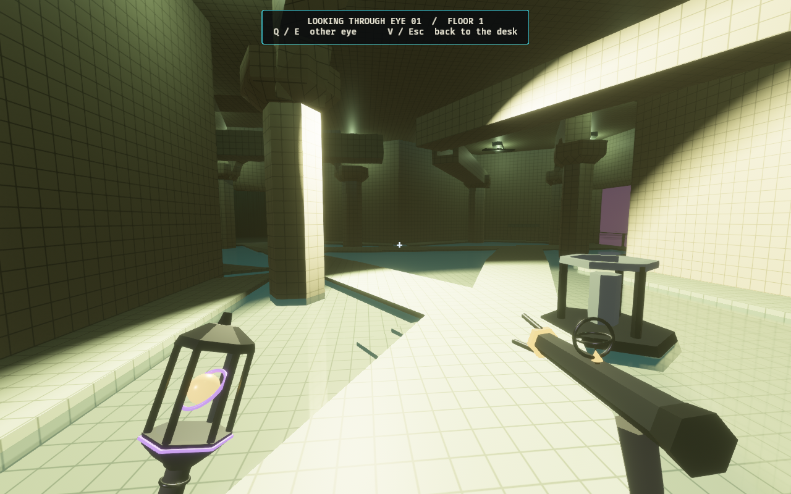
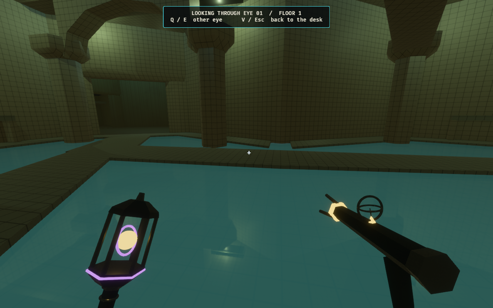
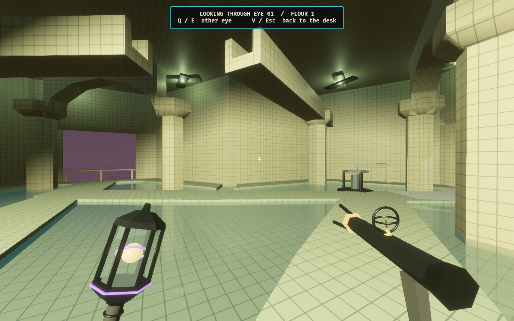
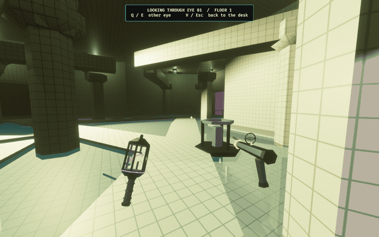
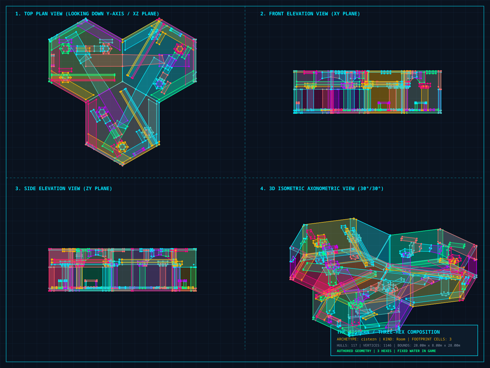

# The Cistern — location evidence

The Backrooms wonder is a three-hex bath with cream ceramic arcades, a shallow
continuous water surface, raised causeways, a dry perimeter gallery, submerged
treads, elevated aqueduct channels, and low outlet mouths. Three outward
thresholds are spaced 120 degrees apart. The room occupies one existing storey:
its complete envelope is 28 × 28 × 8 metres, with a 504 m² hex footprint.

The water level is fixed. Aqueducts and outlets are inert architecture. There is
no fill/drain simulation, usable valve, new victory condition, reflection-based
observation, damage, or swimming mechanic. The later hydraulic objective remains
in the [proposal](../../cistern_wonders_proposal.md).

## In-game views

These images come from the game after a Cistern card was committed through the
Architect desk and accepted by the ascent rules. The composition was not added
by replacing the rendering scene with a mockup.







## Controller walkthrough



The evidence harness holds the rest of the match still after the accepted play.
It stages an Observer at the entry and then walks the committed collision
snapshot using the production Rapier controller: entry → first sector → second
sector → third sector → first sector → entry. The camera is the game's Observer
eye view, including its existing gaze easing and equipment presentation. Two
60 Hz controller steps are taken per captured video frame; the GIF presents the
result at real traversal speed, sampled to 12 fps and 640 × 400 pixels.

The walkthrough proves local traversal, not multiplayer balance, autonomous
Guardian tactics, or the future hydraulic objective. The initial card play may
raise ordinary contradiction pressure; the capture freeze prevents later match
events from changing the location during inspection.

## Authored plan



[Vector plan](cistern-plan.svg) · [Geometry snapshot](cistern-plan.map)

The evidence-only map assembles the exact generated sectors at `(0,0)`, `(1,0)`,
and `(0,1)`, using their 0, 2, and 4 orientations. Internal ports are omitted
from this aggregate room snapshot because they are internal footprint faces.
It validates as three footprint cells, three external ports, 117 hulls, and nine
lights. It is not a second production room asset. The CAD contains physical
geometry; the rendered water is a separate presentation surface in the game.

Each production sector has 39 hulls, below the existing 45-hull cell budget. Six
explicit orientations fit the quantized hex grid exactly, avoiding the thin
exterior light leaks produced by rotating this footprint with a quaternion.
Ordinary tiles retain their existing rotation policy.

## Reproduce

From the `codex/cistern-reimagined` checkout, with no other worktree building in
the shared Cargo cache:

```bash
cargo run -p observed_authoring --bin tilec -- gen-tiles
cargo run -p observed_authoring --bin tilec -- build
OBSERVED2_CAPTURE_HEX_WFC_ARCHITECT=docs/evidence/cistern-reimagined \
OBSERVED2_CISTERN_PORTRAITS=1 cargo dev-run -p observed_game
ffmpeg -y -framerate 30 -i docs/evidence/cistern-reimagined/cistern-walk-%03d.png \
  -filter_complex '[0:v]fps=12,scale=640:-1:flags=lanczos,split[a][b];[a]palettegen=max_colors=96:stats_mode=diff[p];[b][p]paletteuse=dither=bayer:bayer_scale=3:diff_mode=rectangle' \
  docs/evidence/cistern-reimagined/cistern-walk.gif
```

Clear old `cistern-walk-*.png` files before a new capture; a different-length
walk should not inherit frames from an earlier run. Raw frames are omitted from
the committed evidence after GIF verification.

The aggregate CAD snapshot can be inspected independently:

```bash
cargo run -p observed_authoring --bin tilec -- validate docs/evidence/cistern-reimagined/cistern-plan.map
cargo run -p observed_authoring --bin tilec -- render-cad docs/evidence/cistern-reimagined/cistern-plan.map /tmp/cistern-plan.svg
```

The generated CAD status caption was replaced with a geometry-only description;
the visual evidence above establishes the room's in-game appearance.

## Verification

The focused Cistern tests pass, including a real card commit and physical
projection, Backrooms-only deck distribution, bidirectional causeway and gallery
traversal at all six rotations, full-height open internal joins, and sealed
exterior wall corners. The capture exits successfully after completing the
controller route.

Verified on 2026-10-03:

- `cargo fmt --all`: passed.
- `cargo dev-clippy`: passed without warnings.
- `cargo dev-test`: passed; 2,677 tests passed, zero failed, 45 ignored.
- Focused ascent facility suite: 60 passed, two ignored.
- Strict validation of all six authored sectors and the aggregate CAD snapshot:
  passed.
- `git diff --cached --check` and local documentation links: passed.

The extended `dev-test-all` suite was not run. The ignored hand-availability
measurement below was run explicitly.

The relevant ignored `how_much_of_the_hand_is_playable` measurement was run
separately after restricting Cistern cards to Backrooms. It completed in 206.18
seconds. Each distribution below is `playable card count: sampled beats`:

| Mode | Beats | Playable anywhere | Playable on an Observer floor |
| --- | ---: | --- | --- |
| Pocket | 4 | `0:1, 5:3` | `0:1, 5:3` |
| Quick Climb | 400 | `4:160, 5:240` | `0:4, 1:3, 3:1, 4:236, 5:156` |
| Full Ascent | 18 | `0:1, 5:17` | `0:1, 4:10, 5:7` |
| Deep Stack | 377 | `0:1, 5:376` | `0:1, 1:9, 2:42, 3:201, 4:124` |

These are deterministic playtest measurements, not balance assertions. Short
runs especially do not establish the room's effect on match outcomes.
