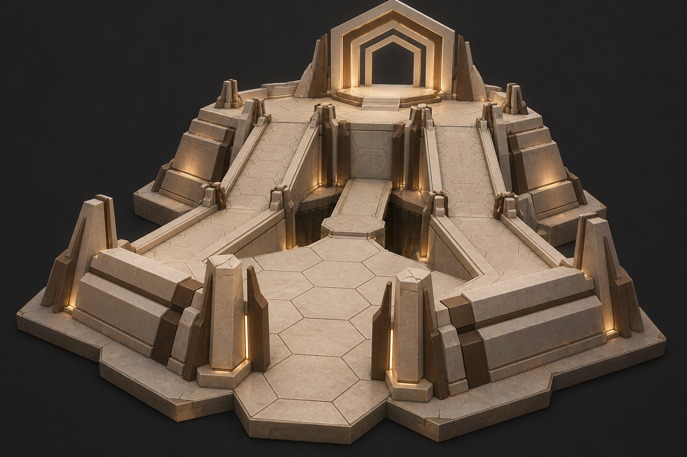
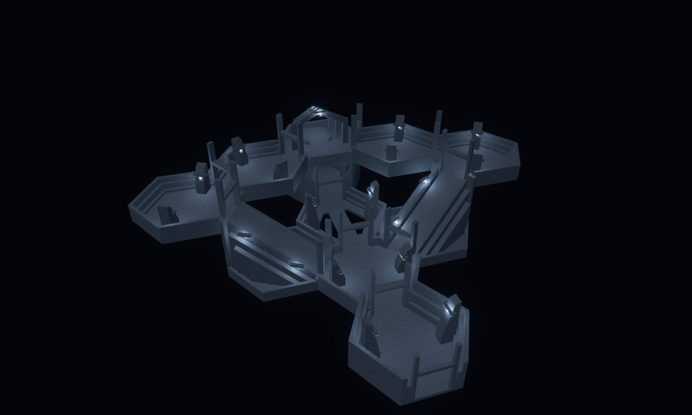
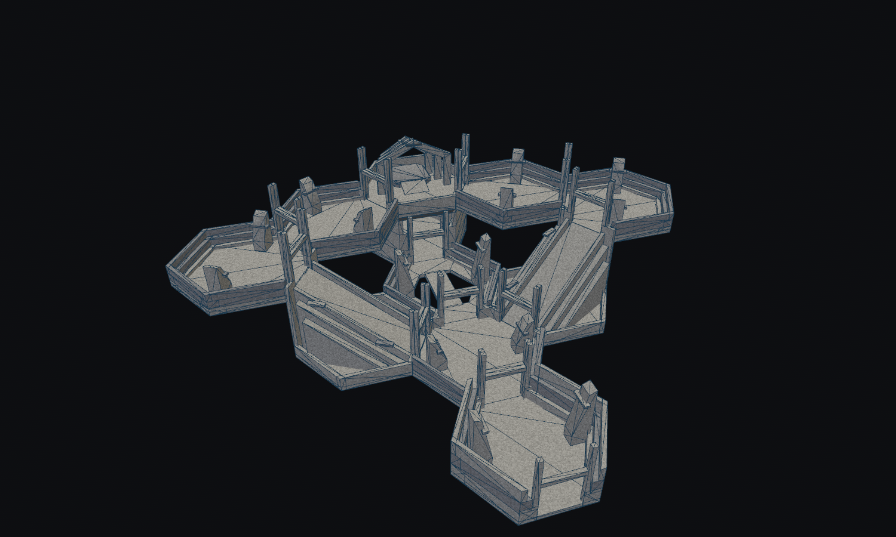
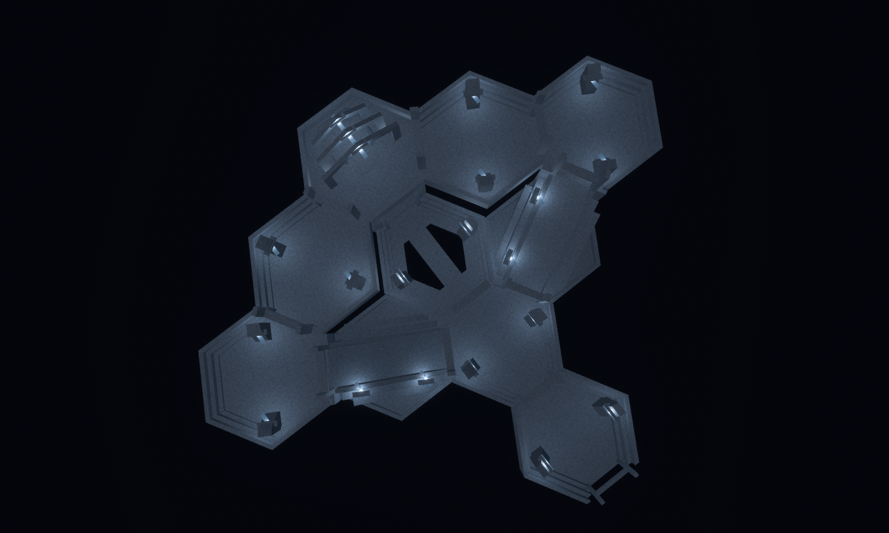
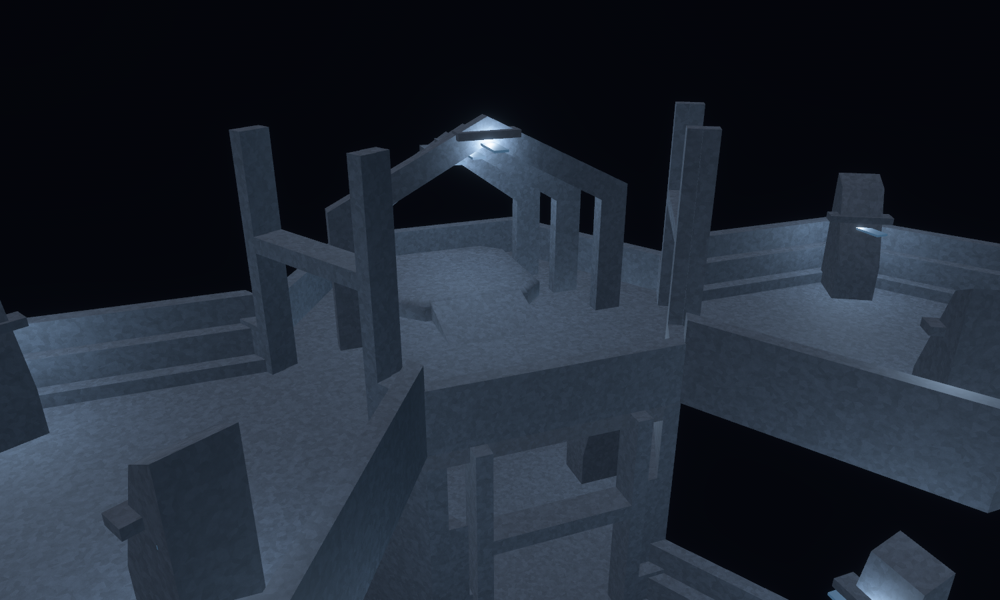
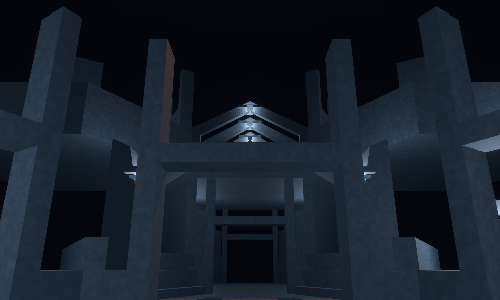

# The Empty Audience

Concept-to-geometry benchmark, 12–13 September 2026. District: **The Welcome /
Facet Monument**.

A ceremonial approach divides into two broad ascents and reunites at an empty
raised dais. Repeated stepped walls, tapered buttresses and three pointed reveals
give the kit a common architectural language. The benchmark asks whether ordinary
WFC modules can form a recognizable monument across tile boundaries.

The concept was generated **before modeling**, using the built-in imagegen tool.
The exact prompt is saved in [prompt.txt](prompt.txt).





The final composition uses **eleven placements across two levels**, including two
8 m ascents, an exposed lower crossing, upper galleries and a dais supported by a
foundation tile. Its ten horizontal cell locations contain thirteen logical
occupied cells when the two ramp heads are included. Nine new Facet Monument
designs provide **54 rotated runtime variants**; eight designs appear in this
composition, with the additional 120-degree landing available to WFC.

The model preserves the concept's paired climb, axial arrival, stepped flanks,
central absence and repeated angular reveals. Visual fidelity remains partial:
the concept's warm stone, luminous joints and dominant focal portal become cooler
shared district surfaces, standard practical lights and a smaller dais structure.
The standard doorway piers remain conspicuous, so the result still reads as a
modular assembly more strongly than the concept's continuous monument. The initial
layout was shortened and the pointed reveals thickened during visual review.





| Architect Ascent goal | Architectural provision | Scope |
| --- | --- | --- |
| Observe routes before committing | Open views between the ascents and across the central space | Sightline geometry; no new observation rules |
| Meaningful route choices | Mirrored ascents converge on the upper dais; the lower axis continues beneath it | Connected authored ports |
| Physical ascent | Two placements of a 4.5 m wide ramp rising 8 m | Production controller tested uphill and downhill without jumping |
| Consequential movement | A 2.75 m crossing spans an actual floor opening; elevated galleries flank open space | Real collision geometry; no scripted collapse added |
| Architect tile cards | Nine designs use existing demanded archetypes | Selectable WFC candidates; the illustrated landmark is hand composed |





The first-person image is a stationary lab capture with `facility_lighting: true`,
not a bot walkthrough or an active Architect match. The lit overview and close
view use inspection fill and shared district materials. The clay and CAD views
isolate the geometry. No solver rule currently guarantees this complete landmark
will appear in a generated facility.

The source of truth is
[forge/audience.rs](../../../crates/observed_authoring/src/forge/audience.rs).
`tilec gen-tiles` emits the nine `assets/tiles/authored/audience_*.map` sources;
`tilec build` compiles them into the catalogue. The largest new module has
**33 convex hulls**, within the 36-hull cell budget. The composition profile is
unchanged. The catalogue contains **384 authored sources**; its hash for this
capture is `652cc4ee1993b0f46ac98639fe01af549689593f146110e1b054facf5ceb3827`.

| Source | Runtime selection at turn zero | Role |
| --- | --- | --- |
| `audience_procession` | `hall_straight:780` | Ceremonial entrance with stepped side walls |
| `audience_crossing` | `hall_straight:786` | Narrow bridge within a floor ring |
| `audience_foundation` | `hall_straight:792` | Covered lower passage supporting the dais |
| `audience_branch` | `hall_junction_4way:780` | Division between the axis and twin ascents |
| `audience_landing` | `hall_turn_120:780` | Alternate landing; available but not placed here |
| `audience_dais` | `hall_turn_120:786` | Triple pointed reveal and ramped podium |
| `audience_ascent` | `hall_ramp:780` | Full-storey climb with stepped flanks |
| `audience_elbow` | `hall_turn_60:780` | Upper return at each ramp head |
| `audience_gallery` | `hall_straight:798` | Upper approach to the dais |

The pointed reveals are assembled from extruded convex sections, and the ramps
and their flanking bands are sloped solids. The
[dais CAD inspection](dais_cad.png) records the authored collider geometry.

Validation covers byte-for-byte source regeneration, matching actual WFC demands,
26 directed horizontal doorway paths, both ascent directions and the podium
approach using the production controller. These are module-level physical tests.
A separate assembled-layout test checks all eleven placements and both logical
ramp heads for matching ports, connectedness and three resets with stable collider
counts and spawn.

The source seam audit checks **384 sources and 467,061 compatible boundary
comparisons with zero height mismatches**. The production projected-facility seam
test also passes. The source auditor does not compare the compatibility ramps'
vertical interfaces; controller tests and logical ramp-head checks provide separate
evidence for those connections.

Final verification: `cargo fmt --all`, `cargo dev-clippy`, `cargo dev-test`, and
`git diff --check` completed successfully. The full workspace suite includes all
three district composition tests, the updated catalogue identity and deterministic
selection pins, and the existing tower, facility, traversal and game regressions.
All five view scripts have identical layouts, and all document links resolve.

Reproduce from the repository root:

```bash
cargo run -p observed_authoring --bin tilec -- gen-tiles
cargo run -p observed_authoring --bin tilec -- build
OBSERVED2_SCRIPT=docs/compositions/empty_audience/hero.json cargo dev-run -p hex_tile_lab
OBSERVED2_SCRIPT=docs/compositions/empty_audience/clay.json cargo dev-run -p hex_tile_lab
OBSERVED2_SCRIPT=docs/compositions/empty_audience/plan.json cargo dev-run -p hex_tile_lab
OBSERVED2_SCRIPT=docs/compositions/empty_audience/dais.json cargo dev-run -p hex_tile_lab
OBSERVED2_SCRIPT=docs/compositions/empty_audience/arrival.json cargo dev-run -p hex_tile_lab
```

All five scripts render the same composition, save a settled image, and exit.
