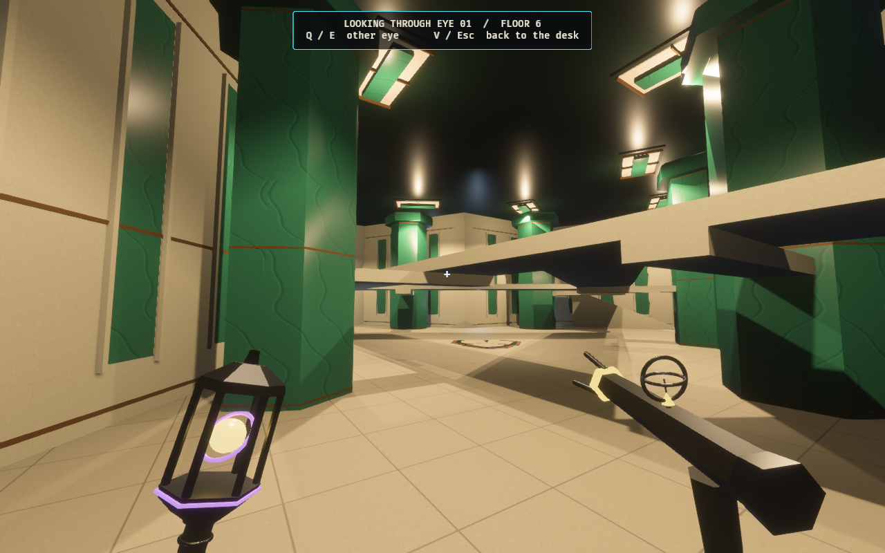
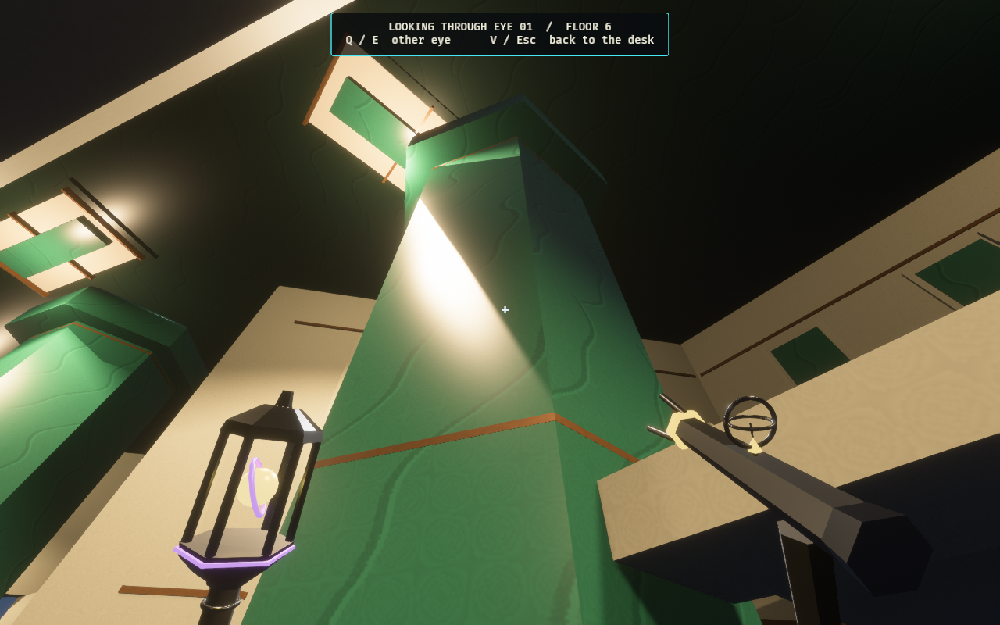
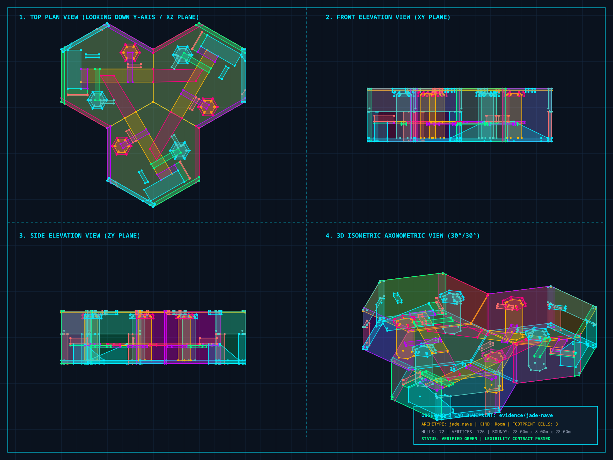

# The Jade Nave — playable Monument wonder

One finite card creates a three-bay Monument room on either ascent floor **5 or 6**
/ simulation level **4 or 5**. Six opaque jade piers, stepped crowns and cantilever
arms frame pale elevated crossings. Each bay has a real ramp, a sheltered watching
landing and an exterior doorway. Bronze reveals, veined stone and warm recessed
coffers give the monument its own local finish.

[Research, inspirational photographs and future goal proposal](../../jade_nave_wonder_proposal.md).
The Brion Memorial, Salk Institute and Fallingwater inform the original design.

## Game views

The stills follow an actual card selection, legal preview and atomic physical
commit in Architect Ascent. The capture begins by placing Observer bodies at a
buildable hall for physical discovery; they then leave through an existing door
outside the candidate footprint and look away. It stages the real finite card, without
injecting knowledge into the match. Inspection poses hold the committed match
still; the walkthrough moves through the production character controller.





[Watching landing](architect-jade-watching-landing-1280x800.png) ·
[Unpowered upper crossing](architect-jade-unpowered-1280x800.png) ·
[Single-card preview](architect-play-1280x800.png) ·
[Committed Architect board](architect-built-1280x800.png)

Nine fixed downlights and room-owned diffuse fills illuminate the whole composition
before entry. The moving district key is disabled inside the Nave. Generator
power controls the emergency-light fraction and switches the luminous coffers
between existing cached handles. Their positions stay fixed across bay changes.

## Production geometry



[Vector CAD](jade-plan.svg) · [Full-room snapshot](jade-plan.map) ·
[Snapshot assembler](assemble_plan.py)

Six strict v2 maps generated by `forge/jade_nave.rs` carry the `facet_monument`
register scope and exact lattice headings. Each sector has **24 collision hulls
and three lights**. The whole composition uses **72 hulls and nine lights**, below
the 128-hull room budget, with three exterior doorways and sealed vertical faces.
The evidence CAD assembles those same production brushes under a legacy room
contract outside the active tile catalog.

The raised circuit is three metres above the storey base. Its ramps run from the
half-metre floor to the landings, and the cantilever arms retain two metres of
clear height over the lower floor. Solid piers break sightlines; all doors, lower
crossings, ramps and upper joins remain physically traversable.


The H.264 / yuv420p video contains **596 consecutive 1280×800 frames at 30 fps**,
lasting **19.87 seconds**. The controller completes in 598 capture frames; 596
screenshots flush before exit. The route crosses the lower floor, climbs a real
ramp, follows the full upper circuit, then descends. Regression checks additionally
walk every ramp and each entry in both directions at every heading on both
Monument floors. The eight saved game stills are also 1280×800.

## Integration

Loyal and Rogue decks receive one Monument-only card when the district exists.
The two Monument floors share that card vocabulary. Earlier card and archetype
IDs remain unchanged. The Architect cutaway retains the Nave's elevated routes
at their actual height while removing the roof. Thumbnails, ghosts, map glyphs, physical commit, bots and
lab vocabulary recognize the new composition. All three cells obey the existing
occupancy, observation, anchor, prison, immutable-structure and collapse checks;
rejection changes no physical cells.

Each floor retains its original protected generator. The documented **Broken
Vigil** Rogue goal is a proposal only. No new victory mechanic, trigger or scoring
counter is implemented. Ordinary Monument finishes and the district progression
remain unchanged.

`observed_style::jade` owns colors, generated texture patterns, roughness and light
semantics. Structural visuals come from authoritative collision hulls. Six cached
mesh/material batches per sector add bounded finish. Luminous coffer entities are
children of their resident cell; removal despawns them, and rewrites reuse identical
cached meshes. Power cycling allocates no new materials.

The catalog advances to **278 active modules** / **374 authored source maps**.
Content hash:
`62daab1d51af86fccb86550ddc6ca628deabd3332e950e7c20b584d3d1031bf9`.
The profile remains
`7b57da365f6c4de7876cd76adfd985db582d6f1610999c29d89d116739b639d1`;
folded simulation hash:
`f2b38ab22b0f0767c81422cfa9c354c1d1837dabcdba4009b099f60ea9894294`.

## Reproduce

Use the machine's shared Cargo target directory and avoid overlapping builds.
Begin with an empty capture directory.

```bash
cargo run -p observed_authoring --bin tilec -- gen-tiles
cargo run -p observed_authoring --bin tilec -- build
OBSERVED2_CAPTURE_HEX_WFC_ARCHITECT=/tmp/jade-capture \
OBSERVED2_JADE_PORTRAITS=1 \
RUST_LOG=warn,observed_game=info cargo dev-run -p observed_game
ffmpeg -y -framerate 30 -i /tmp/jade-capture/jade-walk-%03d.png \
  -c:v libx264 -pix_fmt yuv420p -crf 20 -movflags +faststart \
  docs/evidence/jade-nave/jade-walk.mp4
python3 docs/evidence/jade-nave/assemble_plan.py
cargo run -p observed_authoring --bin tilec -- validate \
  docs/evidence/jade-nave/jade-plan.map
cargo run -p observed_authoring --bin tilec -- render-cad \
  docs/evidence/jade-nave/jade-plan.map /tmp/jade-plan.svg
python3 docs/evidence/jade-nave/finish_cad.py /tmp/jade-plan.svg
cargo fmt --all
cargo dev-clippy
cargo dev-test
cargo test -p observed_match --lib how_much_of_the_hand_is_playable -- --ignored --nocapture
```

The CAD command generates SVG. Its optional JPEG helper lacks Pillow on this
machine; the finalizer uses installed `rsvg-convert`. Raw video frames stay outside
Git. These are traversal and integration checks, rather than a multiplayer balance
claim.

## Verification — 2026-10-04

- `cargo fmt --all` and `cargo dev-clippy`: clean, with warnings treated as errors.
- `cargo dev-test`: **2,719 passed, 0 failed, 45 ignored**.
- All six strict production maps validate with 24 hulls and three lights each.
  The full-room snapshot validates with three footprint cells, three exterior
  doors, 72 hulls and nine lights.
- Real-controller checks cover the lower and upper circuits, every access ramp
  and every entrance in both directions at all six exact headings on both
  Monument floors. Piers stop sight rays and the storey ceiling remains sealed.
- Card checks cover finite Loyal/Rogue copies, absence without Monument, earlier
  ID preservation, complete six-heading previews and actual atomic placement on
  floors 5 and 6. Protected generator cells retain their original state.
- The Architect preview retains raised walking slabs at their actual height and
  removes the roof. Existing Archive Well, Chargeworks, Rain Court and Concourse
  placement tests pass alongside the new Nave test.
- Fixed lights stay in place before entry, across bay changes and through power
  cycles. Coffers switch cached material handles; cell removal despawns their
  entities, and identical rewrites reuse cached meshes.
- The final real-game capture completes the production-controller route in 598
  frames, with 596 consecutive screenshots saved. Game views, local document
  links, SVG XML and H.264 video metadata are verified. No renderer warnings occur.

The complete extended instrumentation suite was not run for this location pass.
The affected hand-availability measurement is recorded below.

The ignored hand-availability measurement completed in **166.54 seconds**, sampling
legal card choices during live hunts:

| Fixture | Sampled beats | Beats with a playable card anywhere | Beats with a playable card on an Observer floor |
| --- | ---: | ---: | ---: |
| Pocket | 4 | 3 | 3 |
| Quick Climb | 400 | 400 | 396 |
| Full Ascent | 18 | 17 | 17 |
| Deep Stack | 377 | 376 | 376 |

This records hand availability, not a competitive balance assertion.
