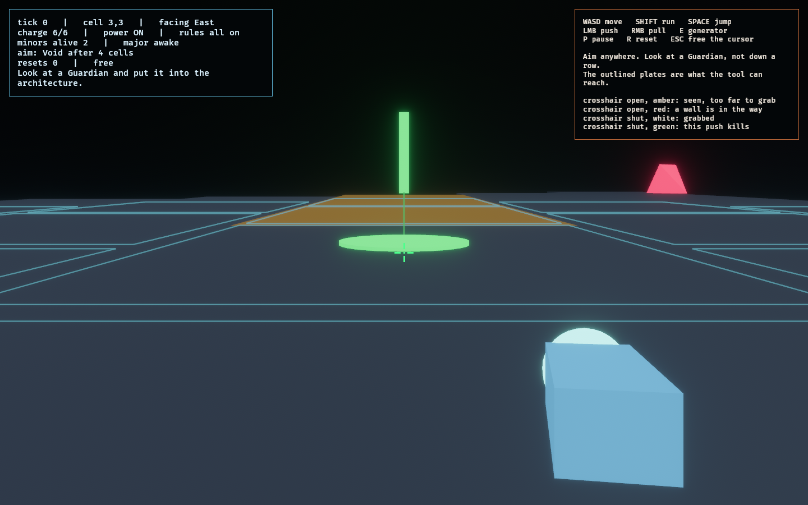

# Kinetic tool lab — evidence


Captured with:

```bash
OBSERVED2_CAPTURE=docs/evidence/kinetic_lab/shove-preview.png cargo run -p kinetic_lab
```

The capture pauses time and stands the Observer west of the ledge run with a
minor Guardian squarely in view, so the frame shows a live preview rather than
an idle board.

## What the frame proves

The green line runs from the minor Guardian at `(4, 3)`, across the three amber
**ledge** cells at `(5..7, 3)`, to a double ring on the void rim at `(8, 3)`, and
the panel reads `aim: Void after 4 cells`.

That number is the point. A push carries `PUSH_IMPULSE = 3` cells, but ledges do
not consume impulse, so the target travels **four** and leaves the floor. The
rule "momentum carries across unrailed geometry" is legible in the frame before
the trigger is pulled, which is the lab's answer to whether a shove is fair — the
preview is the same pure `resolve_shove` the tick will run, not an estimate of
it.

The double ring is the second, non-colour channel on a lethal outcome; grey
would mean the target survives, amber that it lands on a tile already
retracting, red that structure blocks the shove.

## The rest of the board, left to right

| Mark | Cell | What it is |
| --- | --- | --- |
| Yellow square | `(1, 1)` | Generator — cut power here and sight collapses to your own cell |
| Grey hex | `(2, 2)` | Wall — a shove into it is `Blocked` and nothing moves |
| Green ringed square | `(2, 4)` | Recharge station, drawn live because the floor has power |
| Cyan square | `(3, 3)` | Observer, ringed by every plate the tool can reach |
| Orange squares | `(4, 3)`, `(3, 4)` | Minor Guardians — neither freezes when looked at |
| Dark red hex | `(3, 5)` | Retracting tile, fading toward void as its countdown runs |
| Amber hexes | `(5..7, 3)` | The unrailed ledge run |
| Pink square | `(6, 5)` | Major Guardian, drawn awake because nothing is looking at it |

## First person, same board



```bash
OBSERVED2_CAPTURE=docs/evidence/kinetic_lab/fps-reach.png \
  cargo run -p kinetic_lab --bin kinetic_fps
```

The same `KineticWorld`, the same `resolve_shove`, the same `aim: Void after 4
cells` — now standing on the floor rather than looking down at it. The capture
pauses the board first, because with capture working a Guardian one plate away
jails you in 24 ticks.

**The cyan grid on the floor is the tool's reach**, one outline per plate within
`TOOL_RANGE` that has a clear line to it. It answers the question the old
recording provoked — *do I have to fire down a lane?* — in the only place an
answer is worth anything, which is on the floor in front of the player: the
footprint is a blob of two dozen plates in every direction, not a row.

It replaced a single line drawn down the Observer's facing face, a leftover from
lane targeting that survived the rework and went on teaching the rule the rework
removed. Two things are worth recording about why the replacement is plates and
not a swept wedge. A wedge drawn from the aim vector swings with every mouse
movement, which is noise rather than information. And a ground arc at the tool's
42-metre reach sits within two degrees of eye level in a first-person view: the
first cut of this footprint drew exactly that and read as a stray horizon line,
which is also how the bug behind it was found — the outlines had been placed
`PLATE_THICKNESS / 2` above the floor, on the assumption that the constant was a
surface offset, when it is how far a plate hangs *below* `FLOOR_TOP`.

**The reticle** is four arms around a dot, and it carries two readings at once.
The gap is range: it closes as a Guardian comes toward `TOOL_RANGE` and snaps
shut the moment the tool can actually grab it. Colour and arm length are
capability: amber for seen-but-too-far, red for a wall in the way, white for a
grab that only staggers, green with longer arms for a chain that kills, and the
arms grow with the number of Guardians the chain takes. The HUD's `aim:` line
says the same thing in words, so the two can be checked against each other in a
single frame.

**A ring lands under the selected Guardian**, coloured by the fate of the shot.
With a 45-degree cone the crosshair alone no longer says *which* Guardian is
about to be grabbed; this says it on the Guardian, where the player is already
looking.

**Shape language.** Rank reads as the order of the solid. The orange **cube** is
a minor Guardian, the pink **tetrahedron** the major — a rarer solid for a rarer
thing. Both hold whole lattice cells and cross between them in a crisp snap that
finishes well inside their step interval, then wait. That clockwork read is not
decoration: Guardians move in quantised steps because the determinism contract
required it, and the presentation simply stopped apologising for it.

**The green beam** marks where a push would send the target. It is a beam and
not a floor decal because the lethal destination here is void about seventy
metres out, where a flat marker is both invisible and hidden behind the very
Guardian being aimed at. The amber plates between are the unrailed ledge run,
and the beam standing past their far end is the ledge rule stated in world
space: momentum outlives the three cells a push pays for.

Plate geometry is rectangular rather than hexagonal, and that is deliberate. The
lattice tiles exactly with 14x12 plates offset 7 per row, so they meet with no
gap and no overlap and a void cell leaves an exact hole. The hex lattice remains
the connectivity and targeting structure; an authored tile's *geometry* was
never required to be a hex prism, and rendering what you collide with is what
the Legibility Contract actually asks for.

## The shove in motion

[`kinetic_shove.mp4`](kinetic_shove.mp4) — 7 seconds, 1440x900, 60 fps.

```bash
OBSERVED2_CAPTURE_SEQUENCE=docs/evidence/kinetic_lab/frames \
  cargo run -p kinetic_lab --bin kinetic_fps
ffmpeg -y -framerate 60 -i docs/evidence/kinetic_lab/frames/frame_%04d.png \
  -c:v libx264 -pix_fmt yuv420p -crf 20 -movflags +faststart \
  docs/evidence/kinetic_lab/kinetic_shove.mp4
```

The frame directory is gitignored; the mp4 is the tracked artefact, exactly as
for `district_tour.mp4`.

The run holds on the target for a second and a half with the preview beam already
up, pushes at tick 90, follows the target down as it crosses the ledge run and
goes over the rim, then walks. Two things only a recording can show: the
clockwork snap-and-hold of a Guardian between plates, and a shove actually
*leaving* — the target flies, tumbles, and drops, rather than blinking out.

**The recording is a real run, not an animation.** Starting positions and
heading are staged, then every tick after that is driven by `PlayerIntent` and
`ToolRequest` through the same `Embodiment::step` a player's hands use. Because
the model is deterministic, the tape reproduces frame for frame. Capture parks
`FixedUpdate` and advances exactly one tick per rendered frame, so saving a PNG
per frame — far slower than the simulation — cannot let catch-up skip state; the
file is a true 60 Hz record rather than sampled moments.

## The full tour

[`kinetic_tour.mp4`](kinetic_tour.mp4) — 73 seconds, 1440x900, 60 fps, captioned.

```bash
OBSERVED2_CAPTURE_SEQUENCE=docs/evidence/kinetic_lab/frames \
  cargo run -p kinetic_lab --bin kinetic_fps
ffmpeg -y -framerate 60 -i docs/evidence/kinetic_lab/frames/frame_%04d.png \
  -c:v libx264 -pix_fmt yuv420p -crf 21 -movflags +faststart \
  docs/evidence/kinetic_lab/kinetic_tour.mp4
```

It demonstrates, in order: the reach footprint drawn with and without a target;
the reticle's five states; a lethal push carrying past the impulse into void; a
refused push and a refused generator, each announced; a pull; a push onto solid
floor that only staggers; recharging at a live station; cutting and restoring
power; a jump; walking off the rim into void and respawning; being jailed; and a
reset.

**It is driven, not animated.** A closed-loop director reads authoritative state
and emits `PlayerIntent` and `ToolRequest` through the same `Embodiment::step` a
player's hands use. Starting positions and a handful of mid-run Guardian
placements are staged, and every one of those is captioned "Staged:" on screen
as it happens.

### The same tour with `--no-jail`

[`kinetic_tour_nojail.mp4`](kinetic_tour_nojail.mp4) — 74 seconds.

```bash
OBSERVED2_CAPTURE_SEQUENCE=docs/evidence/kinetic_lab/frames \
  cargo run -p kinetic_lab --bin kinetic_fps -- --no-jail
```

Identical script, except the finale. The HUD carries `rules off: jail`
throughout, so the two recordings can never be confused for one another.

The ending is the interesting part. The same event happens — a Guardian walks
onto the Observer's plate — and the run simply continues: no overlay, no capture,
`free` in the HUD, and the crosshair sitting green on the cube now standing on
top of you. That is the flag's whole argument in one shot: with jail off a
Guardian stops being a fail state and becomes a thing in your way.

The script chooses its own finale from the rules rather than being captioned by
hand, because a caption reading "ends the run" over a run that does not end is
exactly the class of claim this lab has already been caught making.
`the_finale_caption_matches_the_rules` asserts that the jailing cut never
mentions the flag and the lenient cut never claims a jail.

### The headless counterpart

`demo::run_headless` plays the identical script with no window and no frame
timing, and `the_scripted_demo_demonstrates_every_claim_it_makes` asserts that
each captioned claim actually occurred, in order, and that the Observer is not
jailed before the finale.

That test exists because it was needed. Four cuts of this script were silently
broken — jailed at tick 299, then 982, then 1685, and one that stopped a single
stride short of the rim so the last third of the tour never ran. Each was found
in milliseconds by the headless log rather than by watching frames, and each was
invisible in a still. The recurring cause is worth keeping in mind when writing
any scripted scenario here: **Guardians pursue continuously**, so "parked out of
the way" has to be measured in ticks, not in distance. The board is nine plates
wide and a minor crosses one every 150 ticks, which means every corner is within
reach of a seventy-second recording.

## The siege, and what it exposed

[`kinetic_siege.mp4`](kinetic_siege.mp4) — 72 seconds, a one-minute siege in the
solved facility.

```bash
OBSERVED2_CAPTURE_SEQUENCE=docs/evidence/kinetic_lab/frames \
  cargo run -p kinetic_lab --bin kinetic_fps -- --siege --minutes=1
```

The run ends **SURVIVED**: five waves outlasted, six Guardians put into the
architecture.

It reads **six** rather than the five it read on the first cut, and nothing about
the facility, the waves or the clock changed. Widening the selection cone to 45
degrees and then fixing the recording bot to fire on the target the cone actually
picked — it had been firing on a lethal Guardian that was not the one the cone
selected — is worth one extra kill a minute, which is a fair summary of how much
of "the tool is ineffective" was really "the tool was hard to point".

The last frame is also worth a look for a reason that has nothing to do with the
tool. It used to carry **SURVIVED** on the overlay and **JAILED** in the HUD in
the same frame: the clock ran out, the match was won, and the Guardians kept
walking for another eleven seconds until one reached the Observer. Two
authoritative readings of one moment, flatly contradicting each other. A decided
siege now freezes its opposition, and `outlasting_the_clock_survives` and
`winning_cannot_be_taken_back_by_a_guardian` hold it there.

The first cut of this exact recording — same seed, same script, same minute —
ended **OVERRUN on wave 5 with zero kills**. Nothing about the facility, the
waves or the bot changed between the two. What changed is that a wall became
lethal.

**The tool used to be inert indoors.** It was designed and tuned on the authored
board, an open plain with a void rim, where a push carries three plates and ends
in nothing. In a building a shove stops at the first wall, and in a corridor that
wall is right there: measured on the pinned facility, most plates have exactly
two open faces and essentially every push was a no-op that still cost charge.
Now a shove that arrives at structure *with momentum left* is killed by it, and
the most abundant feature in a facility went from the reason the tool failed to
the reason it works. `the_tool_is_effective_in_a_corridor_facility` keeps the
measurement, pointed the other way, so it cannot quietly regress.

Two fixes were needed before the siege was even a game, and both were invisible
on the open board:

- **Pursuit was greedy.** Guardians took whichever neighbouring plate reduced
  the distance most, which is correct on a plain and strands them in the first
  corridor that runs the wrong way before it runs the right way. They milled
  about near their spawns and an Observer who never moved *won* — which looks
  exactly like a working siege until you watch one. Pursuit is breadth-first now.
- **The recording bot walked into walls**, for the same reason, and one whole cut
  was a single grey rectangle. It holds its post now and lets them come, which is
  what a siege is anyway.

What to take from the video: the facility reads, the waves arrive and grow, the
clock creates real pressure, and the tool now answers it — using the building
rather than in spite of it.

## Caveat

Neither view answers whether a shove is *satisfying* in the sense a playtest
means — that needs a person at the keyboard, and it is the open human gate. What
these frames establish is that the rules are legible, reproducible, and identical
across two independent presentations of the same simulation.
