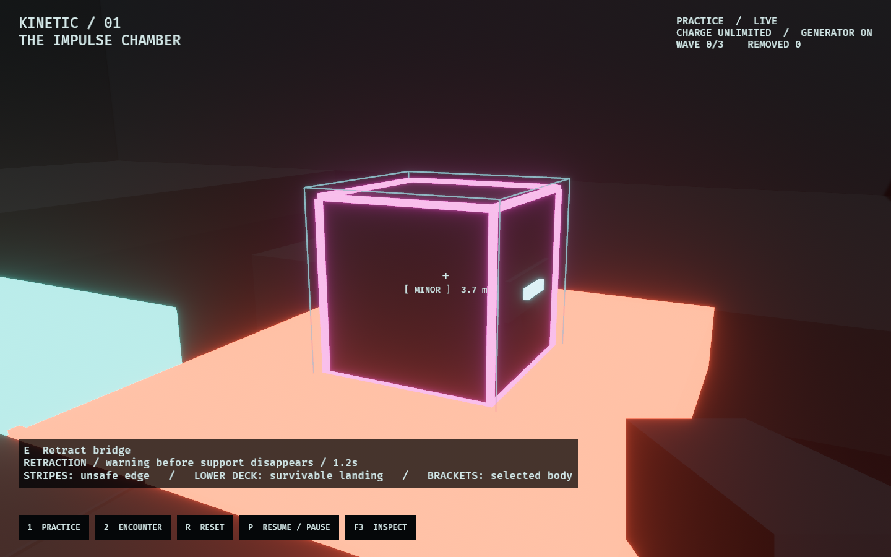
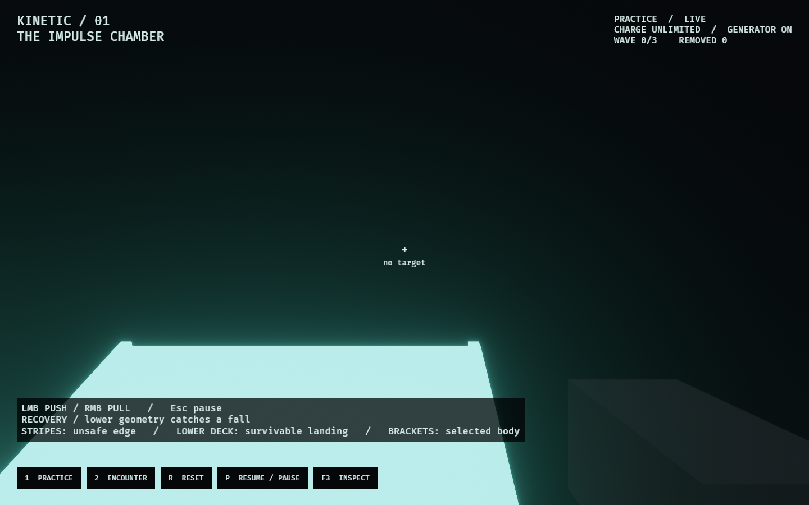

# Continuous kinetic lab evidence

The new first-person lab replaces the discrete schematic and WFC siege. These
captures use the same authored solids, raw-Rapier bodies, and command path as play.


[Open the 20-second walkthrough](walkthrough.gif). It contains five four-second
scenes: prop contact, immediate pull, recovery onto a lower landing, a shove into
void, and telegraphed bridge retraction. Initial snapshots are explicitly staged;
every subsequent movement and impulse comes from ordinary `PlayerIntent` and tool
commands. Capture advances one 60 Hz tick per frame, samples at 15 fps, and fixes
presentation interpolation/effect time to the recorded ticks.

The [event report](verification.txt) records the concrete outcomes:

- Prop contact and pull apply impulses without killing.
- The Observer's fall ends grounded on the lower shelf, rather than resetting.
- The void shove fires at tick 30 and eliminates its minor at tick 110.
- Bridge retraction starts at tick 30, removes support at tick 150, and eliminates
  its falling minor at tick 219.





The 18 focused lab tests cover these outcomes, crosshair selection and occlusion,
charge/refusal behavior, fast wall collision, momentum transfer, powered recharge,
actual pursuit around corners and up both staircases, player falls, terminal-state
freezing, per-tick replay and snapshot continuation, render-schedule independence,
and ten UI resets with stable live entity counts including children.

Both `kinetic_lab` and `kinetic_fps` launch the new experience. `cargo fmt --all`, `cargo dev-clippy`, and `cargo dev-test` all passed on
2026-09-16. Capture is not a substitute for a human assessing
how the tool feels at the keyboard; that remains the open acceptance gate.

Reproduce:

```bash
OBSERVED2_CAPTURE=docs/evidence/kinetic_lab/overhaul/chamber.png cargo dev-run -p kinetic_lab
OBSERVED2_CAPTURE_SEQUENCE=/tmp/kinetic-overhaul-frames cargo dev-run -p kinetic_lab
ffmpeg -y -framerate 15 -i /tmp/kinetic-overhaul-frames/frame_%04d.png \
  -vf 'scale=960:-1:flags=lanczos,split[a][b];[a]palettegen=max_colors=192[p];[b][p]paletteuse=dither=bayer:bayer_scale=3' \
  docs/evidence/kinetic_lab/overhaul/walkthrough.gif
```
