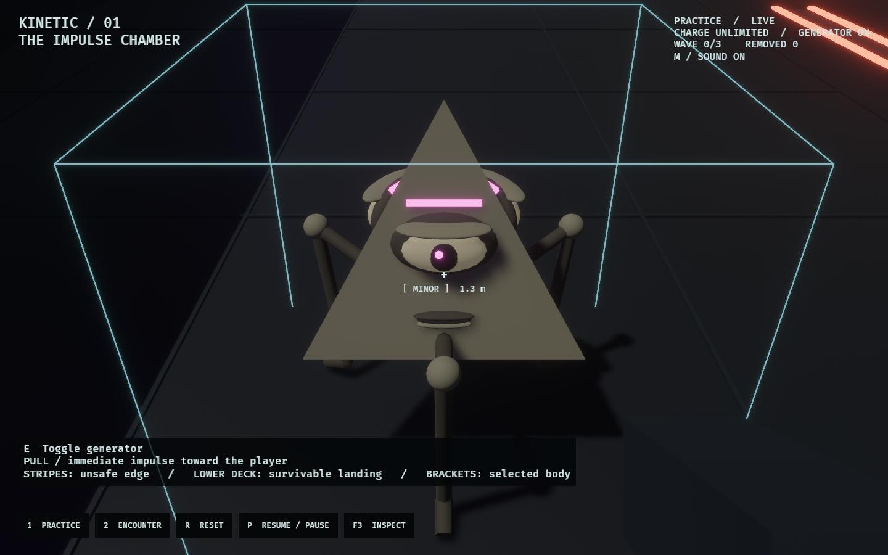

# Kinetic lab — guardian and sound presentation

2026-09-17. The approved movement and impulse tuning is unchanged. The user's
reference is **AD&D first edition**, corrected from second edition during the
work: face-bearing geometric beings with sparse, angular limbs. The models are
original primitive geometry; no reference artwork ships as an asset.



- [Guardian walkthrough](walkthrough.gif): the same five command-driven physical
  demonstrations as the approved overhaul, now with the animated guardian rig.
  This GIF is silent.
- [Labeled sound audition](sound-palette.mp4): all 19 original cues at their source
  level. This is an isolated audition, not captured gameplay sound. In-game gain,
  distance attenuation and obstruction damping make the actual mix quieter.
- [Physics verification](physics-verification.txt): byte-identical to the previous
  overhaul report, including all final simulation digests.
- [Audio verification](audio-verification.json): all committed Vorbis cues decode
  without clipping and match the regenerated decoded PCM sample for sample.

The rig has three lidded eyes, three mouths and three jointed legs on a plain,
matte pyramid. Its self-lit brows identify a minor even in dark chambers. Walking,
blinking, tucked airborne feet and stagger pose are presentation only. The shared
interface added during intervening work remains intact for `wfc_kinetic_lab` and
`plumb_lab`.

Sound covers distinct push/pull, misses and empty charge, impacts, Observer and
guardian footsteps, guardian calls, falls, warnings and retraction, power, waves,
three encounter outcomes, and recharge. `M` mutes both current and new voices.
Pause holds playback; resetting cuts the old attempt's voices and motion history.
The first-frame refusal throttle is covered by a regression test, alongside mute,
pause, reset, and one-motion-cue-pass-per-tick checks.

Reproduce visuals:

```sh
OBSERVED2_CAPTURE_SEQUENCE=/tmp/kinetic-presentation cargo dev-run -p kinetic_lab
```

Reproduce the sound audition source and cue subtitles without overwriting assets:

```sh
python tools/generate_kinetic_audio.py --out /tmp/kinetic-audio --preview /tmp/kinetic-audio/audition.wav
```

Human feedback confirmed the kinetic feel before this pass. Audio balance and
visual character are ready for listening and play feedback; automated checks do
not establish subjective preference.

## Validation

Formatting and warning-free workspace Clippy passed. The full workspace suite
passed **2162 tests** (37 ignored), including all 48 focused tests across
the kinetic, WFC kinetic, and plumb labs. Native capture launches of all three
completed successfully. See [check results](checks.txt).
