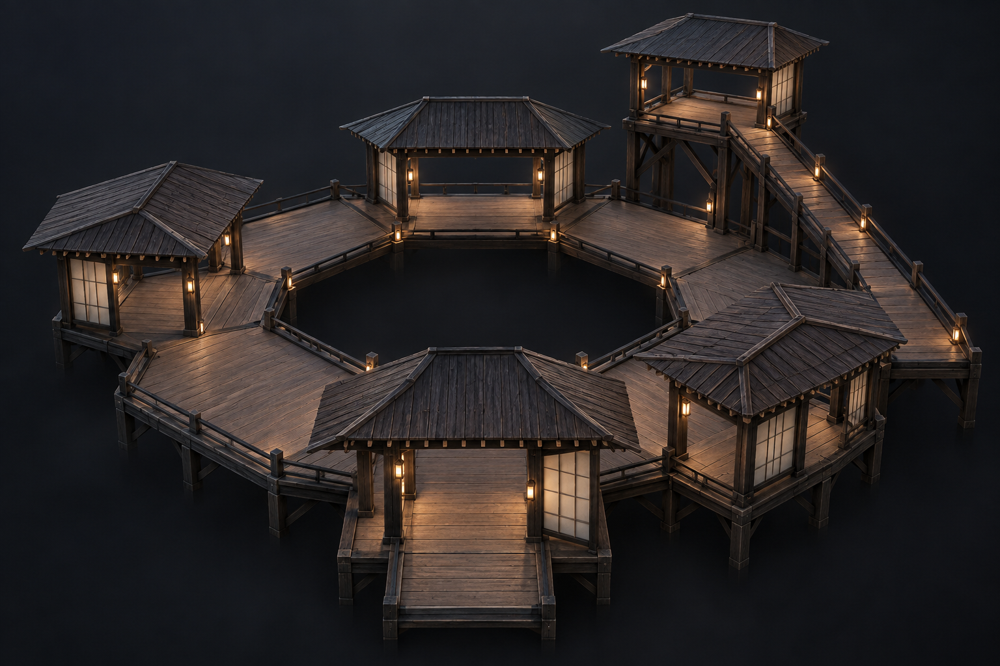
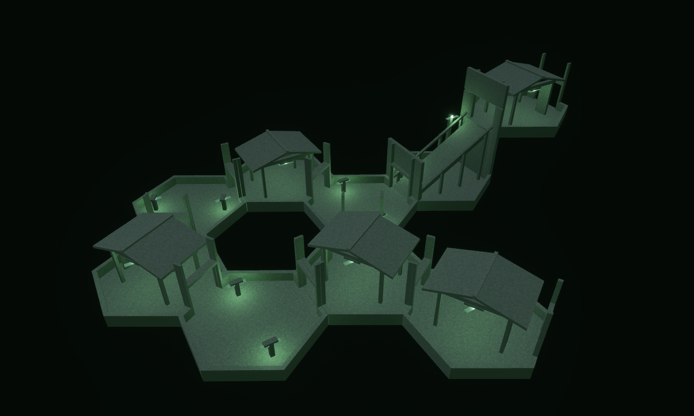
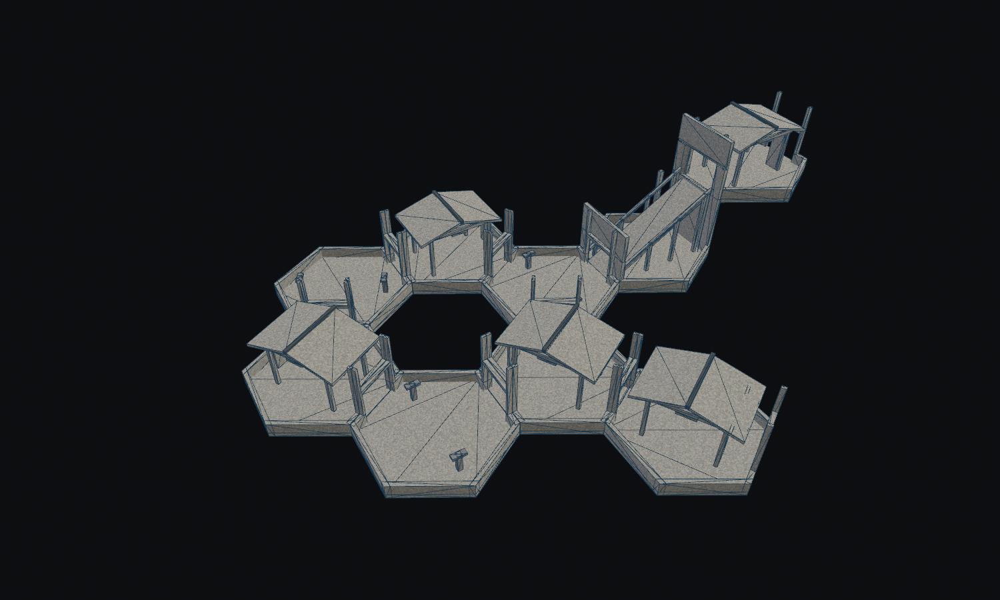
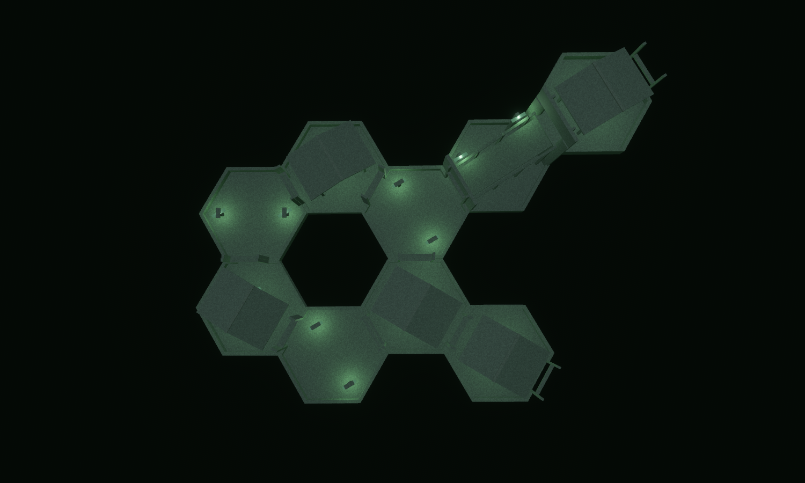
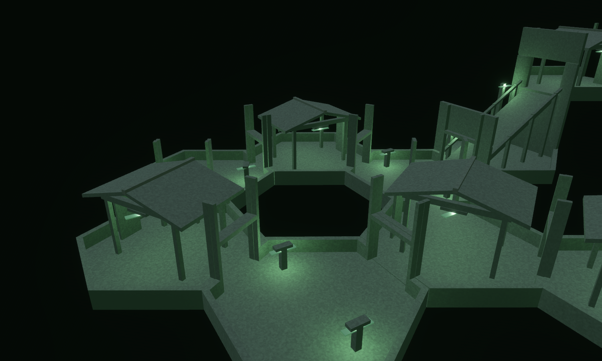
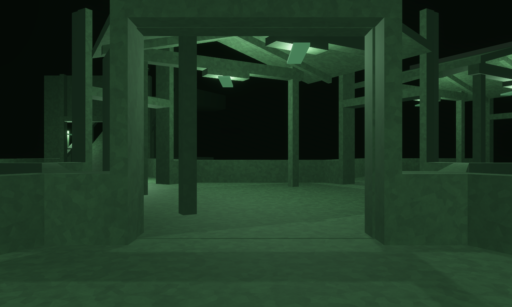

# The Last Courtyard

Concept-to-geometry benchmark, 12 September 2026. District: **The Thin / Thinning**.

The district's answer to instability is subtraction: floor, posts, a roof, and
enough openness to see the whole place. This benchmark follows the Witness
Exchange with a deliberately different composition: one empty court surrounded
by a low ring of pavilions and open decks, with an exposed ascent to a lookout.

The concept was generated **before modeling**, using the built-in imagegen tool.
The exact prompt is saved in [prompt.txt](prompt.txt).





The model preserves the concept's central absence, alternating roofed and open
spaces, slender posts, pitched roofs, visible rafters, sparse screens, and exposed
climb. It uses **nine module placements across two levels**, built from **six new
Thinning-scoped designs**. Six cells surround an absent central cell. The entry
pavilion branches off the ring, and a two-level ramp reaches the upper lookout.
The lookout and entry each have an outward continuation port for future tiles.

This is a useful modular reconstruction with **partial visual fidelity**. The
concept has richer timber joinery, broad hipped roofs, warm lanterns, and more
delicate deck edges. The model has simpler gabled roofs, canonical WFC threshold
posts and lintels, and the shipped Thinning palette's green light and subdued
surfaces. Its material rendering does not reproduce the concept's dark wood and
paper. The clay view makes the achieved geometry visible independently of that
material gap.





| Architect Ascent goal | Architectural provision | Scope |
| --- | --- | --- |
| Observation protects routes | Mostly open pavilion sides and sightlines across a single court | Geometry; no new observation rules |
| Competing routes | Two paths around the court connect entry and ascent | A closed ring with matching authored ports |
| Physical ascent | Suspended 4.5 m wide ramp rises 8 m to the lookout | Production controller walks up and down without jumping |
| Consequential upper-floor movement | The real central void and exposed elevated route | Collision geometry; no scripted collapse or corruption added |
| Architect tile cards | Six designs using existing demanded archetypes | Valid WFC candidates; the pictured arrangement is hand composed |





The first-person capture is a stationary view using `facility_lighting: true`.
It is not a bot walkthrough or a screenshot of an active Architect match. The
overview and close view use inspection fill and the shared district materials.
No actors, gameplay effects, painted detail, or new gameplay mechanics are implied
by these architecture captures.

The lab now accepts `inspection_fill: true` independently of section cuts. That
reuses its existing inspection lights while keeping the authored roofs intact;
it also selects the shared district surface materials. `facility_lighting` takes
precedence over this new flag. The existing scripts retain their default behavior.

The source of truth is
[forge/courtyard.rs](../../../crates/observed_authoring/src/forge/courtyard.rs).
`tilec gen-tiles` emits the six `assets/tiles/authored/courtyard_*.map` sources;
`tilec build` compiles the catalogue and its content hash. Six rotations of each
design provide **36 runtime variants**. The composition profile is unchanged.
The largest new tile uses **35 convex hulls**, below the existing 36-hull cell
budget. The catalogue hash for this capture is
`ae0cd3c94837263a35fa251be4b772a7cf44695c32d93fb6012aff0dfd0ff86a`.

| Source | Runtime selection at turn zero | Role |
| --- | --- | --- |
| `courtyard_corner` | `hall_turn_120:720` | Roofed corner pavilion |
| `courtyard_deck` | `hall_turn_120:726` | Open corner deck |
| `courtyard_fork` | `hall_junction_3way:720` | Roofed entry junction |
| `courtyard_fork_deck` | `hall_junction_3way:726` | Open junction to the ascent |
| `courtyard_lookout` | `hall_straight:720` | Entry or upper lookout pavilion |
| `courtyard_ascent` | `hall_ramp:720` | Suspended full-storey climb |

Roof panels and rafters have sloping upper **and lower** planes; they are thin
convex shells, not solid wedges down to the floor. The ramp uses the same shell
construction, with real support posts and sloped rails. The
[pavilion CAD inspection](pavilion_cad.png) records the authored collider geometry.

Validation includes byte-for-byte source regeneration, real WFC demand matching,
18 directed flat-module doorway paths, both ramp directions, and a layout test
covering all nine placements plus the logical ramp head. That test checks port
compatibility, connectedness and three resets with stable collider counts and
spawn. The full source seam audit covers **375 sources and 448,878 compatible
boundary comparisons with zero mismatches**. The production projected-facility
seam check passes as well. The source auditor does not compare compatibility
ramps' vertical interfaces; the controller and logical ramp-head checks provide
separate evidence there.

Final verification: `cargo fmt --all`, `cargo dev-clippy`, `cargo dev-test`, and
`git diff --check` completed successfully. The complete workspace suite includes
both district composition tests, the updated catalogue identity and deterministic
selection pins, and the existing traversal and facility regression checks.

Reproduce from the repository root:

```bash
cargo run -p observed_authoring --bin tilec -- gen-tiles
cargo run -p observed_authoring --bin tilec -- build
OBSERVED2_SCRIPT=docs/compositions/last_courtyard/hero.json cargo dev-run -p hex_tile_lab
OBSERVED2_SCRIPT=docs/compositions/last_courtyard/clay.json cargo dev-run -p hex_tile_lab
OBSERVED2_SCRIPT=docs/compositions/last_courtyard/plan.json cargo dev-run -p hex_tile_lab
OBSERVED2_SCRIPT=docs/compositions/last_courtyard/courtyard.json cargo dev-run -p hex_tile_lab
OBSERVED2_SCRIPT=docs/compositions/last_courtyard/walk.json cargo dev-run -p hex_tile_lab
```

All five scripts render the same layout, save a settled image, and exit. The
strongest result of this second benchmark is a distinct architectural silhouette
and a readable central court. Material fidelity and finer roof construction are
the clearest opportunities for a later art pass.
