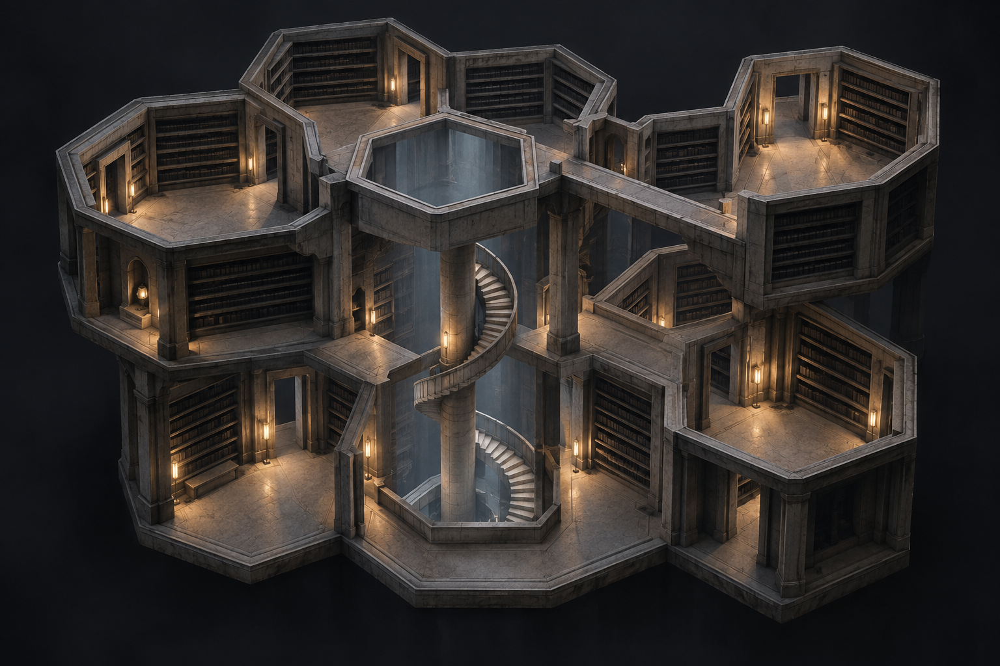
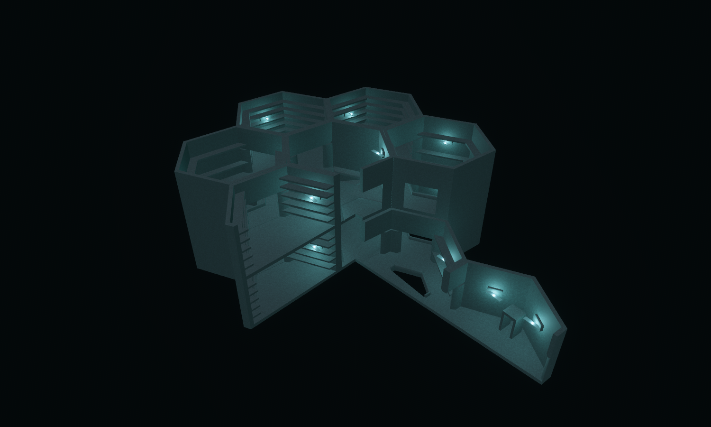
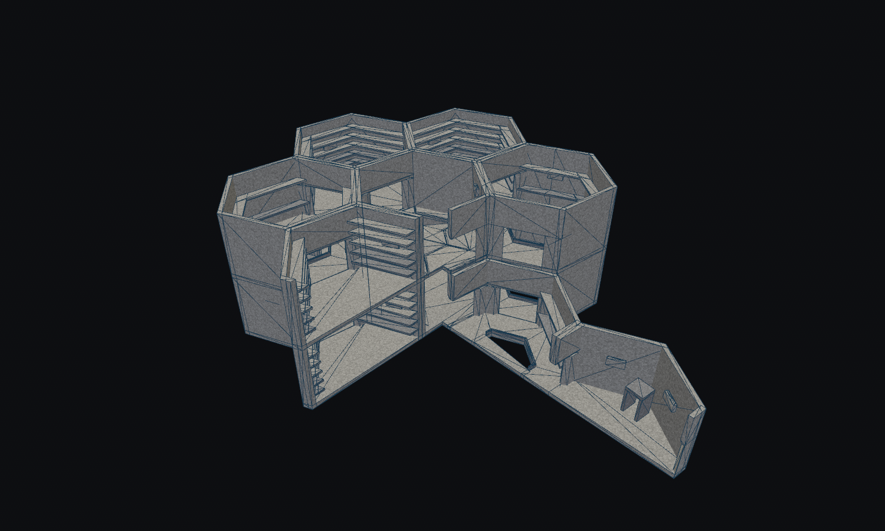
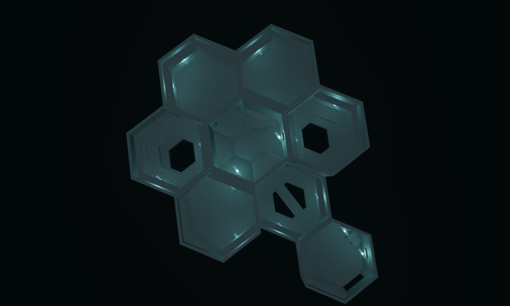
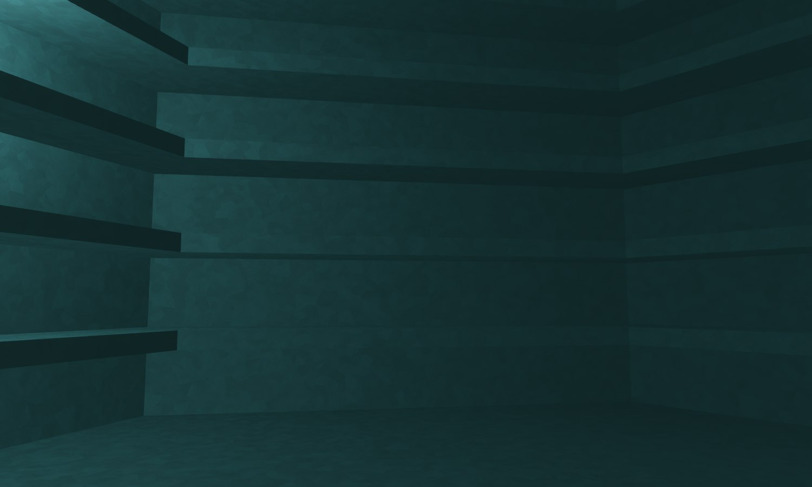
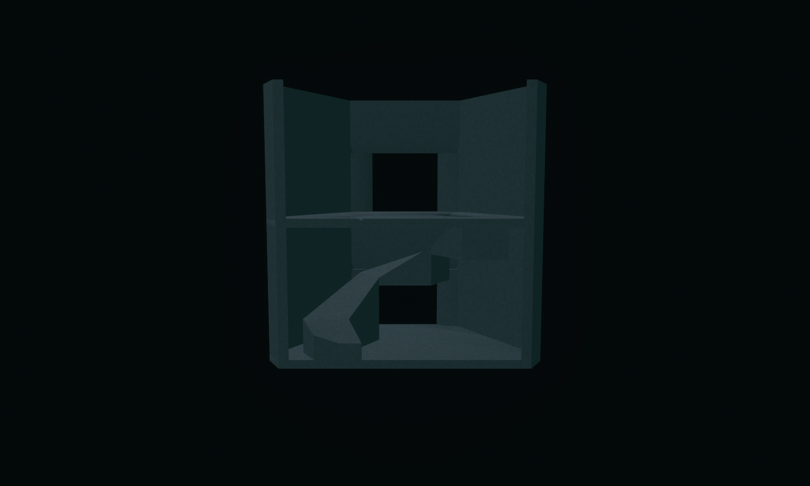

# The Catalogue of Missing Rooms

Concept-to-geometry benchmark, 13 September 2026. District: **The Index /
Infinite Gallery**.

The Index tries to hold a changing facility still by recording it. This scene
turns that premise into a compact library: a lower circuit of hexagonal rooms,
an incomplete upper circuit, two open air shafts and a central helical ascent.
Enclosed shelving rooms interrupt views; deep thresholds reveal the next space
only as a player approaches.

The concept was generated **before modeling** with the built-in imagegen tool.
The exact prompt is saved in [prompt.txt](prompt.txt).





The complete model contains **fourteen placements across two levels**: twelve
placements from six new Infinite Gallery designs and two existing stair-tower
modules. The new designs provide **36 rotated WFC variants**. The tower retains
its established unrotated geometry and signatures. One upper bay is deliberately
absent, exposing the lower bridge and leaving upper continuation ports at the gap.

The model captures stacked hexagonal rooms, repeated shelf courses, real shafts,
a low-railed crossing, a standing-body alcove and a physical 8 m ascent. The four
principal reading-room placements each have **five shelves on four walls**. The
shaft rooms use two courses per sealed wall to accommodate their opening and
continuous low parapet within the existing geometry budget.

Visual fidelity is partial. The concept has filled bookcases, detailed masonry,
warm lanterns and a prominent cylindrical spiral. The model has empty architectural
shelves, the shipped district's cyan lighting and simpler mineral surfaces. Its
reused ascent is a polygonal helical ramp, not individual stair treads. The core is
more enclosed than in the concept and is clearest in the isolated inspection below.
This benchmark improves interior density and route structure; it does not yet
reproduce the concept's surface detail or focal silhouette.





The hero and clay images use the lab's `quarter_volume` display section. It
removes roofs and clips a quadrant through walls, shelves and floor slabs at
consistent planes. The image therefore shows a section of the fourteen-placement
model, rather than fourteen complete visible tiles. The plan and first-person
capture provide complementary views. These display cuts do not alter collision
geometry or port connectivity.

| Architect Ascent goal | Architectural provision | Scope |
| --- | --- | --- |
| Observation requires commitment | Enclosed rooms, deep doorways and shelves limit long views | Geometry; no observation-rule changes |
| Competing routes | Lower gallery circuit and the route through the central tower | Matching authored ports and connected layout |
| Physical ascent | Existing two-module tower joins the levels with an 8 m helix | Established production controller and stacked-tower regressions |
| Consequential upper routes | Two vertically aligned air shafts and an absent upper bay | Real openings and unfinished continuation edges |
| District-matched construction | Six new designs use existing demanded archetypes | Actual WFC candidates; the landmark is hand composed |



This is a stationary first-person lab capture using facility lighting and no
section cut. It is not a bot walkthrough or an active Architect match.



The spiral inspection renders only the two tower modules, in their original
positions, with a volume section. The other four view scripts all
contain the complete, identical fourteen-placement layout. No generator rule
currently assembles this entire library automatically.

The new source of truth is
[forge/index.rs](../../../crates/observed_authoring/src/forge/index.rs).
`tilec gen-tiles` emits the six `assets/tiles/authored/index_*.map` sources;
`tilec build` compiles them into the catalogue. The largest new design uses
**35 convex hulls**, within the existing 36-hull cell budget.

| Source | Runtime selection at turn zero | Role | Hulls |
| --- | --- | --- | ---: |
| `index_reading` | `hall_turn_120:840` | Twenty shelves, four walls, two doors and a roof | 34 |
| `index_fork` | `hall_junction_3way:840` | Shelved upper junction connecting the tower and galleries | 31 |
| `index_junction` | `hall_junction_4way:840` | Lower junction with an outward continuation | 28 |
| `index_shaft` | `hall_turn_120:846` | Open floor ring and continuous 0.5 m parapet | 32 |
| `index_bridge` | `hall_junction_4way:846` | 2.25 m crossing over an actual opening | 35 |
| `index_alcove` | `hall_straight:840` | Entry passage with shelves and a standing recess | 27 |
| Existing `stair_tower_helix_03_bottom` | `stair_tower:234` | Foot of the central helical climb | Existing |
| Existing `stair_tower_helix_03_top` | `stair_tower:240` | Upper arrival and shaft cap | Existing |

The [reading-room CAD inspection](reading_cad.png) records the actual shelf and
enclosure geometry. The catalogue now contains **390 authored sources**. Its hash
for these captures is
`722ec217d5929a8470b912d20a035dc0f0af69d13b10100bb11324fd3542cb03`.
The composition profile is unchanged.

New validation checks source regeneration, actual WFC demand matching, and
**36 directed doorway paths**, plus direct bridge and alcove approaches, with the production
controller, without jumping or falling into shafts. The assembled-layout test
checks all fourteen placements, matching lateral and vertical ports, connectedness,
and three resets with stable collider counts and spawn. The source seam audit
covers **390 sources and 483,636 compatible boundary comparisons, with zero height
mismatches**. The auditor's compatibility-source vertical-interface limitation
remains; the existing stacked-tower controller tests provide separate evidence for
the reused climb.

Two lab presentation issues were corrected during review. Capped towers now use
their actual storey envelope for roof removal, rather than the larger reservation
used for vertical compatibility. Roof removal also preserves the fifth shelf
course. The new volume section clips convex geometry at its planes and filters
lights in the removed quadrant. Focused regression tests cover those behaviours;
the existing wall-only section modes remain available.

Final verification: `cargo fmt --all`, `cargo dev-clippy`, `cargo dev-test`, and
`git diff --check` passed. The complete workspace suite covers all four district
layouts, catalogue identity, deterministic selection and projected-facility seams.
After the final display refinements, all fourteen Hex Tile Lab tests and all three
Index authoring tests also passed, followed by a clean workspace Clippy run.

Reproduce from the repository root:

```bash
cargo run -p observed_authoring --bin tilec -- gen-tiles
cargo run -p observed_authoring --bin tilec -- build
OBSERVED2_SCRIPT=docs/compositions/missing_rooms/hero.json cargo dev-run -p hex_tile_lab
OBSERVED2_SCRIPT=docs/compositions/missing_rooms/clay.json cargo dev-run -p hex_tile_lab
OBSERVED2_SCRIPT=docs/compositions/missing_rooms/plan.json cargo dev-run -p hex_tile_lab
OBSERVED2_SCRIPT=docs/compositions/missing_rooms/reading.json cargo dev-run -p hex_tile_lab
OBSERVED2_SCRIPT=docs/compositions/missing_rooms/spiral.json cargo dev-run -p hex_tile_lab
```

Each script saves a settled image and exits.
