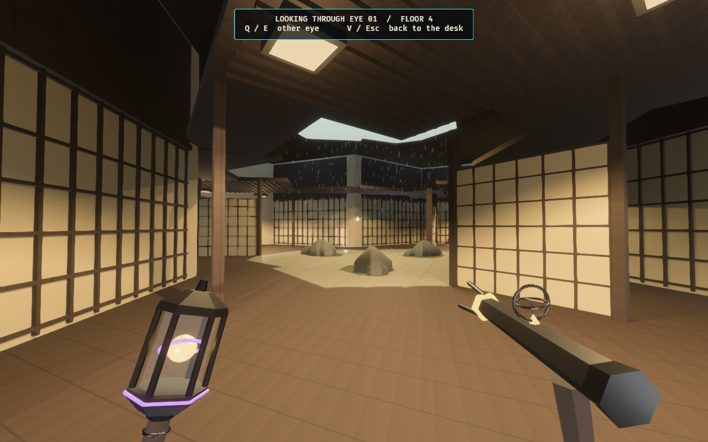
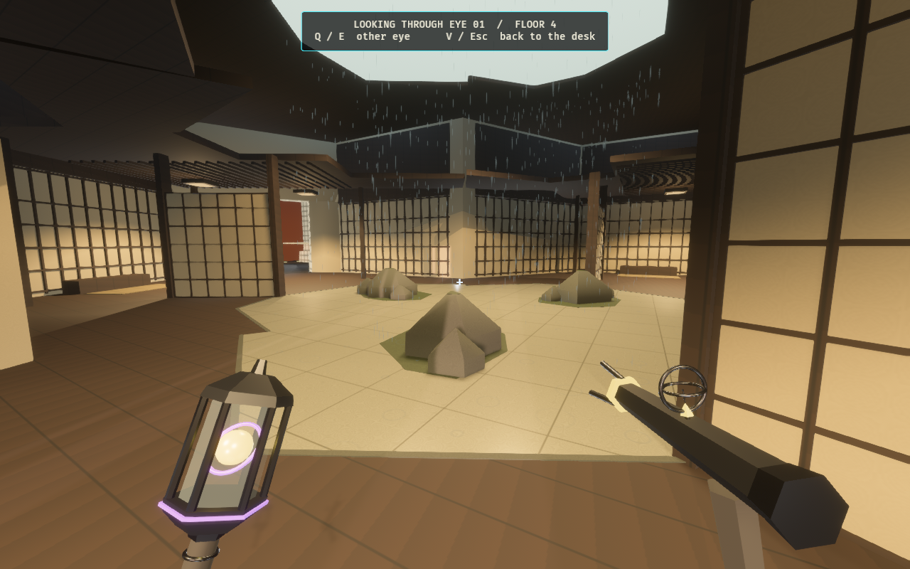
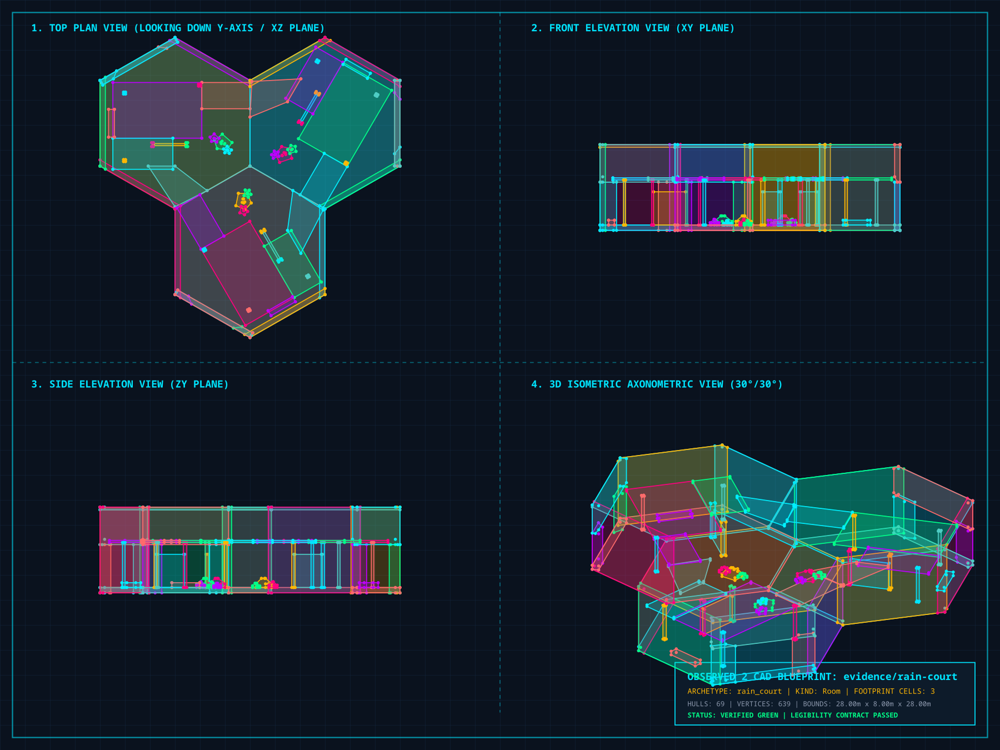

# Rain Court — playable Zen wonder

A real Architect card places three adjoining Zen sectors as one transaction.
The room pairs a sheltered timber veranda with an exposed, continuously paved
rain garden. Opaque paper screens leave real gaps for crossing and observation;
low faceted stones and moss islands frame the garden without requiring jumps.
Zen remains Shadow Screen, displayed floor 4 / level 3 in the eight-floor ascent.

[Research and design](../../rain_court_wonder_proposal.md) includes the official
Katsura Imperial Villa and Teshima Art Museum references and the original schematic.
The production layout follows the quantized hex lattice, with three entrances
separated by 120 degrees and a recessed rain canopy beneath the sealed storey roof.

## Game views

These images come from Architect Ascent after a finite Rain Court card is
selected, previewed and committed through the normal placement rules. Inspection
poses hold the match still. The walkthrough uses the production character
controller and the committed room's actual collision snapshot.





[Covered veranda](architect-rain-veranda-1280x800.png) ·
[Same arrival view without generator power](architect-rain-unpowered-1280x800.png) ·
[Single-card preview and legal placement ghost](architect-play-1280x800.png) ·
[Committed room on the Architect board](architect-built-1280x800.png)

Nine room-owned practical sources illuminate the sectors before entry; the moving
district key is disabled inside the wonder. Generator power controls these
lights and the luminous roof/lantern panels. Unpowered inspection retains the
existing emergency-light fraction and the held lantern. Paper remains opaque
under either lighting state.

## Physical walkthrough


[H.264 walkthrough](rain-walk.mp4): 831 consecutive 1280×800 frames at 30 fps,
lasting 27.7 seconds, encoded as H.264 / yuv420p. The controller completes the
route in 833 capture frames; 831 screenshots flush before exit. It covers the veranda circuit, all three
internal joins, every viewing bay and the central paved crossing. Still images
and this local walkthrough establish the location and its traversal; they are
not a full competitive-match playtest.

## Authored geometry and presentation



[Vector CAD](rain-plan.svg) · [Validated full-room snapshot](rain-plan.map) ·
[Snapshot assembler](assemble_plan.py)

The six production maps come from
`crates/observed_authoring/src/forge/rain_court.rs`, with `register_scope =
shadow_screen` and `rotation_policy = none`. Three exact lattice sectors contain
**69 convex hulls** and **nine practical sources**, within the 128-hull room
budget. Each floor is solid and continuous; both vertical ports remain sealed.
The evidence snapshot assembles the same brushes at their exact production
positions. It is outside the active tile catalog.

`observed_style::rain_court` owns the local cedar, opaque rice paper, wet paving,
stone, moss, tatami and weather palette. Structural visuals use the authoritative
projected hulls. Cedar lattice, moss finishes, drains and slats add no collision.
Ordinary Zen materials and the district progression retain their existing style.

The shell and decorative detail merge into seven material batches per sector.
Rain streaks are deterministic crossed quads in one batch, bounded by the roof
aperture, with shader animation. Impact rings use one shallow garden batch.
Roof and lantern patches follow generator power. These entities belong to the
resident cell, respect cutaways and disappear when it streams out or is rewritten.
Weather material and mesh caches are reset on leaving Hex WFC. No reflection
camera, fluid simulation, observation proxy or new victory predicate is added.

Loyal and Rogue decks each carry one finite Rain Court card where Zen exists.
New card IDs append after the existing content. Placement obeys the existing
floor, occupancy, observation, anchored-body, immutable-structure and atomic
commit protections. The composition profile and ordinary solver demand alphabet
stay unchanged; the catalog and simulation content hashes advance with the new
geometry so mismatched peers refuse the content handshake.

## Reproduce

Use the machine's `CARGO_TARGET_DIR` and avoid overlapping Cargo builds across
worktrees. Begin with an empty capture directory.

```bash
cargo run -p observed_authoring --bin tilec -- gen-tiles
cargo run -p observed_authoring --bin tilec -- build
OBSERVED2_CAPTURE_HEX_WFC_ARCHITECT=/tmp/rain-capture \
OBSERVED2_RAIN_PORTRAITS=1 \
RUST_LOG=warn,observed_game=info cargo dev-run -p observed_game
ffmpeg -y -framerate 30 -i /tmp/rain-capture/rain-walk-%03d.png \
  -c:v libx264 -pix_fmt yuv420p -crf 20 -movflags +faststart \
  docs/evidence/rain-court/rain-walk.mp4
python3 docs/evidence/rain-court/assemble_plan.py
cargo run -p observed_authoring --bin tilec -- validate \
  docs/evidence/rain-court/rain-plan.map
cargo run -p observed_authoring --bin tilec -- render-cad \
  docs/evidence/rain-court/rain-plan.map /tmp/rain-plan.svg
rsvg-convert -w 1800 /tmp/rain-plan.svg -o /tmp/rain-plan.png
cargo fmt --all
cargo dev-clippy
cargo dev-test
cargo test -p observed_match --lib how_much_of_the_hand_is_playable -- --ignored --nocapture
```

The CAD command writes the SVG successfully; its optional JPEG converter needs
Pillow, so this capture uses the installed `rsvg-convert` for the PNG.
Raw walkthrough frames remain outside Git.

## Verification — 2026-10-04

- `cargo fmt --all` and `cargo dev-clippy`: clean, with warnings treated as errors.
- `cargo dev-test`: **2,701 passed, 0 failed, 45 ignored**.
- Production maps: all six validate as strict v2 cells, with 23 hulls and three lights each.
- Full-room evidence snapshot: validated, with three footprint cells, three exterior doors,
  69 hulls, nine lights and a sealed eight-metre storey envelope.
- Controller checks cover all three entrances in both directions, the complete dry circuit,
  and every approach to the central crossing at all six lattice headings.
- Sight rays hit the opaque paper and pass through both screen gaps at every heading.
- Card tests cover Zen restriction, an atomic three-cell physical commit, refused occupied
  siblings, finite loyal/Rogue copies and preservation of earlier card IDs.
- Card thumbnail checks find all three cells at each heading, including orientations that
  would point off the first candidate's lattice edge.
- Lighting tests verify fixed positions before entry, across cell changes and through
  generator power cycles. Weather batches spawn once and despawn with their resident cell.
- Final game capture: complete physical walkthrough; no renderer or shader warnings.
- Local document links, SVG XML, PNG views, MP4 encoding and `git diff --check`: verified.

The catalog contains 266 active modules. Its content hash is
`3f889a409f7de9b777ceec3723ead39f73184f35bcd2a7664c8a046a03cd93d9`;
the profile hash is unchanged. The folded simulation hash is
`b4c366d4f872be71355b40367a462fcf844fd2744ec8ed9a172dc3603ce87fb0`.

The affected ignored hand-availability measurement was run explicitly and completed
in 164.24 seconds. It samples actual legal card choices during live hunts:

| Fixture | Sampled beats | Beats with a playable card anywhere | Beats with a playable card on an Observer floor |
| --- | ---: | ---: | ---: |
| Pocket | 4 | 3 | 3 |
| Quick Climb | 400 | 400 | 396 |
| Full Ascent | 18 | 17 | 17 |
| Deep Stack | 377 | 376 | 376 |

This measurement is evidence, not a balance assertion. The complete extended
instrumentation suite was not run for this location pass.
