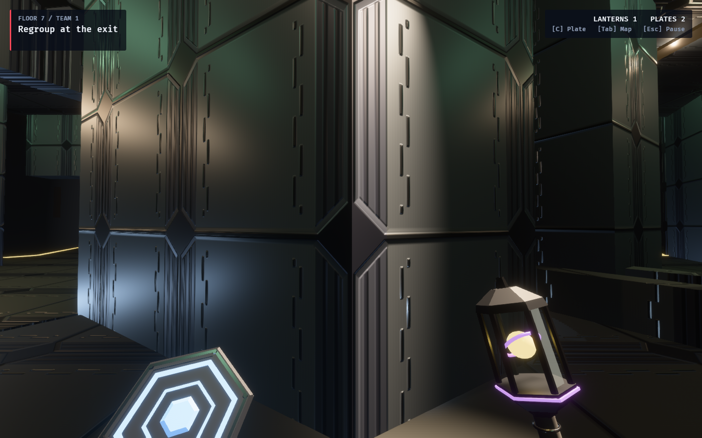

# Reactor district — shared folded-metal finish

The Chargeworks' Forerunner-inspired material now belongs to the whole
Reactor / Megastructure district. Ordinary rooms, corridors and climbing
geometry use the same gray metal plates, chamfered seams, dark blue recessed
ribs, stepped inlays and generated normal-map relief. Roughness is 0.42 and
metallic response is 0.65. The Chargeworks shares the district's exact cached
floor, wall and ceiling material handles, including their card previews.

Electric conveyor fields, canisters, belt markings and machinery remain
specific to the Chargeworks. This changes appearance only; collision,
placement rules, simulation content and the proposed delivery objective are
unchanged. Reactor retains its existing district lighting, fog and practicals.



The screenshot is a regular production WFC tile, not a played wonder. The
surface-tour capture stages the body at q2 r3 on level 6 (displayed floor 7),
holds the pose and lets streaming and lighting settle before saving it.
This is material evidence, not a traversal or objective playtest.

An initial tour exposed Bevy's GPU clustering Z-list growth from 1,024 to
2,048 entries, which can briefly corrupt lighting. The game now reserves at
least 2,048 entries before rendering on supported GPUs; CPU clustering and
headless tests keep their normal configuration. The refreshed tour verifies
that the resize warning is gone.

The paint and relief generator live in the shared `observed_style::reactor`
module. Shared `hex_shell_surface` and `surfaces::surface_images` APIs dispatch
Reactor structural roles to that finish; practical-fixture treatments retain
their existing meanings. Other districts retain their material generators.

Related: [Chargeworks design and future delivery proposal](../../chargeworks_wonder_proposal.md),
[Chargeworks screenshots and electric-field video](../chargeworks/README.md).

## Reproduce

From this checkout, with the machine's `CARGO_TARGET_DIR` set and no other
worktree building in that cache:

```bash
OBSERVED2_CAPTURE_HEX_WFC_SURFACES=/tmp/reactor-metal-capture \
RUST_LOG=warn,observed_game=info cargo dev-run -p observed_game
```

The seven photographed floors include `vista_07_floor_7.png`, the Reactor.
The tour uses the production facility and leaves match topology unchanged.

## Verification

- Focused `cargo test -p observed_style`: 90 passed, zero failed, one ignored.
  Existing coverage verifies image tiling, bounded albedo, normal validity,
  district distinction and nonsignal structural treatments.
- `cargo fmt --all` and `cargo dev-clippy`: passed, with no warnings.
- `cargo dev-test`: 2,685 passed, zero failed, 45 ignored.
- Refreshed seven-floor GPU surface tour: completed with no warnings or errors.
  The Reactor screenshot was visually inspected.
- `git diff --check` and local documentation links: passed.
- Extended `cargo dev-test-all` was not run for this presentation change.
