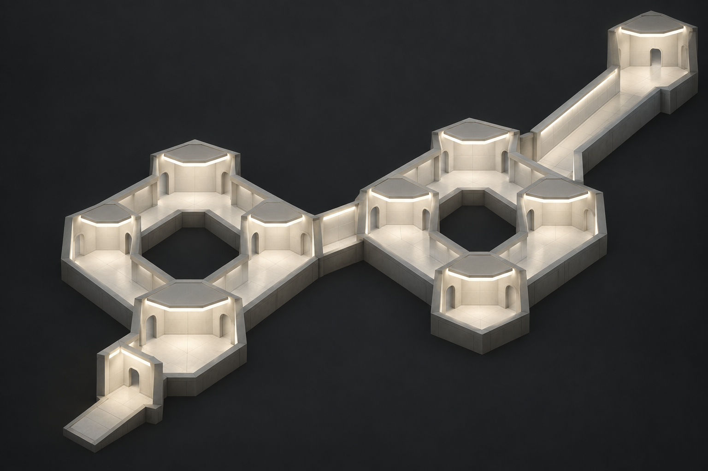
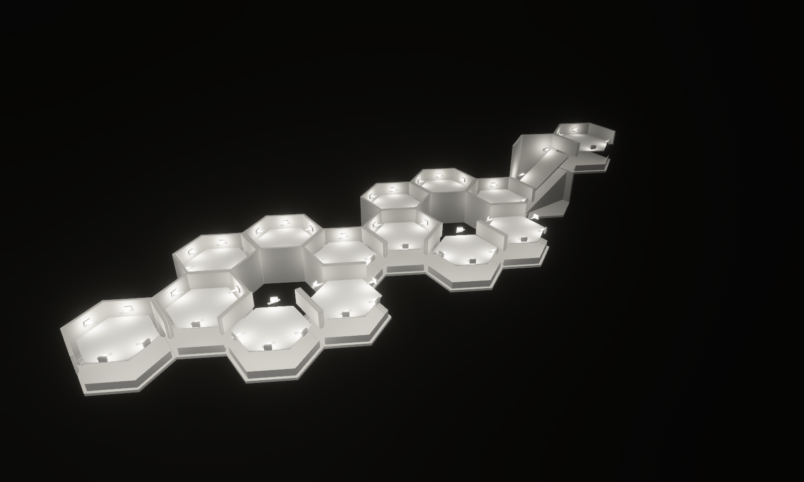
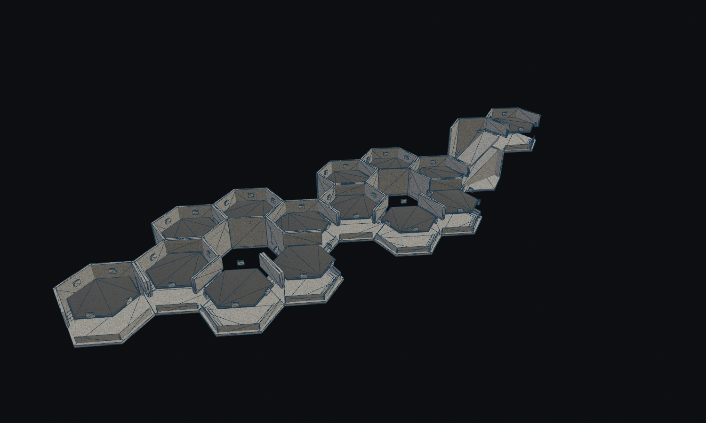
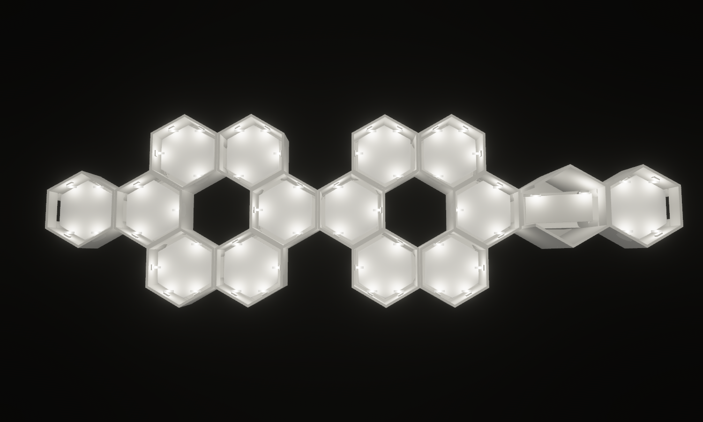
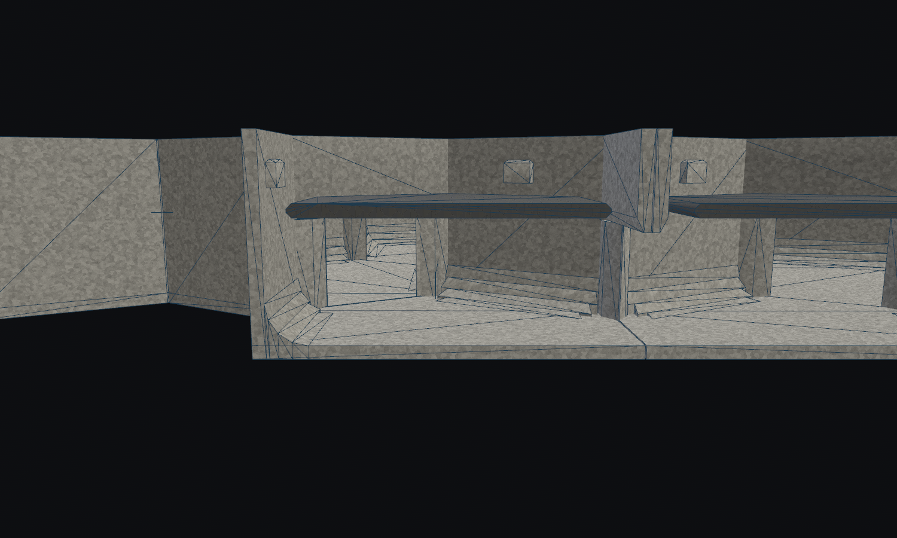
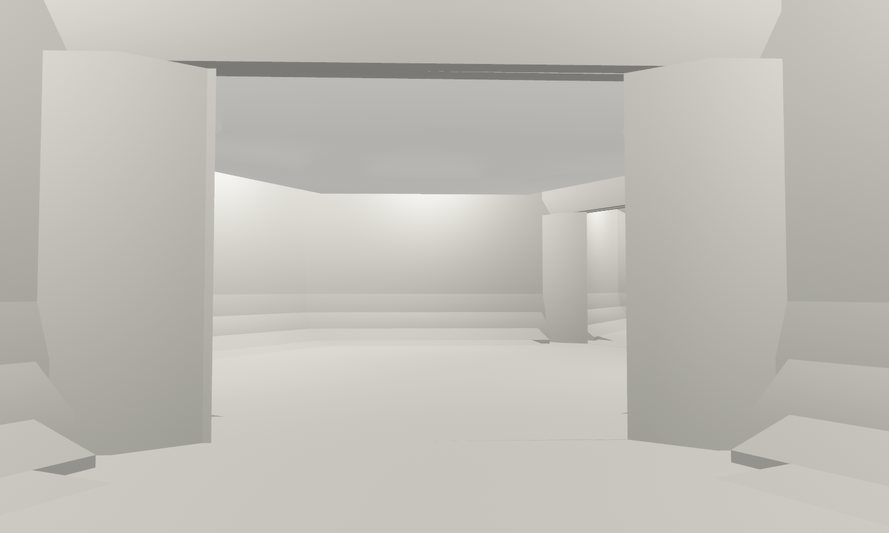
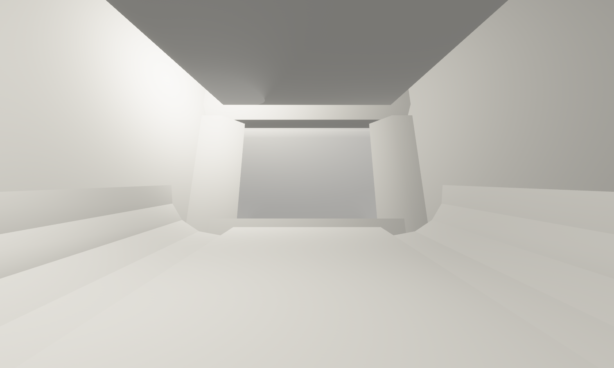

# The Same Door Twice

Concept-to-geometry benchmark, 13 September 2026. District: **The Noon /
Overlit Grid**.

Two nearly identical room circuits make a player question which junction they
have reached. Both routes through each circuit rejoin before the next choice;
an enclosed 8 m ascent leads to the upper continuation. Repeated door profiles,
floor coves and floating ceiling rafts provide few unique landmarks.

The concept was generated **before modeling** with the built-in imagegen tool.
The exact prompt is saved in [prompt.txt](prompt.txt).





The model contains **fifteen placements across two levels**, assembled from
**four new designs providing 24 rotated WFC variants**. Each six-room loop
surrounds an absent hex cell. An entry, an ascent and an upper landing complete
the composition. The ascent reserves a second logical cell for its ramp head:
fifteen placed modules occupy sixteen logical cells.

The geometry captures repeated loops, separate ceiling slabs, concealed practicals
from the sampled walking viewpoint, faceted floor coves and a physical climb.
The concept's diamond-shaped loops have been adapted to six-room hexagonal loops
so each center is an actual unoccupied cell.

The lighting refinement replaces the original blue mineral appearance with
neutral daylight and pale plaster. Visual fidelity remains partial: the concept's
continuous luminous ceiling slots are still represented by discrete concealed
practicals, and the geometry retains four-facet coves and beveled rectangular
doorways. The soft fill is a real-time approximation, not simulated indirect
light transport.





The hero and clay captures use the existing wall-only `half` section: outer roofs
and near-side walls are removed while the floating ceiling rafts remain. Many
broad surfaces visible from above are therefore raft tops, with the walking
floor beneath. The plan removes outer roofs and preserves those rafts as well.
Exposed fixtures in these inspection views normally sit above the raft edges.
These display cuts do not change collision or ports.

| Architect Ascent goal | Architectural provision | Scope |
| --- | --- | --- |
| Observation requires commitment | Enclosed rooms and deep thresholds restrict long views | Geometry; no observation-rule changes |
| Competing routes | Two repeated circuits, each with two paths between forks | Connected authored ports |
| Uncertain orientation | Identical profiles recur at both loops | Architectural repetition; no playtest claim |
| Physical ascent | Enclosed ramp joins floors 8 m apart | Production-controller traversal in both directions |
| District-matched construction | Four designs use demanded Overlit Grid archetypes | WFC candidates; the landmark is hand composed |



The cove inspection uses the existing `half_volume` section to clip floors, walls
and ceiling slabs at one plane. It exposes their construction and the space
between the raft and the outer roof. The fixtures are visible in this cutaway.



The first-person image uses facility lighting without inspection fill or a section
cut. The ceiling raft hides the lamps from this sampled viewpoint; this capture
does not prove concealment from every possible position. It is a stationary lab
view, not a bot walkthrough or an active Architect match. All six view scripts
contain the same complete fifteen-placement layout. No generator rule currently
assembles the entire landmark automatically.

The source of truth is
[forge/noon.rs](../../../crates/observed_authoring/src/forge/noon.rs).
`tilec gen-tiles` emits the four `assets/tiles/authored/noon_*.map` sources;
`tilec build` compiles them into the catalogue. The largest design uses
**33 convex hulls**, within the existing 36-hull cell budget. The lighting refinement below changes the shared Overlit Grid treatment and its
material selection; authored geometry and catalogue identity remain unchanged.

| Source | Runtime selection at turn zero | Role | Hulls |
| --- | --- | --- | ---: |
| `noon_straight` | `hall_straight:900` | Repeated entry and upper landing | 33 |
| `noon_bend` | `hall_turn_120:900` | Coved room turning around a central void | 33 |
| `noon_fork` | `hall_junction_3way:900` | Choice and rejoining points | 30 |
| `noon_ascent` | `hall_ramp:900` | Enclosed 8 m ramp with sloping ceiling raft | 25 |

The [CAD inspection](cove_cad.png) records the actual authored cove geometry.
The catalogue now contains **394 authored sources**. Its hash for these captures is
`7e9145d8e9e0788d4422cf7afbef8de6481f1e4bac08e55a05f2f95fc3f69ba0`.
The composition profile is unchanged.

New validation checks source regeneration, actual WFC demand matching and
**twelve production-controller paths**: ten directed doorway routes and both
ascent directions, without jumping. The assembled-layout test checks all fifteen
placements, matching neighboring ports including the ramp head, connectedness,
and three resets with stable collider counts and spawn.

The source seam audit covers **394 sources and 491,536 compatible boundary
comparisons, with zero height mismatches**. Its compatibility-source vertical
interfaces are not compared; controller traversal and the logical ramp-head
connection are checked separately.

Initial geometry verification: `cargo fmt --all`, `cargo dev-clippy`, `cargo dev-test`, and
`git diff --check` passed. The full workspace suite includes all five district
composition tests, source regeneration, catalogue identity, deterministic
selection, facility traversal and the existing stacked-tower regression.

## Lighting refinement

The [original first-person view](lighting_before/walk.png),
[original overview](lighting_before/hero.png), and
[original plan](lighting_before/plan.png) preserve the benchmark before this pass.
The current room capture uses the same camera and layout as that first-person
baseline, with facility lighting, no headlamp and no inspection fill.

The [capture measurements](lighting_measurements.json) record whole-frame mean
RGB values of `(48, 66, 87)` before and `(191, 189, 182)` after, on a 0–255 scale.
These quantify the brighter, more neutral image; they are display measurements,
not physical illuminance or a gameplay contrast audit.

The Noon's daylight, plaster albedo, fixture emission and bounded surface fill now
live in `observed_style`. The canonical game, Hex Tile Lab and the WFC atlas honor
its plain-surface texture policy. Other districts retain their game materials.
The neutral finish deliberately removes the shared mineral texture and wall weave
from this district rather than attempting to brighten their dark pixels.
The game retains its separate semantic route accents on ramp geometry; the lab's
ascent capture isolates the architectural material and lighting treatment.

The game and facility-lighting preview now share practical intensity, range,
source radius and the normalization for multiple sources in one tile. The Noon
uses a 3,000,000-lumen base budget, modulated by room role and source count, a
14 m range and a 2 m source radius. It remains shadowless even when its fixtures
are nearest to the player and enter the game's shadow budget. Other districts
retain their existing game practical budgets. Radius broadens the specular
response; it does not turn a point light into an area light.

Broad horizontal slabs above door height now receive ceiling material in the
Noon. This gives the suspended rafts their diffuse fill while retaining their
ordinary lit response. They remain visible when outer roofs are removed. The
sloping ascent ceiling is still treated separately by its existing geometry
classification and retains more contrast.



The result is brighter and less blue, with readable thresholds and coves. Bounded
material emission approximates bounced fill under the rafts; this is not baked
lighting or global illumination. The cutaway still exposes the individual fixture
housings and local pools. Continuous luminous strips would require a further
fixture-authoring pass.

New checks cover neutral non-signal materials, per-tile source budgets, overhead
slabs versus shelves/decks/walls, three visual rebuilds with stable entity and
light counts, and the game's shadow-budget behavior when moving between Noon and
Monolith cells.

Lighting verification completed 14 September 2026: `cargo fmt --all`,
`cargo dev-clippy`, `cargo dev-test`, and `git diff --check` passed. The final
workspace run includes the route-accent safeguard, overhead-slab classification,
light reset checks, shadow-budget integration test and stacked-tower regression.
All six view scripts were rendered and visually inspected.

Reproduce from the repository root:

```bash
cargo run -p observed_authoring --bin tilec -- gen-tiles
cargo run -p observed_authoring --bin tilec -- build
OBSERVED2_SCRIPT=docs/compositions/same_door_twice/hero.json cargo dev-run -p hex_tile_lab
OBSERVED2_SCRIPT=docs/compositions/same_door_twice/clay.json cargo dev-run -p hex_tile_lab
OBSERVED2_SCRIPT=docs/compositions/same_door_twice/plan.json cargo dev-run -p hex_tile_lab
OBSERVED2_SCRIPT=docs/compositions/same_door_twice/cove.json cargo dev-run -p hex_tile_lab
OBSERVED2_SCRIPT=docs/compositions/same_door_twice/walk.json cargo dev-run -p hex_tile_lab
OBSERVED2_SCRIPT=docs/compositions/same_door_twice/ascent.json cargo dev-run -p hex_tile_lab
```

Each script saves a settled image and exits.
