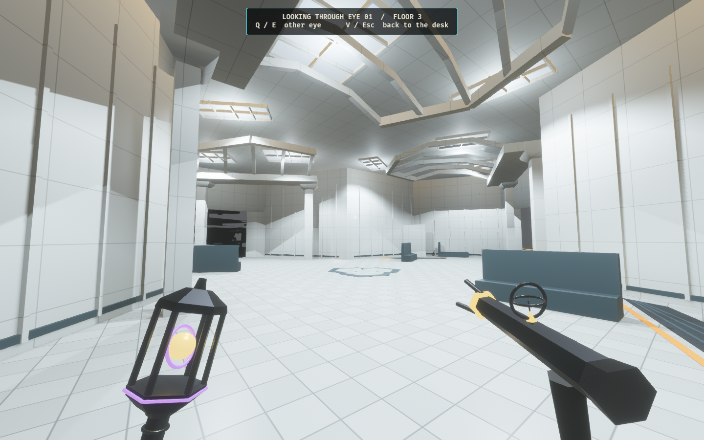
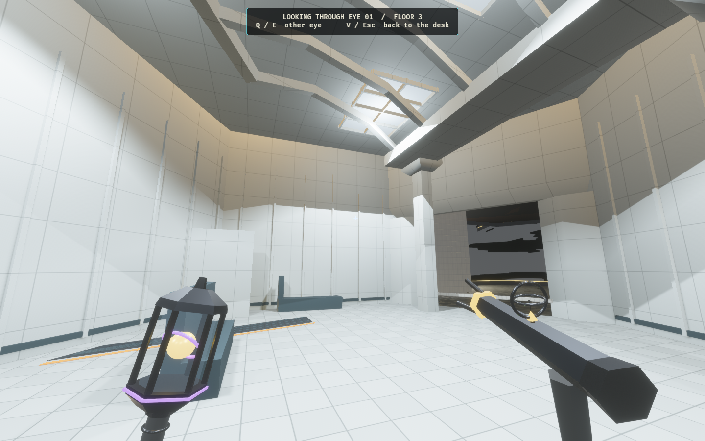
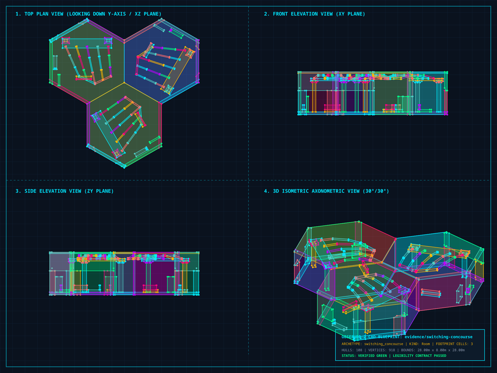

# The Switching Concourse — playable Lumen wonder

A finite Architect card places three Lumen sectors as one transaction on floor
3 / level 2. Five canopy ribs fan across each bay from a header supported by
ceramic piers. A second header joins their outer ends, enclosing luminous coffers
below the sealed storey roof. Dark platform insets, ochre edges, benches and
opaque service fins frame a broad, continuous crossing.

[Research and design](../../switching_concourse_wonder_proposal.md) links the
primary Calatrava and SOM references. This is an original transit interior,
with generated materials and geometry.

## Game views

The stills follow a real card selection, legal preview and atomic physical commit
in Architect Ascent. Inspection poses hold the match still. The walkthrough uses
the production character controller against the committed collision snapshot.





[Platform approach](architect-concourse-platform-1280x800.png) ·
[Same arrival without generator power](architect-concourse-unpowered-1280x800.png) ·
[Single-card preview](architect-play-1280x800.png) ·
[Committed room on the Architect board](architect-built-1280x800.png)

Nine fixed downlights plus room-owned diffuse fills illuminate the hall before
entry. The moving district key is disabled inside it. Existing generator power
controls their emergency-light fraction; the panel finish switches between two
cached materials. Lights retain their positions and shadows across sector changes.

## Physical geometry and traversal

oridinaryoridinaryoridinary

[Vector CAD](concourse-plan.svg) · [Full-room snapshot](concourse-plan.map) ·
[Snapshot assembler](assemble_plan.py)

The six strict v2 production maps come from
`crates/observed_authoring/src/forge/switching_concourse.rs`, scoped to
`overlit_grid`, with exact lattice orientations and no runtime rotation.
Their three-sector composition contains **108 hulls and nine lights**, below the
128-hull room budget. Both vertical faces remain sealed. The evidence snapshot
assembles those same brushes as a legacy room contract outside the active catalog.


The H.264 / yuv420p video contains 602 consecutive 1440×900 frames at 30 fps,
lasting 20.07 seconds. The controller completes its route in 604 capture frames;
602 screenshots flush before exit. The route covers each bay, the platform
circuit and the central joins. Physical
regression checks additionally walk all three entrance bays and crossings
in both directions at all six headings, check opaque service fins and verify the
sealed canopy. These are location and traversal checks; they do not establish
competitive balance in a full match.

## Integration

Loyal and Rogue decks each receive one Lumen-only card where that district exists.
Its ID appends after every existing card. Preview, thumbnail, placement ghost,
map glyphs, physical commit and lab vocabulary recognize the composition.
Existing observation, occupancy, anchor, immutable-structure, prison and collapse
protections apply to the whole placement. Rejection changes no physical cells;
acceptance advances one generation for all three.

Each floor's original generator and its cell stay unchanged. The hall can connect
routes toward that protected room; it does not guarantee generator adjacency.
The existing facility-wide **Darkness** objective is unchanged. The proposed
district-specific **Last Service** Rogue goal is documented only. No new victory rule,
control fixture or power simulation is implemented.

`observed_style::concourse` owns ceramic, platform metal, markings, texture patterns
and light colors. Structural visuals use authoritative hulls. Six material batches
per sector add bounded detail and respect cutaways. Panel entities are children of
the resident cell, so rewrite and streaming remove them. Identical geometry reuses
cached meshes and power changes reuse existing material handles. Ordinary Lumen
finishes and the eight-floor district progression remain unchanged.

The production catalog adds six modules, advancing its content hash and the folded
simulation compatibility hash. The composition profile stays unchanged.

## Reproduce

Use the machine's shared Cargo target directory and avoid overlapping builds.
Begin with an empty capture directory.

```bash
cargo run -p observed_authoring --bin tilec -- gen-tiles
cargo run -p observed_authoring --bin tilec -- build
OBSERVED2_CAPTURE_HEX_WFC_ARCHITECT=/tmp/concourse-capture \
OBSERVED2_CONCOURSE_PORTRAITS=1 \
RUST_LOG=warn,observed_game=info cargo dev-run -p observed_game
ffmpeg -y -framerate 30 -i /tmp/concourse-capture/concourse-walk-%03d.png \
  -c:v libx264 -pix_fmt yuv420p -crf 20 -movflags +faststart \
  docs/evidence/switching-concourse/concourse-walk.mp4
python3 docs/evidence/switching-concourse/assemble_plan.py
cargo run -p observed_authoring --bin tilec -- validate \
  docs/evidence/switching-concourse/concourse-plan.map
cargo run -p observed_authoring --bin tilec -- render-cad \
  docs/evidence/switching-concourse/concourse-plan.map /tmp/concourse-plan.svg
python3 docs/evidence/switching-concourse/finish_cad.py /tmp/concourse-plan.svg
cargo fmt --all
cargo dev-clippy
cargo dev-test
cargo test -p observed_match --lib how_much_of_the_hand_is_playable -- --ignored --nocapture
```

The CAD command generates SVG. Its optional JPEG helper lacks Pillow on this
machine, so the finalizer uses the installed `rsvg-convert` and fits the long
legend without changing geometry. Raw video frames remain outside Git.

## Verification — 2026-10-04

- `cargo fmt --all` and `cargo dev-clippy`: clean; warnings are treated as errors.
- `cargo dev-test`: **2,713 passed, 0 failed, 45 ignored**.
- All six strict production maps validate with 36 hulls and three lights each.
  The full-room snapshot validates with three footprint cells, three exterior
  doors, 108 hulls and nine lights.
- Controller checks cover the platform circuit, central crossings and entrance
  bays in both directions at all six exact lattice headings. Service fins stop
  sight rays and the canopy remains sealed.
- Card checks cover Lumen restriction, finite Loyal/Rogue copies, preserved earlier
  card IDs, complete six-heading previews, atomic physical commit and rejection
  without partial changes. The original generator cells remain unchanged.
- Lighting checks cover fixed positions before entry, across sector changes and
  through generator power cycles. Panel handles switch without allocating new
  materials, and cell removal despawns the panel and reuses cached geometry.
- The final Architect capture completes its real-controller route without renderer
  warnings. PNG views, SVG XML, local document links and H.264 video metadata are
  verified.

The catalog contains 272 active modules. Its content hash is
`92170e3ff9897a94a64a13c9755ec5f5ba87eb8e44a9f2c478d74c2fc71243cd`.
The profile stays at
`7b57da365f6c4de7876cd76adfd985db582d6f1610999c29d89d116739b639d1`;
the folded simulation hash is
`26cb2214cad7f482dccdf9080cb764a692ef07791cd0247a054fd622ce07d61c`.


The affected ignored hand-availability measurement also completed in **163.85
seconds**, sampling real legal card choices during live hunts:

| Fixture | Sampled beats | Beats with a playable card anywhere | Beats with a playable card on an Observer floor |
| --- | ---: | ---: | ---: |
| Pocket | 4 | 3 | 3 |
| Quick Climb | 400 | 400 | 396 |
| Full Ascent | 18 | 17 | 17 |
| Deep Stack | 377 | 376 | 376 |

This is hand-availability evidence, not a balance assertion. The complete extended
instrumentation suite was not run for this location pass.
