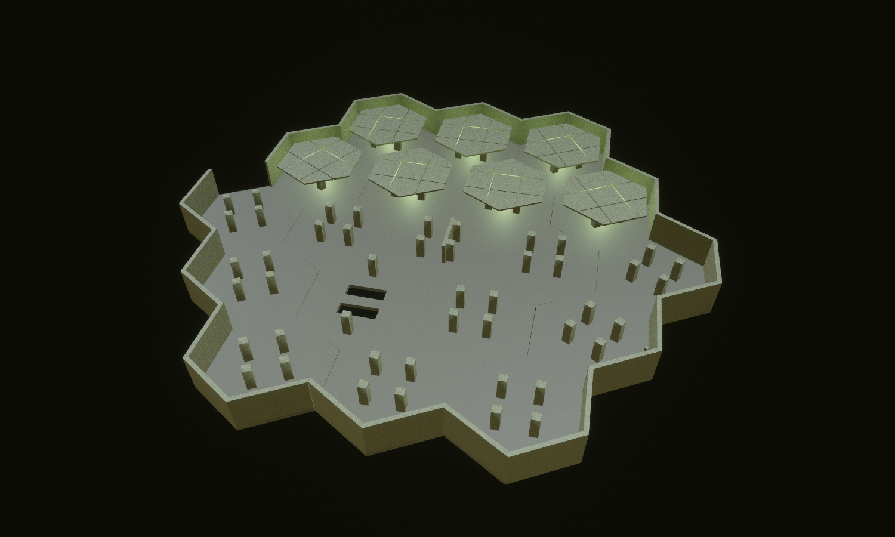

# The Third Light — The Back / Liminal Grid

Concept-to-tile benchmark, 14 September 2026. Six new district-scoped designs compose into **19 hex tiles on one floor** in Hex Tile Lab. A repeated field of plain columns sits beneath low suspended panels; an off-centre partition interrupts sightlines, and a narrow crossing divides a maintenance opening.



The [concept image](concept.png) was generated first with the built-in image generator. Its [exact prompt](prompt.txt) is preserved. The model carries across the compact footprint, repetition, low ceiling, sparse fluorescent rhythm and interrupted circulation. The current shared materials are greener and coarser than the warm cream concept; the ceiling has fewer panel divisions and the columns lack the concept's base and capital detailing. This is a modular geometry benchmark, with further material and ceiling detailing still visible as an art-quality gap.

## Views

- [Hero](hero.png): Lit inspection with shared Liminal Grid surfaces, EV100 7.0. Seven rear suspended ceilings remain; the front ceilings and upper service envelope are removed photographically.
- [Clay](clay.png): the same cutaway with neutral materials and diagnostic mesh edges.
- [Plan](plan.png): complete floor arrangement with ceilings removed.
- [First person](walk.png): full geometry and ordinary facility lighting at default exposure. This is a stationary interior capture, not a traversal recording.
- [Ceiling detail](ceiling.png): an upward interior inspection of the panel joints, rails and fixture housings.
- [Maintenance crossing](cut.png): a 1.5 m strip crosses a genuine 5 m square floor opening.
- [Sightline partition](baffle.png): a 6 m partition offsets the central route while preserving paths around both ends.
- [Ceiling CAD](ceiling_cad.svg) ([PNG](ceiling_cad.png)): the base source's actual convex geometry in four views.

All seven JSON scripts in `docs/compositions/third_light` use the same placement list. Sections only change rendering; collision retains the complete source geometry. The lab now supports an explicit suspended-ceiling cut height and optional rear-roof retention. It also correctly classifies the standard 0.5 m floor slab as a floor surface.

## Reusable sources

The forge is `crates/observed_authoring/src/forge/back.rs`. Generated sources live in `assets/tiles/authored/back_*.map`.

| Source | WFC archetype | Runtime variant, turn 0 | Hulls | Purpose |
| --- | --- | ---: | ---: | --- |
| `back_grid` | `expanse` | 1020 | 28 | Open six-way column field |
| `back_baffle` | `expanse` | 1026 | 29 | Off-centre sightline interruption |
| `back_cut` | `expanse` | 1032 | 30 | Narrow crossing with a perimeter bypass |
| `back_corner` | `hall_junction_3way` | 1020 | 28 | Closed perimeter corner |
| `back_edge` | `hall_junction_4way` | 1020 | 28 | Perimeter edge or broad entrance |
| `back_recess` | `hall_junction_4way` | 1026 | 30 | Shallow peripheral alcove |

All six expand into six rotations scoped to `liminal_grid`: **36 new runtime candidates**. Their signatures match existing production demands. The composition contains **537 authored hull instances, 171 ceiling panels, 74 columns and 57 fixture housings**. One of each tile's three housings has an authored practical source, for **19 sources** before photographic section filtering. Light colour and output remain owned by shared style.

Doorway clearance remains 4 m. Suspended panels have 3 m clearance above the floor, with rails 0.25 m lower. The shared 8 m outer envelope remains above this service space to preserve existing boundary contracts. The largest source has 30 hulls, below the existing 36-hull limit.

This is a hand-composed landmark. WFC can select the individual candidates; no new rule makes it reproduce this exact arrangement. The geometry supports route choice, interrupted observation and an environmental fall hazard relevant to Architect Ascent's kinetic-tool play. It does not add generators, Guardian behaviour, push/pull rules or an ascent connection.

## Validation

- Byte-exact forge regeneration, source compilation and existing production-demand matching for all six designs.
- Production character controller traverses every ordered doorway pair around the columns, partition and opening, without jumping or falling.
- The narrow crossing is walkable in both directions. A stationary body over the adjacent opening falls below the tile, confirming there is no hidden floor.
- Lab layout resolves all 19 placements, matches neighbouring ports, connects the entire floor and resets three times without accumulating collision state.
- Section tests cover front/rear ceiling retention, upper-envelope removal, retained floors and practical filtering.
- The game's legacy Liminal hall-pair check now scopes its weight markers to the original variant IDs. New weight-3 candidates no longer impersonate a legacy pair; district-wide demand coverage remains mandatory.
- Projected-facility seam sampling accounts for the nominal integer hex's 7.2 cm corner offset under a 60-degree rotation. Its horizontal vertex search is 8 cm; the floor-height tolerance remains 5 cm. The seeded production facility's open seams pass.
- Seam audit: **407 sources, 535,095 valid boundary comparisons, zero height mismatches**. This audit compares the sampled outer boundary envelope; it does not measure the actual doorway aperture or compare the legacy vertical interface contracts. Controller traversal supplies separate clearance evidence.

Formatting and Clippy pass without warnings. Combined workspace verification covers **2,098 passed tests and 37 ignored tests**, with no unresolved failures. The final rerun reuses the already-passed, unchanged stacked-tower test; exact commands and audit corrections are recorded in [verification.txt](verification.txt).

The rebuilt catalogue contains 407 sources. Its content hash is `e620f190857c0dbb8728dd4aca238ef196c4972754970369123daf6fb3d4fe06`; the profile is unchanged. The folded simulation hash is `0e08f120c345c229d2052367aeee483ad75fa6a84dbb758ade2fc6ab6bf3938e`. Spectator seed 1 selects a changed candidate digest; both pinned placement counts and both tower selections remain unchanged.

## Reproduce

From the repository root:

```bash
cargo run -p observed_authoring --bin tilec -- gen-tiles
cargo run -p observed_authoring --bin tilec -- build
OBSERVED2_SCRIPT=docs/compositions/third_light/hero.json cargo dev-run -p hex_tile_lab
```

Swap `hero.json` for `clay.json`, `plan.json`, `walk.json`, `ceiling.json`, `cut.json` or `baffle.json`. Each script captures a PNG and exits. A directly launched development binary needs `BEVY_ASSET_ROOT` pointing to `labs/hex_tile_lab`, plus the development dynamic-library search paths.
