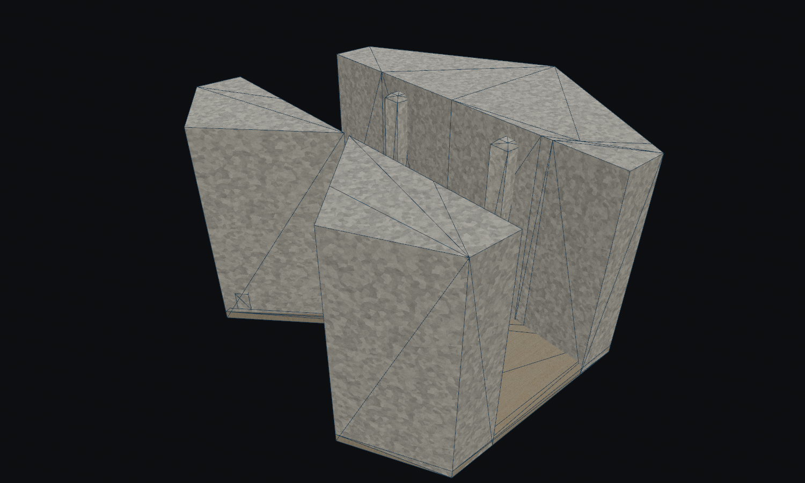
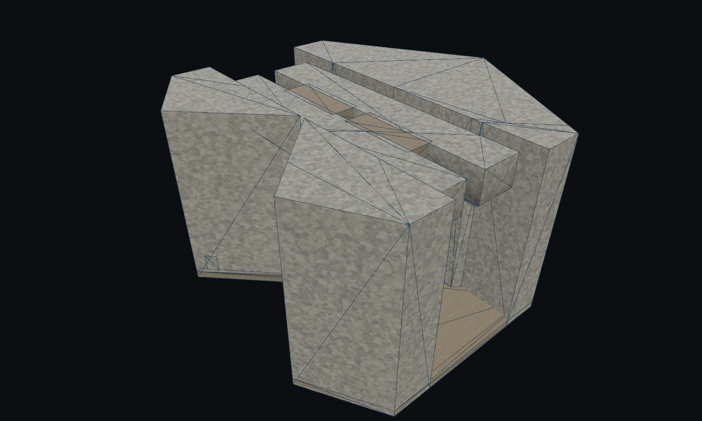
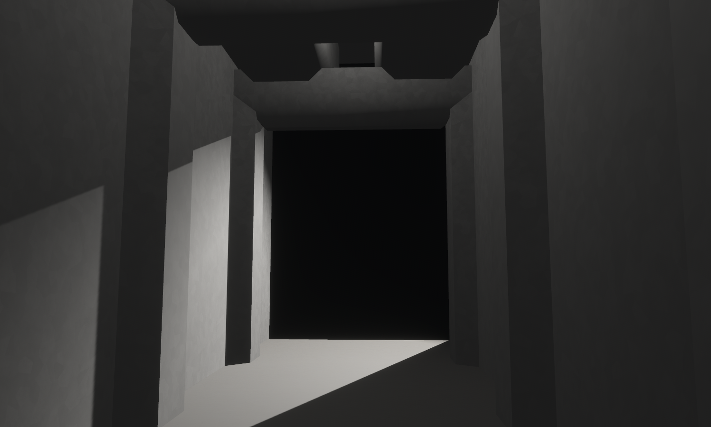
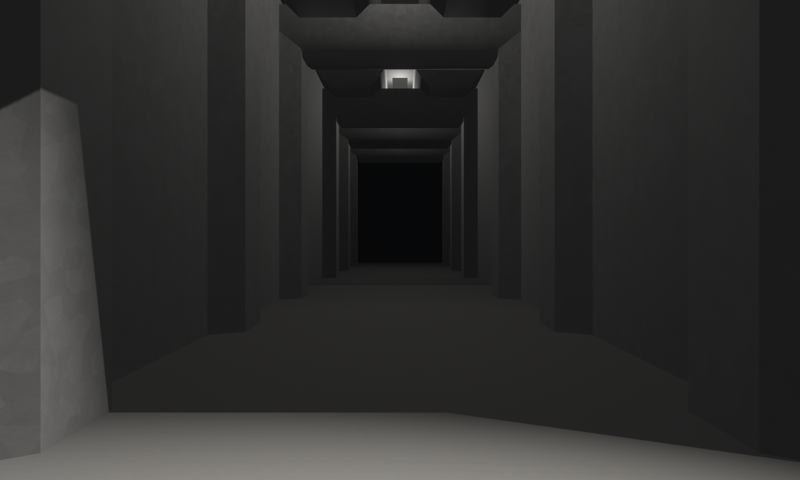
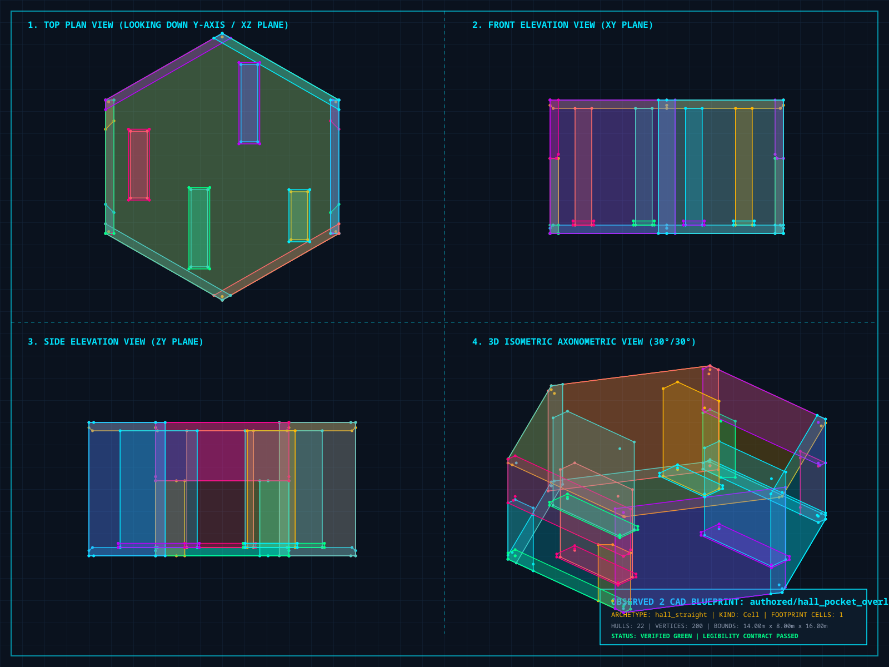

# Lantern Passage — first replacement

The original and replacement use `authored/hall_straight`, variant 0.
The cutaways use the same camera, Monolith register and clay inspection mode.
They were captured after fixing the lab's authored/compatibility selection order.

| Before | After |
| --- | --- |
|  |  |





The joined run uses the production capsule with scripted walking.

The black opening is the end of the single-tile preview, with no neighbour
placed beyond it. This frame checks the passage itself, not a solved facility.
The split ceiling is visible in the eye-level view; the section removes its
outer roof so the supporting structure can be inspected.

The CAD plans show geometry, not game lighting. Their colours distinguish hulls
and carry no gameplay meaning. The `rsvg-convert` renderer produced the PNGs
because the optional JPEG conversion helper lacks Pillow on this host.

Reproduce the replacement captures:

```bash
OBSERVED2_SCRIPT=docs/compositions/tile_curation/section.json cargo dev-run -p hex_tile_lab
OBSERVED2_SCRIPT=docs/compositions/tile_curation/eye.json cargo dev-run -p hex_tile_lab
```

The original capture predates the replacement. Re-running the section script
now renders the new geometry; it will not reconstruct the old source.

The first-pass catalog decision and remaining quality queue are in
[the curation note](../../tile_curation.md).

## The additional retirement found by traversal testing



The partition immediately inside the west opening crosses the straight route.
This module has no local navigation guide around it; the production spectator
stalls there. The CAD footer's automatic “green” label only reflects authoring
validation, **not** successful traversal. That distinction is why the gameplay
regression gate remains necessary after visual inspection.

## Verification

- `cargo fmt --all` and `cargo dev-clippy`: passed.
- Authoring package: all 216 tests passed during `cargo dev-test`, including
  source/forge identity, catalog hashes, retained connection coverage, 36 passage
  traversal cases and exhaustive stacked-stair traversal.
- After updating the intentional horizontal-selection snapshot,
  `cargo dev-test --exclude observed_authoring`: passed for the remaining
  workspace, including both production spectator seeds and lab reset tests.
- `cargo test -p observed_authoring --doc`: passed (no doctests).
- `tilec build`: 332 active modules. The new passage validates at 27 hulls.
- Inspected CAD, matched before/after sections, facility-lighting eye-level
  capture and a three-cell scripted-walk capture.

The initial runs caught an obsolete requirement for two Liminal decorations,
then the pocket B traversal defect and the expected changed selection snapshot.
Those are resolved; no test was disabled to get this result. Existing ignored
long-running surveys remain ignored.
