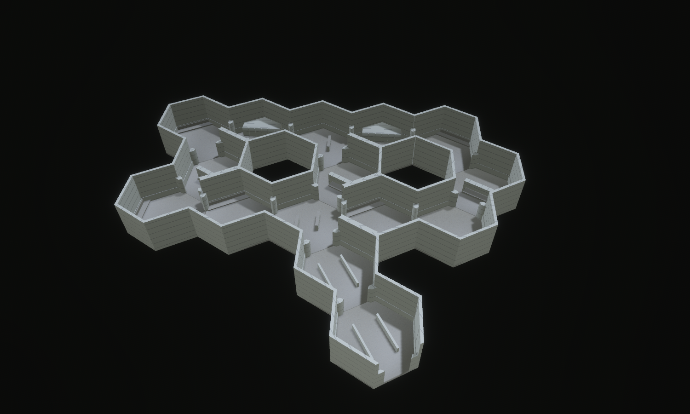

# The Uncalled Number — Institutional

Concept-to-tile benchmark, 15 September 2026. **Eight reusable Institutional
designs compose into fifteen hex tiles**: an admissions approach, a waiting
concourse, three service hatches and a staff passage forming two circulation loops.



The [concept](concept.png) was generated first; its [exact prompt](prompt.txt)
is preserved. The model carries across the low fluorescent ceiling, continuous
wall dado, built-in seating, cabinet banks and repeated reception openings.
The concept has richer materials, more convincing furniture detail and a shorter
entry. The model's hexagonal perimeter is much more evident. These remain visible
art-quality gaps; this is a reusable geometry benchmark, not visual parity.

## Views

- [Overview](hero.png): complete footprint with both ceiling layers removed.
- [Clay](clay.png): matching framing with neutral materials and diagnostic edges.
- [Plan](plan.png): the two loops and three links from above.
- [Counter](counter.png): reception opening, solid counter and adjoining routes.
- [Waiting](waiting.png): built-in seating and low queue partitions.
- [Ceiling](ceiling.png): a selective cut retaining the back passage's low ceiling.
- [Hatch](hatch.png): player-height photograph through the actual air opening.
- [Staff passage](staff.png): player-height photograph under the full ceiling.
- [Reception CAD](reception_cad.svg) ([PNG](reception_cad.png)): authored solids
  in plan, elevations and isometric projection.

All eight scripts in `docs/compositions/uncalled_number` share one placement list.
Inspection views use EV100 5.8, inspection fill and a shadow-casting key. Their
section cuts affect presentation only. The two player-height photographs use
complete geometry and facility lighting, without inspection fill. They are
stationary photographs, not recorded playthroughs.

## Sources and composition

The source of truth is `crates/observed_authoring/src/forge/intake.rs`; generated
maps are `assets/tiles/authored/intake_*.map`.

| Source | Archetype | Runtime variant, turn 0 | Hulls | Placements |
| --- | --- | ---: | ---: | ---: |
| `intake_arrival` | `hall_straight` | 1200 | 21 | 2 |
| `intake_waiting` | `hall_straight` | 1206 | 25 | 2 |
| `intake_service` | `hall_straight` | 1212 | 27 | 2 |
| `intake_junction` | `hall_junction_3way` | 1200 | 24 | 1 |
| `intake_concourse` | `hall_junction_4way` | 1200 | 25 | 1 |
| `intake_reception` | `hall_turn_120` | 1200 | 24 | 3 |
| `intake_turn` | `hall_turn_120` | 1206 | 22 | 2 |
| `intake_elbow` | `hall_turn_60` | 1200 | 22 | 2 |

These sources expand into **48 Institutional-scoped WFC candidates**, with six
rotations per source. The composition contains **355 hull instances and 30
authored practical sources**, on one continuous floor level. The largest new
source has 27 hulls, below the existing corpus ceiling of 36.

The floor surface is at 0.5 m; the lower ceiling soffit is at 5 m, leaving 4.5 m
above the floor. Canonical thresholds retain 4 m standing clearance. Each tile
has two strip-light housings attached to the low ceiling. The shared style owns
their colour and output; this benchmark changes no lighting or renderer code.

Each reception has a five-metre-wide air opening between world heights 1.75 m
and 2.5 m, giving 0.75 m of clear height above the counter. The complete assembly
is offset two metres from the canonical centre spawn. It provides a view while
preventing passage through the counter; walking routes lead around its ends.
Seating is modelled as continuous solid base, seat and back bands. Cabinets are
wall-backed masses with divided fronts. Queue barriers remain low enough to
see over. No active service equipment, signage or furniture interaction is added.

The two missing interior hex positions are outside void pockets enclosed by the
loop, not holes in a tile floor. The entry tail provides the only exterior
continuation. All fifteen placements form one connected network.

This offers alternate approaches, short obstructed views and sightlines through
service openings for the existing exploration and observation goals. Geometry
and controller tests do not prove new Guardian, observation or objective
behaviour. The landmark is hand-composed: its sources are WFC-selectable, but no
solver rule guarantees this exact arrangement.

## Validation

- All eight sources reproduce byte-for-byte and match production demands.
- The production character controller traverses all **30 ordered doorway pairs**
  without jumping or falling off the floor.
- A small collision probe passes through the centre of the hatch opening; a probe
  at the header and a full player capsule at the counter are blocked.
- The lab resolves all fifteen placements, checks mating ports and connectivity,
  and resets three times without accumulating collision state.
- Seam audit: **428 strict sources, 586,986 valid boundary comparisons, zero
  height mismatches**. Vertical compatibility sources without compiled interface
  contracts are reported but not compared; this layout has no vertical ports.

Formatting and Clippy pass without warnings. The full workspace run reports
**2,113 passed, zero failed, 37 existing ignores**, with no filtered tests.
Results are recorded in [verification.txt](verification.txt).

Catalogue hash: `d473785a769222a1fe0a437460ada563b321baeedb35f00dd007353c37e0c5b8`.
Folded simulation hash: `f9428ac14916f0225d8a7bef349cf20f8eb6399b377885f86ead8e42f84e3ab4`.
The composition profile is unchanged. Spectator candidate-selection digests
change with the added content; placement counts and tower selections do not.
The selection test now reports both seed results together when a pin differs.

## Reproduce

```bash
cargo run -p observed_authoring --bin tilec -- gen-tiles
cargo run -p observed_authoring --bin tilec -- build
OBSERVED2_SCRIPT=docs/compositions/uncalled_number/hero.json cargo dev-run -p hex_tile_lab
```

Swap `hero.json` for another named view. Each saves its PNG and exits. Direct
development-binary launches additionally require `BEVY_ASSET_ROOT` pointing at
`labs/hex_tile_lab` and the development dynamic-library search paths.

This completes the [ten-register benchmark series](../district_benchmarks.md).
