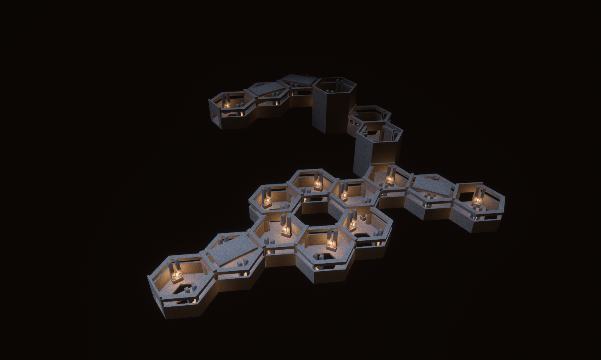

# The Unfinished Crossing — The Unwitnessed / Megastructure

Concept-to-tile benchmark, 14 September 2026. Seven new district-scoped source designs compose into **17 placements, 19 logical cells and three storeys** in Hex Tile Lab. Two suspended ramps gain 16 metres; a lower circuit surrounds an absent cell, while smaller unrailed apertures and a broken cantilever create real fall hazards.



The [generated concept](concept.png) came first; [the exact prompt](prompt.txt) is preserved. The model translates its interrupted circulation, recessed piers, heavy service conduits and suspended climbs into the existing quantized hex grid. It is less dense and less weathered than the concept, with a more exposed chain of upper platforms. This is a verified modular geometry benchmark, not a claim of matching the concept's final art fidelity.

## Inspect the composition

- [Hero](hero.png): roof-off Lit inspection, neutral lab shell materials, EV100 7.7. This is an architectural photograph, not facility lighting.
- [Clay](clay.png): complete geometry with roofs, neutral materials and the lab's diagnostic edges.
- [Plan](plan.png): roof-off clay overview of the ring, branches and staggered climb.
- [Suspended ascent](ascent.png): half-volume architectural section, EV100 9.0. The empty space under the ramp is real; the section only removes presentation geometry.
- [Bridge](crossing.png): 2.25 m unrailed crossing over the tile's open floor.
- [Broken cantilever](break.png): the floor ends inside the cell, away from the two valid doorways.
- [First person](walk.png): full geometry, shared Megastructure materials, ordinary facility lighting and default exposure. The current district remains dark and warm compared with the cool concept.
- [Ramp CAD](ascent_cad.svg) ([PNG](ascent_cad.png)): the source's actual convex geometry in four views.

All seven JSON scripts in `docs/compositions/unfinished_crossing` contain the same placement list. The lab renders those authored modules with its standard surface and practical-fixture presentation; no section modifies collision.

## Reusable sources

The forge is `crates/observed_authoring/src/forge/unwitnessed.rs`. Generated sources live under `assets/tiles/authored/unwitnessed_*.map`.

| Source | WFC archetype | Runtime variant, turn 0 | Hulls | Purpose |
| --- | --- | ---: | ---: | --- |
| `unwitnessed_gallery` | `hall_turn_120` | 960 | 30 | Navigable ring around an open centre |
| `unwitnessed_crossing` | `hall_straight` | 966 | 31 | Narrow bridge with open space on both sides |
| `unwitnessed_gate` | `hall_straight` | 960 | 26 | Roofed threshold between exposed routes |
| `unwitnessed_fork` | `hall_junction_3way` | 960 | 26 | Branch choice and space to retreat |
| `unwitnessed_arrival` | `hall_turn_120` | 966 | 26 | Upper landing and change of direction |
| `unwitnessed_break` | `hall_turn_60` | 960 | 25 | Connected corner with a terminated side cantilever |
| `unwitnessed_ascent` | `hall_ramp` | 960 | 28 | Thin 8 m climb with walkable air below |

The ramp keeps a base floor to satisfy the existing Ramp floor contract; its inclined slab is only 0.5 m thick, leaving traversable space beneath the upper end. The cantilever and ring apertures have no hidden floor.

Each source expands to six rotations in `megastructure`: **42 new runtime candidates**. All match existing production geometry demands. The source hull maximum is 31, below the existing 36-hull ceiling. The rendered arrangement uses 475 authored hull instances and 34 authored practical sources.

The complete landmark is hand-composed. The WFC may select these constituent tiles in Megastructure cells; no new rule makes it reproduce this exact landmark. The benchmark supplies architectural choices relevant to Architect Ascent—commitment, retreat and height exposure—without adding observation, falling or Rogue-conversion rules.

## Validation

- Byte-exact forge regeneration and strict source parsing for all seven designs.
- Production character controller traverses every ordered door pair, the ring navigation and narrow bridge, and both directions of the suspended ascent, without jumping.
- A controller route beneath the ramp verifies that it is a thin slab rather than a solid wedge.
- Driving beyond the cantilever drops the body below the tile. Its terminating west face has no declared exit; the two actual doorways remain walkable.
- Lab layout resolves every placement, matches adjacent ports including the two logical RampHeads, connects all three storeys and resets three times without accumulating collision state.
- Source seam audit: **401 sources, 505,515 valid boundary comparisons, zero height mismatches**. The audit does not compare the legacy vertical interface contracts; ramp traversal and the layout's RampHead checks are separate evidence.
- `cargo fmt --all`, `cargo dev-clippy` and `cargo dev-test` pass. The complete workspace run reports 2,093 passed tests and 37 ignored tests, with zero failures or warnings. `git diff --check` also passes.

The rebuilt catalogue contains 401 sources. Its content hash is `979edfc624eac36c8a2273d01c76bb483b2c545bbf189ba3be58d096859603cc`; the profile is unchanged. The folded simulation hash is `f714af331e449a5f3dd8161c06f80fe54785c00f8ae48b036d213e500f5ba5d5`. Spectator selection digests were updated for the added candidates; placement counts and tower selection remain pinned unchanged.

## Reproduce

From the repository root:

```bash
cargo run -p observed_authoring --bin tilec -- gen-tiles
cargo run -p observed_authoring --bin tilec -- build
OBSERVED2_SCRIPT=docs/compositions/unfinished_crossing/hero.json cargo dev-run -p hex_tile_lab
```

Swap `hero.json` for `clay.json`, `plan.json`, `ascent.json`, `crossing.json`, `break.json` or `walk.json`. Each capture saves its PNG and exits. A directly launched development binary needs `BEVY_ASSET_ROOT` pointing to `labs/hex_tile_lab`, plus the development dynamic-library search paths.
