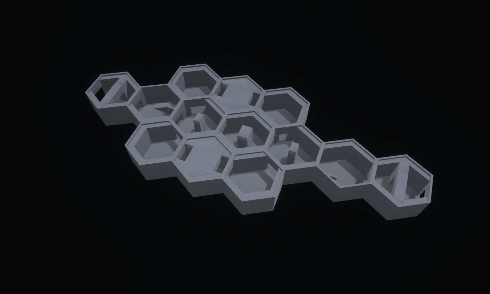

# The Weight Between — Monolith

Concept-to-tile benchmark, 15 September 2026. **Seven reusable Monolith designs
compose into thirteen hex tiles**, with a central procession, two bypass loops,
and two solid ramps leading to viewing terraces 2.5 metres above the main floor.



The [concept](concept.png) was generated first using the built-in image generator;
the [exact prompt](prompt.txt) is preserved. The model translates its heavy piers,
compressed passages and ramped overlooks into the existing production grid.
The model keeps more perimeter wall than the concept, and its repeated hexagonal
envelope is more evident. It does not reproduce the concept's surface weathering
or carefully localised light washes. These remain visible art-quality gaps.

## Views

- [Overview](hero.png): complete footprint with the outer roofs removed; the low
  bore ceilings remain so their solid depth is visible.
- [Clay](clay.png): matching framing, neutral materials and diagnostic mesh edges.
- [Plan](plan.png): the same layout from above, with the cut lowered to 4.4 m
  to remove low ceilings, lintels and their fixture housings too.
- [Cutaway](cutaway.png): a lower camera and sectional removal of near masses.
  This is a presentation cut, not missing physical walls.
- [Central masses](mass.png): the main pier and its smaller neighbouring piers.
- [Terrace](terrace.png): the solid ramp, landing and thick front/end parapets.
- [From the overlook](overlook.png): a stationary first-person photograph with
  the complete roof and facility lighting.
- [Bore](bore.png): stationary first-person view along a compressed side passage.
- [Pier](pier.png): stationary first-person approach to the central mass.
- [Overlook CAD](overlook_cad.svg) ([PNG](overlook_cad.png)): the authored convex
  solids in plan, elevations and isometric projection.

All nine scripts in `docs/compositions/weight_between` share the same placement
list. Inspection captures use EV100 5.5 and a shadow-casting inspection key.
First-person captures use facility lighting and the full geometry. They are
photographs, not recorded playthroughs.
The first-person views retain deep shadows and show a narrower useful view from
the terrace than the concept suggests; the lab overview is an inspection image,
not a claim that the facility is evenly lit during play.

## Sources and composition

The source of truth is `crates/observed_authoring/src/forge/weight.rs`; generated
maps are `assets/tiles/authored/weight_*.map`.

| Source | Archetype | Runtime variant, turn 0 | Hulls | Role |
| --- | --- | ---: | ---: | --- |
| `weight_pier` | `hall_straight` | 1140 | 19 | One 3 × 4 m floor-to-ceiling mass splitting circulation |
| `weight_gate` | `hall_straight` | 1146 | 20 | Deep portal beneath a heavy crosspiece |
| `weight_bore` | `hall_straight` | 1152 | 20 | Passage carved between two solid shoulders under a low ceiling |
| `weight_overlook` | `hall_straight` | 1158 | 20 | Solid ramp, elevated landing and parapets |
| `weight_fork` | `hall_junction_4way` | 1140 | 21 | Smaller central pier at a four-way decision |
| `weight_turn` | `hall_turn_120` | 1140 | 19 | Broad turn with a deep wall-backed shoulder |
| `weight_elbow` | `hall_turn_60` | 1140 | 19 | Tight turn with the same heavy envelope |

The seven sources expand into **42 district-scoped runtime candidates**. Every
signature matches a production WFC geometry demand. The composition contains
**257 hull instances and 22 authored practical sources**, with a maximum of
21 hulls per new source, below the existing corpus ceiling of 36.

The central seven-tile route is gate → overlook → fork → pier → fork → overlook
→ gate. Each three-tile bypass connects the two forks through a low bore. All
thirteen floors are continuous; all external thresholds retain the standard
4.5 m width and 4 m standing clearance. Thickened sealed walls and internal
masses stay inside the canonical footprint.

Each overlook rises from a 0.5 m floor surface to a 3 m landing along a 5 m-long
solid ramp. The 3 × 2 m landing has a one-metre-high parapet along its front and
end. The two overlooks face opposite sides of the procession. They remain
inside one storey, with no new vertical port or ascent mechanic. The main
door-to-door route stays on the ground; climbing is an optional detour.

This layout offers movement around opaque masses, changes between compressed
and tall spaces, and elevated views toward neighbouring thresholds. Those are
geometric affordances for exploration and observation, not new observation,
Guardian or objective rules. Controller tests prove access to the terraces;
they do not claim autonomous bots will choose to use them. Floor-level deck
annotations guide traversal around the piers.

The landmark is hand-composed. Its sources are selectable by WFC, but no new
solver rule guarantees this exact thirteen-tile arrangement.

## Shared lighting correction

Monolith's authored material describes neutral concrete, but its inherited
Reactor palette coloured the surface blend, fog and practical lights amber.
The shared `observed_style::architecture` palette now uses a neutral structural
accent, near-white practical/key lights and restrained cool ambient/fog. Its
existing light intensities, hard-shadow key and high concrete roughness remain.
Signal-tier treatments are unchanged. This correction applies in the game and
lab; it is not a private screenshot material override.

## Validation

- All seven sources reproduce byte-for-byte and match production demands.
- The production character controller traverses all **24 ordered doorway
  pairs** through the bores and around the piers without jumping or falling.
- The same controller climbs onto the overlook, reaches its landing and returns
  to the main floor without jumping.
- The lab resolves all thirteen placements, checks adjacent ports and connected
  routes, and resets three times without accumulating collision state.
- The neutral Monolith treatment has a regression check for lighting hue,
  concrete roughness, hard shadows and structural emission below signal levels.
- Seam audit: **420 strict sources, 566,580 valid boundary comparisons, zero
  height mismatches**. Vertical compatibility sources without compiled interface
  contracts are reported but not compared by this audit; this composition has
  no vertical connections.

Formatting and Clippy pass without warnings. The full workspace run reports
**2,109 passed, zero failed, 37 existing ignores**, with no filtered tests.
Results are recorded in [verification.txt](verification.txt).

Catalogue hash: `2e999aa7a3cba6e7d25d9ae2d653ce2912d8c6116524055052fa1d089abfea70`.
Folded simulation hash: `4d5b6f711b26bc823824cc6848f184ed1c59e2337920a5cbfcff3fd9a22856a4`.
The composition profile is unchanged. Spectator candidate-selection digests
change with the additional content; placement counts and tower selections do not.

## Reproduce

```bash
cargo run -p observed_authoring --bin tilec -- gen-tiles
cargo run -p observed_authoring --bin tilec -- build
OBSERVED2_SCRIPT=docs/compositions/weight_between/hero.json cargo dev-run -p hex_tile_lab
```

Swap `hero.json` for another named view. Each saves its PNG and exits. Direct
development-binary launches additionally require `BEVY_ASSET_ROOT` pointing at
`labs/hex_tile_lab` and the development dynamic-library search paths.
