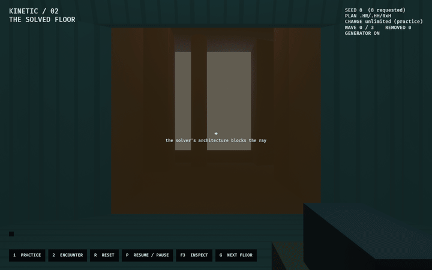

# WFC Kinetic — the solved floor

Evidence for [`labs/wfc_kinetic_lab`](../../../labs/wfc_kinetic_lab/README.md).

The floor is seven cells of a real solve of the production tile catalogue, at
seed 8: two rooms, five halls, and two cells the collapse declined to build.
142 projected hulls.

| | |
|---|---|
| [floor.png](floor.png) | Where an Observer stands up, facing the way out |
| [retraction.png](retraction.png) | The tile control, mid-warning |
| [doorway-shove.png](doorway-shove.png) | A minor bracketed in a doorway that no longer leads anywhere |
| [walkthrough.gif](walkthrough.gif) | All five staged scenes |

## The finding

A solved floor offers **zero** faces a body can be shoved through. Every face
onto void comes back parapeted — clear at eye height, walled from the floor to
about 1.2 m — and the solver never points a door at a cell it declined to build.

The only drop is one the Architect makes. Retracting a tile leaves the doorways
into it opening onto nothing, and those are floor-level and shovable because
they were thresholds between two built cells a moment earlier. The recording's
last scene is a minor committed to void through one of them.

[verification.txt](verification.txt) is generated by the capture run and records
every event and the final digest of each scene.
