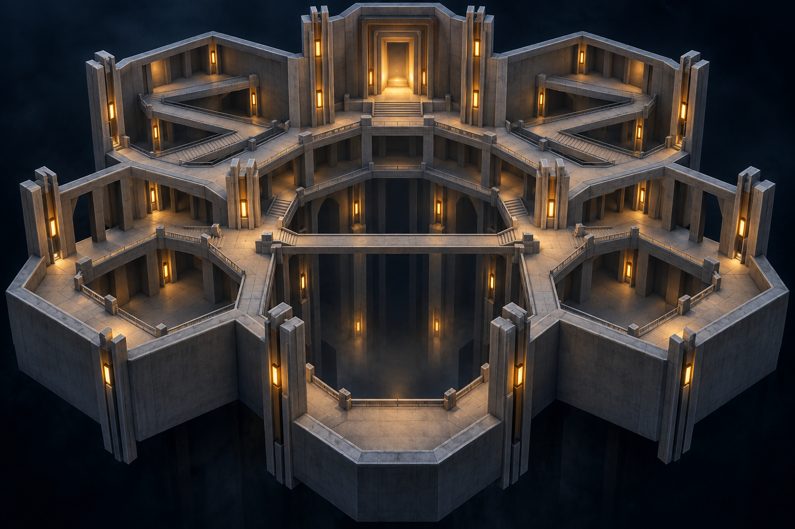
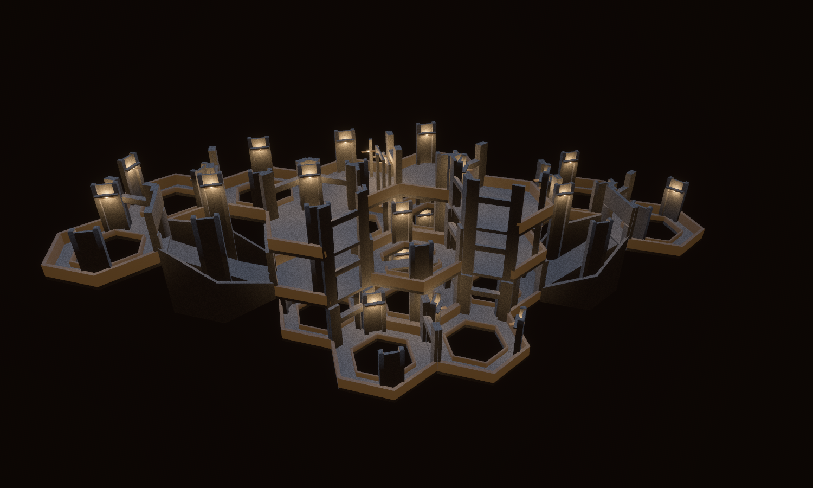
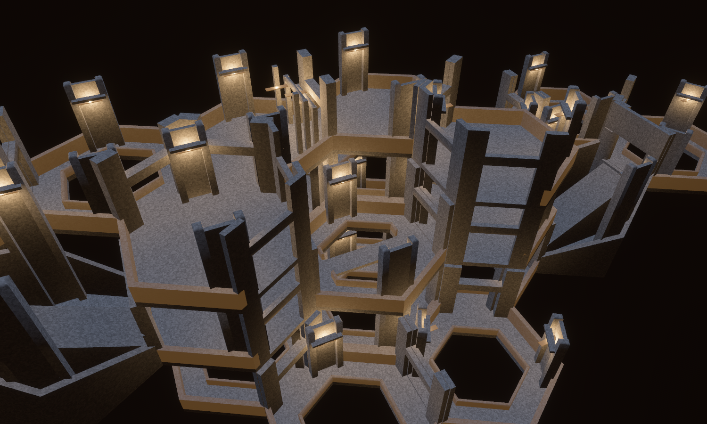
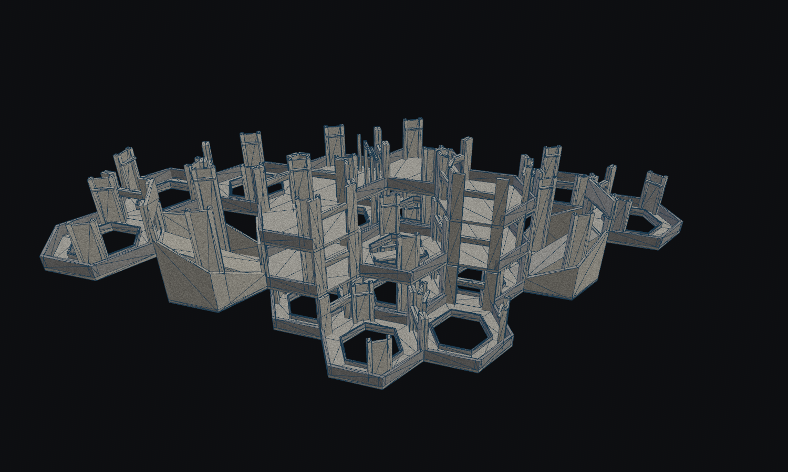
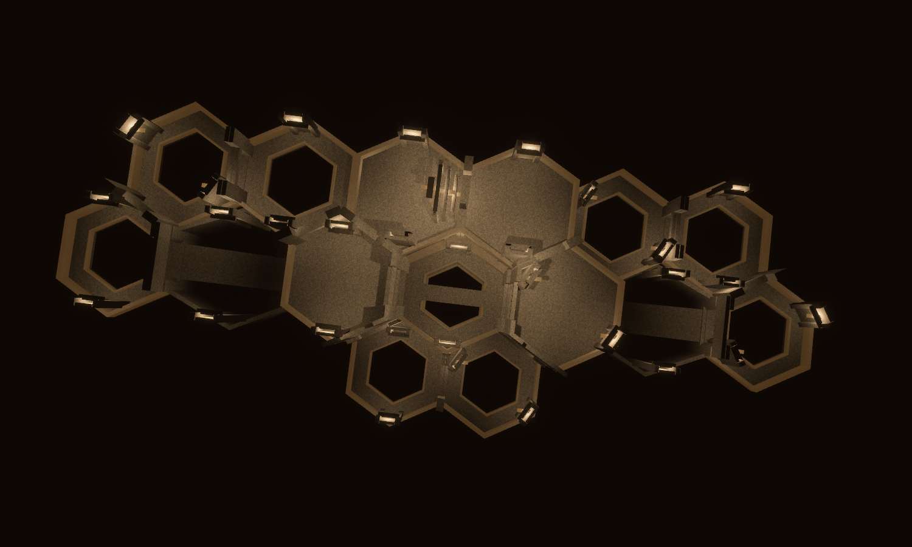
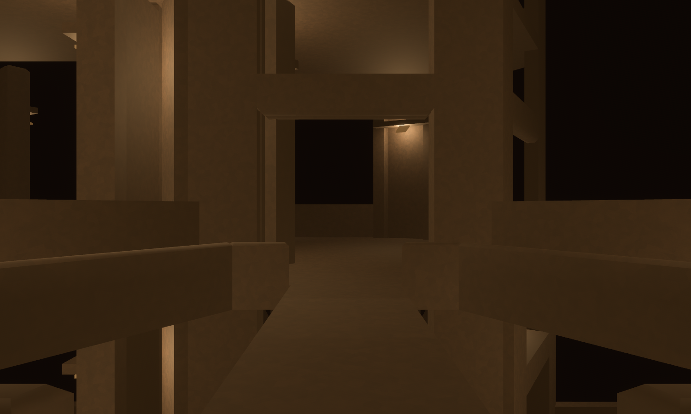

# The Witness Exchange

Concept-to-geometry benchmark, 12 September 2026. District: **The Well / Wellshaft**.

The concept was generated first with the built-in imagegen tool, then reconstructed
using the repository's convex-brush forge and rendered in `hex_tile_lab`.
The exact generation instructions are in [prompt.txt](prompt.txt).





The result is a working modular reconstruction with **partial visual fidelity**.
It retains the open wells, exposed crossing, tiered observation galleries, paired
piers, warm practicals, and nested doorway. The refinement replaces five upper
ring galleries with solid terraces, giving the central crossing more space. The
gateway faces into the chamber and carries light within its nested frames.
Compared with the [first pass](first_pass.png), the upper decks form a clearer
surround, but the concept's monumental central space remains a modeling gap.
The practical lights are
horizontal fixtures, rather than the concept's vertical light strips. These are
visible differences in the benchmark, not features supplied by the concept image.

The seven-cell chamber has two external ramp circuits. Those circuits adapt the
imagined switchbacks to the existing WFC ramp rule: enter one side and exit the
opposite side one storey higher. The front galleries stop at the lowest level and
the central well has no upper deck, exposing the middle-level bridge. There are
**24 module placements across three levels and 15 horizontal hex positions**.



| Architect Ascent goal | Authored affordance | Scope of this proof |
| --- | --- | --- |
| Mutual observation | Open atria, low inner parapets, windows above thresholds | Sightlines and physical geometry; no observation simulation added |
| Consequential traversal | 2.25 m unrailed bridge, open drops, two 8 m ascents | Production controller collision and navigation tests |
| Rescue and cooperation | Layered gateway on the upper rear gallery, reached through the climbing route | Architectural approach only; no prison immunity, door equipment, or rescue mechanic added |
| Architect card placement | Fifteen Wellshaft-scoped designs using existing demanded archetypes | Catalogue candidates available to WFC; this particular arrangement is hand composed |







The overview uses the lab's inspection lighting and plan section. It is a geometry
review image. The first-person image enables `facility_lighting`, including the
production palette, fog, and absence of a headlamp. No actors, gameplay effects,
or postprocessed paint-over are present in these lab captures.

The source of truth is [forge/witness.rs](../../../crates/observed_authoring/src/forge/witness.rs).
`tilec gen-tiles` emits the fifteen `assets/tiles/authored/witness_*.map` sources;
`tilec build` emits the catalogue and hash. Each module expands to six rotations
in Wellshaft, giving 90 runtime variants. The maximum new tile cost is 34 convex
hulls against the existing 36-hull cell budget. The composition profile is unchanged.
The catalogue and combined simulation hashes change because collision content changed.

| Source | Runtime selection at turn zero | Purpose |
| --- | --- | --- |
| `witness_bridge` | `hall_straight:660` | Straight crossing over a real hole |
| `witness_straight` | `hall_straight:666` | Ring circulation around an open well |
| `witness_balcony` | `hall_turn_120:660` | Corner gallery |
| `witness_elbow` | `hall_turn_60:660` | Tight return landing |
| `witness_junction` | `hall_junction_3way:660` | Three connected gallery approaches |
| `witness_crossroads` | `hall_junction_4way:660` | Branch from the chamber to an ascent |
| `witness_return_fan` | `hall_junction_4way:666` | Eastern upper return |
| `witness_return_pairs` | `hall_junction_4way:672` | Western upper return |
| `witness_gate` | `hall_turn_120:666` | Nested rescue-approach reveal |
| `witness_ascent` | `hall_ramp:660` | Roofless full-storey climb |
| `witness_terrace_corner` | `hall_turn_120:672` | Solid upper corner terrace |
| `witness_terrace_junction` | `hall_junction_3way:666` | Solid three-way terrace |
| `witness_terrace_crossroads` | `hall_junction_4way:678` | Solid terrace with ascent branch |
| `witness_terrace_fan` | `hall_junction_4way:684` | Solid eastern upper return |
| `witness_terrace_pairs` | `hall_junction_4way:690` | Solid western upper return |

The layout test resolves every placement, checks all neighboring port classes
(including the solver's logical ramp heads), proves the three-level graph is
connected, and rebuilds it three times to check collider counts and spawn reset.
Controller tests cross all 96 directed doorway pairs on the fourteen flat modules
without falling, and climb the ascent without jumping. The geometry is not a
guarantee that a random WFC seed will assemble the pictured chamber.

Seam validation passes across all 369 catalogue sources: **436,645 compatible
boundary comparisons, zero height mismatches**. The seam tool does not compare the compatibility
ramp's vertical interface; the controller climb and explicit ramp-head layout
checks provide separate evidence for it.

Final verification: `cargo fmt --all`, `cargo dev-clippy`, and `cargo dev-test`
completed successfully. The workspace suite includes source reproducibility,
controller traversal, composition connectivity and reset, production catalogue
selection, and actual seams in a projected facility. The selection and content
hash pins were updated for the added catalogue candidates. All six capture
scripts produced images, and their composition layouts match the tested hero.

Reproduce the captures from the repository root:

```bash
cargo run -p observed_authoring --bin tilec -- gen-tiles
cargo run -p observed_authoring --bin tilec -- build
OBSERVED2_SCRIPT=docs/compositions/witness_exchange/hero.json cargo dev-run -p hex_tile_lab
OBSERVED2_SCRIPT=docs/compositions/witness_exchange/clay.json cargo dev-run -p hex_tile_lab
OBSERVED2_SCRIPT=docs/compositions/witness_exchange/plan.json cargo dev-run -p hex_tile_lab
OBSERVED2_SCRIPT=docs/compositions/witness_exchange/bridge.json cargo dev-run -p hex_tile_lab
OBSERVED2_SCRIPT=docs/compositions/witness_exchange/chamber.json cargo dev-run -p hex_tile_lab
OBSERVED2_SCRIPT=docs/compositions/witness_exchange/gate.json cargo dev-run -p hex_tile_lab
```

The view scripts take a settled screenshot and exit. All their geometry is drawn
from the compiled catalogue, and their layout is checked by
`witness_exchange_resolves_mates_connects_and_resets`. The single bridge's
[CAD inspection](bridge_cad.png) records its real open shaft and crossing collider.

The [gateway detail](gate.png) shows its three lit frames. The strongest result
is translating an image into reusable, traversable WFC content. The refinement
improves the arrangement, while the concept's scale and central-space hierarchy
remain stronger than the modeled scene.
