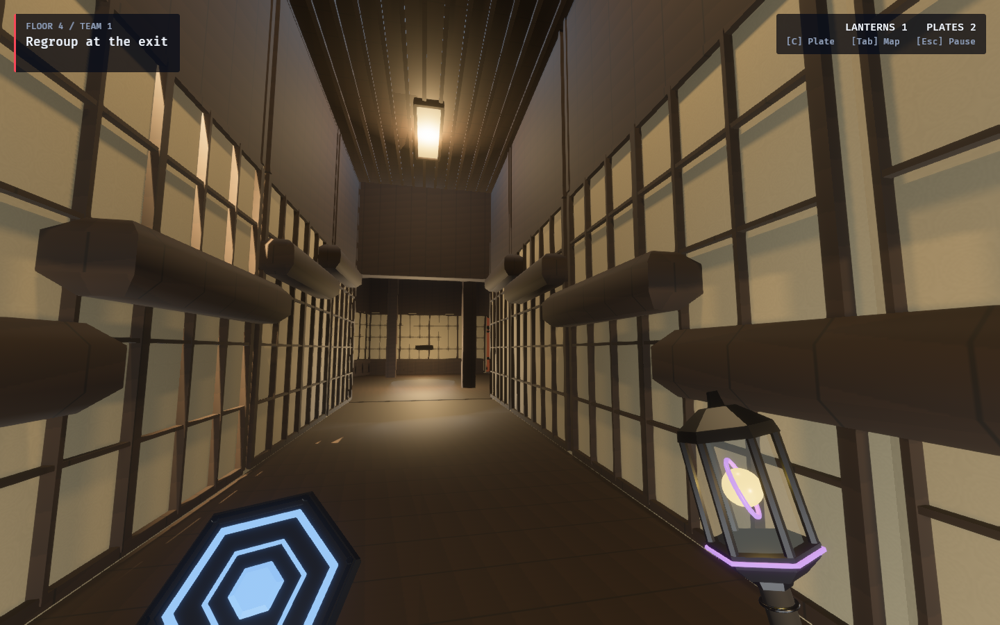
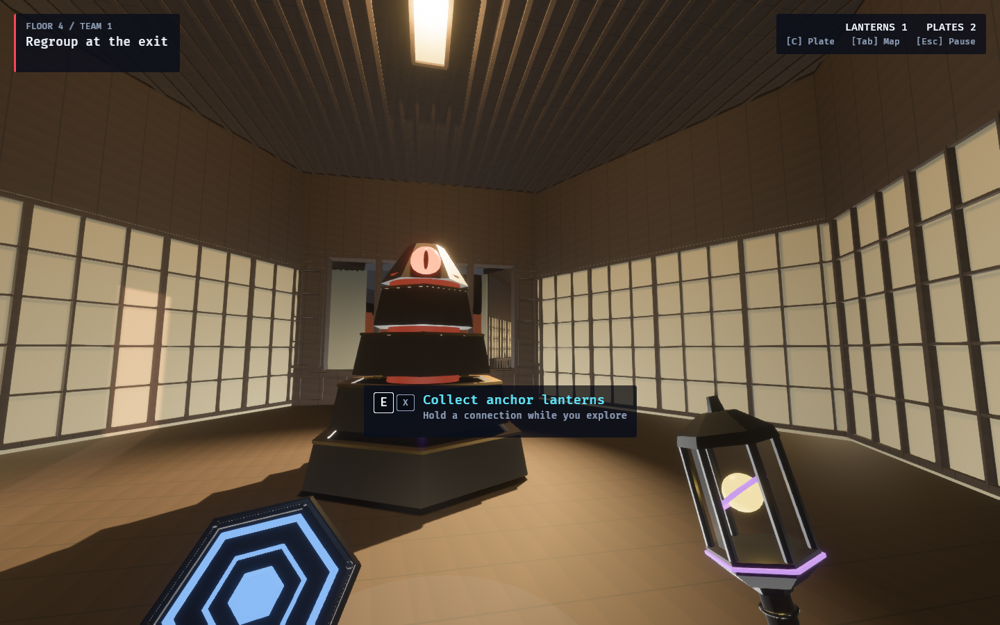

# Ordinary Zen — Rain Court cedar and paper

Zen remains Shadow Screen on level 3, displayed floor 4. Ordinary corridors,
rooms and ascent geometry now share the Rain Court’s dry cedar and opaque paper
finishes. The wonder and ordinary shell reuse the exact cached cedar and paper
material handles. Rain, wet garden paving, moss, stones and tatami seating remain
local to the Rain Court.

In halls and rooms, broad low-reaching screens receive paper; narrow posts,
high lintels, furniture and joinery receive cedar. Climb surfaces retain their
existing facing-based projection, using the same shared materials. Fine lattice and upper timber panels fit each wall’s
actual convex support, including the interior screens of narrow corridors.
Ceiling slats fit individual flat slab undersides, including narrow rafts.
Sloping or small supports that cannot contain a full rectangle remain undressed.
Declared perimeter door faces receive no lattice. Window pieces and ceiling slabs stay
separate, preserving their apertures and stairwell gaps. Rims around the existing
authored diffusers make them read as paper lanterns.

Paper reflects real light instead of carrying the former structural emissive
glow. Ordinary sources keep their authored positions and the existing power and
shadow-budget paths; their warm colour follows the court and their source budget
is 2.4 million lumens before composition, rhythm and source-count scaling. This
lights reflective cedar and paper while retaining the corridor’s darker intervals.
The Rain Court keeps its own fixed downlight rig.

All details are shallow presentation geometry. There are no new colliders,
observation rules, cards, victory conditions, tile catalog or simulation-hash
changes. Mesh caches include the actual fitted geometry. Entities belong to the
cell parent and carry storey/cutaway metadata, so streaming and rewrites remove
them with the shell. Library bookcases retain their existing support-fit policy.

## Production captures

These are ordinary solved tiles in the production surface-tour fixture, with
settled player-eye inspection poses just inside their existing entrances.
No wonder, props or topology changes are staged. The normal objective furniture,
Guardian and equipment may be visible. These stills establish appearance, not a
competitive playtest.

| View | Cell | Level |
| --- | --- | --- |
| Straight corridor | q8 r8 | 3 |
| Corner | q1 r4 | 3 |
| Room | q19 r4 | 3 |
| Junction | q2 r10 | 3 |
| Climb entry | q1 r11 | 3 |





[Corner](zen-corner.png) · [Junction](zen-junction.png) · [Climb entry](zen-climb.png)

## Reproduce

With the machine’s `CARGO_TARGET_DIR` set and no overlapping build in that cache:

```bash
OBSERVED2_ZEN_PORTRAITS=1 \
OBSERVED2_CAPTURE_HEX_WFC_SURFACES=/tmp/zen-corridors \
RUST_LOG=warn,observed_game=info cargo dev-run -p observed_game

OBSERVED2_ZEN_PORTRAITS=climb \
OBSERVED2_CAPTURE_HEX_WFC_SURFACES=/tmp/zen-climb \
RUST_LOG=warn,observed_game=info cargo dev-run -p observed_game
```

The optional Zen selector captures ordinary Straight, Corner, Room and Junction
archetypes; `climb` reuses the existing production climb-tour entry pose. The
usual surface tour is unchanged when the selector is absent.

## Verification

- Six focused Zen checks passed: actual and rotated supports, narrow interior
  screens and ceiling rafts, door/window and stairwell clearance, shallow controller
  clearance, finish classification, mesh reuse, climb cutaway ownership and cleanup.
- The four existing Library fitting checks passed with the shared support helper.
- Five final 1440×900 production GPU views completed without warnings or errors;
  each was inspected after the interior-screen and joinery corrections.
- `cargo fmt --all` and `cargo dev-clippy` passed, without warnings.
- Full `cargo dev-test`: **2,707 passed, zero failed, 45 ignored**.
- Changed documentation links and `git diff --check` passed.
- Extended `cargo dev-test-all` was not run for this presentation change.

Related: [Rain Court research and design](../../rain_court_wonder_proposal.md),
[Rain Court card, captures and walkthrough](../rain-court/README.md).
