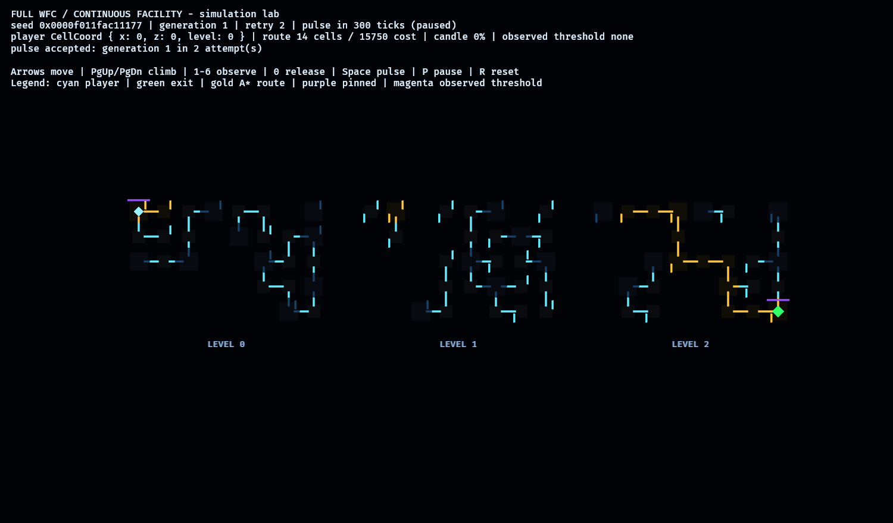
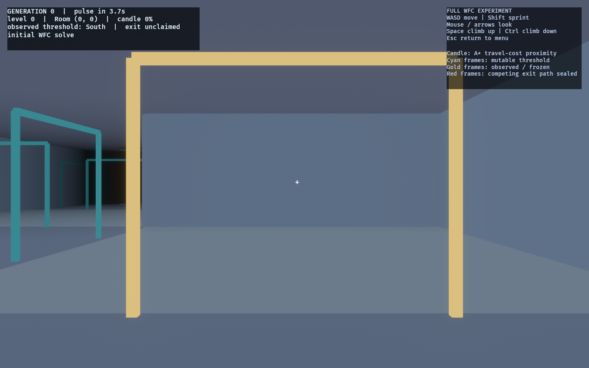
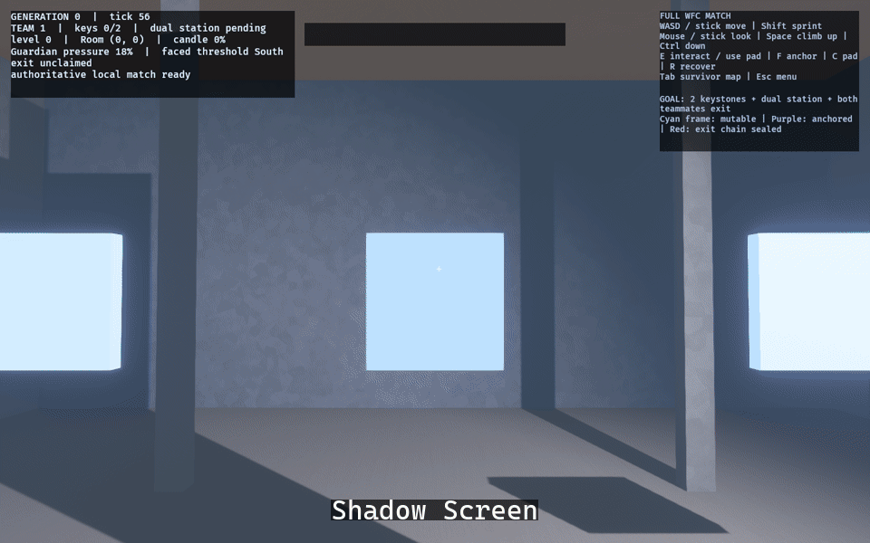

# Continuous Full-WFC Facility

Branch: `experiment/full-wfc-facility`

The full-WFC facility is the canonical **Play** match. It exists in one continuous
8 x 5 x 3 world-space lattice: crossing a threshold is physical movement, while the
former isolated-Place/preview match remains a regression fixture.

## Implemented rules

- Every committed generation has a weighted-A* route from spawn and every occupied
  `PlayerId` cell to the exit.
- A five-second deterministic pulse may delete and recreate any unobserved room or
  hall. Presentation rebuilds only the changed cell entities.
- Occupancy pins its module. Looking at a room threshold pins the room, its exact
  non-branching hall chain, and the destination room. Other threshold faces on that
  destination room may still change if they are not observed.
- The first currently observed terminal chain claims the exit. All competing exit
  faces are sealed in both navigation and continuous movement. Releasing observation
  releases the claim.
- The carried candle is a real point light. Its intensity and range increase with a
  normalized scalar from the same weighted A* travel costs used by the route guard.
  The selected route is never shown in the played mode.
- Vertical connections are continuous climb shafts: Space climbs up and Ctrl climbs
  down while the player is in the shaft opening. No teleport transaction is involved.
- Horizontal room thresholds share one 4.5 m x 4.66 m clear aperture projected into
  both the render shell and Rapier. Hall-to-hall branches remain fully open.
- Every horizontal room threshold uses the manifest-selected Kenney CC0 gate and
  cable dressing when present, with style-normalized materials and procedural
  fallbacks. The indicator reports durable state only: cyan mutable, purple
  anchor-locked, red sealed. Observation never changes the light.
- Each cell carries its authored architecture register. Procedural dressing supplies
  Shadow Screen slats, Monolith masses, Overlit Grid panels, Institutional panels,
  Facet seams/shaft air, Megastructure recesses/ribs, Wellshaft practicals, Infinite
  Gallery bands, and Thinning decay without adding collision or another WFC layer.
- The desktop render tier uses HDR bloom, high SSAO, FXAA, distance fog, a single
  current-cell shadow key, and at most seven unshadowed current/connected practicals.
  Facet Monument alone receives bounded volumetric air. Ambient/fog ease between
  cell registers and the shared klaxon palette carries the escape countdown.

## Evidence

The resettable lab shows all three levels and the otherwise invisible invariants:



The assembled first-person mode uses the shared semantic style treatments. Cyan
frames are mutable thresholds, purple is a durable anchor lock, red is a sealed exit
chain, and the green beacon is the exit:



The automated style tour captures all nine architecture registers through the same
played camera and render stack:



Reproduce the captures:

```powershell
$env:OBSERVED2_CAPTURE='docs/evidence/full_wfc/full_wfc_lab.png'
cargo run -p full_wfc_lab

$env:OBSERVED2_CAPTURE_FULL_WFC='docs/evidence/full_wfc/full_wfc_game.png'
cargo run -p observed_game --bin observed

$env:OBSERVED2_CAPTURE_FULL_WFC_STYLE='docs/evidence/full_wfc_style'
cargo run -p observed_game --bin observed
```

## Verification

- `cargo test --workspace` passes across the domain crates, labs, assembled game,
  replay/architecture ratchets, and doc tests.
- `cargo clippy --workspace --all-targets -- -D warnings` passes.
- `OBSERVED2_CAPTURE_FULL_WFC_STYLE` completed through the real Vulkan renderer; all
  nine stills and the FFmpeg palette-filtered GIF were inspected after capture.

## Current scope

The canonical match now includes all eight runners, Guardian, keystones, deployable
equipment, team pads, dual-station cooperation, survivor map, progression/results,
bots, versioned replay, and the production Rapier controller. Phase 85 remains a
hands-on tuning/playtest gate; online transport is still outside this arc.
