# Guardian forms: candidates for the major Guardian

Three candidate forms for the major Guardian, modelled in `labs/guardian_form_lab`.
Each acts out the four things a major does in a match: hunting, frozen because someone
sees it, frozen by an anchor lantern, and the catch. Each stands beside the existing
minor Guardian, a 1.8 m person and the facility's real doorway (4.5 m wide, 4 m clear).
**The Tumbler is the major Guardian** (chosen 2026-09-25), and it is in the game with
its sounds. The Plumb and the Roller stay here for the minor roster; the Plumb may yet be
a second major or another special.

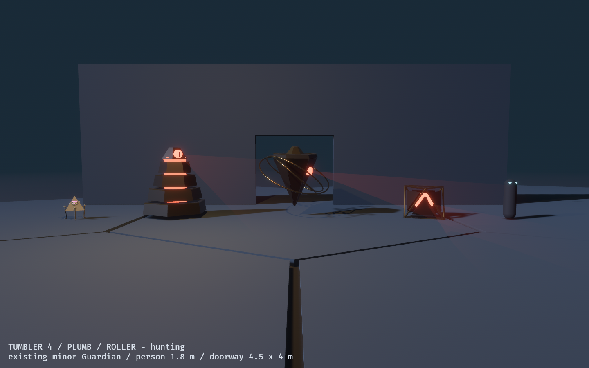

## In the game

The game draws its Guardian as the Tumbler at four tiers (`game/src/hex_wfc/guardian.rs`).
The forms moved from the lab into a shared crate, `observed_guardian`, so the game and
the lab draw the same thing. The simulation is unchanged: it owns where the Guardian
is and its status, and the view follows.

- **Hunting, frozen by sight, frozen by an anchor** are the simulation's three
  statuses, drawn as the lab draws them.
- **The catch** sends the Guardian home in the same tick, so it plays as a short-lived
  second Tumbler where the Guardian was last drawn, for 1.8 s.
- **It glides.** The simulation moves the Guardian a whole cell (14 m) at a time; the
  drawn one glides there at 12 m/s, and snaps only when a catch sends it home.
- **Its eye throws red light:** strong while it hunts, dim while it is held.

On the Phase 101 arc gate (uncapped) the Tumbler costs nothing measurable: median
9,360 µs, p95 13,108 µs, worst mutation frame 13,626 µs, against 9,645, 13,551 and
14,730 µs before it.

| In the moonlit loggia, frozen by the runner's gaze | In the windowed room, frozen by the runner's gaze |
| --- | --- |
| 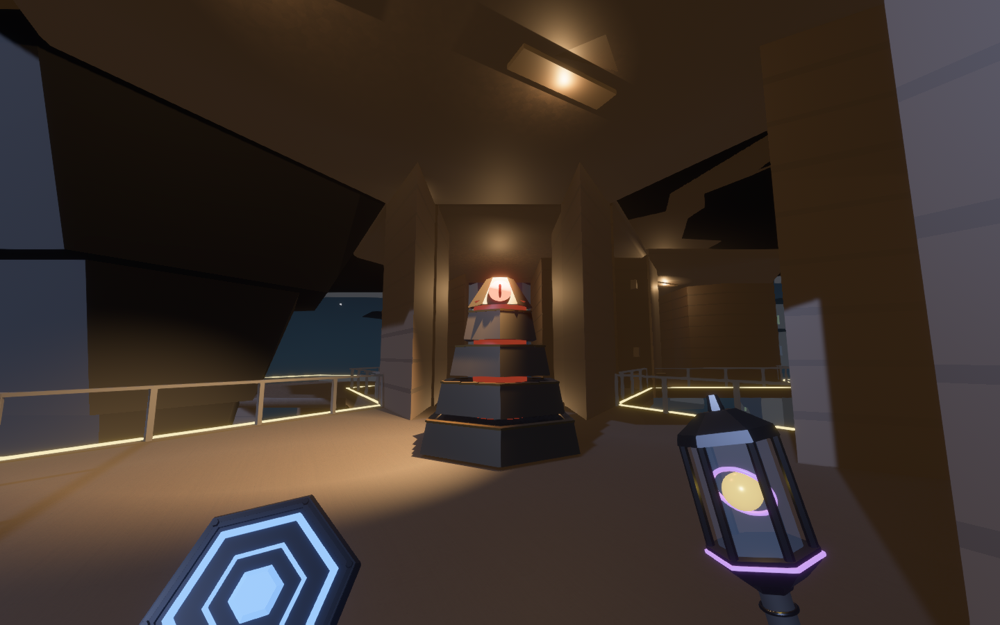 | 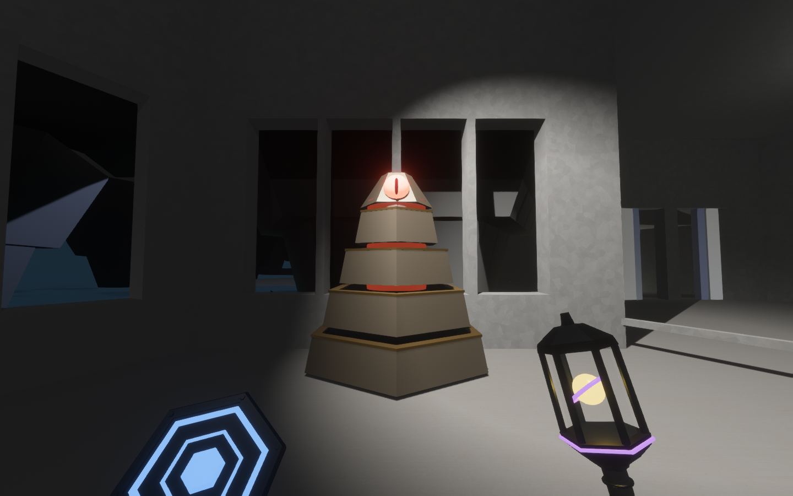 |

```powershell
$env:OBSERVED2_CAPTURE_HEX_WFC_GUARDIAN = "docs/evidence/guardian_forms"; cargo dev-run -p observed_game
```

The capture stages the Guardian ahead of the runner. The simulation freezes it there
itself, because the runner is looking at it.

## Sound

Every sound is original, synthesised by `tools/generate_guardian_audio.py` (standard
library and ffmpeg, fixed seeds, 48 kHz mono, peak headroom). The loops are crossfaded
into their own heads so they repeat without a seam.

The palette is dark and crunchy. Nothing is struck high: a tick is a low knock with a
burst of band-limited grit, not a sine ping; a rush is dark noise, never white; bronze
rings an octave or more down. Every cue is driven into a soft saturator for grit and
then low-passed, so the harmonics the saturation adds stay warm. The first palette was
judged too bright; the second pass took each cue's energy-weighted spectral centroid
down, the Tumbler's from 750-1,460 Hz to 300-550 Hz, and the Plumb's hum from 8,760 Hz
(it whooshed with white noise) to 267 Hz.

The Tumbler's sounds carry its states by ear:

| When | Sound |
| --- | --- |
| Hunting | a bronze drone on 55 Hz, its fifth and octave, breathing, under grinding gear teeth and a knocking ratchet: looped |
| Seen | the ratchet knocks faster and faster, and the latch drops home with a crunch and a low bronze ring. The hum stops: silence means frozen |
| Anchored | a falling rush, a magnetic thunk, and a dark glass dyad (370 and 554 Hz): the lantern's voice, not the Guardian's bronze |
| Let go | the latch lifts, and the ratchet knocks its way back up into the hum |
| A catch | the tiers telescope up over a crunching ratchet, then a sub boom, a burst of grit and a low tritone ring (110 and 155 Hz) |

In the game the hum is spatial and follows the Guardian, fading out within a fraction
of a second of it being seen. The one-shots play from where it stands. The catch
replaces the old dread swell as the catch event's cue, so it plays once, from the catch.

The Plumb has a low pale drone with its three orbits rushing past, its rings settling
when seen, and faces grinding open in its catch. The Roller is heard landing on each
face (a hollow thud and its struts crunching); seen, a low pure tone holds as it
balances.
The lab plays all of them; the films below carry them.


## The brief

- **Modron is a mood, not a design.** `agents.md` and the Architect Ascent design both
  say so, and ask for original pyramidal Guardians. The mood taken here is clockwork
  order, rank, and a single dispassionate gaze. No name, part or silhouette is copied.
- **Major and minor differ in silhouette first.** Only a major answers to being looked
  at. The existing minor is small, pale and three-eyed, with legs. Every candidate is
  large, dark and one-eyed, with none.
- **Every state is said in shape and motion, not colour alone.** Frozen must *look*
  frozen with the colour turned off. Colour supports it: the seams go dark and the
  anchor's purple clamps on.

All colours come from `observed_style::guardian`: an oxidised-bronze shell, brass trim,
and the threat red (`MarkerRole::Collapse`) in the eye, the seams and the search beam.
Its tests hold the rules. The shell is darker than a minor's ivory and never emits. The
eye is signal-tier. The beam is haze under the signal floor. A frozen seam is at most a
tenth as bright as a live one.

## The candidates

### Tumbler: a stepped pyramid that locks when seen

Hexagonal tiers, each turning at its own rate like a lock's tumblers, with the eye in a
crown that tracks and scans. **Seen, the tiers snap into line with a latch's overshoot,
it settles onto the floor, the eye fixes on you and the seams go dark.** Being frozen
looks like the facility's own language for observation: a lock closing. Rank is its
tier count: three, four or five.

| Hunting | Frozen by sight | Frozen by an anchor | Catch |
| --- | --- | --- | --- |
| 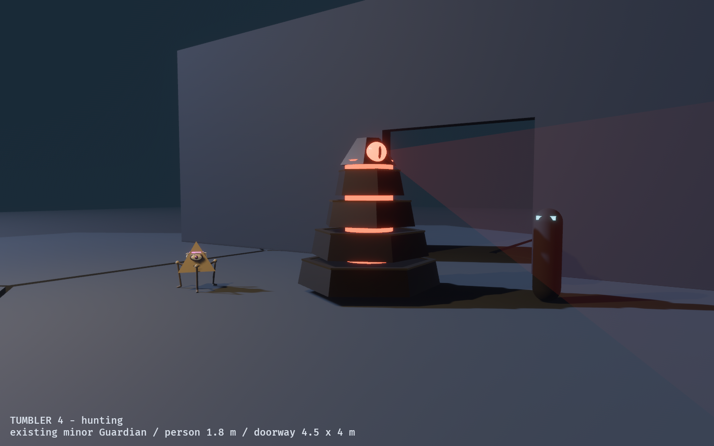 | 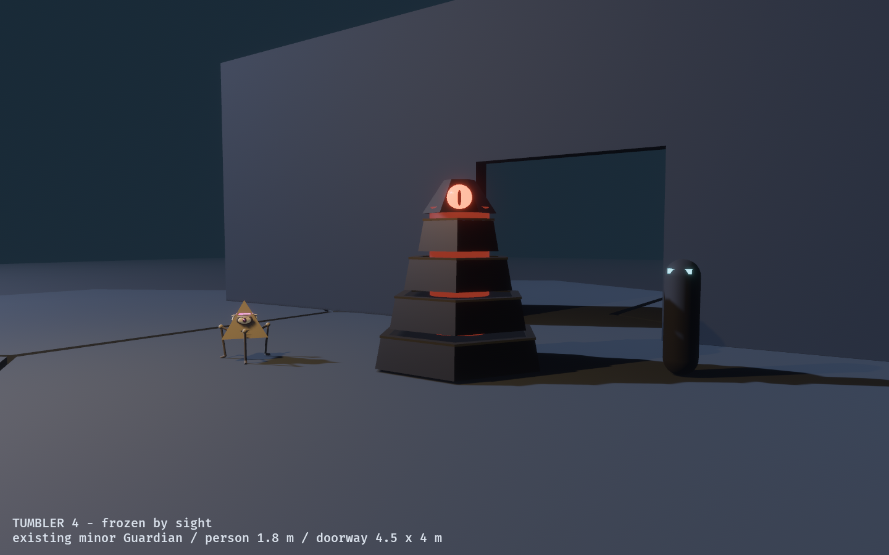 | 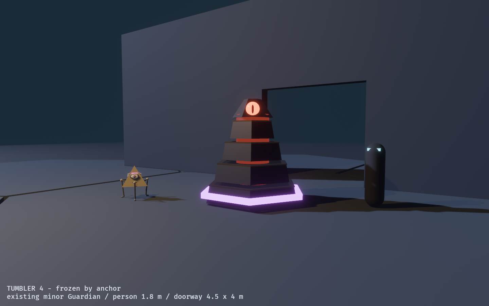 | 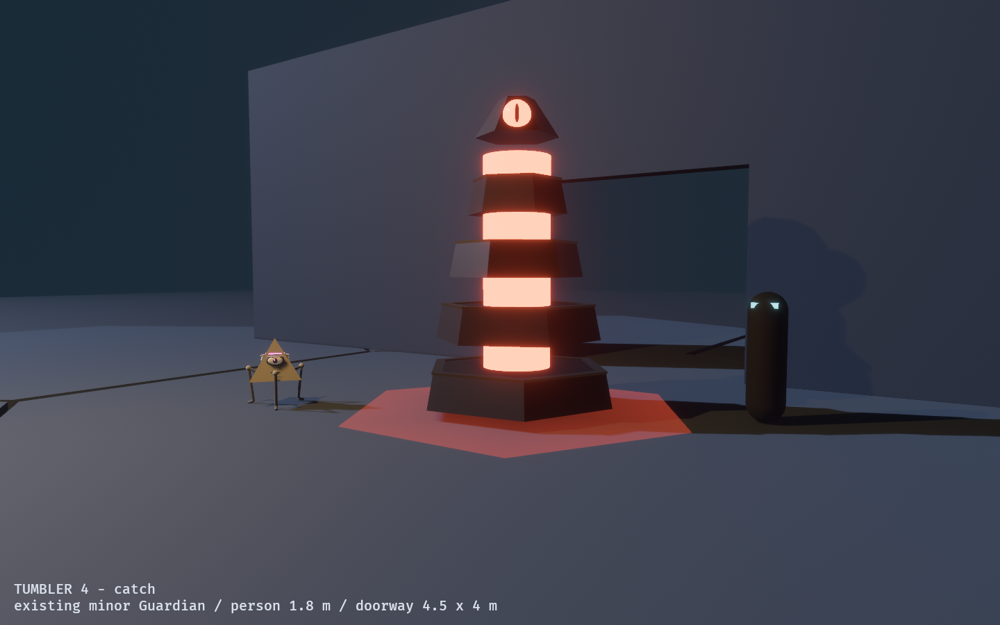 |

Films, with sound: [seen](evidence/guardian_forms/film_tumbler_4_seen.mp4) ·
[catch](evidence/guardian_forms/film_tumbler_4_catch.mp4) ·
[encounter](evidence/guardian_forms/15_tumbler_4_encounter.png) ·
[ranks](evidence/guardian_forms/41_tumbler_ranks.png)

### Plumb: an inverted pyramid ringed by orbits

It hangs point-down, turning slowly, so its eye and beam sweep the room like a
lighthouse, while three brass rings orbit it. **Seen, the rings fall flat into a seal,
it turns its eye on you, and it sets its point on the floor.** It is the most uncanny of
the three up close. The catch opens its six faces like petals around a red core.

| Hunting | Frozen by sight | Frozen by an anchor | Catch |
| --- | --- | --- | --- |
| 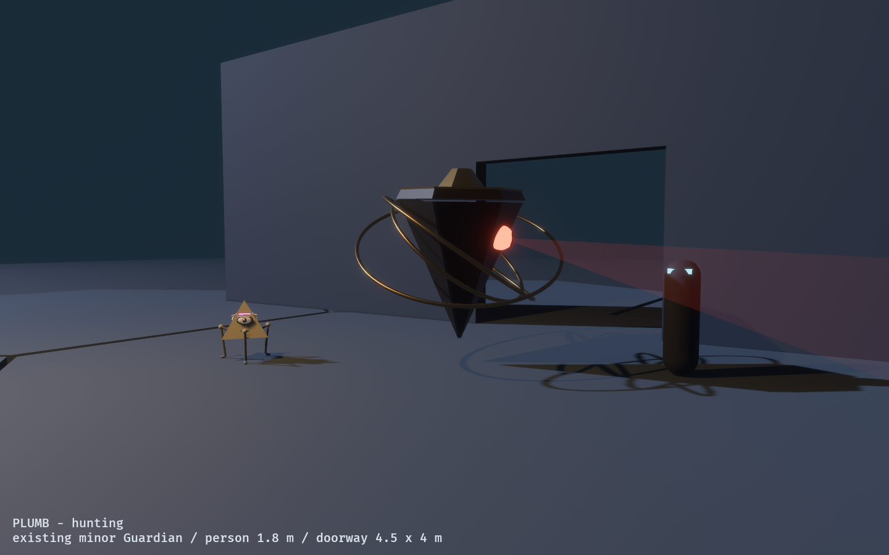 | 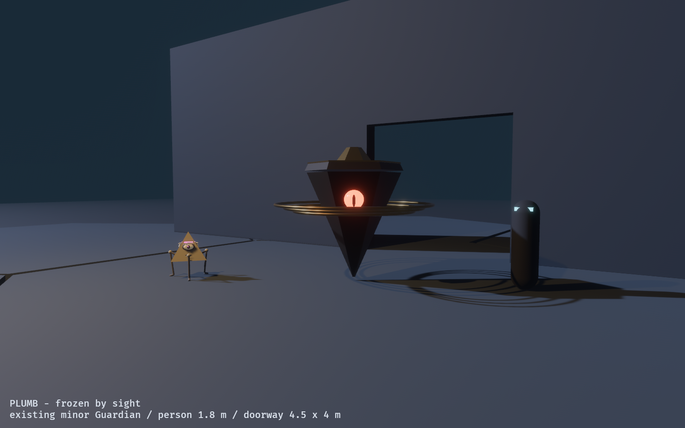 | 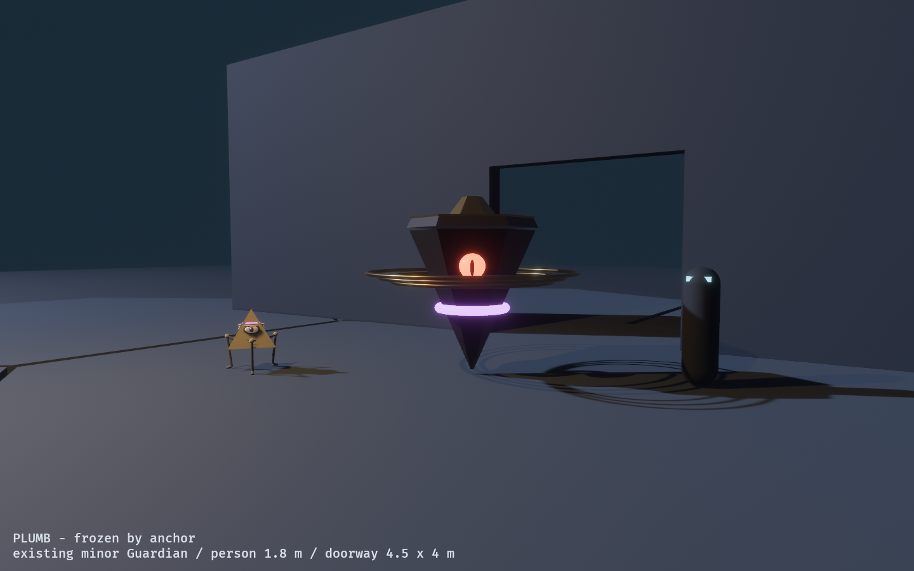 | 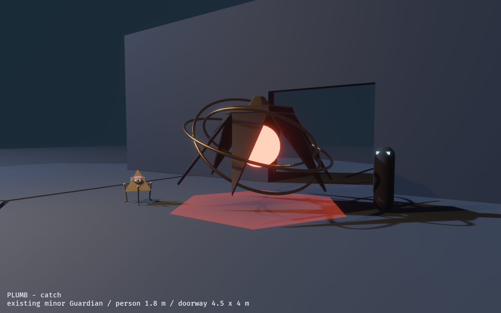 |

Films, with sound: [seen](evidence/guardian_forms/film_plumb_seen.mp4) ·
[catch](evidence/guardian_forms/film_plumb_catch.mp4) ·
[encounter](evidence/guardian_forms/25_plumb_encounter.png)

### Roller: an octahedral cage that walks by tumbling

It rolls face to face: a pause, a slow tip, a heavy fall onto the next face. The eye
stays level inside the cage, scanning through its windows. **Seen, it tips up onto a
single point and stays there, impossibly balanced.** No unfrozen body could hold that
pose, so it reads as frozen from any distance. The catch splits it at the equator.

| Hunting | Frozen by sight | Frozen by an anchor | Catch |
| --- | --- | --- | --- |
| 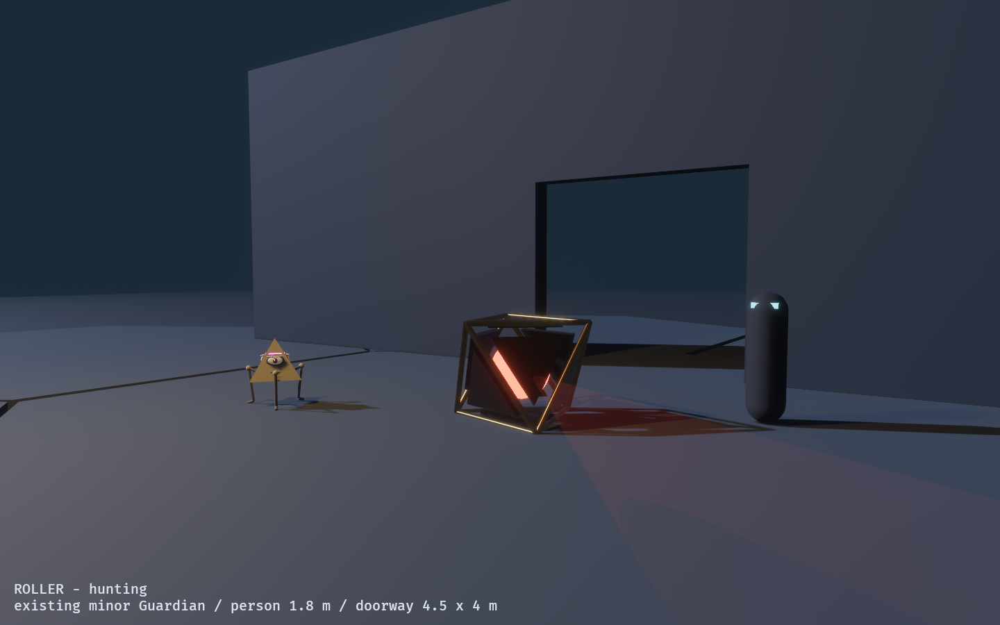 | 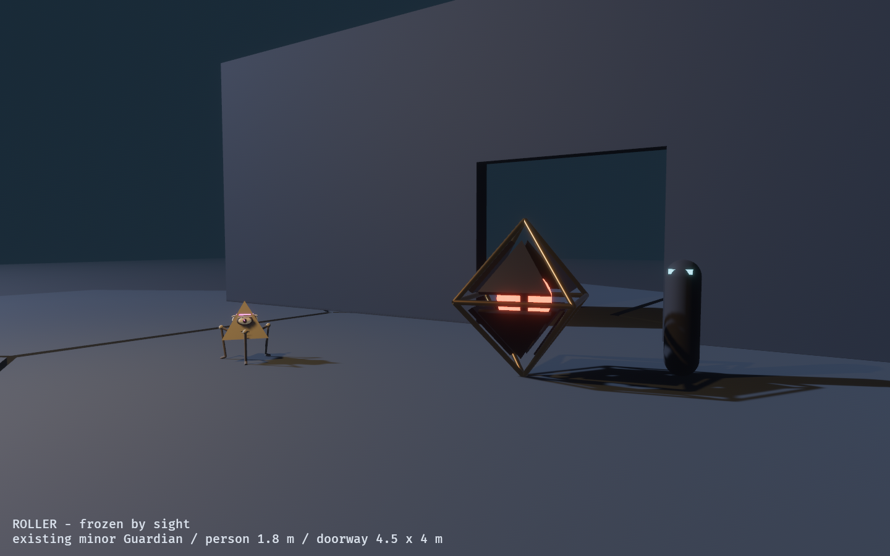 | 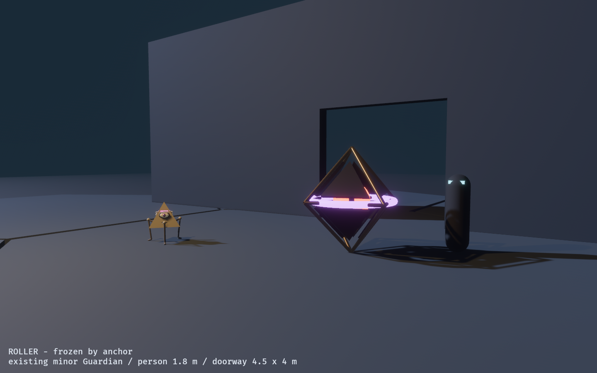 | 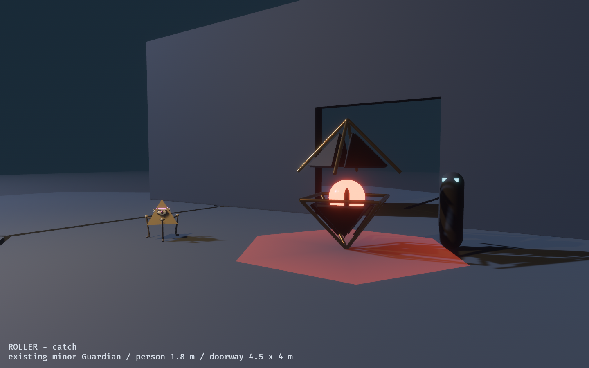 |

Films, with sound: [seen](evidence/guardian_forms/film_roller_seen.mp4) ·
[catch](evidence/guardian_forms/film_roller_catch.mp4) ·
[encounter](evidence/guardian_forms/35_roller_encounter.png)

## Comparing them

| | Tumbler | Plumb | Roller |
| --- | --- | --- | --- |
| Height | 3.2 m (4 tiers); 2.6 to 3.8 m by rank | 3.25 m hovering, 2.9 m grounded | 1.4 m on a face, 2.4 m on a point |
| Frozen reads by | tiers in line, settling, dark seams | rings flat, point grounded, stare | balanced on one point |
| Frozen from a distance | good: the moving stripes stop | good: the rings stop orbiting | best: an impossible pose |
| Headroom under a 4 m lintel | 0.8 m (4 tiers), 0.2 m (5) | 0.75 m | 1.6 m |
| Up close | a watchful tower | most unsettling | a cage around an eye |
| Motion | turning in place, gliding | turning, swaying, gliding | walks, in a heavy rhythm |
| Fits the sim's gliding position | yes | yes | needs the roll timed to its speed |
| Rank variants | natural (tier count) | ring count, perhaps | size |
| Silhouette against the minor | clearly different | clearly different | clearly different |

## Beyond the major

Minor Guardians are never frozen by sight. They are answered by the kinetic tool,
which shoves them into void, off an unrailed edge, or into a retracting tile. Whichever
forms are not chosen could become minors whose *shape* says how to beat them:

- **A small Plumb hovers.** A shove off a ledge does nothing, because it floats. It has
  to be driven into a retracting tile, or through a door that is then closed.
- **A small Roller rolls.** Push it and it keeps tumbling, so it is the easiest to put
  off an unrailed edge, and the hardest to stop coming.
- **The existing minor walks.** It sits between the two.

These are ideas for the minor roster, not decisions.

## Running it

```powershell
cargo dev-run -p guardian_form_lab
$env:OBSERVED2_CAPTURE = "docs/evidence/guardian_forms"; cargo dev-run -p guardian_form_lab
```

Keys: `1`-`3` the Tumbler at 3, 4 or 5 tiers; `4` the Plumb; `5` the Roller; `L` the
line-up; `K` the ranks. States: `H` hunting, `S` frozen by sight, `A` frozen by an
anchor, `C` catch. `Tab` changes the camera, `P` pauses, `R` resets.

The capture writes the stills and a frame folder per film (frames stay out of git).
`tools/mux_guardian_films.py` compiles each film to MP4 with its soundtrack, rebuilt
from the same timeline the capture used:

```bash
python3 tools/mux_guardian_films.py <capture dir> --out /tmp/films   # then copy in
```

Render to a local directory and copy the MP4s into the repository. On the ntfs3 mount
the repository lives on, ffmpeg writing one of them in place stalled indefinitely.

## What is tested

The poses are pure functions of state and time (`form.rs`), so the lab tests the
properties the choice rests on:

- a frozen Guardian does not move;
- a hunting one always does, including the Roller between rolls;
- the seams go dark exactly when frozen;
- every part's origin stays inside the doorway while hunting or frozen (origins, not
  full extents: the heights above are computed from the dimensions);
- the Roller never sinks or lifts off mid-roll, lands flat, returns to its start, and
  balances on exactly one point when frozen.

## Still thin

- **The sounds have not been heard by a person.** They were checked by their shapes
  (waveforms and a spectrogram) and by what the tests can hold: headroom, seamless
  loops, and that each state change has its cue. Levels and the hum's spatial falloff
  want a listening pass on real speakers.
- **You can walk through it.** The Guardian has no collider; the simulation never gave
  it one, and adding one would change the simulation. The Tumbler's base is 3 m
  across, so a body standing against a frozen one clips into it.
- **Hunting has only been seen in the lab.** In first person a Guardian that is in view
  is frozen by definition, so the in-game stills can only show it frozen.
- **The Roller's roll is not tied to a speed.** It walks a fixed out-and-back. In a
  match its roll would have to keep pace with the simulation's 2.5 m/s glide.
