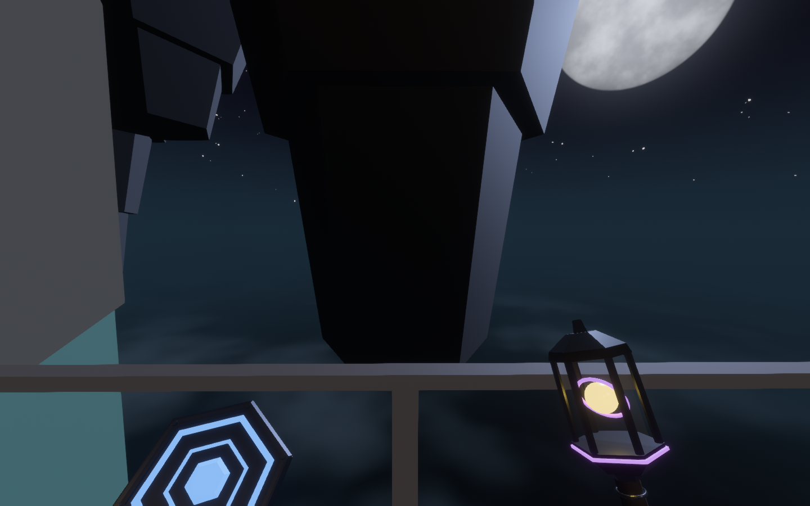
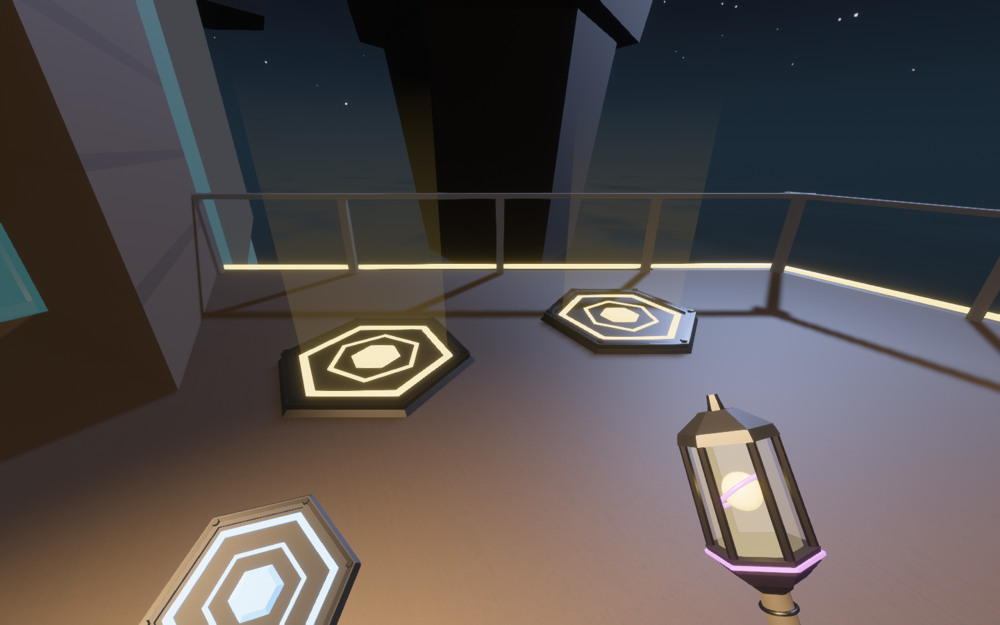
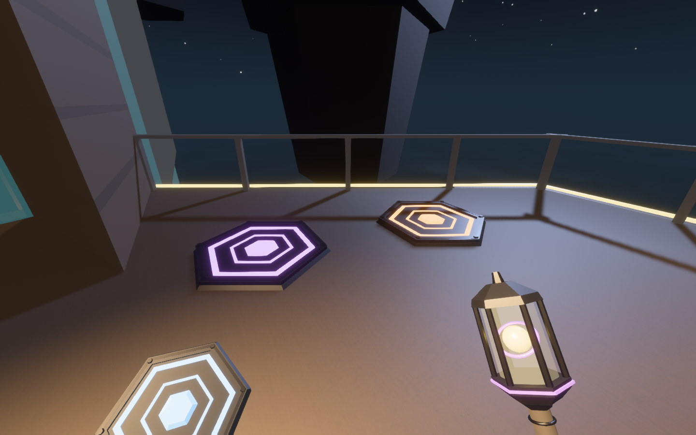
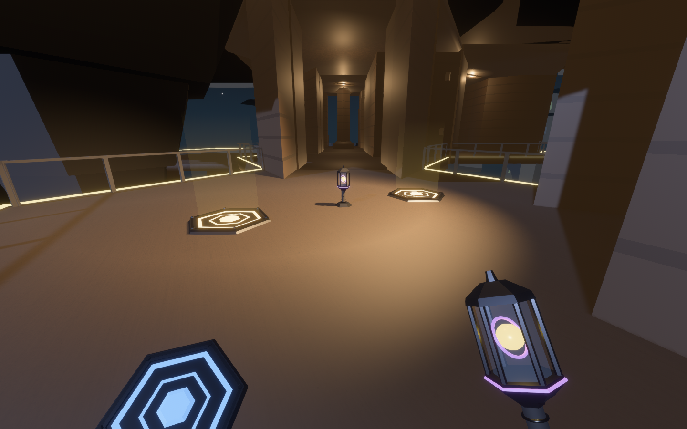
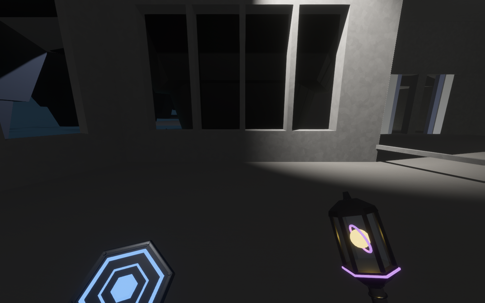

# Hand equipment: the teleport plate and the anchor lantern

What an Observer carries, and what they put down, drawn to the same standard as the
open-air facility around them. This note records the rules the two devices follow, how
they are built, and how to capture them.



## The rule: one part carries the signal

Each device is a signal, and each carries its signal in one place:

- **the plate** in its state ring, inner ring and lens;
- **the lantern** in its guide core, and in the anchor purple of its gyro and base band.

Everything else is hardware: dark blued gunmetal, bright machined trim, a rubbered
grip, nearly clear glass. Hardware never glows. Before this, a carried plate was drawn
entirely in the teammate signal, so the whole disc bloomed and was the brightest thing
on screen, brighter than anything it pointed at.

The finishes live in `observed_style::equipment`, next to the marker treatments the
signal parts already used, and three rules there are tested:

- Hardware is darker than the dimmest signal it carries.
- A carried signal is scaled into the first-person budget (`HELD_SIGNAL_SCALE`) and
  stays lit. The lantern's guide core is the exception: the player reads the exit from
  it, so it stays signal-tier.
- A linked plate's light column is haze under the signal floor, never a beacon.

## The plate

A hexagonal deck, 1.6 m across its corners and under 10 cm tall, lined up with the
cell it lies in. It has a raised rim with a bright machined edge and six corner studs.
Inside the rim sits the signal: a state ring, an inner ring and a lens.

| State | Colour | And |
| --- | --- | --- |
| Linked (your team has another plate down) | next-room amber | the inner ring turns, and a faint light column rises |
| Lone (placed, connecting nothing yet) | control purple | still |
| A rival team's | rival orange | still: walking onto it does nothing |
| In your hand | teammate blue, at the held scale | one plate per plate carried, up to three |

A drop-in body (`models/pad.glb`) still replaces the procedural hardware when an author
supplies one; the signal rides on top of either.

## The lantern

An observation torch: a knurled grip and pommel, a collar, a hexagonal cage of six
bars around a glass chamber, and chamfered caps up to a finial. Inside is the guide
core, circled by a slow gyro ring in the anchor's purple, so the lantern reads as an
instrument that is watching.

The carried core glows with the light it casts. It is brightest toward the exit, never
below half, and it stutters when the Guardian closes in.

A lantern set down at a threshold, or waiting in a cache, stands on a small plinth on
the floor. It is drawn 2.4 times the size of the one in a hand, so it reads from
across a room.

The Import Replacer sample torch that stood in for the lantern body has been retired
(see `assets/SOURCES.md`). The `lantern` drop-in slot is empty until an author supplies
a body; the core and gyro would ride inside it.

## In the hand

The lantern rides low in the right hand, canted in toward the middle of the view. The
plate rides in the left, face tipped up so its ring can be read. Both sway with the
body's actual speed: a step's rise and fall and a small side-to-side. The sway is read
from the simulation's positions and is capped, so a teleport is not a thousand steps.

Both are held inside the body's own radius, so standing against a wall never pushes
them through it. `held_devices_stay_inside_the_body` holds each device's bounding box
at many headings and at pitches from -0.9 to 0.9 radians, and requires every corner to
stay inside the smaller of the two controller radii (0.38 m).

## Evidence

```powershell
$env:OBSERVED2_CAPTURE_HEX_WFC_EQUIPMENT = "docs/evidence/hand_equipment"; cargo dev-run -p observed_game
```

The capture reuses the vista capture's railed loggia and moonlit room. For each pose it
stages what the runner carries and what lies on the floor, and holds it there. That is
evidence only, like the pose itself.

| | |
| --- | --- |
|  |  |
|  |  |
|  | |

## Still thin

- **Remote players' devices float.** Another player's held items are drawn at that
  player's eye, with no body to hold them. That was true before, too.
- **The Guardian is untouched.** It is still a procedural capsule and ring.
- **The sway has not been seen in motion, and has no test.** The capture is stills,
  and the runner is placed rather than walked, so the sway is at rest in every frame.
  A walking MP4 is the evidence it still needs.
