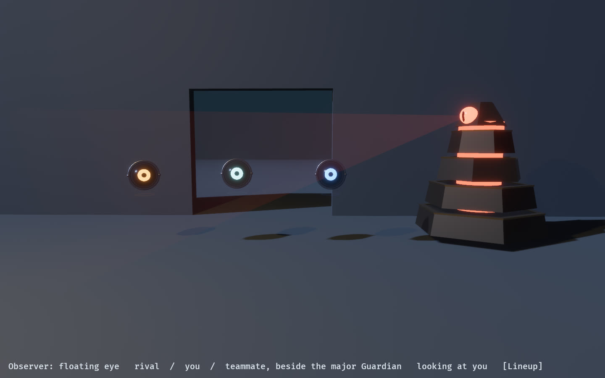
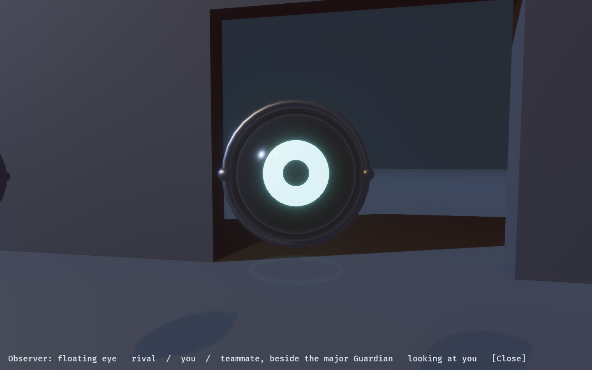

# The Observer: a floating eye

The design calls for "spherical eyeball Observers" (`architect_ascent_design.md`,
section 8), and until 2026-10-02 the game drew every other body as a translucent
capsule in its team colour. The Observer is now a floating eye, modelled in
`labs/observer_form_lab` and drawn by the game from the same crate,
`observed_observer`, the way the major Guardian is drawn from `observed_guardian`.

## The form

- **A dark globe at the body's eye height.** Deep blue-black enamel, 0.52 m across,
  its centre exactly where the camera puts that body's eye (0.70 m above its centre,
  1.6 m off the floor), so looking through a body and looking at it agree about where
  it sees from. A test pins the two together.
- **An iris in whose eye it is.** You, teammate or rival, at signal brightness, and
  never the Guardian's red. It is the one part of an eye you read across a room.
- **A steel gimbal.** A ring facing forward that turns with the body's heading, the
  frame the globe pitches in. Its two pins carry the iris's colour, so whose eye it is
  shows from behind and from the side, where the iris cannot.
- **A hover ring** underneath, in the iris's colour at haze strength: it says the thing
  floats.

A sphere where a Guardian is a pyramid, dark where a minor is pale, and a coloured iris
where a Guardian's eye is red: the classes differ in silhouette first, and colour only
confirms it.

## What it does

- **It looks where the body looks.** The globe and lids turn to the simulation's yaw
  and pitch, eased in the game because a bot's heading can snap between ticks. In a game
  about observation, where another Observer is looking is the most useful thing its
  body can show.
- **It bobs,** three centimetres, so it is never quite still.
- **It blinks,** each eye on its own period between 3.5 and 6.5 s, so a room of them
  never blinks together. Shut, the lids close over the iris and pupil entirely.
- **At arm's length it is seen through.** Bodies set out together and bots walk in
  file, so the eye ahead is often at your own eye height, and a dark globe half a metre
  across hid the doorway you were both heading for. Within 2.4 m of the camera an eye
  goes translucent, and comes back past 2.8 m so it does not flicker at the threshold.
  The capsule was translucent always for the same reason; the eye is solid where it is
  read.

The pose is a pure function of the gaze, a clock and a seed, so every property above is
a test in `observed_observer::form`, and the colours' rules are tests in
`observed_style::observer`.

## In the game

`game/src/hex_wfc/observer.rs` dresses each body's root as an eye and poses its parts;
`entities` still owns where the body stands and whether it is drawn. Every body gets an
eye, and only the one the camera is inside is hidden: in play, and when a spectator
looks through the followed body's eyes (`V`). Before this, the body that started as
local was left out at spawn, so after a spectator's focus moved, the camera sat inside
the new body's visual and the old one had none.

On the Phase 101 arc gate (uncapped) the eyes cost nothing measurable: median frame
11,483 µs, p95 15,047 µs, worst mutation frame 16,775 µs, against 11.5, 14.9 and
16.3 ms before them. The gate passes.

## The lab

`cargo dev-run -p observer_form_lab`. `Tab` the camera, `C` every eye looks at the
camera, `P` pause, `R` reset. `OBSERVED2_CAPTURE=<dir>` writes `lineup`, `lineup_about`,
`close`, `profile` and `blink` stills and an eight-second film of the line-up looking
about, [`eyes.mp4`](evidence/observer_form_lab/eyes.mp4).

## Not yet

- **Hand equipment:** another Observer's lantern and kinetic tool are still drawn where
  a hand would be. An eye has no hands; hanging them from the gimbal is the next step.
- **States:** caught, jailed and corrupted have no form of their own yet. The lids are
  the obvious place to say them.
