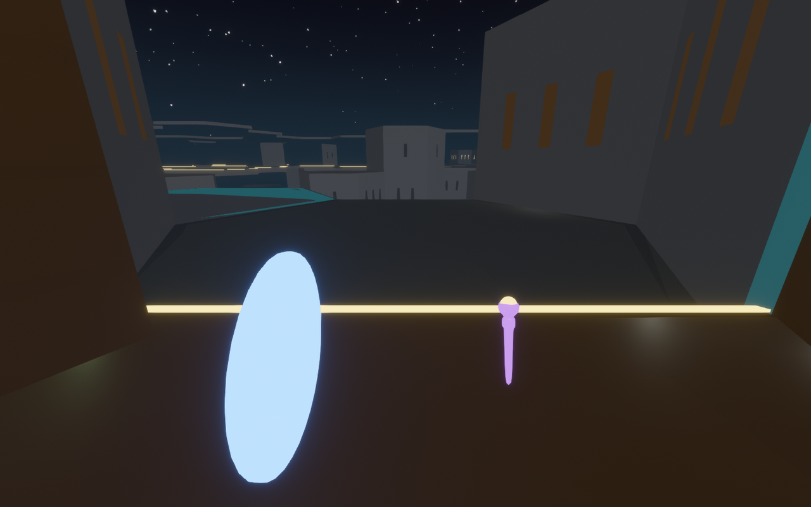
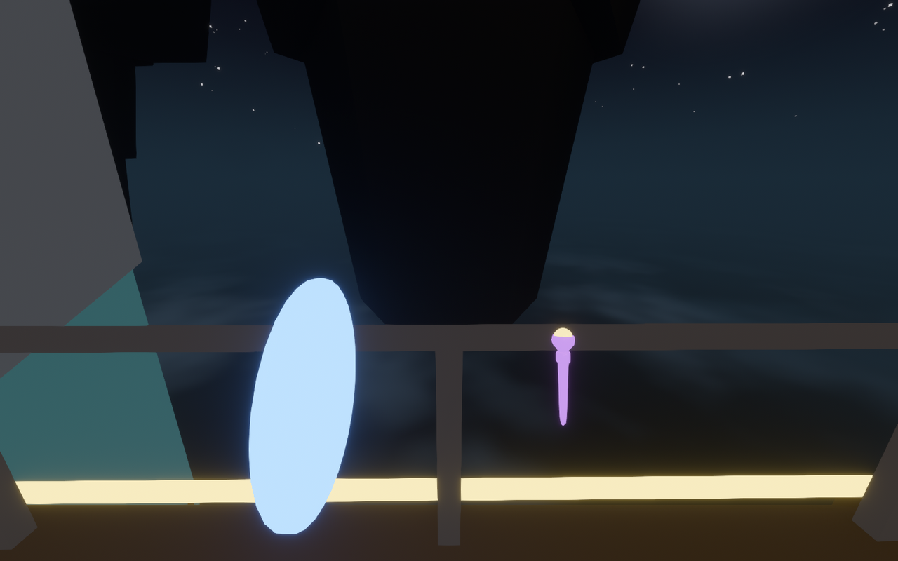
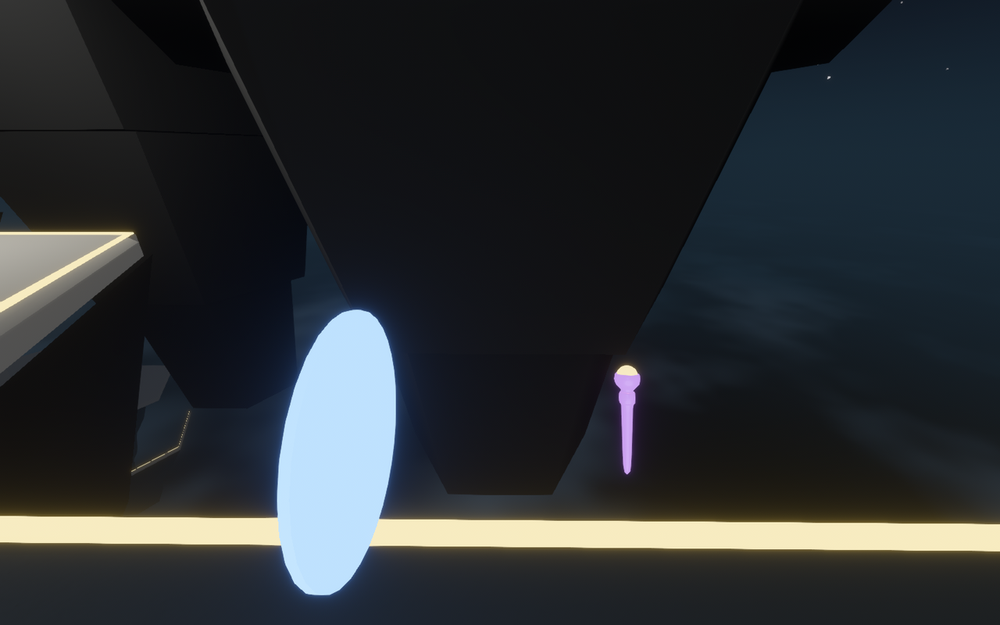
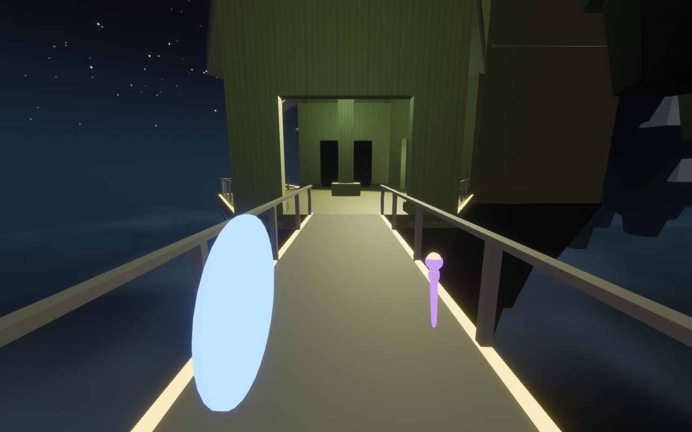
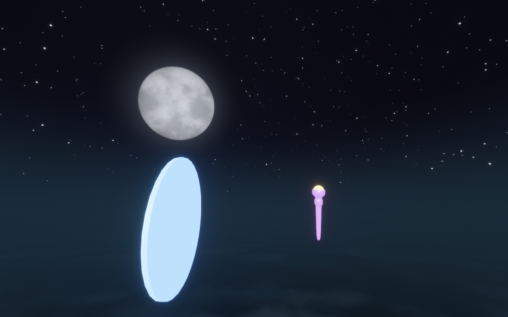

# Open air in the facility

`labs/vista_lab` showed what the facility could look like from inside open air: sheer
storey cliffs, floating structures, walkways with nothing on either side. This note
records how that was brought into the facility the game actually plays. It covers the
rules, the decisions behind them, what was measured, and what is still thin.



## Decisions

Made on 2026-09-24, before implementation:

| Question | Decision |
| --- | --- |
| How does the facility open onto the air? | **Open edges by rule**, derived from the solved shape. No new tiles. |
| What happens at a drop? | **The height rule**: railed below level 5, bare from level 5 up. |
| The boundary wall around the lattice? | **Removed.** The rim is open air like everywhere else. |
| May tiles seen across open air change while someone is looking? | **Yes, for now.** Observation still follows door connections, so a distant tile seen across air is not frozen: a relayout can rewrite it in plain sight, and its far skin swaps in place. That may look good; revisit once it has been seen in play. |

## The rules

**Air is classified, and stays classified.** The match calls
`HexWfcWorld::mark_open_air` when it solves the facility. A world that classifies air
re-derives the classification after every committed or reverted relayout, in both
directions: air that a new cell has sealed off goes back to rock. An air cell that a
relayout hands back as rock is not counted as a change.
(`observed_facility::hex_wfc`)

**Walls come down where a corridor meets the outside.** A one-level corridor hall
(straight, corner, junction, expanse) that faces an unbuilt cell or the lattice edge
loses the authored structure standing in that face's sector. It gains a lit lip and,
below level 5, a railing. A straight hall open on all four flanks becomes a 2.6 m
walkway. Rooms, ramps and shafts keep their walls. A railing is an invisible
full-height guard collider behind drawn posts and rail, because a guard drawn at
collider size reads as a wall. (`observed_match::hex_wfc::geometry::open_edge`)

**The rim is railed where it stays walled.** The boundary shell used to plug room
ports authored at the lattice edge. Now every cell that keeps its walls carries a lip
and, where the height rule says so, a railing on its rim faces. Where the prefab has a
wall they sit inside it; where it has an opening they make a balcony.

**Geometry follows built versus unbuilt, not air versus rock.** A relayout only builds
or clears cells inside its own region. Air and rock, by contrast, can flip anywhere a
pocket is sealed or opened. If walls followed air, a watched loggia could close.

**The observation contract is unchanged.** A corridor hall's walls now depend on its
lateral neighbours, so a protected hall holds those neighbours out of the relayout
pocket. The pocket shrinks around watched halls instead of committing a change that
would alter one. Pinned pieces still never change.

**A fall is a setback, not a softlock.** A body can step off a bare edge onto the
roof of a lower hall, and the railed loggias around that roof keep it out. After three
seconds on a roof, the body goes back to the last cell it stood in.

## Presentation

- **Open-edge pieces** have their own mesh groups: the lip (a lit `GantryEdge`
  signal), the railing and the walkway (connective structure, the same in every
  district), and the truss. Guards are never drawn. A cell carrying open-edge or rim
  pieces is no longer a pure function of its tile, so it is cached by position.
- **The sky**: a dome that is darkest straight down, and a two-layer cloud sea below
  the lattice. It uses the same `observed_style::open_air` colours and cloud texture
  as the Architect cutaway and the vista lab.
- **The moon and the stars**: a large moon, nearly twenty degrees across because the
  megastructure stands so high, hanging low in the west-south-west with a soft halo,
  and eighteen hundred stars thinning toward the horizon haze. The moon's direction is
  one constant (`open_air::toward_moon`), shared by the disc in the sky, the shading
  baked into the far skin, and the vista lab's moonlight. It is HDR and blooms, but it
  stays under the signal floor, so no gameplay cue competes with it.
- **Outdoors atmosphere**: when the player's cell has open edges, the palette becomes
  `open_air(palette)`. Fog reaches about 300 m and fades into the horizon instead of
  black, and the fill light is the moon's cool neutral.
- **The far-field skin** (`view::exterior`): streaming keeps detailed cells within
  about 30 m, and open edges let you see much further. The skin covers the building
  beyond that:
  - moonlit concrete storey faces wherever a cell is walled against the outside, with
    lit window slits;
  - slab and ceiling bands with a distant lit line where a cell opens;
  - roofs, and a keel under whatever hangs over true void.

  A cell's skin is hidden while its detailed geometry is resident. The moon's angle is
  baked into vertex colour, since the facility carries no directional light.

## Measured

On the production facility as it was when open edges landed (24 × 17 × 8, the
committed profile at its old void share of 300, six seeds; see *More void* below for
what the profile asks for now):

| | per facility |
| --- | --- |
| built / air / rock | ~2,480 / ~680 / ~105 cells (76% / 21% / 3%) |
| built cells with a face open to air | ~1,230 |
| straight halls with air on all four flanks (walkways) | 7 to 11 |
| doors that open onto air | 0 |

Across the whole tile corpus (13,572 faces):

- **Every sealed face opened at once:** nothing stays standing in any of them.
- **One face opened alone:** 32 faces keep a corner mass belonging to the face next
  door.

In the deterministic gate bot's match, holding a protected hall's neighbours out of
the pocket committed 22 relayouts where the old rule committed 21. The bot's route was
tick for tick the same.

## Evidence

```powershell
$env:OBSERVED2_CAPTURE_HEX_WFC_VISTA = "docs/evidence/open_air_facility"; cargo dev-run -p observed_game
```

The capture stands the runner in open edges of the production facility, chosen for the
deepest drop beyond them, and takes one still at each.

| | |
| --- | --- |
|  |  |
|  |  |
|  | |

## More void: the composition

At 300 the production facility is 76% built, so most open edges overlooked the roof of
the storey below. The committed composition profile now asks for a void share of
**2,000**, relabelled `open air`.

**What it does to the shape** (`vista_lab`'s `sweep_void_share`, six seeds, arc lattice):

| void share | air | open halls | walkways | deep drops off the rim | deep drops between towers | floating cells | solved, exit reachable |
| --- | --- | --- | --- | --- | --- | --- | --- |
| 300 (was) | 21% | 903 | 9 | 368 | 294 | 137 | 6/6, 6/6 |
| 1,000 | 43% | 785 | 18 | 191 | 551 | 212 | 6/6, 6/6 |
| **2,000** | **56%** | 671 | 29 | 131 | **674** | 244 | 6/6, 6/6 |
| 4,000 | 69% | 485 | 32 | 72 | 612 | 255 | 6/6, 6/6 |

Solve time is flat at about 0.4 s throughout. Drops between towers, the vista's look,
peak near 2,000; beyond it the building thins and they fall away.

**What it does to a match** (`survey_void_share_playability`, a solo spectator runner
on the arc lattice, ten seeds):

| void share | finished | median completion tick | recoveries |
| --- | --- | --- | --- |
| 300 (was) | 10/10 | 20,633 | 0 |
| 1,500 | 9/10 | 20,589 | 0 |
| **2,000** | **10/10** | **18,457** | 0 |

At 1,500 one runner stalled while seeking, standing on a level-4 hall; it was not a
fall. Two thousand finished every run and ran about 10% faster at the median.

To try another share in the game without committing it:

```powershell
$env:OBSERVED2_HEX_VOID_SHARE = "4000"; cargo dev-run -p observed_game
```

The share is folded into the simulation content hash, so a LAN peer on a different
composition refuses the match.

## Two bugs the gate could not see

Both were found by the production survey after open edges merged, and both are fixed
with tests that fail without the fix.

- **Holed floors.** Most corridor halls are narrower than their cell, and the solid
  masses either side of the corridor carry its floor as well as its wall. Removing a
  mass to open a face holed the floor. Each removed mass now leaves its footprint as
  floor.
- **A walkway kept the hall's path.** A span kept the full-width hall's authored deck
  guide, which weaves across floor the span no longer has. It walked the runner off an
  unrailed level-7 walkway, onto the roof below and back, for the rest of the match. A
  span now carries no authored guide.

The gate missed both because its hex fixtures are compact four-level facilities built
from the compatibility tiles. Bare edges only start at level 5, and the committed
corpus is richer. `production_runner_crosses_unrailed_open_edges_without_falling` now
runs the seed that looped, on the arc lattice, in the gate.

## Still thin

- **The far skin is lit by its bake.** The moon now hangs in the sky where the bake says
  it is, but nothing in the scene casts its light: the facility still carries no
  directional light, because one without shadows would light every interior through
  its walls, and one with them has a cost at this scale that has not been measured.
- **Observer sight does not cross open edges, by decision for now.** Observation in the
  match still follows ports, so tiles seen across air can change in plain sight (see
  *Decisions*). Freezing them, as `architect_lab` models, remains available if watching
  the distance rewrite itself turns out to read as a bug rather than a spectacle.
- **The retired boundary role is still in the code.** `HexStructureRole::Boundary` and
  the per-piece spawn path that drew the shell are now dead. Removing them touches
  `hex_wfc_lab` and the spectator, and is left for a clean-up.
