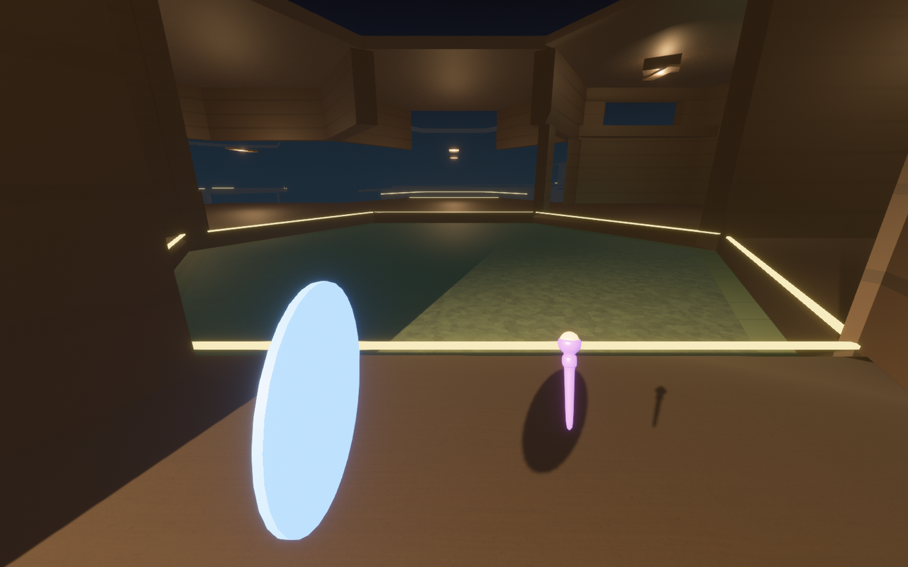

# Open air in the facility

`labs/vista_lab` showed what the facility could look like from inside open air: sheer
storey cliffs, floating structures, walkways with nothing on either side. This note
records how that was brought into the facility the game actually plays. It covers the
rules, the decisions behind them, what was measured, and what is still thin.



## Decisions

Made on 2026-09-24, before implementation:

| Question | Decision |
| --- | --- |
| How does the facility open onto the air? | **Open edges by rule**, derived from the solved shape. No new tiles. |
| What happens at a drop? | **The height rule**: railed below level 5, bare from level 5 up. |
| The boundary wall around the lattice? | **Removed.** The rim is open air like everywhere else. |

## The rules

**Air is classified, and stays classified.** The match calls
`HexWfcWorld::mark_open_air` when it solves the facility. A world that classifies air
re-derives the classification after every committed or reverted relayout, in both
directions: air that a new cell has sealed off goes back to rock. An air cell that a
relayout hands back as rock is not counted as a change.
(`observed_facility::hex_wfc`)

**Walls come down where a corridor meets the outside.** A one-level corridor hall
(straight, corner, junction, expanse) that faces an unbuilt cell or the lattice edge
loses the authored structure standing in that face's sector. It gains a lit lip and,
below level 5, a railing. A straight hall open on all four flanks becomes a 2.6 m
walkway. Rooms, ramps and shafts keep their walls. A railing is an invisible
full-height guard collider behind drawn posts and rail, because a guard drawn at
collider size reads as a wall. (`observed_match::hex_wfc::geometry::open_edge`)

**The rim is railed where it stays walled.** The boundary shell used to plug room
ports authored at the lattice edge. Now every cell that keeps its walls carries a lip
and, where the height rule says so, a railing on its rim faces. Where the prefab has a
wall they sit inside it; where it has an opening they make a balcony.

**Geometry follows built versus unbuilt, not air versus rock.** A relayout only builds
or clears cells inside its own region. Air and rock, by contrast, can flip anywhere a
pocket is sealed or opened. If walls followed air, a watched loggia could close.

**The observation contract is unchanged.** A corridor hall's walls now depend on its
lateral neighbours, so a protected hall holds those neighbours out of the relayout
pocket. The pocket shrinks around watched halls instead of committing a change that
would alter one. Pinned pieces still never change.

**A fall is a setback, not a softlock.** A body can step off a bare edge onto the
roof of a lower hall, and the railed loggias around that roof keep it out. After three
seconds on a roof, the body goes back to the last cell it stood in.

## Presentation

- **Open-edge pieces** have their own mesh groups: the lip (a lit `GantryEdge`
  signal), the railing and the walkway (connective structure, the same in every
  district), and the truss. Guards are never drawn. A cell carrying open-edge or rim
  pieces is no longer a pure function of its tile, so it is cached by position.
- **The sky**: a dome that is darkest straight down, and a two-layer cloud sea below
  the lattice. It uses the same `observed_style::open_air` colours and cloud texture
  as the Architect cutaway and the vista lab.
- **Outdoors atmosphere**: when the player's cell has open edges, the palette becomes
  `open_air(palette)`. Fog reaches about 300 m and fades into the horizon instead of
  black, and the fill light is the moon's cool neutral.
- **The far-field skin** (`view::exterior`): streaming keeps detailed cells within
  about 30 m, and open edges let you see much further. The skin covers the building
  beyond that:
  - moonlit concrete storey faces wherever a cell is walled against the outside, with
    lit window slits;
  - slab and ceiling bands with a distant lit line where a cell opens;
  - roofs, and a keel under whatever hangs over true void.

  A cell's skin is hidden while its detailed geometry is resident. The moon's angle is
  baked into vertex colour, since the facility carries no directional light.

## Measured

On the production facility (24 × 17 × 8, the committed composition profile, six
seeds):

| | per facility |
| --- | --- |
| built / air / rock | ~2,480 / ~680 / ~105 cells (76% / 21% / 3%) |
| built cells with a face open to air | ~1,230 |
| straight halls with air on all four flanks (walkways) | 7 to 11 |
| doors that open onto air | 0 |

Across the whole tile corpus (13,572 faces):

- **Every sealed face opened at once:** nothing stays standing in any of them.
- **One face opened alone:** 32 faces keep a corner mass belonging to the face next
  door.

In the deterministic gate bot's match, holding a protected hall's neighbours out of
the pocket committed 22 relayouts where the old rule committed 21. The bot's route was
tick for tick the same.

## Evidence

```powershell
$env:OBSERVED2_CAPTURE_HEX_WFC_VISTA = "docs/evidence/open_air_facility"; cargo dev-run -p observed_game
```

The capture stands the runner in open edges of the production facility, chosen for the
deepest drop beyond them, and takes one still at each.

| | |
| --- | --- |
|  |  |
|  |  |

## Still thin

- **The production facility is dense.** It is 76% built, so most open edges overlook
  the roof of the storey below. The deep drops are at the rim, where the view is the
  cloud sea, not the building. For the vista's towers and floating islands to appear in
  play, the composition profile needs more void between structures. That is a
  composition question, not a rendering one.
- **The far skin reads dark.** It is correct at the edge of the fog, but without a real
  moon the distant building is mostly silhouette and window light.
- **Observer sight does not yet cross open edges.** Observation in the match still
  follows ports. Seeing across air (which `architect_lab` already models) is the next
  gameplay step, and it touches the observation contract, so it is a design decision.
- **The retired boundary role is still in the code.** `HexStructureRole::Boundary` and
  the per-piece spawn path that drew the shell are now dead. Removing them touches
  `hex_wfc_lab` and the spectator, and is left for a clean-up.
