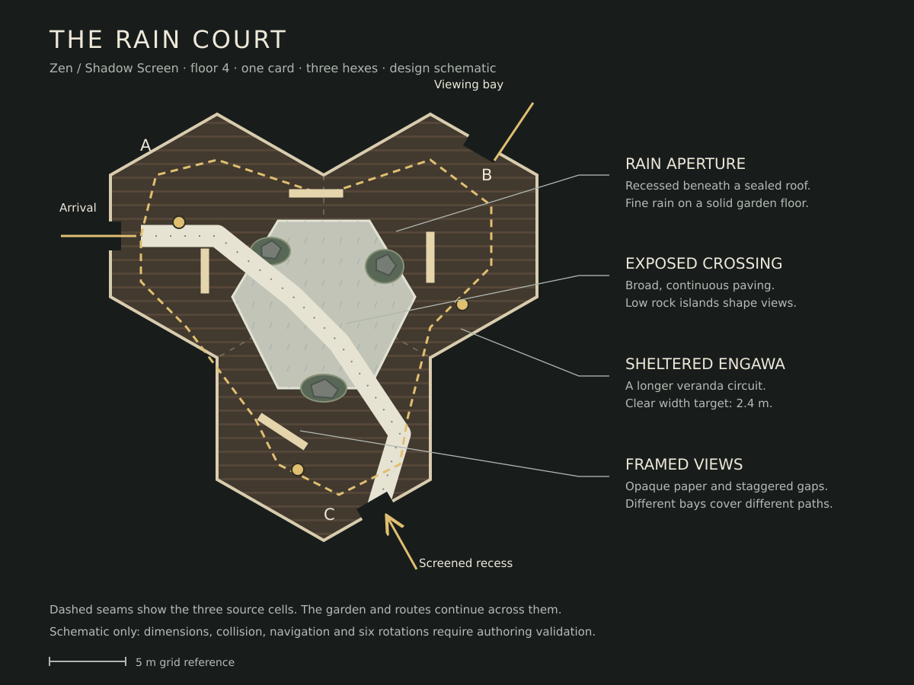

# The Rain Court — a Zen wonder

Researched and implemented on 2026-10-04. One Architect card now places the
three-sector Rain Court on Zen floors. See the [game captures, physical
walkthrough and verification](evidence/rain-court/README.md).

Zen is `ShadowScreen`, displayed floor 4 in the current eight-floor ascent.
Its existing identity is pale paper against dark timber, tatami, slatted ceilings
and long sunset shadows. The Rain Court should make **framed views and the handoff
of observation** memorable within that identity.

## Research

| Reference | What the source establishes | Design inference |
| --- | --- | --- |
| [Katsura's moon-viewing platform — Imperial Household Agency](https://kyoto-gosho.kunaicho.go.jp/en/room/3A240/) | Opening the shoji doors reveals the garden beyond a veranda and projecting bamboo platform. | A sheltered engawa — a veranda along the garden — can frame a crossing and give a teammate somewhere to watch it. |
| [Katsura photographic tour — Imperial Household Agency](https://www.kunaicho.go.jp/en/learn/institution/shisetsu/kyoto/katsura-ph.html) | The Shokintei's first room has patterned paper sliding doors; the villa's buildings and garden paths create distinct viewing positions. | Use repeated timber bays, opaque paper panels and offset openings to reveal the garden in changing fragments. |
| [Teshima Art Museum — Benesse Art Site Naoshima](https://benesse-artsite.jp/en/art/teshima-artmuseum.html) | Rei Naito and Ryue Nishizawa's museum admits light, wind and outside sound through two roof openings; water emerges across its floor. | A small amount of water and a strongly framed light source can animate a quiet space. Our garden and rain aperture are an original arrangement, not a copy of the museum or its artwork. |

The projecting veranda is the reference for a place to pause, look and cover a
teammate. [Photograph and description — Imperial Household Agency](https://www.kunaicho.go.jp/en/learn/institution/shisetsu/kyoto/katsura-ph.html).

Paper, timber and deliberate framing supply the material direction; we would
develop our own screen pattern. [Photograph and description — Imperial Household Agency](https://www.kunaicho.go.jp/en/learn/institution/shisetsu/kyoto/katsura-ph.html).

The relationship between a quiet interior, an aperture and moving water supplies
the atmospheric direction. [Official museum account and photographs — Benesse Art Site Naoshima](https://benesse-artsite.jp/en/art/teshima-artmuseum.html).

These photographs stay with their publishers. They are references, not game
assets or evidence of a playable room.

## Imagine

A low paper-screened threshold opens onto a dark timber veranda. Beyond its
eaves, fine rain falls into a pale stone garden. Three moss islands hold low,
weathered rocks. Broad flat stones lead across the garden; wet edges catch the
light, while the veranda stays dry. Warm lanterns illuminate the paper bays.

Across the court, another sheltered ledge is visible through an offset opening.
A teammate can see the middle of the crossing from one bay and its far end from
another. The position that revealed the garden on arrival does not expose every
approach at once. Walking changes the view before it changes the destination.

The rain falls from a recessed luminous aperture inside the building. Zen has
another district above it: its roof remains sealed within the existing storey.
This is a garden that appears to have weather indoors, with shallow runnels
disappearing below the veranda. Small wet surfaces and fine rain sell the place;
the playable garden is a continuous solid floor.

## Design

[Standalone schematic](compositions/rain_court/plan.svg). It is a proposed spatial
arrangement, not authored collision or a final placement contract.

- **One card, three adjoining hexes, one floor.** Use the existing atomic
  multi-tile placement pattern, three exterior doorways and continuous internal
  spans. Author six exact lattice orientations rather than rotating an
  approximate regular hexagon. Keep the current district progression.
- **A continuous sheltered route.** The engawa loops around the garden, with a
  target clear width of at least 2.4 m after posts and screens. Each external
  approach joins this route. Small sitting alcoves sit outside its clear width.
- **A shorter exposed crossing.** Broad paving stones suggest a route through
  the rain between the garden's low rock islands. A continuous floor underlies
  them; traversal requires neither jumping nor swimming. All three approaches
  can reach the crossing or take the veranda.
- **Three distinct views.** Arrival, a projecting viewing bay and a far screened
  recess give different views of the crossing and approaches. Staggered opaque
  panels and real gaps determine visibility. Paper glow never makes a solid
  panel transparent to observation.
- **A sealed rain aperture.** A recessed canopy fits below the eight-metre
  ceiling. Gentle local rain, shallow surface ripples and drainage are
  presentation effects. The composition needs no open upward port, extra floor,
  fluid simulation or dynamic weather system.
- **Fixed light before entry.** Room-owned lanterns and aperture lights provide
  the readable paper-to-timber contrast under existing generator power. Exclude
  the moving district key inside the composition, following the earlier wonders.
  Reserve readable unpowered surfaces and existing lantern counterplay.
- **Materials with physical roles.** Dry timber and limited tatami belong under
  the eaves; pale stone, subdued moss and wet mineral surfaces belong in the
  garden. Shared Zen style APIs own the palette. Architectural glows remain
  distinct from gameplay signals. No district-wide material revision is included
  in this location proposal.

Authored floors, panels, posts, rocks, thresholds and roof determine collision
and observation. Decorative lattice detail, rain and water follow that geometry.
Any reflection is decorative; it does not observe a Guardian. A quiet localized
rain loop would be a presentation addition with a bounded emitter, not an audio
masking or stealth mechanic.

## Connection to the active goals

**Observers and their Architect:** the court offers an exposed shortcut toward
the onward route and a longer covered circuit. Different viewing bays let a team
handoff observation of a Major Guardian while another member crosses, searches
an approach or attempts a rescue. The protected geometry still follows ordinary
observation, occupancy, anchor and prison rules. Shelter grants no immunity.

**Rogue:** opaque screens and low rock groups create approaches that must be
watched from different positions. The Rogue can contest these approaches and
the surrounding mutable routes using existing cards and Guardian rules. This
wonder supports the existing capture objective; it does not need another global
victory timer to justify its place in Zen.

## Authoring and review plan

The implemented location pass delivers the three-sector composition, one Architect card,
Zen floor restriction, six exact orientations, continuous navigation, the fixed
light setup and bounded local rain presentation. Reserve the existing hull and
light budgets; batched decorative detail must stream, rewrite, cut away and
despawn with its owning cells. Do not change the ascent's victory predicates.

Review with an overhead plan, a low entrance view, a garden-level crossing view,
a reverse view from the projecting bay, and a first-person walkthrough covering
all external approaches and internal joins. Show powered and unpowered lighting.
The rain and aperture must already be visible from the approach, without a light
following the arriving player.

Acceptance requires a recognizable garden and veranda from eye level, clear
distinctions between opaque screens and open views, traversal without hopping,
and usable routes in every supported orientation. Prove collision and
observation against the actual authored geometry, then validate the multi-tile
card under the existing atomic placement and mutation protections. Game captures
establish those properties; this schematic and the reference photos do not.

Related: [district wonder shortlist](cistern_wonders_proposal.md),
[Architect Ascent](architect_ascent_design.md),
[authoring workflow](tile_authoring.md).

The schematic above records the design direction. The [authored CAD plan](evidence/rain-court/rain-plan.png)
records the production geometry, including the exact three door orientations,
covered circuit, screen gaps and nine faceted garden stones. The evidence page
records the implementation checks and reproducible capture commands.
