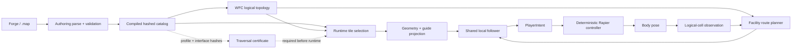
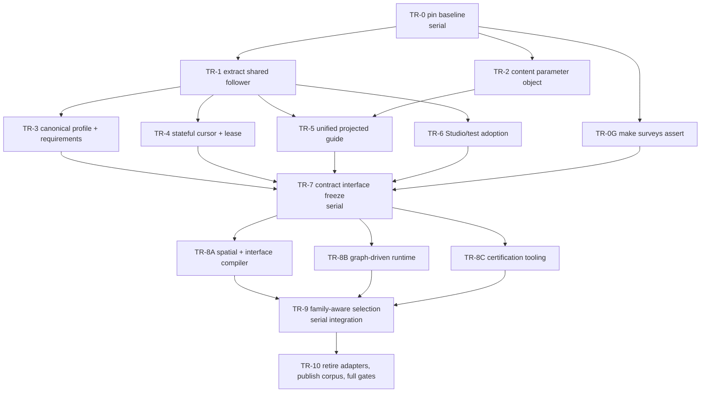

# Refactor Arc S — Traversal Contracts and Module Assembly

**Status:** executing — Waves 0-5 complete; TR-10 is the last packet

**Planning baseline:** `main@911b046` (`Merge branch 'arc-r/switchback-atomic-2'`)

**Trigger:** the switchback-to-perimeter-ramp replacement succeeded, but only after
failures escaped isolated tile validation and appeared as multi-seed spectator-bot
stalls in assembled facilities.

## Execution status

The integration branch is `refactor/traversal-contract-integration`. Completed work:

| Wave | Packets | Integration evidence |
|---|---|---|
| 0 | TR-0, TR-0G | Baselines pinned and production seed surveys promoted to assertions (`5053ca2`, `2f7bf65`). |
| 1 | TR-1, TR-2 | Shared stateless follower and immutable `HexMatchContent` merged (`03cbe42`, `3008da7`). |
| 2 | TR-3, TR-4, TR-5 | Canonical runtime profile, external stateful bot driver, and atomic projected guides merged (`7265b50`, `1eac79f`, `97169dc`). |
| 3 | TR-6, TR-7 | Studio's canonical Rapier audit and the reviewed shared serialized contract seam merged (`41c4bfa`, `4330f07`). |
| 4 | TR-8A, TR-8B, TR-8C | All three merged (`6c59e86`, `d9d2720`, `4fdb616`). Union gate: fmt clean, `dev-clippy` clean, `dev-test` 1823 passed / 0 failed, asserting 24-seed survey passes, `git diff --check` clean, catalog `74ead7a6…` and profile `99e682b1…` unmoved, no generated artifact touched. |
| 5 | TR-9 | Family-first selection merged (`2a218b2`). Union gate: fmt clean, `dev-clippy` clean, `dev-test` 1829 passed / 0 failed, asserting 24-seed survey passes, `diff --check` clean. Every pin holds unedited - catalog, profile, simulation `9937ed51…`, both spectator selection digests, the intent/body trace, the headless completion tick. No generated artifact touched. |

### Wave 5 integration notes

The `"stair_tower"` string special case is **gone** from both match projection
and Composition Traversal Studio, and the Studio's coverage now calls the
production selector rather than copying it. Assembly width comes from
`AssemblyContract::scope` for contracted content; for compatibility content it
is read from the geometry — an archetype presenting `ShaftOpen` on `Up` or
`Down` is a `VerticalColumn`. That reproduces the deleted string's answer
exactly on the committed corpus and stays true for the next tower an author
draws, which the string never would have.

**The packet's real question was answered by an empty diff.** The acceptance
fixture — a second complete tower family with a distinct aperture — required no
new match or bot conditional, and no file under `observed_traversal/**` or the
bot's steering appears in the change at all. That is the whole point of Arc S
stated as a measurement.

**And the coverage it does not have.** Two families never mix under any
condition TR-9 could construct: five seeds, all ten districts, every tower
signature, end caps, and a committed relayout. But that is a synthetic kit.
Nothing in the committed corpus declares a family, so the family path has **zero
production coverage** until TR-10 migrates the corpus. The green board measures
the mechanism, not the content.

**TR-10 inherits one undecided rule**, documented at `family_options`: once a
family exists for an archetype it is authoritative for that assembly, and
compatibility prototypes of the same archetype are not consulted — even one
sitting at the exact register while the family answers only `generic`. The
alternative lets a column take a compatibility cell at one level and a family
member at the next, which is the original fault wearing a different hat. Inert
today; real the moment a migrated `hall_straight` coexists with the generated
compatibility kit.

### Wave 4 integration notes

**TR-8B is additive and inert.** Nothing in the committed corpus populates
`ProjectedTraversalGuide.graph` — the single projection site in
`geometry.rs::push_tile` still passes `graph: None` — so the legacy adapters are
implemented and tested but reachable only from tests. Production intents, the
selection digest, the perimeter-tower intent/body trace, and the catalog hash
are unchanged, and the pin tests passed without being edited. Populating the
field belongs to whoever owns `geometry.rs` next; it is not a leftover.

**Two seam questions were escalated rather than decided by the worker, and both
were escalated correctly.**

*Objective on the lease — declined.* `HexTraversalLease` carries no objective, so
the driver keeps one in a local `GraphLeg` wrapper. That stays. An objective is a
match/AI concept and the ownership table already says `observed_traversal` does
not own objectives; putting one on the lease would leak match semantics into the
traversal crate to save a wrapper. TR-9 should not revisit this without a reason
that is not convenience.

*Graph-follower turning constants.* The graph's capture radius is a graph
constant rather than a `FollowerConfig` field, because `FollowerConfig` is hashed
into the frozen profile identity `29e48ecf…` and adding a field there would have
moved it silently. Correct call; noted here so it is not mistaken for an
oversight later.

### What wave 4 does *not* yet prove

Three gaps, all disclosed by their own packets rather than found later. None is
a defect; each is a reason TR-9 and TR-10 cannot be treated as tidying.

1. **Contract-authority certification has never run against a real tile.** The
   committed corpus has no v3 contracts, so `tilec certify-corpus` reports 0
   contract / 67 compatibility / 58 no-traversal. The corruption gate is genuine
   but its evidence is a synthetic fixture. TR-10's migration is what turns
   certification from a mechanism into a measurement.
2. **The compiler's thresholds are unproven against authored geometry.**
   `CLEARANCE_HEIGHT_UNITS = 36` and the ±8-unit channel were chosen against
   fixtures. Expect to tune them at migration, and expect the first real run to
   fail loudly - that is the point of it.
3. **Clearance obstruction is tested along the clearance axis**, by exact
   point-in-plan-convex-hull, not by full solid intersection. It catches a
   blocked doorway or a capped shaft; an obstruction sitting *beside* the axis
   passes. Recorded in `compiler/spatial.rs`.

### Two operational notes for later waves

**The FGD is behind the schema.** `tile_meta` gained three v3 properties that
the TrenchBroom definition does not list, so a v3 module is authorable from the
forge but not from the entity browser. Updating `fgd.rs` alone red-lights
`committed_fgd_matches_generated_fgd`, because the `.fgd` is publisher-owned;
schema and regeneration land together, in TR-10.

**A stale shared target artifact imitates a merge conflict.** Merging TR-8A
produced four convincing `unresolved import` errors in TR-8B's `bot/leg.rs`,
visible only through `composition_studio`. The symbols existed, were ungated,
and `observed_match` compiled clean standalone; the cause was a partial artifact
left by a concurrent-link collision during parallel execution.
`cargo clean -p <crate>` clears it. Do not spend the diagnosis time twice, and do
not let it be recorded as a cross-packet incompatibility.

TR-7 intentionally moves the runtime-profile identity from v1
`15ee7875d369...` to v2 `29e48ecf1d20...`. V1 omitted effective Rapier
character-controller values that were hard-coded at the call site. V2 names the
physics that actually runs; controller inputs, completion ticks, and body/replay
digests remain unchanged. This hash is not yet folded into catalog, snapshot, or LAN
identity. TR-10 owns that later compatibility boundary.

Compiled catalog v3 remains byte-compatible and rejects embedded contracts. Catalog
v4 requires complete, canonical contracts but deliberately fails runtime expansion
until the TR-8 adapters exist. Certificate DTO fields and canonical certificate
serialization are owned by TR-8C, after its real runner proves the necessary stacked
pair and failure-trace data; TR-7 provides only the shared guide and interface hash
value objects needed for that work.

## Decision

The next refactor should establish one explicit contract:

> A resolved module assembly, evaluated under one traversal profile, provides a
> certified local traversal graph that geometry projection, bots, tests, and tools
> all consume.

This is not a universal navmesh project. It is a small, deterministic graph over
authored module ports, deck paths, climbs, and their physical controller. Facility
pathfinding continues to answer **which external port comes next**. A shared local
follower answers **how to cross the selected physical module** and emits ordinary
`PlayerIntent`. The production Rapier controller remains the only authority that
moves bodies.

The work is split into two hats:

1. **Refactoring Hat:** preserve catalog hashes, selected tiles, emitted intents,
   completion ticks, and snapshot digests while centralizing current behavior.
2. **Contract Hat:** intentionally change schemas, selection, hashes, and validation
   only after the shared seams are in place and characterized.

That separation is a merge rule, not merely an organizational preference. A commit
must not mix behavior-preserving extraction with a new content contract.

## Why this incident was expensive

The replacement crossed more systems than the source tile suggested:

| System | Current responsibility | Failure exposed by the replacement |
|---|---|---|
| Forge / `.map` sources | Hulls, floor apertures, ramps, lights, ports, spine, deck | A locally plausible ramp could still have the wrong stacked aperture, tread mass, or exit route. |
| Authoring schema | `levels`, footprint, ports, validation budgets | `levels` simultaneously represents logical occupancy, geometry allowance, and standalone bounds. |
| Compiled catalog | Rotation/register expansion, hashes, runtime prototypes | It has no family or assembly identity, so compatible signatures can select incompatible shapes. |
| WFC topology | Chooses logical spaces and external signatures | It correctly proves connectivity but knows nothing about a capsule's route through selected geometry. |
| Geometry projection | Selects tiles and projects hulls, spines, decks, lights, sockets | Related output is carried in parallel collections, making partial updates and drift possible. |
| Bot route planner | Chooses a cell route to an objective | It also owns shape-specific local steering and handoff rules that do not belong to facility planning. |
| Movement sync | Projects a Rapier pose back to a logical cell | Height hysteresis can change the route-planner cell while a physical local traversal is still active. |
| Authoring tests | Exercise individual tiles and stacked fixtures | Several copied the bot's steering rule, so a drifted copy could agree with itself and still miss production behavior. |
| Composition Studio | Fast geometric walkability diagnosis | Its useful geometric probe is advisory and has a separate route/follower interpretation. |
| Game gates | Spectator route and production corpus | The 24-seed survey was ignored and printed stalls without asserting that the list was empty. |

This is the Refactoring.Guru **shotgun surgery** smell: one concept—physical module
traversability—has fragments in authoring, catalog selection, projection, match AI,
movement synchronization, tools, and tests. The cure is not a larger bot system. It
is a stronger boundary and one owner for each decision.

## Baseline evidence anchors

Line numbers refer to `911b046` and are navigation aids, not permanent API promises.

| Path / symbol | Baseline evidence |
|---|---|
| `crates/observed_authoring/src/source.rs:47` — `ModuleCell` | One `levels` field participates in exact footprint expansion and spatial validation. |
| `crates/observed_authoring/src/tile.rs:136,314,405` — `StairSpine`, `DeckPath`, `TilePrototype` | Authoring owns local guide math and stores climb/deck separately beside geometry. |
| `crates/observed_authoring/src/catalog.rs:51,165` — `CompiledModule`, runtime expansion | Compiled modules serialize `levels`, spine, and deck, then independently expand registers and rotations. |
| `crates/observed_authoring/src/lib.rs:67` — `RuntimeHexCatalog` | The loader correctly bundles cells, rooms, composition, and a folded catalog/composition hash, but not the traversal profile. |
| `crates/observed_match/src/hex_wfc/geometry.rs:86,582,758` | Projection carries parallel guide collections; `Catalogue::tile_for` selects by archetype/register/signature and special-cases `"stair_tower"`. |
| `crates/observed_match/src/hex_wfc/model/bot.rs:299,388,418` | `vertical_command`, `climb_command`, and `finish_stair_command` own physical shape and handoff policy. |
| `crates/observed_match/src/hex_wfc/model/movement.rs:179` — `resolve_level` | Logical level is reconstructed from feet height with hysteresis while bot steering reads the result. |
| `crates/observed_authoring/src/tests.rs:581,648` | The authoring harness copies the bot rule and separately invents a stacked-column environment. |
| `tools/composition_studio/src/module/walk.rs:28` | Studio derives a third set of traversal thresholds and describes physics as nondeterministic despite the promoted deterministic Rapier path. |
| `crates/observed_match/src/hex_wfc/mod.rs:33` | Match tests combine compatibility cells and strict towers rather than loading exactly the production corpus. |
| `game/src/hex_wfc/launch.rs:89` and `sim.rs:69` | The assembled game loads the actual authored corpus through different entrypoint plumbing. |
| `game/src/tests.rs:5065` — `survey_spectator_routes_across_seeds` | The production 24-seed survey is ignored and only prints its stall count. |

## Current and target flow



The feedback from body pose to logical cell remains useful for occupancy,
observation, objectives, and replanning. It must no longer replace or reverse an
in-flight local leg. A `TraversalCursor` owns that leg until arrival, explicit
invalidation, recovery, or an authorized teleport.

## Ownership after the refactor

| Owner | Owns | Does not own |
|---|---|---|
| `observed_facility` | Logical topology, external port sequence, route cost, relayout | Physical steering, hulls, controller thresholds, local module geometry |
| `observed_traversal` | Production controller, guide primitives, local follower, cursor, controller-derived requirements | WFC archetypes, module families, objectives, rendering |
| `observed_authoring` | Source schema, spatial contract, port bindings, module graph, family metadata, interface fingerprints, catalog compilation | Bot objectives, body mutation, presentation |
| `observed_match::hex_wfc` simulation | Bodies, objectives, facility state, resolved-instance projection | Shape-specific steering, keyboard input, bot-only route caches |
| `observed_match::hex_wfc::HexBotDriver` | Objective-to-facility route, traversal leases/cursors, progress watch, `HexPlayerCommand` production | Body mutation, rendering, authoritative replay state |
| `game` / `server` | Loading one immutable content object and advancing the match | Reassembling loose catalog/profile vectors |
| Composition Studio | Fast advisory geometry probe and visualization of authoritative results | A second production traversal policy |
| `tilec` | Deterministic compile-time validation and authoritative Rapier certification | Runtime recovery or hidden geometry fixes |

The existing strengths remain hard constraints:

- All movement enters through `PlayerIntent`.
- The deterministic raw-Rapier controller moves bodies; traversal never teleports.
- Simulation stays independent of presentation.
- Selection and validation use stable domain IDs, never Bevy `Entity` values.
- The internal traversal graph is not exposed as a player route. Exploration remains
  unsolved for human players.

## Target contracts

The names below are the intended API vocabulary. TR-7 freezes their exact fields and
serialization before contract work fans out.

### 1. One immutable match-content value

```rust
pub struct HexMatchContent {
    pub catalog: Arc<ResolvedHexCatalog>,
    pub traversal: TraversalRuntimeProfile,
    pub simulation_content_hash: [u8; 32],
}

impl HexWfcMatch {
    pub fn new(
        seed: u64,
        config: HexMatchConfig,
        content: Arc<HexMatchContent>,
    ) -> Result<Self, HexMatchError>;
}
```

`ResolvedHexCatalog` is expanded, validated, indexed, and immutable. It contains the
cell and room modules, composition profile, family index, and certificates needed by
initial projection and relayout. `HexWfcMatch` retains the same `Arc`; it does not copy
loose `Vec<TilePrototype>` and `Vec<RoomPrototype>` values into fields that can form an
impossible combination.

The current constructors remain thin adapters during the Refactoring Hat and are
deleted only in TR-10.

### 2. Explicit spatial meanings

```rust
pub struct ModuleSpatialContract {
    pub logical_footprint: LogicalFootprint,
    pub geometry_envelope: GeometryEnvelope,
    pub clearance_volumes: Vec<ClearanceVolume>,
}

pub struct LogicalFootprint {
    pub cells: Vec<ModuleCellRef>,
}
```

- `logical_footprint` is the exact set of lattice cells owned by the module.
- `geometry_envelope` is where hulls, lights, sockets, and guide nodes may exist.
- `clearance_volumes` are spaces collision geometry must not enter when assemblies
  stack or meet.
- Per-cell floor policy remains attached to an exact logical cell.
- Structural shell decisions are derived from exact footprint and floor/interface
  policy; they are not inferred from another overloaded level count.

Authoring v1/v2 `levels` fields remain readable at the importer boundary and convert
once into the explicit internal contract. New v3 sources and compiled catalog v4 no
longer serialize the overloaded meaning.

For the perimeter tower this means: one logically owned cell, a declared upper
landing geometry reservation, and an explicit clearance/aperture volume for the
stacked handoff.

### 3. Family-first assembly selection

```rust
pub struct ModuleFamilyId(pub String);

pub enum AssemblyScope {
    Cell,
    VerticalColumn,
}

pub struct AssemblyVariantId {
    pub family: ModuleFamilyId,
    pub rotation: u8,
}
```

Selection order becomes:

1. Derive a stable assembly identity from `AssemblyScope`.
2. Resolve register or generic fallback for the whole assembly.
3. Select `AssemblyVariantId` once from the assembly identity.
4. Select the signature-specific member inside that variant.
5. Project that member's hulls, lights, sockets, interfaces, and traversal guide
   together.

For `VerticalColumn`, family and rotation are constant for the column. Rotation may
not be independently expanded and selected per signature member; doing so recreates
the fault that forced the atomic switchback removal. A separate family weight chooses
families. Member weights may only choose among interface-equivalent members within a
family.

The compiler rejects an assembly variant that lacks any demanded signature for its
archetype/register set. The runtime never silently mixes families to fill a hole.
The current `"stair_tower"` string special case in match projection and the duplicate
rule in Composition Studio are retired.

### 4. Quantized interface fingerprints

```rust
pub struct InterfaceProfile {
    pub face: HexFace,
    pub class: PortClass,
    pub landing: QuantizedPose,
    pub aperture: QuantizedAperture,
    pub clearance: QuantizedClearance,
    pub guide_terminal: QuantizedPose,
}

pub struct InterfaceFingerprint(pub [u8; 32]);
```

This extends `seam_auditor::FaceSignature`, which already captures lateral class,
floor, and headroom, to vertical interfaces. Fingerprints use canonical integer
authoring units, not tolerance-sensitive formatted floats.

`structural_hash` remains a hull-deduplication key. It must not double as an
interface fingerprint: a safe handoff also depends on the aperture, landing,
clearance, port, and guide terminal.

### 5. One module-local guide and follower

```rust
pub struct TraversalGuide {
    pub nodes: Vec<TraversalNode>,
    pub edges: Vec<TraversalEdge>,
}

pub struct TraversalEdge {
    pub from: TraversalNodeId,
    pub to: TraversalNodeId,
    pub mode: TraversalMode,
}

pub enum TraversalMode {
    Walk,
    Climb,
}

pub struct ModuleTraversal {
    pub guide: TraversalGuide,
    pub port_bindings: BTreeMap<String, TraversalNodeId>,
}

pub struct TraversalLease {
    pub instance: ModuleInstanceId,
    pub generation: u32,
    pub entry: TraversalNodeId,
    pub exit: TraversalNodeId,
}

pub struct TraversalCursor {
    pub lease: TraversalLease,
    pub edge: usize,
    pub direction: TraversalDirection,
}
```

`TraversalGuide`, its path math, cursor, and follower live in
`observed_traversal`. Module port bindings and compilation live in
`observed_authoring`. Projection transforms the guide and bindings into one
`ProjectedTraversalGuide` associated with a stable resolved module instance.

The follower consumes body feet/yaw, the projected guide, and a mutable cursor. It
returns `PlayerIntent` plus an explicit state such as `Following`, `Arrived`, or
`OffGuide`. It does not mutate the body, choose objectives, recompute facility routes,
or recover falls.

Bot-only derived state sits outside the authoritative match:

```rust
pub struct HexBotDriver {
    routes: BTreeMap<PlayerId, BotRouteCache>,
    cursors: BTreeMap<PlayerId, TraversalCursor>,
    progress: BTreeMap<PlayerId, ProgressWatch>,
}

impl HexBotDriver {
    pub fn command(
        &mut self,
        game: &HexWfcMatch,
        player: PlayerId,
    ) -> HexPlayerCommand;
}
```

The game and authoritative server own a driver for their bots. Replays and LAN clients
continue to consume recorded or server-owned commands, so the simulation does not
acquire a hidden bot-state dependency. `HexWfcMatch::bot_player_command` remains a
temporary compatibility adapter while callers migrate.

Existing `DeckPath` and `StairSpine` first compile into this graph without changing
their behavior. Direct flat crossings and legacy ramps receive deterministic adapter
graphs. Only after equivalence tests pass are the separate annotations and
`ramp_walk_dir`/archetype branches removed.

### 6. One traversal profile and certificate

The current profiles are measurably different: authoring tests use
`FpsConfig::default()` (7.0 m/s, radius 0.40 m, step 0.45 m); the hex match uses
`FpsConfig::deliberate_rapier()` (4.6 m/s, radius 0.38 m, step 0.42 m) and then silently
sets `look_step` to `1.0`; Composition Studio uses
`observed_content::TraversalProfile` defaults. A passing authoring walk therefore does
not currently certify the exact production body.

Introduce one complete value:

```rust
pub struct TraversalRuntimeProfile {
    pub controller: FpsConfig,
    pub follower: FollowerConfig,
    pub requirements: TraversalRequirements,
    pub profile_hash: [u8; 32],
}
```

`FpsConfig::deliberate_rapier()` plus the hex `look_step = 1.0` override remain
numerically unchanged during extraction, but are constructed in one place. Turning
converts desired yaw through the supplied `controller.look_step`; it never assumes
that value is `1.0`. `TraversalRequirements` derives radius, body height, step, slope,
snap, headroom, and guide-capture tolerances from the same runtime profile.

The existing serialized `observed_content::TraversalProfile` remains readable as a
compatibility DTO and gets one checked conversion. It currently omits the controller
integration `substep`, so it must not be described as a complete simulation profile.
The Contract Hat adds/version-controls the missing field and follower/guide contract
identity before the profile hash becomes a LAN gate. The handwritten conversion in
`game/src/content.rs` is then retired.

```rust
pub struct TraversalCertificate {
    pub profile_hash: [u8; 32],
    pub structural_hash: [u8; 32],
    pub guide_hash: [u8; 32],
    pub interface_hashes: Vec<InterfaceFingerprint>,
    pub certified_pairs: Vec<CertifiedPortPair>,
}
```

`tilec` produces the authoritative certificate by running the shared follower through
the production deterministic Rapier scene. The fast Composition Studio geometric
probe remains valuable advisory evidence and should reject obvious failures quickly;
it does not certify success.

Certification covers:

- every declared entry/exit pair in both directions;
- every unique vertical interface pairing;
- stacked lower/upper assemblies deduplicated by interface fingerprint rather than a
  Cartesian test of every cosmetic member;
- a representative three-cell vertical column;
- doorway-to-deck, deck-to-climb, climb-to-deck, and deck-to-door handoffs;
- no out-of-world recovery and deterministic intent/body digests.

## Ratchet invariants

These become tests before old code is deleted:

1. A logical facility route never depends on rendered entities or tile string names.
2. A resolved module instance selects geometry and guide atomically.
3. One vertical assembly uses one family, register fallback, and rotation.
4. Every selected external port is bound to a traversal node.
5. A local traversal lease owned by `HexBotDriver` survives logical-cell height
   rounding.
6. Relayout may invalidate a lease only when it changes that resolved instance; the
   invalidation is explicit and deterministic.
7. Teleport, Guardian setback, escape, and recovery explicitly tell the driver to clear
   the cursor.
8. Authoring and game tests call the production follower; no “as the bot does” copy
   remains.
9. Certification uses the same `FpsConfig` and Rapier controller as the match.
10. No normal or broad survey treats a non-empty stall list as success.

## Delivery graph

One integrator and at most three implementation agents work in parallel. The
integrator owns shared status, merges, full gates, and generated content.



## Work packets

### TR-0 — Pin the working behavior

**Hat:** Refactoring. **Owner:** integrator. **Must land first.**

Add characterization fixtures without moving production code:

- Pin the current compiled catalog/composition simulation hash.
- Pin selected `(cell, TileKey)` results for the production corpus on the canonical
  spectator seed and the formerly failing `10_000_031` seed.
- Pin tower source/module counts and current register fallback.
- Record a current local-climb intent/body trace and final digest.
- Pin the headless gate completion tick and snapshot digest.
- Add a synthetic test proving that an identical variation key across separate
  signature buckets does **not** guarantee family coherence.

**Exit:** all fixtures pass twice from clean processes and `git diff --check` is clean.
No production hash or generated asset changes.

### TR-0G — Turn diagnostics into gates

**Hat:** Refactoring. **Owner zone:** `game/src/tests.rs` and a new dedicated
production-corpus survey helper only.

- Extract `run_spectator_seed(seed) -> Result<SurveyReport, TraversalStall>`.
- Keep the 24-seed run ignored for duration, but make it assert an empty stall list.
- Add a small normal regression matrix containing the canonical seed and the formerly
  failing seed.
- Report stable seed, logical cell, resolved module instance/family, guide edge,
  position, and recent progress on failure.
- Preserve the current no-recovery assertion.

**Exit:** an intentionally tiny tick budget makes the test fail with useful evidence;
the real budget passes.

### TR-1 — Extract the exact current follower

**Hat:** Refactoring. **Owner zone:** new guide/follower modules under
`crates/observed_traversal`, `observed_match/src/hex_wfc/model/bot.rs`, and the
authoring traversal-test helpers.

Use Move Method, Extract Function, and compatibility re-exports:

- Move `StairSpine`, `DeckPath`, and their path math into `observed_traversal`.
- Extract the current approach, climb, terminal, and deck-handoff decisions into one
  pure stateless follower function.
- Keep match responsible for choosing the current cell/next cell and passing the
  current compatibility annotations.
- Replace copied authoring “as the bot does” loops with calls to the same follower.
- Preserve public authoring names through re-exports while consumers migrate.

Run old and new followers side by side in tests and compare every emitted
`PlayerIntent`, body bit pattern, completion tick, and final digest.

**Exit:** exact equivalence, unchanged content hash, and no copied bot rule in
`observed_authoring/src/tests.rs`.

### TR-2 — Introduce `HexMatchContent`

**Hat:** Refactoring. **Owner zone:** the runtime-content boundary, match constructors,
`game/src/hex_wfc/launch.rs`, `game/src/hex_wfc/sim.rs`, server, and catalog-consuming
labs. Do not edit bot or geometry-selection logic.

- Wrap the existing `RuntimeHexCatalog`, composition profile, production `FpsConfig`,
  and simulation hash in one immutable value.
- Change production/server construction to pass `Arc<HexMatchContent>`.
- Retain `new_with_rooms` and `new_with_profile` as test compatibility adapters.
- Store the immutable content object for relayout rather than independent prototype
  vectors.
- Centralize test-corpus construction so match, game, and server cannot assemble
  subtly different fixture catalogs.

**Exit:** facility selection, projection, snapshots, and network identity are
bit-identical; loose constructors have no production callers.

### TR-3 — Canonical traversal runtime profile

**Hat:** Refactoring. **Owner zone:** `observed_traversal` config/requirements,
`observed_content` conversion, and configuration-specific tests. Only one agent may
own traversal core during this packet.

- Add `TraversalRuntimeProfile` and `TraversalRequirements::from(&FpsConfig)`.
- Pass the match's production config into authoring/controller harnesses and tools.
- Replace `FpsConfig::default()`, `TraversalProfile::builder().build()`, `HEADROOM`,
  aperture, and capsule copies where they express the same physical contract.
- Preserve the current hex `look_step = 1.0` behavior explicitly and make follower
  turning scale through whatever `look_step` the profile supplies.
- Keep the serialized content schema readable, identify its missing `substep`, and
  prove its compatibility conversion plus explicit substep equal the shipped config.
- Define canonical hashing over every controller field, follower tolerance, and guide
  contract version, but do not fold it into the hex content hash yet.

**Exit:** changing one test config changes every derived authoring/certification
threshold in a focused test, without changing production numerical behavior.

### TR-4 — Extract `HexBotDriver`, then add a stateful cursor

**Hat:** Refactoring until parity is proven; any steering change moves to the Contract
Hat. **Owner zone:** match bot module, game/server bot call sites, and traversal
follower state. Movement remains read-only input to the driver.

- Move `BotRouteCache`, progress/stuck watching, and cursors into `HexBotDriver`, owned
  by the game/server input source rather than `HexWfcMatch`.
- Keep `HexWfcMatch::bot_player_command` as a temporary adapter until every caller
  supplies its driver.
- Acquire a lease when a facility route enters a resolved module leg.
- Continue that leg despite logical-level hysteresis until the authored terminal says
  it arrived.
- Explicitly clear/reacquire on target change, relevant relayout, recovery, authorized
  teleport, setback, or escape.
- Keep stuck recovery outside the follower.

First run a compatibility mode that produces the same decisions as current
`finish_stair_command`; only then remove height-based reconstruction.

**Exit:** the pinned command/intent trace and completion tick remain equal, replays
need no driver state, and a focused test can perturb logical-cell resolution mid-climb
without reversing the cursor.

### TR-5 — Project one guide value

**Hat:** Refactoring. **Owner zone:** `observed_match/src/hex_wfc/geometry.rs`, a new
geometry submodule if needed, and geometry tests.

- Introduce `ProjectedTraversalGuide` keyed by stable resolved module instance.
- Replace the parallel `climbs`/`decks` maps and their parallel delta handling with one
  guide collection.
- Project hulls, guide, bindings, lights, and sockets in the same resolved-instance
  pass.
- Keep accessors that synthesize the old maps while the bot adapter remains.
- Make relayout deltas add/remove a whole resolved instance's guide atomically.

**Exit:** full projection equals bounded-delta projection, unchanged stable collider
IDs and selection digests, and no partial guide survives instance removal.

### TR-6 — Adopt shared behavior in tools and tests

**Hat:** Refactoring. **Owner zone:** `tools/composition_studio/src/module/**`, tool
tests, and `tilec` diagnostic entrypoints only.

- Make Module Studio display the authoritative guide, bindings, cursor, and failure
  edge.
- Keep its geometric surface sampler as the fast advisory preflight.
- Add an optional deterministic Rapier walk that calls the production follower.
- Route authoring stack/door fixtures through the shared follower.
- Correct stale documentation that describes production Rapier as nondeterministic.

**Exit:** tools no longer own a second route/follower policy, while the fast geometric
probe remains independently testable.

### TR-7 — Freeze the contract seam

**Hat:** transition checkpoint. **Owner:** integrator. **Serial.**

Land one small commit that fixes:

- exact type/module names and ownership;
- v1/v2 compatibility conversions and v3/v4 serialization defaults;
- guide and interface canonical ordering;
- family, rotation, register-fallback, and weight semantics;
- certificate/profile/hash composition rules;
- which old APIs remain adapters through TR-10.

This commit may add empty/new types and adapters, but it must not regenerate the
corpus or change runtime selection. All TR-8 agents branch from this exact SHA.

### TR-8A — Compile explicit spatial and interface contracts

**Hat:** Contract. **Owner zone:** `observed_authoring` source, tile, catalog, and seam
auditor modules; new `spatial.rs`/`interface.rs`/`family.rs`; FGD schema; and Forge
entity/recipe support. `source.rs` and `catalog.rs` have one owner.

- Implement logical footprint, geometry envelope, and clearance validation.
- Extend lateral seam profiles to vertical landing/aperture/guide interfaces.
- Parse family ID, assembly scope, family weight, and assembly-wide rotation.
- Validate complete signature coverage by register and assembly variant.
- Reject mismatched vertical fingerprints, incomplete generic fallback, mixed scopes,
  rotations, or weights.
- Keep v1/v2 compatibility translation covered by unchanged-hash tests.

Do not regenerate committed maps/catalogs in the worker branch.

**Exit:** synthetic complete/incomplete/mismatched families produce deterministic,
specific diagnostics naming family, register, rotation, and signature.

### TR-8B — Consume module-local graphs at runtime

**Hat:** Contract. **Owner zone:** traversal graph/follower and match bot consumption.
Do not edit compiler/selection files.

- Compile compatibility deck/spine annotations into graph nodes/edges.
- Bind facility entry/exit faces to projected guide terminals.
- Ask the facility planner only for the next external transition.
- Acquire the corresponding local leg and execute it through `TraversalCursor`.
- Remove shape inference from `vertical_command`, `climb_command`, and
  `finish_stair_command` once graph parity passes.
- Add direct adapter graphs for legacy flat/ramp cells so migration can be incremental.

**Exit:** a new graph-shaped fixture needs no bot branch, and changing logical cell
mid-leg cannot change the edge being followed.

### TR-8C — Build authoritative certification

**Hat:** Contract. **Owner zone:** new certification modules, `tilec`, Module Studio
diagnostics, and their tests. Do not edit source schema or runtime selection.

- Build deterministic Rapier scenes from compiled hulls and declared assemblies.
- Exercise certified port pairs with the shared follower/profile.
- Deduplicate stacked combinations by interface fingerprint.
- Serialize certificates with canonical ordering and actionable failure traces.
- Provide a fast command for one module/family and a corpus command for integration.

**Exit:** intentionally corrupting a landing, aperture, clearance, or guide terminal
fails at compile/certification time before a match can load the catalog.

### TR-9 — Switch to family-aware selection

**Hat:** Contract. **Owner:** one runtime-selection agent plus integrator review.
**Serial because it changes deterministic geometry.**

- Replace the flat `(archetype, register, PortSignature)` choice with the compiled
  family index.
- Select register fallback, family, and rotation once per assembly.
- Select only a matching member inside that assembly variant.
- Reuse the production selector from Composition Studio coverage.
- Delete the `"stair_tower"` branch and duplicated studio rule.
- Preserve deterministic relayout selection from the same assembly identity.

The acceptance fixture is a synthetic **second complete tower family** with a distinct
aperture/guide. Adding it may change authoring data and compiler fixtures, but must not
require a new match/bot conditional. No generated production corpus changes land in
this packet.

**Exit:** two complete families never mix within a column across seeds, door
signatures, caps, registers, or relayouts.

### TR-10 — Migrate, publish, and remove adapters

**Hat:** Contract cleanup. **Owner:** integrator and sole catalog publisher.

- Migrate the perimeter tower/ramps and relevant Forge sources to authoring v3.
- Regenerate `.map`, FGD, compiled catalog, manifest, certificates, and sidecar hashes
  once from the fully merged schema/compiler.
- Fold the traversal-profile/certificate identity into the simulation content hash;
  call out the intentional LAN/replay compatibility boundary.
- Remove old loose match constructors, old spine/deck fields and adapters, old
  archetype steering, hybrid fixture catalog assembly, and nonasserting diagnostics.
- Update `Catalogue.md`, authoring documentation, and this plan's status table.
- Run full automated and manual gates.

**Exit:** no compatibility adapter has a production caller; the committed corpus
rebuilds byte-for-byte; Spectate AI completes the production seed matrix.

## Parallel execution schedule

At most three workers plus one integrator are active. A slot stays idle when the only
available work would overlap an owned file.

| Wave | Worker A | Worker B | Worker C | Integrator gate |
|---|---|---|---|---|
| 0 | — | — | — | TR-0 baseline commit |
| 1 | TR-1 follower | TR-2 content object | TR-0G survey gates | Merge one at a time; targeted tests, then wave union |
| 2 | TR-3 then TR-4 (same traversal owner) | TR-5 projection | TR-6 tool adoption | Rebase consumers only after A's API lands; run production-corpus smoke |
| 3 | — | — | — | TR-7 interface-freeze commit; publish exact SHA |
| 4 | TR-8A authoring compiler | TR-8B graph runtime | TR-8C certification | Contract tests; no generated corpus yet |
| 5 | — | — | — | TR-9 deterministic-selection commit |
| 6 | — | — | — | TR-10 generation, cleanup, docs, full gates |

TR-8B and TR-8C may consume only the interfaces frozen in TR-7. If either discovers a
missing field, it reports the need; the integrator amends the seam in a serial commit
and restarts the affected branches from that SHA. Agents do not independently evolve
shared contracts.

## Exclusive ownership and conflict rules

| Zone | Exclusive owner while active |
|---|---|
| `crates/observed_traversal/**` | Follower/profile/cursor worker; never two traversal workers concurrently |
| `observed_authoring/{source.rs,tile.rs,catalog.rs,forge/**}` | Spatial/family compiler worker |
| `observed_match/.../model/bot.rs` + `movement.rs` | Follower/cursor/runtime-graph worker |
| `observed_match/.../geometry.rs` and geometry tests | Projection or selection worker, never both |
| `game/src/hex_wfc/{launch.rs,sim.rs}`, server/lab entrypoints | Content-object worker |
| `game/src/tests.rs` production survey | Gate worker |
| `tools/composition_studio/**` and `tilec` | Tool/certification worker after its input API is frozen |
| Root manifests/lockfile, `Catalogue.md`, `ROADMAP.md`, this plan | Integrator |
| Generated `.map`, FGD, catalog, manifest, certificates, hashes | Integrator/catalog publisher only |

No agent resolves an overlap by discarding another branch's work. If an unexpected
shared-file edit is required, the agent stops at a compiling leaf commit and hands the
integration edit to the integrator.

## Worktree and branch protocol

Create one pinned integration branch and three worktrees outside the repository:

```powershell
git branch refactor/traversal-contract-integration 911b046
git worktree add "O:\Observed 2-tr-a" -b refactor/tr-a refactor/traversal-contract-integration
git worktree add "O:\Observed 2-tr-b" -b refactor/tr-b refactor/traversal-contract-integration
git worktree add "O:\Observed 2-tr-c" -b refactor/tr-c refactor/traversal-contract-integration
```

At each wave:

1. All worker branches start from the same published integration SHA.
2. Each task prompt includes its packet ID, exclusive file list, invariants, expected
   hash policy, and exact test commands.
3. Workers run package-scoped tests. The shared `O:/Observed 2/target` cache is already
   configured; concurrent Cargo commands may wait on its lock, so stagger large builds.
4. A worker commits only its packet, reports the handoff below, and never merges to
   `main`.
5. The integrator merges branches one at a time, reruns that packet's tests, then runs
   the union gate for the wave.
6. The next wave branches from the resulting integration SHA, not from a moving branch.

Required worker handoff:

```text
Packet:
Base SHA:
Commit SHA:
Changed files:
Invariant moved / behavior intentionally changed:
Commands and results:
Catalog hash before/after:
Selection digest before/after:
Intent/body trace before/after:
Generated artifacts: none | exact list
Known follow-ups/conflicts:
git status --short:
git diff --check:
```

## Verification matrix

Package gates should stay focused while workers are active:

```powershell
cargo test -p observed_traversal
cargo test -p observed_authoring
cargo test -p observed_facility --features wfc
cargo test -p observed_match hex_wfc
cargo test -p composition_studio
cargo test -p observed_game survey_spectator_routes_across_seeds -- --ignored --nocapture
```

The integrator runs after every wave:

```powershell
cargo fmt --all
cargo dev-clippy
cargo dev-test
git diff --check
```

There is currently no ordinary PR CI; `.github/workflows/steam-deck-release.yml` runs
only manually or for release tags. Until a normal workflow is added, the integrator's
recorded local output is the authoritative merge evidence. TR-8C should add a manual
and scheduled traversal-soak workflow only after the certification command is stable.

Final evidence:

- normal production-corpus seed matrix passes;
- asserting 24-seed survey reports `0 of 24` stalls;
- headless ramp/stair gate completes twice on the same tick and digest;
- no run emits `PlayerRecovered` during ordinary traversal;
- catalog and certificates rebuild byte-for-byte;
- Module Studio shows graph, bindings, interface fingerprints, and certification;
- manual Spectate AI completes on the canonical production content;
- any visual evidence uses the existing screenshot/GIF pipeline and documents its
  semantic legend.

## Hash and compatibility policy

Refactoring Hat packets must preserve:

- compiled catalog and folded simulation hashes;
- selected tile keys and stable collider IDs;
- current `PlayerIntent` traces and physical body digests;
- canonical completion ticks and final snapshots.

If an extraction changes one, stop and classify it before merging. A serialization-only
difference still requires an explicit decision because the hash gates LAN clients.

Contract Hat changes land at deliberate boundaries:

1. Authoring v3/catalog v4 and regenerated sources.
2. Family-aware deterministic selection.
3. Traversal-profile/certificate hash folding.
4. **Switching production onto graph legs — an intent-trace boundary.**

Boundary 4 was discovered by TR-8B and is a correction to this plan. TR-8B's
packet description says to remove shape inference from `vertical_command` /
`climb_command` / `finish_stair_command` "once graph parity passes", which
assumed parity was reachable. It is not, by construction: compatibility lateral
steering emits `movement 1.0` with `sprint_held: true`, while the graph
follower's `walk_toward` emits `movement 0.35` without it. Those are different
intents because the two paths were written to different intentions, not because
one has drifted from the other.

So the removal is not a refactor that can be finished quietly under the
Refactoring Hat. It changes emitted `PlayerIntent` and therefore body digests,
completion ticks, and snapshots, and it needs the same treatment as the other
three: its own commit, before/after traces, a replay/LAN compatibility note, and
complete seed evidence. Until that lands, the old steering functions stay and
the graph path stays unreachable in production.

#### Correction: "which intent is right" was the wrong question

I first recorded this as a choice between the two intents. Measured, it is not a
choice, because **both already ship, on different legs**:

| leg | path | movement | sprint | target speed |
|---|---|---|---|---|
| climb | `follow_stateless` → `walk_toward`, `FollowerConfig::default()` | 0.35 | false | 0.35 × walk 4.6 = **1.61 m/s** |
| lateral | `steer_toward` in `model/bot.rs` | 1.0 | true | 1.0 × run 7.0 = **7.0 m/s** |

Both are correct for what they do. A body should not take a stair at 7 m/s, and
should not cross a hall at 1.6. The graph follower is not emitting a *rival*
tuning — it is emitting the **climb** tuning uniformly, to every edge, because
`walk_toward` reads `config.movement_scale` and never looks at the edge.

`TraversalEdge` already carries `TraversalMode::{Walk, Climb}`. The follower has
the information and does not use it. If tuning is selected per edge mode — Climb
edges keeping 0.35/no-sprint, Walk edges taking 1.0/sprint — the emitted intents
should match the current ones exactly, because the only other term, `look`, is
already identical: the compatibility path clamps an applied yaw delta, and
`walk_toward` divides the same clamped delta by a `look_step` the hex profile
pins to `1.0`.

**So boundary 4 may not be a boundary at all.** It plausibly reduces to a plain
behaviour-preserving refactor plus a per-mode tuning pair on `FollowerConfig`.
That must be *proved*, not assumed — the pinned intent/body trace and completion
tick are exactly the instruments, and anything that still differs after the
split is the real boundary and should be reported as such. Treat this as a
promising lead that removes a blocker from TR-10's critical path, not as a
settled result.

Related smell, cheap to fix while in there: `steer_toward_with_speed` takes
`sprint` and `movement_scale` and has exactly one caller, which always passes
`(true, 1.0)`. Those parameters are where the per-mode pair wants to live.

Each boundary gets its own commit, before/after hashes, replay/LAN compatibility note,
and complete seed evidence. Generated files are never hand-edited.

## Risks and controls

- **Schema migration becomes another big bang.** Keep v1/v2 readers and translate at
  the boundary until the final corpus publication.
- **A family index still mixes rotations.** Put rotation in `AssemblyVariantId` and
  validate it across the whole family, not each expanded member.
- **A fingerprint passes incompatible geometry.** Include landing, guide terminal,
  aperture, and clearance; hull boundary alone is insufficient.
- **Graph abstraction hides bad physics.** Certification drives the real controller;
  a graph is a declared route, not proof that the capsule can traverse it.
- **A cursor becomes authoritative hidden state.** Keep it in the bot input driver,
  not match simulation. Record/server-authorize the resulting commands, reset it on
  explicit invalidation, and prove command/body/snapshot traces remain deterministic.
- **Test runtime grows without bound.** Keep a small normal seed matrix, a targeted
  deterministic gate, and a broader scheduled/manual soak.
- **Parallel agents overwrite generated content.** Only the integrator runs corpus
  generation and commits hashes.
- **Shared root/module files cause merge churn.** Freeze public interfaces serially and
  give each active packet an exclusive path list.
- **Content selection changes accidentally during refactoring.** Pin selection digests
  before introducing indexes; change them only in TR-9.

## Non-goals

- No general-purpose navmesh or arbitrary pathfinding framework.
- No route display or path solving for human players.
- No new movement mechanics, controller tuning, teleport traversal, or networking
  protocol redesign.
- No arbitrary procedural mesh generation.
- No simultaneous migration of unrelated room/equipment authoring.
- No deletion of compatibility readers before production, server, labs, and tests all
  consume `HexMatchContent`.

## Definition of done

Arc S is complete when adding a second perimeter-tower family requires only authored
data plus compiler validation—not a bot, projection, or tool special case—and all of
the following are true:

- the compiler proves family coverage and compatible vertical interfaces;
- the resolved catalog selects a family/rotation once per column;
- projection carries one atomic module instance and one local traversal guide;
- `HexBotDriver` executes that guide through a persistent cursor and `PlayerIntent`;
- authoring tests, Module Studio, certification, and matches call the same follower and
  profile;
- production/server/tests load the same immutable content object;
- normal and broad seed gates assert zero stalls and zero traversal recoveries;
- the final intentional content-hash boundary is documented and reproducible;
- `cargo fmt --all`, `cargo dev-clippy`, `cargo dev-test`, catalog rebuild, and manual
  Spectate AI verification all pass.
