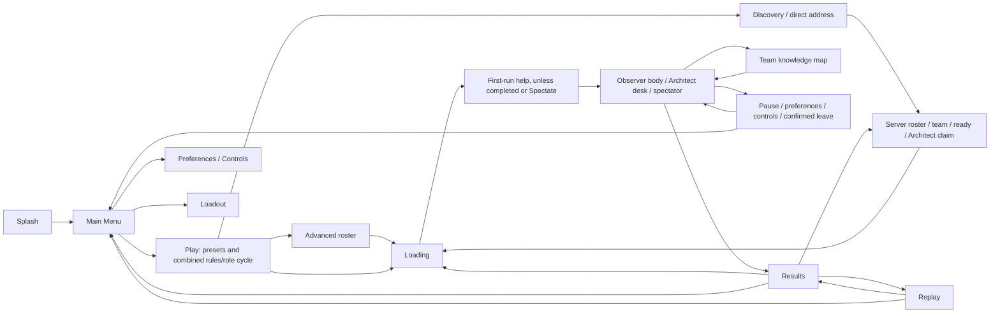
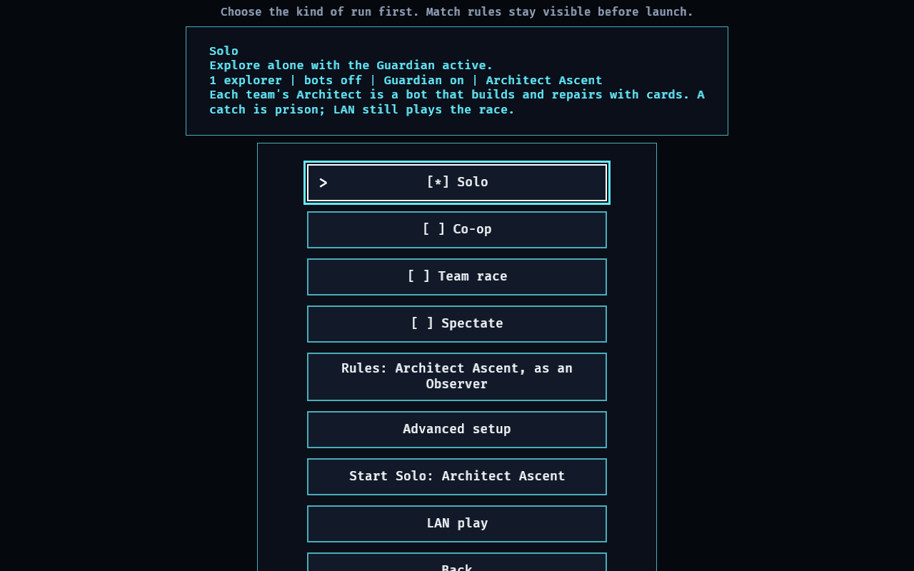
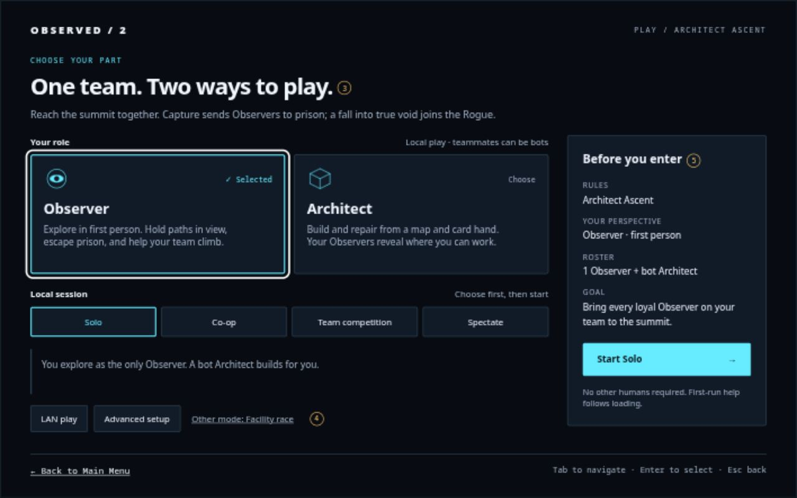
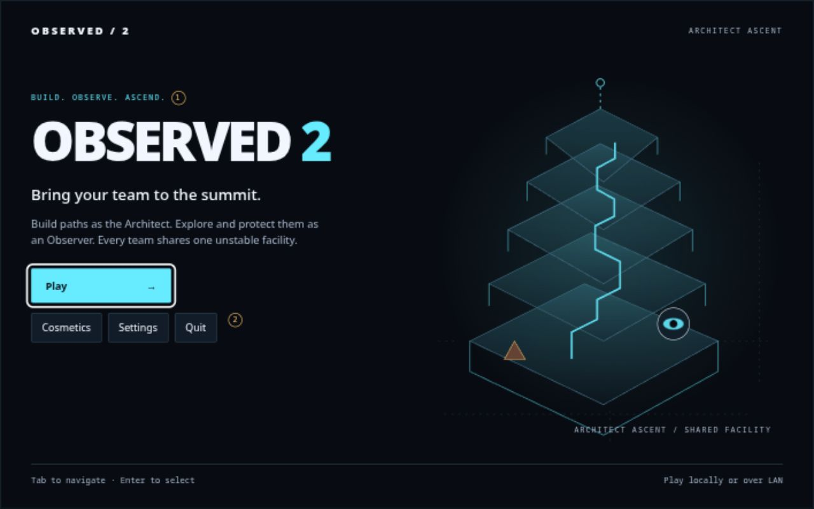

# End-to-end player experience audit

**Date:** 3 October 2026 (America/Denver). **Audited revision:** `aede5646`.
**Feature branch:** `codex/end-to-end-ux`, based on refreshed `origin/main`.
**Audience:** a new Observer or Architect, a returning local player, and a LAN host/joiner.

This is the pre-implementation audit. See [the menu implementation record](menu_implementation.md)
for the subsequent menu and role-entry changes; the findings below retain their
original revision and evidence.

The frontend has a useful interaction foundation, but it still introduces an older
race rather than the game being built. The most immediate rendered defect is Play
clipping at 1280×800, especially after selecting Ascent. The most consequential
content defects are mixed rules/role selection, false LAN capability copy, and
race-specific onboarding and results.

This milestone changes only review artifacts and evidence. Production behavior,
public APIs, preferences, networking, and simulation remain unchanged.

Review the [interactive Main Menu and Play concepts](menu_concepts.html), the
[evidence manifest](../evidence/ux/manifest.json), and the
[reproduction notes](../evidence/ux/README.md). The concepts express an Ascent-first
front end, with the facility race retained as a secondary explicit route.

## Evidence and verification boundaries

The existing `OBSERVED2_CAPTURE_FRONTEND` driver rendered a complete fifteen-screen
sweep at **1280×800 physical pixels**. Every image in that baseline sweep was
inspected. Additional sweeps compared true defaults and saved Ascent Observer and
Architect configurations; representative images are retained below. All captures
use the same audited build. Source inspection covers the rest of the session.

These are **staged renders, not a completed player walkthrough**. The driver enters
states directly, injects a synthetic completed race for Results/Replay, enters the
match through a direct bot driver, and sets pause/map overlays programmatically.
Its Loading image intentionally has no launch request. It cannot prove navigation,
real cancellation/retry, a live LAN lobby, or an actual Ascent result.

An initially empty configuration directory was not a true fresh profile: running
from the worktree migrated the tracked `saves/settings.json` and `saves/profile.save`.
That run is retained as the **legacy migration baseline**. The true-default run
used an empty working directory outside the repository as well as an isolated
configuration directory, avoiding that fallback. Returning-role runs used explicit
Ascent/role saves with onboarding version 1 complete.

Native UI control is disabled in this session. Actual native keyboard/pointer
navigation, physical-controller use, real local loading recovery, and two-game
LAN interaction are **unverified**. None of the existing Arc Q human gates are
marked complete. Existing protocol tests can support source conclusions without
substituting for those human checks.

## Current player journey

Local rematch uses a new prepared seed. LAN Rematch and Return go back to the lobby.
Loading cancellation returns to the request's context. Pause settings are overlays
inside the match, rather than the standalone frontend Settings state. Offline pause
stops simulation; LAN pause and the map continue with neutral local input.

| Stage | What currently works | Friction / next review |
| --- | --- | --- |
| Splash and Main Menu | Four clear actions; explicit Quit; focus chevron and outline | No premise or role introduction; XP leads the first impression |
| Play and Advanced | Presets, explicit Start, saved draft, validated sixteen-body cap | Clipping; rules and role share one cycling button; “Solo” copy contradicts an Architect seat |
| Preferences and Controls | Separate personal settings; all eighteen binding rows fit | Legacy migration produces a new binding collision; Architect controls are not this binding list |
| Cosmetics | Equipped and locked states explain themselves | Text-only inventory gives no appearance preview; “Loadout” suggests gameplay equipment |
| LAN browser | Direct address, discovery, paging and disabled explanations | “Host this setup” does not restate rules/roster here; Play gives false LAN information |
| Lobby | Authoritative roster, team requests, readiness and Architect claims | Captured lobby has no server; connected-role availability and failure feedback need a live pass |
| Loading | Coarse phase, elapsed time, error, disabled Retry when unavailable | Captured error is staged; genuine progress, retry/cancel and generation races remain unverified |
| First-run help | Visible modal, four beats, binding-derived copy | Same Observer/race lesson is offered for Ascent and Architect; completion is global |
| Observer play | HUD source distinguishes summit, prison and rescue; nearby executable prompts | Live readability of Lance, power, team requests and corruption handoff needs a player pass |
| Architect desk | Known board, five cards, target feedback, team requests, teammate eyes, controller adapter | Dense first-action guidance; Station description collides with the bottom help strip |
| Map | Team-local knowledge, explicit legend, seen connections and floor browsing | Verbose technical legend; zero-based map floor versus one-based desk/HUD |
| Pause and Leave | Root and confirmation render; Cancel gets initial focus | Native Back/modal behavior and offline/LAN tick policy remain interaction checks |
| Results | Roster-based participant/spectator copy and real replay availability | Series, keystone and absorption story cannot explain a summit win or Rogue win accurately |
| Replay and Rematch | Replay-only state; disabled unavailable controls; new-seed local rematch | Race-shaped replay story and generic result envelope omit Ascent role/faction context |

## Ranked findings

P1 means a primary route is obstructed or teaches materially incorrect behavior.
P2 means an important explanation, compatibility path or presentation needs work.
P3 is polish after the primary path is reliable. Confidence distinguishes rendered
facts from source-backed conclusions and experience hypotheses.

| ID / priority | Evidence and player impact | Recommended change and acceptance |
| --- | --- | --- |
| **UX-01 / P1 — Play exceeds the baseline** | [Defaults](../evidence/ux/defaults_1280x800/play.png), [Observer](../evidence/ux/ascent_1280x800/observer_play.png) and [Architect](../evidence/ux/ascent_1280x800/architect_play.png): the default heading is partly clipped; Ascent loses the heading entirely and cuts off Back. **Rendered fact.** | Split role, preset and confirmation into a compact column layout. At 1280×800, all text, controls, focus outlines and Back fit for both roles and every preset, without shrinking essential text or depending on scrolling. |
| **UX-02 / P1 — Rules and role are one hidden cycle** | [`next_rules`](../../game/src/play_setup.rs) cycles Race → Ascent Observer → Ascent Architect. Defaults select Race. Preset descriptions remain “Explore alone…” even for an Architect. The player cannot compare the two roles or see the summit goal before launch. **Source and rendered fact.** | Make Ascent the fresh default; present separately labeled Observer and Architect choices with their verbs. Retain a secondary Facility race route. Show perspective, actual Observer roster, Architect ownership, bots and goal before Start; Spectate has no human role claim. |
| **UX-03 / P1 — Onboarding teaches the wrong game** | [`onboarding_beats` and `spawn`](../../game/src/screens/onboarding.rs) do not branch on rules or role. “FIND A WAY OUT” teaches keystones and a synchronized station; “A fall reroutes you instead of ending the run” omits true-void corruption. An Architect receives movement lessons. [First beat](../evidence/ux/defaults_1280x800/onboarding.png) renders legibly. **Source fact; only beat one rendered here.** | Add role/rules-specific help: Observer summit/rescue/power/Lance/request loop; Architect known targets, preview/rotation/commit, cooldown and requests; race retains its own objectives. A player new to a role can obtain that role's help after completing another; skip/reopen work; rendered controls match bindings. |
| **UX-04 / P1 — LAN copy denies implemented support** | Both [Ascent summaries](../evidence/ux/ascent_1280x800/observer_play.png) say “LAN still plays the race.” [`listen_server_config`](../../game/src/lan.rs) passes `--ascent`; [`lobby_update_labels`](../../game/src/screens/lobby.rs) exposes the Architect claim. **Source/rendered contradiction; live path unverified.** | Remove the blanket denial. Explain hosting the chosen rules versus joining the host's rules, and that LAN role selection is an authoritative lobby claim. A two-client Ascent run must match the displayed rules and roles, reject a conflicting claim visibly, and respect the loading barrier. |
| **UX-05 / P2 — Results lose Ascent meaning** | [`result_for`](../../game/src/hex_wfc/ascent.rs) maps Rogue victory to `winner=None`, with corrupted players able to win. [`ResultsStory`](../../game/src/screens/results.rs) still narrates a series, absorption, and keystones. [`ActivePlaySession`](../../game/src/play_setup.rs) has no rules or role field. [Rendered race story](../evidence/ux/frontend_1280x800/09_results.png) illustrates the inherited vocabulary. **Source fact; no live Ascent finish observed.** | Preserve mode, seat/perspective, faction and outcome facts through completion. Verify summit victory, loyal loss, Rogue victory from a corrupted seat, Architect results and Spectate; explain why the run ended without fabricating a series or objective. Carry honest context into Replay and Rematch. |
| **UX-06 / P2 — Migration introduces a binding conflict** | [Migrated Controls](../evidence/ux/frontend_1280x800/04_settings_controls.png) warns that lantern and Ask both use `T`. [True defaults](../evidence/ux/defaults_1280x800/controls.png) use `F` and `T`, with no conflict. Tracked legacy settings supply `torch=T`; missing `ask` defaults to `T`. **Rendered and source fact.** | Handle newly added bindings during migration without overwriting existing player choices silently. Explain a conflict and offer a clear resolution. Cover old saves missing Ask, explicit custom bindings and restored defaults; both actions must remain usable. |
| **UX-07 / P2 — Spectate hides the normal play explanation** | [Staged bot view](../evidence/ux/ascent_1280x800/observer_bot_view.png) has no objective panel. [`hud/play.rs`](../../game/src/hex_wfc/hud/play.rs) explicitly hides that HUD for spectators. This is intentional scheduling, not proof of a camera failure. **Rendered/source fact; live spectator usability is a hypothesis.** | Review the actual Spectate route and add a small spectator-specific role/team/goal/control treatment if needed. A viewer can identify who they follow, the match goal, how to change view and how to leave; manual player control is not implied. |
| **UX-08 / P2 — Map explanations require translation** | [Map](../evidence/ux/frontend_1280x800/14_survivor_map.png) starts with nine lines of technical categories and floor `0`; [desk](../evidence/ux/ascent_1280x800/architect_desk.png) starts at `01 / 08`. **Rendered fact; overload is an experience hypothesis.** | Use one-based player-facing floors consistently. Keep floor/you/goal and key meanings in the first reading; move deeper topology detail into expanded help. Retain legends and team-knowledge restrictions. Validate finding the player, a known connection and floor controls with a new player. |
| **UX-09 / P2 — Desk card copy touches the help strip** | [Architect desk](../evidence/ux/ascent_1280x800/architect_desk.png): Station's multiline description reaches the bottom control instruction. A new Architect must read both to act. **Rendered fact.** | Reserve separate card-description and control-help space. At 1280×800 every card description and active-device instruction is readable without overlap; preview, rejection and successful commitment remain understandable. |
| **UX-10 / P2 — Roster language drifts from canon** | [`CoOp`](../../game/src/play_setup.rs) uses four body seats; the [canonical design](../architect_ascent_design.md#1-match-shape) specifies an Architect plus one-to-three Observers. The Architect is outside the body count. **Source fact.** | Reconcile the Ascent roster model in a separate slice, including LAN limits/bot ownership. Until then, state actual Observer count plus Architect explicitly. The menu redesign must not silently reinterpret `members_per_team`. |
| **UX-11 / P3 — Cosmetics have no visual comparison** | [Loadout](../evidence/ux/frontend_1280x800/05_loadout.png) describes colour/trail/badge entirely in text. **Rendered fact.** | Rename the entry Cosmetics and add a representative code-drawn equipped preview in a later slice. Locked items retain readable unlock reasons and remain unavailable for activation. |
| **UX-12 / P3 — Loading language describes machinery** | [Loading](../evidence/ux/frontend_1280x800/08_loading.png) explains “deterministic,” “off the main thread,” and “solve time.” Those terms do not help a player choose an action. **Rendered fact.** | Use phase, elapsed time, selected run and next action in player language. Keep truthful coarse progress and concrete errors; do not invent percentages. |

### Annotated review images

**UX-01, UX-02, UX-04:** title above the viewport; role buried inside Rules;
summary says bots off while describing a bot Architect; false LAN denial;
Back clipped below the viewport. Bot-fill describes Observer bodies, but the
screen never makes that distinction explicit.

**Proposed direction:** separate role cards; local preset rail; explicit roster
and summit goal beside Start; visible LAN/advanced routes; secondary race link.
Numbered annotations correspond to the review notes in the HTML concept sheet.

**Proposed direction:** lead with the shared game and its two roles, preserve
one primary Play action and direct access to Cosmetics, Settings and Quit.
The primitive illustration is decorative, not a projection of hidden match state.

## Ordered implementation backlog

### Slice 1 — Menu clarity and visual direction

Implement UX-01 and UX-02 plus the menu-side correction for UX-04. This is the next
feature slice; no production implementation was made during this audit.

- Keep Main Menu → Play shallow. Main Menu explains the premise, has Play as initial
  focus, renames Loadout's entry to Cosmetics, and preserves Settings and explicit Quit.
  Profile progress stays accessible in Cosmetics.
- Compose Play as role/preset controls plus a run summary and explicit Start, following
  the concept hierarchy. Use the existing semantic widgets and typed screen actions;
  preserve Back, remembered focus, disabled-state reasons and pointer/keyboard/controller
  activation. Decorative geometry never becomes a focus target.
- Fresh Ascent selection defaults to Observer + Solo. Keep explicitly saved Race/role
  selections on return. Retain the existing serialized `PlayRules`, `PlaySeat` and
  `PlaySetupDraft` fields; introduce no persisted schema in this slice. Replace the
  combined cycling action with direct selection actions.
- Use existing preset mappings. Label the two-team preset “Team competition” for Ascent
  and “Team race” for Race. Do not change body counts, the sixteen-body validation or bot
  behavior. Describe Observer bodies and the dedicated Architect separately.
- Spectate disables human role controls with an explanation while preserving the last
  playable role for a later preset. Its summary explicitly says bot-controlled viewpoint.
  The Facility race route exposes race setup without an Architect choice.
- LAN opens discovery using the selected host setup; joining adopts the server's rules.
  Make clear that team and Architect claims occur in the authoritative lobby. Custom
  setup preserves chosen rules and role. Both paths retain semantic Back.
- Draw the proposed primitive decoration through code and the shared UI theme/style
  ownership. Keep production text within the shipped ASCII font and use geometry for
  arrows/selection shapes. No new image asset, font dependency or animation system is
  required. Layout must reserve margin for longer summaries and focus outlines.

**Acceptance:** at 1280×800, every preset under both rules and both valid Ascent
roles fits; Start's summary agrees with the finalized roster and perspective;
returning preferences survive; all input paths select the same action; Back returns
correctly; repeated screen visits leak no entities or input-capture state. Re-run
the frontend captures, focused setup/widget/screen tests, and the repository's
`cargo fmt --all`, `cargo dev-clippy`, `cargo dev-test` gate for that code change.
New flow tests must exercise behavior rather than reproduce layout constants.

**Rollout dependency:** land and verify Slice 2 before calling the fresh Ascent
experience ready for players. A menu-only default change would currently send
first-time users into the wrong tutorial. Slice 1 can be reviewed independently,
but a release must not present that path as complete.

### Slice 2 — Entry into the chosen role

Address UX-03 and UX-06, then UX-09 and real loading checks. Introduce role-aware
onboarding completion/reopening, teach the appropriate first loop, preserve binding
choices on migration, and make the desk's first action readable. Exercise successful
local preparation, real cancellation, a genuine retryable failure and late completion
after cancellation. Preserve the existing immutable loading-request boundary.

### Slice 3 — Play and LAN continuity

Validate the actual Observer and spectator views, simplify map reading and unify
floor labels (UX-07/08). Verify Lance/power, request/answer, prison/rescue and
corruption-to-Rogue explanations. Complete UX-04 with a live connected lobby,
role contention, a delayed second loader, neutral online pause, and disconnect/rejoin.
Resolve the canonical roster mismatch (UX-10) explicitly with server compatibility
checks rather than hiding a new count inside a menu refactor.

### Slice 4 — Completion and secondary polish

Implement mode/faction-aware results and honest replay/rematch context (UX-05),
then cosmetics previews and loading wording (UX-11/12). Preserve result facts
separately from rendered UI; replay must not read back into live simulation.
Test loyal victory, Rogue victory, both human roles, Spectate, absent replay,
local rematch and LAN lobby return.

## Remaining hands-on acceptance matrix

All rows below are open; staged screenshots or unit tests do not close them.

| Scenario | Required observation |
| --- | --- |
| Keyboard-only full session; pointer repeat | Every reachable screen, focus restoration, disabled skipping, correct Back, no click-through on dismissal |
| Physical controller primary route and desk | Same actions as keyboard/pointer, stick latch, legible prompts, reversible preview and commit |
| Fresh Ascent Observer and Architect | Correct help for chosen role, understandable first action, working skip/reopen and accurate objective |
| Local preparation success/cancel/retry | Correct destination; no stale worker enters play; retry uses a fresh request identity |
| Two real LAN game processes | Ascent and host roster shown correctly; only one Architect per team; second loader delays tick one; neutral pause and rejoin |
| Offline pause / map / confirmed leave | Tick policy matches explanation; Cancel stays in match; confirmation leaves once; subsequent launch is clean |
| Actual Ascent completion | Summit and Rogue outcomes explained from each relevant perspective; accurate Replay and Rematch |

The old [Arc Q human gate](../arc_q/phase_123_human_ux_gate.md) remains open. Its
historical statement that Play fits is superseded by this revision's captures;
its completed checks are evidence from the earlier revision, not current acceptance.

## Subsequent implementation records

This audit and its original captures remain historical evidence. The
[menu and role-entry implementation](menu_implementation.md) records Slices 1 and
2's menu/help work. The [in-match guidance and map implementation](in_match_implementation.md)
records the Observer/spectator and map portion of Slice 3. The
[completion implementation](completion_implementation.md) records Slice 4's
mode/faction-aware Results and replay/rematch context. Connected LAN acceptance,
roster compatibility, cosmetics previews and loading wording remain outstanding;
see those records for the exact automated and human validation boundaries.

The subsequent [recorded world replay replacement](replay_implementation.md)
supersedes the room-trace playback described by the completion slice. It adds
actual geometry/actor/prison history, event navigation and camera views before
cosmetics work. Human and graphical LAN acceptance remain open.

The subsequent [cosmetics comparison and loading clarity](cosmetics_loading_implementation.md)
implements the representative designs and player-facing phase/recovery wording of
UX-11/12. Applying cosmetics to canonical match presentation, roster compatibility,
human input acceptance and connected graphical LAN acceptance remain open.
