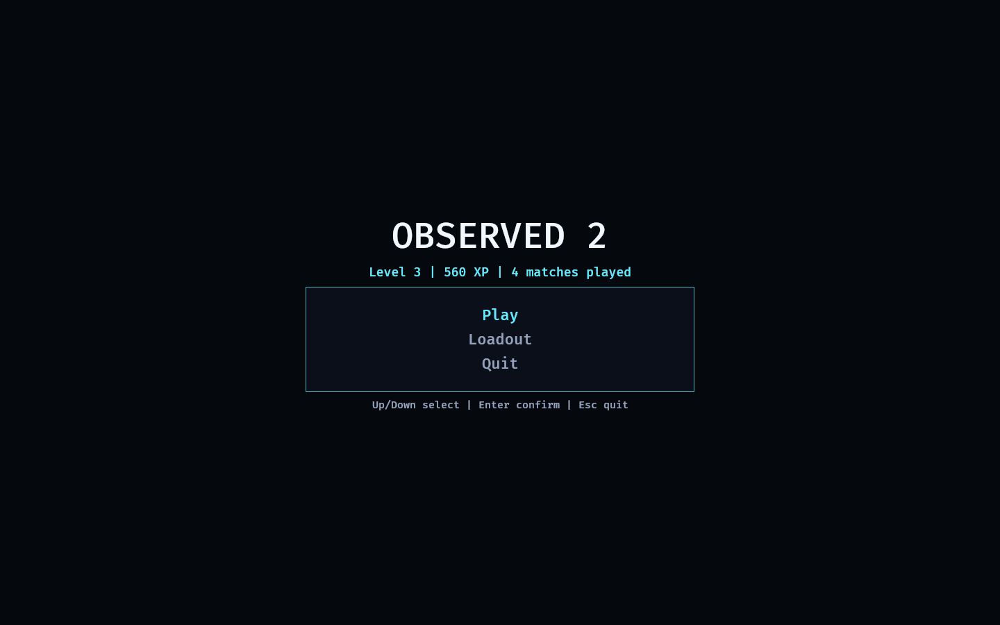

# Observed 2 — the assembled game

The **integration of the proven systems into one cohesive, playable whole**, with
the emphasis on UX. Where the labs each proved a single mechanic in isolation, this
crate strings them into the loop a player actually moves through:

```
Splash → Main Menu → Loadout → Lobby → Match → Results → (Main Menu) …
```

Run it:

```powershell
cargo run -p observed_game     # binary is named "observed"
```

Nothing here re-implements game logic. Each screen is a *projection* of a proven
model:

- the **career / progression** is [`progression_lab`](../labs/progression_lab/README.md)'s
  `Profile`, wrapped in a persistent [`Career`](src/flow.rs) resource that survives
  every match;
- the **lobby** is [`session_lab`](../labs/session_lab/README.md)'s matchmaker forming
  a real balanced session;
- the **match** is the **live, first-person 3D, networked hybrid match**
  ([`net_match_lab`](../labs/net_match_lab/README.md)'s `LiveNetMatch` over
  [`fps_hybrid_match_lab`](../labs/fps_hybrid_match_lab/README.md)): you walk the
  concrete maze in first person; each round you cross is replicated to a remote peer
  by `network_lab`'s lockstep over a hostile transport, and the result resolves into a
  `MatchResult`.

The only new code is the **state machine + presentation**: [`flow.rs`](src/flow.rs)
(the pure career loop) and [`screens.rs`](src/screens.rs) (the Bevy screens). This
keeps the project's input / simulation / presentation separation: the screens read
the models, they don't own the rules.

## Functionality evidence



The main menu, with the career banner reading **Level 3 | 560 XP | 4 matches
played** — the persistent profile, grown by four completed matches, projected
straight into the UI. The menu is keyboard-navigated (Play highlighted in accent,
the rest dim); the same theme carries across every screen.


The Match screen is a **live first-person 3D view** of the concrete maze — here
62% along the spine, over a HOSTILE network (drop 9 / dup 5 / reorder 22) with the
remote replica **5/5 in sync**. The integrated asset pass adds the enclosed ceiling,
fixture-anchored lights, character and equipment models, facility props, and an HDR
maintenance viewport. You walk the maze in first person; each round you cross is
replicated to the remote peer by the lockstep transport.

The live match now uses a multi-level generated maze: three flat room elevations
are connected by deterministic stair bands, and floors, supports, walls, ceilings,
lights, props, avatars, and hazards all render at the simulation height.

Each protected route now presents a visible choice: the red direct lane crosses a
pulsing pressure gate, while cyan marks a longer safe bypass. Hitting an active
gate returns you to the current-room checkpoint and briefly stalls movement; match
progress never decreases. When unseen passages commit a reroute, the existing
mechanical cue is joined by a screen-edge route-shift flash and camera jolt.

Pressing `Tab` opens the in-match TAC-MAP: a top-right schematic projected from
the live match state, showing the protected spine, collapsed rooms, the locked or
open exit, uncollected keystones, rival teams, and your current room or hallway.

## What it demonstrates

- **One cohesive loop** — the proven systems connect end to end: you launch from a
  formed session, play the **networked** match, see your result, and your progression
  persists into the next visit to the menu.
- **A persistent career** — `Career` lives for the whole app (not per-state), so XP,
  levels, and unlocks accrue across matches; the result of each match is awarded
  exactly once.
- **A first-person 3D match** — the Match is played in first person in the concrete,
  rerouting maze (the proven `fps_hybrid_match_lab` controller), with WASD + mouse
  look or Steam Deck / standard gamepad controls; the menus are UI overlays on the
  same 3D camera. The maze is solid textured geometry rebuilt when corridors reroute.
- **Complete drop-in asset plan** — textured floors, walls, and ceilings; real
  ceiling fixtures with point lights; exit gate and emissive sign; teammate and
  rival models; doorway frames; route equipment; crates, consoles, and animated
  collapse beacons; footsteps, reroute, success, and ambience audio; plus an
  industrial HDR panorama used as the environment and an in-facility viewport.
  Missing files retain procedural colour/model fallbacks.
- **Networked during play** — each round the player resolves is replicated live to a
  remote peer over the hostile lockstep transport, which the HUD reports (replica
  rounds, in-sync, packet loss/duplication/reordering).
- **Unified, consistent UX** — a single visual theme (title / accent / dim / panel),
  keyboard and controller navigation shared by every menu, an in-match HUD, and an
  in-match pause overlay.
- **Strict state-scoped cleanup** — every screen's entities carry `DespawnOnExit`, so
  exactly one screen is ever alive and transitions never leak (a test cycles the
  whole loop five times and asserts the screen count stays at one).
- **Orthogonality preserved at the integrated level** — the match still takes no
  profile, so a test grinds a career, equips every unlocked cosmetic, and asserts the
  match resolves identically. Cosmetics and progression cannot change a result.
- **Readable traversal risk** — pressure emitters, pulsing red floor/light, cyan
  bypasses, HUD phase/hit counters, and checkpoint setbacks make the route choice
  explicit without adding combat or damage.
- **A live TAC-MAP** - `Tab` toggles a schematic overlay built from the same match
  brain and shared visual language as the world: gold spine route, red collapse /
  locked exit, green open exit, keystones, rivals, and your current room or hallway.

## Screens & controls

Navigation is the same everywhere: **Up/Down** (or **W/S**) to move, **Enter** (or
**Space**) to confirm, **Esc** to go back. On Steam Deck or a standard controller:
**left stick/D-pad** selects, **A** confirms, and **B** goes back.

- **Splash** — title card; Enter/A (or a short timer) advances to the menu.
- **Main Menu** — `Play` → Lobby, `Loadout`, `Quit`. Banner shows your live level/XP.
- **Loadout** — browse the cosmetic catalog; Enter equips the selected one if it is
  unlocked. A header summarizes your level, unlock count, and equipped cosmetics.
- **Lobby** — a balanced session formed by the matchmaker (two teams, players,
  ratings). `Launch match` drops in; you are Team 1.
- **Match** — a live first-person 3D walk through the concrete maze. **WASD + mouse**
  or **Deck controls** move/look; cross into the next gold-spine room to advance your
  team; **E/X** seizes control or activates a nearby teleport pad link. Red is the
  pressure-gate shortcut; cyan is the safe bypass.
  The HUD shows gate phase/hits, the round, your status, escaped / absorbed
  counts, the collapse line, and a **NET lockstep** line (profile, replica rounds,
  in-sync, packet loss / duplication / reordering). **Tab/R1** toggles the TAC-MAP.
  **F/L1** drops or picks the anchor torch; **C/Y** drops or picks a teleport pad.
  **Esc/Start** pauses (overlay with **Q/Y** to quit to menu).
- **Results** — Victory / Escaped / Absorbed headline, placement, the XP/levels/
  unlocks the match awarded, then `Continue` back to the menu.

## Manual verification

1. `cargo run -p observed_game`.
2. From the splash, press Enter/A → the main menu. Note the banner (Level 0 on a fresh
   profile).
3. Open **Loadout**, equip a cosmetic, **Esc** back — the equipped summary persists.
4. **Play** → the lobby shows a formed session; **Launch** drops you into the maze.
5. Walk in first person (**WASD + mouse** or Deck controls) into the next gold-spine room to advance —
   the **NET lockstep** line shows your rounds replicating to the remote and the
   packet loss/duplication/reordering of the hostile transport. **Esc/Start** pauses
   (cursor released); **Esc/Start** again resumes.
6. Compare a red pressure-gate shortcut with its cyan bypass. Confirm an active
   pulse returns you to the checkpoint without changing match progress, while the
   idle shortcut and safe bypass both remain usable.
7. Press **Tab/R1** and confirm the TAC-MAP appears in the top-right: gold spine,
   red collapse / locked exit, green open exit once the keystones are collected,
   keystone pips, rival pips, and your marker updating between rooms/hallways.
8. During the run, verify footsteps while moving, the mechanical cue plus route-
   shift flash/jolt after an off-camera reroute, warning beacons in collapsed rooms,
   and the success sting when a team escapes.
9. On **Results**, confirm the placement and that XP was awarded; **Continue**.
9. Back on the menu the banner now reads a higher level / XP / match count — the
   career persisted. Repeat: it keeps growing.

## Tests

`cargo test -p observed_game` covers both the pure career loop and the Bevy
lifecycle:

- the headless career loop grows the persistent profile and awards each match once;
- the networked match resolves and the transport is orthogonal (a hostile and a
  clean network land on the identical result);
- progression/cosmetics never change the match (orthogonality, re-asserted here);
- the app boots into the splash screen;
- the full menu→lobby→match→results→menu loop runs (driving the lockstep transport
  to convergence) and grows the career;
- screens are state-scoped and never leak across five full cycles;
- equipping a cosmetic from the loadout persists into the career;
- every `ASSET_PLAN.md` file exists and every visual category, including the HDR
  environment, pressure-gate emitters, safe/risky floor treatments, route-shift
  overlay, and dynamic hazard beacon, is represented in the Match state;
- an active pressure gate resets the body without changing the competitive round
  or earned room progress;
- the TAC-MAP starts hidden, toggles with `Tab`, draws live route/room/marker UI,
  hides cleanly, and leaves no state or UI entities after the Match.
