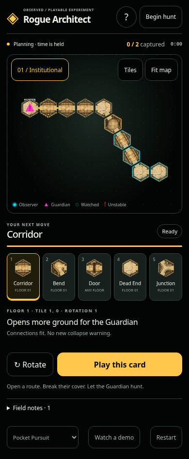

# Rogue Architect

A resettable Rogue pressure prototype on the real deterministic `HexWfcWorld`.
Reconnect and rewrite a damaged facility so autonomous Guardians can discover,
pursue, and jail both Observers. Start with **Pocket Pursuit**, then try the two
larger, two-floor hunts.

## Play in a browser

```bash
scripts/build-architect-web.sh
python3 -m http.server 8774 --bind 0.0.0.0 --directory web-dist/architect-lab
```

Open `http://localhost:8774` on the host, or the host's LAN IP and port 8774 on a
phone connected to the same network. A phone on the host’s Tailscale network can
use its Tailscale IP with the same port; the current preview is
`http://100.71.157.43:8774`. Keep the preview server running on the host. The build requires the Rust
`wasm32-unknown-unknown` target and lockfile-matched `wasm-bindgen-cli` (0.2.125).
The build script honors Cargo's configured target directory.

The browser runs the **same Rust simulation compiled to WASM**, with a DOM/SVG
presentation. It does not download Bevy's desktop renderer, require WebGPU, fetch
fonts, or send gameplay to a server. The output directory is a standalone static
bundle. Its JS, stylesheet, WASM, and illustrated asset requests share a content-derived cache key.
Use ordinary HTTP compression when deploying; the build also emits a gzip copy
of the WASM for servers that support precompressed responses.

### Illustrated tactical tiles

The browser board and hand use five ink-and-watercolor tile studies over the
actual WFC connectivity. **Tiles** opens a larger viewer with all six clockwise
rotations; opening it pauses the hunt. Rust supplies the face order, neighbor
vectors, and card masks to the browser. Artwork never decides an opening.

See [art direction and topology contract](web/art/README.md) for original prompts,
source PNGs, optimized assets, symmetry handling, and rotation verification.

### The interaction loop

1. Read the short introduction. Time begins paused.
2. Select one of the five cards, then tap a tile marked by a glowing dot.
3. Inspect its legal orientation and immediate route/instability preview.
4. Rotate if desired, then explicitly **Play this card**.
5. **Begin hunt** or **Resume hunt** to watch the consequence. **Plan** pauses time
   whenever you want to think. The five-second recharge uses simulation time.

Tap selects; one-finger drag pans; pinch zooms. A drag or pinch cannot commit a
card or accidentally become a tap. **Fit map** recenters. Both floors have named
buttons, and scenario/reset/demo controls work without a keyboard. In the browser,
`1`–`5` select cards, `R` rotates, and Space toggles planning when focus is on the
board. Returning from a background tab leaves the hunt paused.

HTML buttons, selects, live feedback, labeled keyboard-selectable SVG tiles,
visible focus, safe-area padding, and reduced-motion support are intentional parts
of the interface. Portrait supports 320px widths without horizontal scrolling;
landscape uses a scrollable command rail with sticky play controls.

## Rules now proven in the lab

- Seeded five-card deck, district matching, rotations, local attachment, refill,
  shared 300-tick cooldown, and atomic command rejection. Pocket deals only its
  own district. A no-op cannot waste a card.
- Emergency requisition refills a depleted or dead hand to exactly five instantly
  and publicly for the price of releasing exactly one major Guardian on the floor
  active Observers occupy, leaving the placement cooldown untouched. Released major
  and spawn cell selection are fully deterministic from seed and command history.
- Scenario damage is applied to a solved facility. The first repair card is offered
  from the ordinary finite deck. Missing known cells can be rebuilt through the
  same command boundary as replacements.
- Unmatched lateral **or vertical** ports warn before one exposed tile retracts
  every 180 ticks. Exposed connections into retracted cells continue the instability.
  A compatible card cancels pending retractions; removed cells require rebuilding.
- Observation, occupancy, anchors, open doors, and the prison protect against
  retraction. A completely consumed non-prison floor closes permanently and its
  district cards recycle out of the deck.
- Closed doors block movement and sight. Observers can reopen doors; open doors
  protect their connection. A rewrite/retraction consumes hosted doors.
- Matching sealed vertical faces are **not** a passage; cross-floor movement needs
  matching open ports.
- Traced deterministic Observer/Guardian/Architect selectors. Guardians detect
  along connected sightlines, investigate card targets, and patrol by visit history
  rather than oscillating between the first two neighbors. The bot evaluates known
  connectivity and detected targets, then submits ordinary legal card commands.
- Captures produce simulation events and the all-jailed outcome. Browser prey
  markers show detected Observers and explicitly marked stale sightings, never
  undiscovered current positions. Previews describe immediate topology, not promised
  future captures.
- Unsafe falls and true-void corruption: Observers whose supporting tile is retracted
  fall downward through the vertical hex stack. If surviving structure exists on any
  lower level, the Observer lands safely. Only a fall through the entire surviving
  stack into true void corrupts the Observer into the Rogue AI faction. Corruption is
  immediate, irreversible, and public (logged to the event stream and exposed in web
  snapshots), removing the former Observer from first-person play. When every loyal
  Observer is eliminated (all are jailed or corrupted), Rogue achieves victory.

The Pocket opening stays unresolved without a card. The deterministic bot repairs
it and wins through the ordinary command path. Larger scenarios exercise multiple
repairs and floor transitions. A paused human can inspect the same choices.

## Desktop lab

```bash
cargo dev-run -p architect_lab
```

The original Bevy diagnostic interface remains available: card keys `1`–`5`,
`Q`/`E` rotate, Space submits, `B` bot, `P` pause, `N` one behavior beat, `R` reset,
`[`/`]` scenario, `F`/Home recenter, mouse wheel zoom, and right/middle drag pan.
The browser is the primary touch interface; the desktop rail remains a debugging
view rather than the phone layout.

## Verification

```bash
cargo fmt --all
cargo dev-clippy
cargo dev-test
cargo clippy -p architect_lab --all-targets --features web -- -D warnings
cargo test -p architect_lab --no-default-features --features web --lib
cargo run -p architect_lab --no-default-features --example pressure_probe
scripts/build-architect-web.sh
# With Playwright available in Node's module search path and Chromium installed:
node scripts/verify-architect-web.cjs
node scripts/verify-architect-rotations.cjs
```

Set `ARCHITECT_URL` for a server other than `http://127.0.0.1:8774`. The browser
verification uses real touch events for pan and pinch and runs the complete
preview → play → capture → result → reset flow against the built WASM. It captures
evidence in `docs/evidence/architect_lab/mobile/`.

Rust coverage includes retraction cadence, every protection class, rebuild/repair,
floor closure, atomic rejection, vertical movement, deterministic play, and
renderer-free Bevy selection/reset lifecycle checks.

## Scope and human gate

This remains a cell-level Rogue lab. First-person movement, authored 3D hull
projection, loyal construction, continuous physical ragdoll falls, prison escape/rescue,
and production LAN integration belong to subsequent proofs. The native diagnostic
view can expose full actor state; the browser filters undetected prey.

Automated completion establishes that the loop works, not that it is fun. The
remaining gate is a person on a real phone predicting a useful card play and
causing an understandable capture. Mobile Chromium emulation does not substitute
for physical iOS Safari or Android testing.


