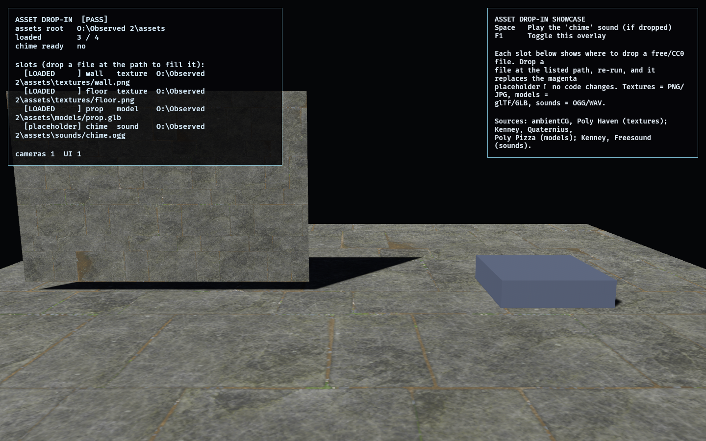

# Asset Drop-In Showcase

A tooling lab (not a numbered roadmap phase): the **simple way to find free/CC0
assets and drop them into place**. Every other lab is procedural (colored shapes,
wireframe gizmos); this one defines a tiny convention so a downloaded file just
works, with a graceful magenta-placeholder fallback when a file is absent.

## How it works

The shared [`observed_assets`](../../crates/observed_assets) crate is a data-driven
list of **slots** — a logical name, a kind (texture / model / sound), and the path it
expects under `assets/`. This lab is its visual proof app: the overlay lists every
slot with its exact absolute path and `LOADED` / `placeholder` status. The 3D scene
physically previews the original wall, floor, prop, and chime slots; the assembled
game consumes the larger match-asset set from the same crate.

Bevy features for the three asset kinds are scoped to this lab only: `png`/`jpeg`
(textures, already available), `bevy_gltf` (glTF/GLB models), `bevy_audio` +
`vorbis`/`wav` (OGG/WAV sounds).

## Functionality evidence



With nothing dropped into the lab-local asset root (the default headless test
state), the preview slots use **magenta placeholders**, while the overlay still
reports every planned slot and exact path. `[PASS]`.

## What it demonstrates

- **Drop-in, no-code** — a file at a slot's path replaces its placeholder on the
  next run; the manifest is the only thing to edit to add slots.
- **Graceful fallback** — missing files become magenta placeholders, so the lab (and
  any lab adopting the convention) always runs.
- **All three asset kinds** — textures (PNG/JPG), models (glTF/GLB), sounds
  (OGG/WAV), each with a sensible CC0 source called out in the help panel.
- **Tells you exactly where** — the overlay prints the absolute path per slot, so
  there's no guessing about Bevy's asset root.

## Controls

- `Space`: play the `chime` sound (if a sound file is dropped)
- `F1`: toggle the overlay

## Where to get assets / what to drop

See [`assets/README.md`](../../assets/README.md) for the slot → path → source table.
In short: **ambientCG / Poly Haven** (CC0 textures), **Kenney / Quaternius / Poly
Pizza** (CC0 glTF models), **Kenney / Freesound** (CC0 sounds). Prefer CC0 (public
domain, no attribution).

## Success conditions

1. Boots with a camera, the overlay, and one status entry per manifest slot.
2. With no files present, every slot is a placeholder and the lab still runs
   (`[PASS]`, `loaded 0/N`).
3. Dropping a valid file at a slot's path makes it `LOADED` and replaces the
   placeholder on the next run.
4. The manifest is well-formed (unique names; each path in a subfolder with a
   supported extension) — covered by tests.

## Manual verification

1. Run `cargo run -p asset_lab`. Note the overlay paths (all `placeholder`).
2. Download a CC0 texture, save it as `assets/textures/wall.png`, and re-run — the
   wall shows your texture and the overlay reads `LOADED` for `wall`.
3. Try a `.glb` at `assets/models/prop.glb` (the pedestal gets your model) and an
   `.ogg` at `assets/sounds/chime.ogg` (press `Space` to play it).

## Regenerating the evidence screenshot

```powershell
$env:OBSERVED2_CAPTURE = "docs/evidence/asset_lab.png"
cargo run -p asset_lab
```
