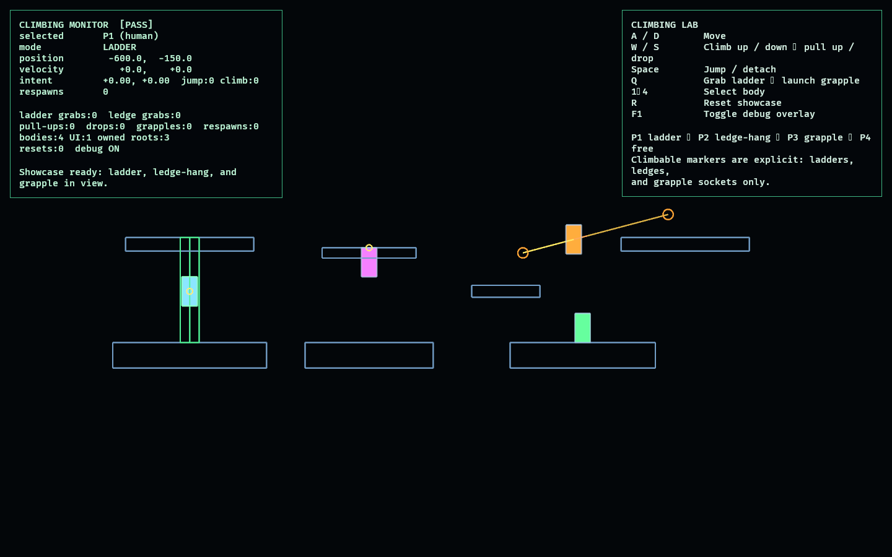

# Climbing Lab

The Climbing Lab proves authored vertical traversal as a set of discrete,
explicit modes layered on top of the shared `PlayerIntent`. Climbing logic is a
pure state machine (`simulation.rs`) so every transition is unit-testable; Bevy
entities only present that state.

There is no universal surface climbing and no simulated rope physics. A body can
only climb where the course author placed a ladder, a ledge, or a grapple
socket.

## Functionality evidence



The authored showcase renders all four traversal modes at once (captured via
`OBSERVED2_CAPTURE`, see below): P1 on a ladder, P2 hanging from a ledge, P3
mid-grapple between two sockets, and P4 standing free — with the debug overlay
reporting `[PASS]` (four bodies, one UI root).

## Traversal modes

- **Free** — walk, run-less ground movement, jump, fall, land, out-of-bounds
  respawn.
- **Ladder** — attach when overlapping a ladder and asking to climb; move up and
  down; step off at the top or bottom; jump to detach.
- **Ledge hang** — grab an authored edge when the hands sweep across it; pull up
  onto the surface, drop back into free fall, or shimmy sideways along the edge.
- **Grapple** — launch from a socket that has an authored target and traverse the
  straight line to it.

## Controls

- `A` / `D`: move
- `W` / `S` (or `↑` / `↓`): climb up/down on a ladder; pull up / drop from a hang
- `Space`: jump, or detach from a ladder / drop from a hang
- `Q`: grab an overlapping ladder, or launch from a nearby grapple socket
- `1`–`4`: select which body receives human input
- `R`: reset the authored showcase
- `F1`: toggle the debug overlay

Unselected bodies hold their authored pose so every mode stays visible until you
drive one.

## Debug visualization

- Blue rectangles: solid surfaces
- Green rectangle + line: ladder climbable region
- Magenta line: grabbable ledge edge
- Orange circles + link line: grapple sockets and their target
- Per body: collision box, red velocity vector, blue intent vector, and a yellow
  attach-point marker for the current climb mode
- Monitor panel: selected body's mode, position, velocity, intent, per-mode
  transition counters, live entity counts, and a `[PASS]`/`[FAIL]` health flag

## Success conditions

1. A body transitions cleanly between free movement and each climb mode.
2. A ladder is climbed to the top and the body steps onto the platform.
3. Jumping off a ladder returns the body to free fall.
4. A ledge is grabbed when the hands sweep its edge; pull-up, drop, and sideways
   shimmy each behave and clamp correctly.
5. A grapple traverses from socket to socket and ends in free movement.
6. Leaving the world bounds respawns the body at its authored start state.
7. Repeated reset restores exactly four bodies and one UI root with neutral
   intent and no duplicated entities.

## Manual verification

1. Run `cargo run -p climbing_lab`.
2. Select P1 (`1`) and use `W`/`S` to climb the ladder to the top platform; press
   `Space` partway up to confirm the jump-off.
3. Select P2 (`2`); shimmy with `A`/`D`, then `W` to pull up and walk off, or `S`
   to drop.
4. Select P4 (`4`), walk to a grapple socket, and press `Q` to traverse to the
   far platform.
5. Walk a body off the world to confirm a respawn is counted.
6. Press `R` several times and confirm the monitor stays `[PASS]` with four
   bodies and one UI root.

## Regenerating the evidence screenshot

```powershell
$env:OBSERVED2_CAPTURE = "docs/evidence/climbing_lab.png"
cargo run -p climbing_lab
```

With `OBSERVED2_CAPTURE` set, the lab renders the showcase, writes the PNG to
that path, and exits automatically.
