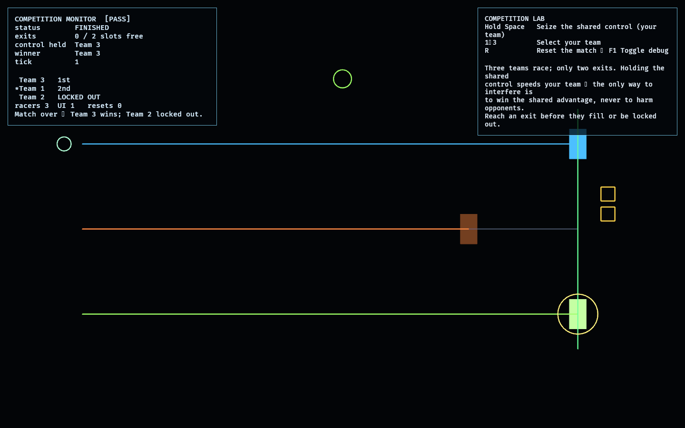

# Competition Lab

The Competition Lab is the third feasibility lab beyond the foundation. It probes
the **competitive layer**: several teams race through a shared structure toward
**capacity-limited exits**, and the match resolves to a deterministic placement —
winner, runner-up, and locked-out.

The design rule from `AGENTS.md` is that teams **cannot directly harm** each
other; they only manipulate shared systems. Here that is a single contested
**control** ([model.rs](src/model.rs)): a team can spend a tick seizing it
instead of racing, and while it holds the control it advances faster. A team's
progress is only ever raised by its own racing, never lowered by an opponent —
interference is purely indirect (winning the shared advantage). Exits run out, so
finishing order is everything.

The contested control stands in for the shared machinery / routes / observation
proven in the earlier labs; this lab isolates the competition resolution itself.

## Functionality evidence



A finished match (captured via `OBSERVED2_CAPTURE`): three teams, two exits.
Team 3 held the shared control and won, Team 1 took the last exit, and **Team 2
was locked out** — the monitor shows the standings and `0 / 2 slots free`.

## What it demonstrates

- **Multiple competing teams** — three teams race simultaneously with independent
  per-tick actions.
- **Capacity-limited exits** — only two exit slots; the third team is locked out
  when the exits fill. Capacity is the competitive stake.
- **Indirect interference only** — the contested control speeds its holder; no
  action ever reduces an opponent's progress (a test asserts progress never
  drops).
- **Deterministic resolution** — ties and finishing order resolve by `TeamId`;
  the same actions always produce the same placement.

## Controls

- `Hold Space`: seize the shared control for your team (costs the tick's progress)
- `1`–`3`: select your team (the others are bots that periodically contest the
  control)
- `R`: reset the match · `F1`: toggle debug

## Debug visualization

- One lane per team with a progress fill toward the exit gate on the right
- Exit-capacity slots (filled gold as teams claim them)
- The shared control marker, coloured to its current holder, plus a glow on the
  boosted team
- Monitor panel: status, exit slots free, control holder, winner, live standings
  (`1st` / `2nd` / `LOCKED OUT` / `n%`), and a `[PASS]`/`[FAIL]` flag

## Success conditions

1. Exactly `EXIT_CAPACITY` teams claim placements; the rest are locked out.
2. Holding the shared control lets a team finish ahead (interference flips the
   result) without ever lowering an opponent's progress.
3. Seizing forgoes that tick's advance; control ties resolve deterministically.
4. The match resolves to a deterministic placement and a winner.
5. Repeated reset restores a fresh match with no leaked entities.

## Manual verification

1. Run `cargo run -p competition_lab`.
2. Watch a default race: two teams reach the exits, the third is locked out.
3. Press `R`, then hold `Space` early to seize the control for your team and
   confirm it pulls ahead and wins.
4. Note that no team's bar ever moves backward — you can only get ahead, never
   set an opponent back.

## Regenerating the evidence screenshot

```powershell
$env:OBSERVED2_CAPTURE = "docs/evidence/competition_lab.png"
cargo run -p competition_lab
```
