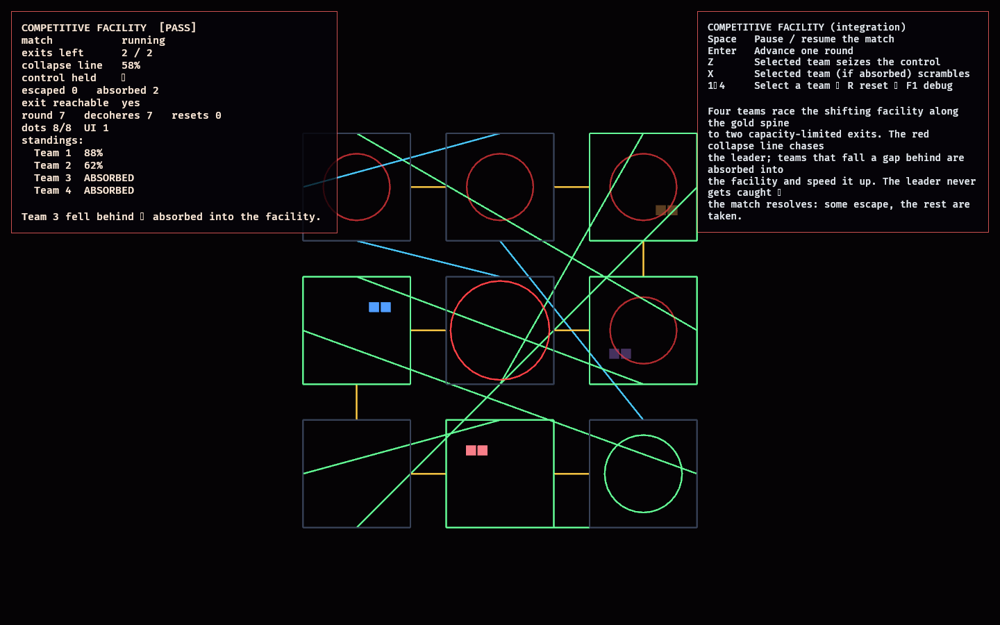

# Competitive Facility

The Competitive Facility is the second **integration** lab (Phase 11). Phase 10's
[`mutable_facility`](../mutable_facility/README.md) proved a single team can finish
an objective while the structure rewires. This lab turns that into a *full
competitive match* by folding in the two proven competitive systems on top of the
same mutable graph — so all three higher-level systems run as one loop.

What it reuses, wholesale, as libraries:

- **Structure** — [`mutable_facility`](../mutable_facility/src/model.rs) (its
  `spine_next` and entrance/exit), itself reusing
  [`constraint_lab`](../constraint_lab/src/model.rs) (protected spine) and
  [`observation_lab`](../observation_lab/src/model.rs) (observe/decohere graph).
- **Competition** — [`competition_lab`](../competition_lab/src/model.rs):
  capacity-limited exits, deterministic placement, and the single contested
  control (`RaceAction`) as the only interference.
- **Facility director** — [`director_lab`](../director_lab/src/model.rs): the
  collapse line, absorption of fall-behind teams (`Role`), escalation, and the
  director-only `scramble`.

The key change from those scalar feasibility labs is that **progress is graph
position** ([model.rs](src/model.rs)): a team's progress is how far its clump has
travelled along the protected spine toward the exit, while the unobserved
structure rewires behind it every round. The spine never rewires, so the exit
stays reachable and the race always resolves.

## Functionality evidence



Captured mid-match (`OBSERVED2_CAPTURE`, round 7): the **crimson leader** is at 88%
near the green exit, **sky** is chasing at 62%, and the two slower teams have
already been **absorbed** (dimmed). The **red collapse** has eaten the back half of
the gold spine (its larger ring is the frontier) while the rest of the structure
has rewired (cyan). The monitor reads `[PASS]`, `exit reachable yes` — the match is
resolving deterministically.

## What it demonstrates

- **Three systems as one loop** — observation + the protected spine + competition
  + the director compose into a single playable match, each reused as a library.
- **Deterministic resolution** — a full match ends with the capacity of exits
  escaping (the fastest teams) and the rest absorbed by the facility; a test runs
  it to completion and asserts the placement.
- **Indirect-only interference** — no team ever lowers another's progress; the
  only levers are the shared contested control (seize to sprint, forgoing a round)
  and the collapse (which the absorbed accelerate).
- **The leader is safe** — the collapse chases the leader but never catches it; the
  fastest team always escapes.
- **Playable under churn** — the structure keeps rewiring every round yet stays
  traversable along the spine, so progress is never blocked.

## Controls

- `Space`: pause / resume the auto-run
- `Enter`: advance one round
- `Z`: the selected team seizes the shared control (sprint next; forgoes this round)
- `X`: the selected team, if absorbed, scrambles to push the collapse
- `1`–`4`: select a team · `R`: reset · `F1`: toggle debug

## Debug visualization

- Connection / doorway colours: **gold** = protected spine, **green** =
  observed/frozen, **cyan** = free/mutable, grey dot = sealed wall
- Room borders: green when observed (a team occupies it)
- Exit room: green ring; **collapse**: red rings over swallowed spine rooms, the
  largest at the frontier
- Teams: one colour each (crimson / sky / violet / amber); the selected team
  brightens, escaped teams brighten, absorbed teams dim
- Monitor panel: match state, exits remaining, collapse %, control holder,
  escaped/absorbed counts, exit reachability, per-team standings, entity health,
  and a `[PASS]`/`[FAIL]` flag

## Success conditions

1. All four teams start clumped at the entrance with the exit reachable.
2. The auto-run resolves the match: exactly `EXIT_CAPACITY` teams escape (fastest
   first, deterministic), and every other team is absorbed.
3. The fastest team wins and is never absorbed.
4. Falling a gap behind the leader gets a team absorbed, which accelerates the
   collapse; no team's progress ever decreases.
5. The structure rewires every round but stays traversable along the spine.
6. The match is deterministic; repeated reset restores the authored entrance with
   no entity leaks.

## Manual verification

1. Run `cargo run -p competitive_facility`.
2. Watch the auto-run: teams advance the gold spine at different paces; the red
   collapse climbs from the entrance; slower teams dim out as they are absorbed;
   the leader reaches the green exit. The monitor ends `match OVER`, `escaped 2`.
3. Press `R`, then `Space` to pause and step with `Enter`. Select the slowest team
   (`4`) and press `Z` a few times then let it run — the seized control's sprint
   changes how far it gets.
4. After a team is absorbed, select it and press `X`: the collapse % jumps.

## Regenerating the evidence screenshot

```powershell
$env:OBSERVED2_CAPTURE = "docs/evidence/competitive_facility.png"
cargo run -p competitive_facility
```
